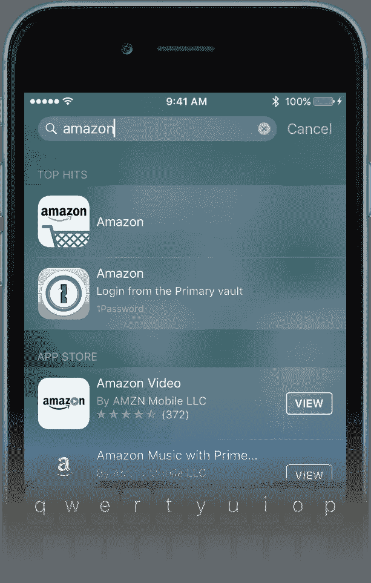

# iOS 中的聚光灯搜索

> 原文：<https://medium.com/hackernoon/spotlight-search-in-ios-bc8aefa19a92>

*   ***它为什么有帮助？***

通过使用核心 spotlight framework APIs 索引我们的应用程序内容，我们允许用户通过 Spotlight search 和 Safari 搜索和访问我们的应用程序内容。

*   ***概述(苹果):-***

通过使您的内容可搜索，您可以帮助用户访问您的应用程序中的活动和项目。核心的 Spotlight 框架提供 API 来标记和管理持久的用户数据，如照片、联系人和设备索引中的已购买项目，并允许您创建应用程序的链接。

这使得您的应用程序的内容在用户的设备中可被发现、可见且易于访问。在本教程中，我们将完成这个功能，最后你会意识到让用户的生活变得简单是多么容易。

***让我们开始吧……***

现在，假设我们有一个列表，在选择时，它会显示所选项的一些细节(如下图所示)。我们需要这些项目显示在我们的聚焦结果中。

→ *关于 App，我们正在创作！*

我们正在创建的演示应用程序包含一个 UITableViewController，它嵌入在 NavigationController 中。它显示了一个汽车列表，上面有它们的品牌名称和形象。在选择列表项(汽车)时，它导航到 DetailVC 屏幕，在这里我们可以全屏查看该特定汽车项的相同细节。为了这个应用程序的目的，我创建了一个 plist 文件，将我们的汽车项目加载到 datasource 模型中，以提供给我们的 TableViewController 类。请查看项目文件(从本教程底部下载示例项目)。

首先，我们让我们的数据在聚光灯下也能被搜索到。因此，当用户使用我们内容的关键字进行搜索时，图像和品牌名称将显示在屏幕上。我们将在后面的讨论中定义这些关键字。

**L** 之后，点击与我们的应用程序相关的搜索项，我们的应用程序将会启动，我们会显示与该特定项目相关的详细信息屏幕。

→在演示应用程序中，我创建了一个 plist 文件，其中包含汽车的品牌名称及其图像名称。我将所有图像添加到 assets 文件夹中，因此我们可以用它们填充我们的 tableview。我创建了一个模型对象，汽车，以使其易于工作。该项目还包含一个名为***asset extractor***的类，用于为资产项创建 url 字符串(查看该类)。

→完成项目设置，在 MainViewController 中显示数据，并在选择 tableview 单元格时显示 DetailVC 和相关数据后，我们开始 spotlight 搜索功能的实际部分。

***将数据索引到聚光灯框架:***

*   为此，我们要求 CoreSpotlight API 对我们的数据进行索引，这样就可以在用户执行的搜索中找到它。但无论是我们的应用程序，还是 CS API 都不能决定这将是什么样的数据。我们的责任是准备数据并以特定的形式提供给 API。这意味着，我们希望通过 Spotlight 搜索的所有数据都必须表示为 ***CSSearchableItem*** 对象，然后组合成一个*数组*并交给 *CS API* 进行索引。
*   单个***CSSearchableItem***对象包含一组属性，这些属性使 iOS 对*可搜索项目*的细节一清二楚，例如搜索时应该显示哪些数据(例如，品牌名称及其图像)，以及使我们的应用程序中的数据出现在 Spotlight 搜索中的关键字。
*   单个可搜索项目的所有属性都由一个***CSSearchableItemAttributeSet***对象表示，该对象提供了许多用于分配我们需要的*值*的属性。
*   为聚光灯建立数据索引是最后一个应该做的事情。

通常和正常的流程包括以下步骤(包括索引):

1.  **为每一个单独的数据设置属性**，例如一个汽车对象(***CSSearchableItemAttributeSet***对象)。
2.  使用上一步的属性(***CSSearchableItem***对象)，为每条数据初始化一个**可搜索的**项。
3.  将所有可搜索的项目收集到一个**数组**中。
4.  **使用上述数组**索引聚光灯的数据。

为了完成任务，我们按顺序遵循所有这些步骤。

为了开始，首先我们需要将两个框架导入到项目文件中。

> **导入*****core spot light***
> 
> **导入**导入**导入*导入*导入**

在这里，我写了一个简短的描述来完成这个功能，还包括了示例项目中的代码片段。我把注释放在这里来解释代码，所以请看看下面的图片来做些什么。

*去做！！！*

->在视图控制器中编写一个方法来设置可搜索内容功能

—>在这种方法中，

*   定义一个数组来保存单个的***cssearcabreitem***对象
*   遍历所有数据项，然后
*   用 ***内容类型*** 初始化***CSSearchableItemAttributeSet***
*   为循环中的每个*单个项目*设置该***CSSearchableItemAttributeSet***对象的属性(如标题、缩略图 URL、描述等)
*   将**关键字**设置为这个**CSSearchableItemAttributeSet**对象，以从 **spotlight 搜索**中识别我们的内容
*   使用**唯一标识符**、**域标识符**和上述**CSSearchableItem attributeset**对象初始化 **CSSearchableItem** 对象。这个 ***的唯一标识符*** 将用于从 ***聚光灯搜索*** 中捕捉 ***用户选择的项目*** 。所以*的后缀*是一些与你的数据相关的信息*项*的末尾，这个*是唯一的标识符*。域标识符将用于对可搜索项目进行分组
*   将上面定义的 **CSSearchableItem** 对象附加到您在该方法前面定义的**数组**中
*   最后，通过使用**核心 Spotlight API，**通过传递从上面获得的数组对象来索引项目。
*   在 viewDidload 中调用此方法。

目前，我们的应用程序的内容可以从 spotlight 搜索中搜索到，在点击或选择我们应用程序的结果项目后，我们的应用程序将会启动，主视图控制器将会显示。为了让用户更加友好，我们需要显示所选项目的详细屏幕。

这很容易实现。我们需要做的就是实现一个名为，***restoreUserActivityState(_ activity:NSUserActivity)的方法。***

上述函数的参数是一个***nsurectivity***对象。该对象有一个名为 ***userInfo*** 的字典属性，该字典包含 Spotlight 上**所选可搜索项目的**标识符**。我们将从标识符中提取出数据源数组中项目的索引，并呈现细节视图控制器。仅此而已。**

为了获得该活动，我们需要在 AppDelegate 对象中实现一个函数。即

> ***func application(_ application:ui application，continue user activity:NSUserActivity，restoration handler:@ escaping([Any]？)->Void)->Bool {***
> 
> ***}***

每当用户从 spotlight 搜索中选择与我们的应用程序相关的项目时，就会调用这个函数。所以这里我们调用上面的 restore 方法并传递***useractivity***对象。

仅此而已。我们成功地完成了任务。恭喜你！！！

你可以从[这里](https://github.com/penumutchuprasad/LKSpotlightSearchTutorial/tree/master/LKSpotlightSearchTutorial)下载示例项目

— — — — — — — — — *********************** — — — — — — — — —

如果你喜欢我的教程请关注我的 ***中*、**[***Twitter***](https://twitter.com/Leelakrishn4)&[***linkedIn***](https://www.linkedin.com/in/leela-prasad-penumutchu-b44023157/)*账号*

*感谢阅读…*

*****************************!！！再见！！！*****************************