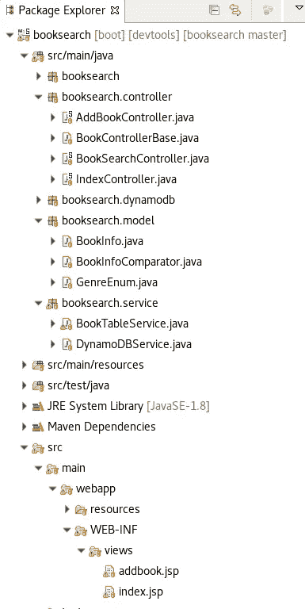
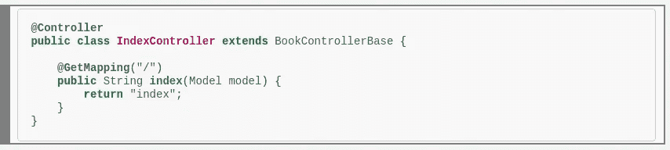
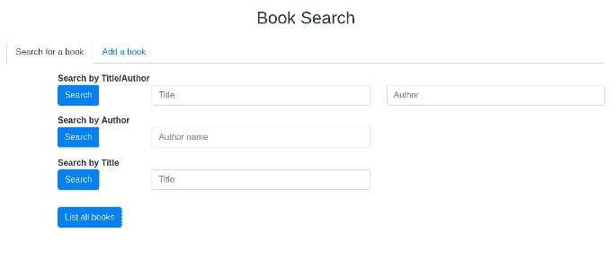
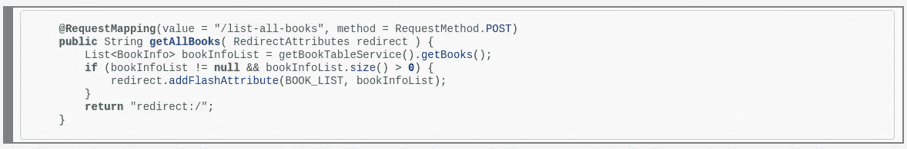
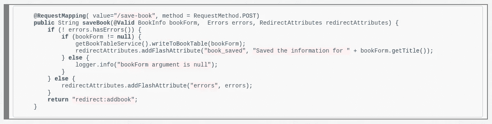
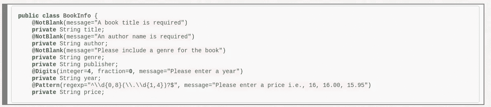
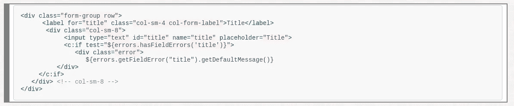
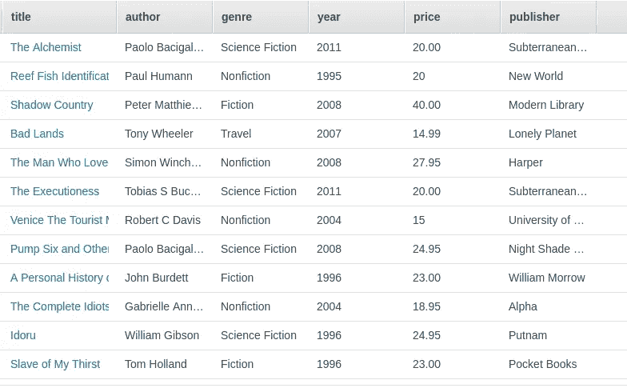

# 弹簧和发电机 b

> 原文：<https://medium.com/hackernoon/spring-and-dynamodb-b51bf0cb7a1e>

## 介绍

术语“全栈”开发通常是指在客户端和服务器端都使用 JavaScript 的 web 应用程序开发。对于那些只懂 JavaScript 的人，我可以告诉你，计算机科学中的东西比你的哲学中所梦想的要多得多。

这篇文章描述了一个构建和搜索图书信息数据库的演示应用程序。这个应用程序是用 Java 语言的 [Spring 框架](https://spring.io/%3E)构建的。该应用程序使用 Java Server Pages (JSP)在服务器端动态呈现网页。该应用程序使用 Amazon Web Services (AWS) DynamoDB 数据库来存储图书信息。

在写这篇文章时，我假设读者对 Java 编程语言有所了解。我还假设读者会参考源代码，可以在 [GitHub](https://github.com/IanLKaplan/booksearch) 上找到。源代码在 Apache 2 软件许可下发布。

# 背景

Topstone 软件出版物[一个简单的 Spring Boot 模型视图控制器(MVC)示例](http://topstonesoftware.com/publications/simple_spring_boot_mvc_example.html)展示了如何用 Spring MVC 构建一个非常简单的 web 应用程序。本出版物还简要讨论了 Spring 工具套件，这是一个集成开发环境(IDE ),也用于开发图书搜索应用程序。

# Spring 框架

软件开发的目标之一应该是编写尽可能少的软件。这个目标可以通过利用 Spring 这样的软件框架和 Java 生态系统的海量软件资源来实现。

在过去，Topstone Software 已经使用了 [Grails 框架](https://grails.org/)来开发利用 Java 生态系统的全栈 Web 应用程序。例如，Topstone Software 使用 Grails 框架开发了[under ground](http://www.nderground.net/)社交网络。

虽然 Topstone 软件仍然提供 Grails 应用咨询，但是所有新的 web 应用开发都使用了 [Spring 框架](http://www.spring.io/)。Topstone Software 选择 Spring 框架的原因包括:

*   Spring 框架包含大量资源，可以用来快速开发应用程序。其中包括 Spring Boot 和 Spring MVC，它们已经被用来开发图书搜索应用程序。
*   有各种各样的文档资源可以帮助开发者理解基于 Spring 的应用程序。
*   Spring 框架是来自 [Pivotal](http://www.pivotal.io/) 的核心开源产品，因此开发者可以依靠持续的支持和对 Spring 社区需求敏感的开发团队。
*   Spring 是最流行的 Java web 应用程序开发框架，它的流行程度还在继续增长。

# 应用架构

尽管图书搜索应用程序并不打算成为一个高质量的应用程序，但它展示了如何构建一个真正的“全栈”Spring 应用程序。

## 模型、视图、控制器和服务

模型由包含应用程序数据的数据结构组成。在这种情况下，只有一个数据结构，即 BookInfo 对象。BookInfo 对象是持久存储在 DynamoDB 数据库中的数据结构。

控制器由一组响应网页交互的类和函数组成。在图书搜索应用程序中，有三个控制器:

1.  索引控制器响应主应用程序索引页面的 HTTP GET 请求。索引网页包含一组用于图书信息搜索的表单。
2.  图书搜索控制器响应图书信息搜索表单的 HTTP PUT 操作。BookSearch 控制器为每个搜索表单提供了一种方法。搜索的结果将呈现在服务器端。服务器端呈现的页面是模型-视图-控制器的“视图”部分。
3.  AddBook 控制器响应 HTTP PUT 操作，该操作将图书信息表单发送到控制器。如果没有错误，图书表单数据将保存在 DynamoDB 数据库中。

为了避免控制器逻辑变得过于复杂，与管理网页交互不直接相关的代码被放在服务对象中。在图书搜索应用程序中，BookTable 服务支持对图书信息数据库的读写。BookTableService 抽象出关于数据库的细节。在这种情况下，数据库是 DynamoDB。可以在不改变 BookTableService 接口的情况下改变数据库。DynamoDB 服务对象支持 BookTable 服务。

## 图书搜索项目结构(来自 Spring 工具套件)



## 索引页面控制器

图书搜索应用程序中最简单的控制器是应用程序索引页面(例如，相对 URL“/”处的页面)的控制器。与所有 Spring 控制器一样，这个控制器类用控制器属性@Controller 标记



@GetMapping 注释告诉 Spring 框架，index 函数处理对相对 URL“/”的 HTTP GET 请求。@GetMapping 注释是

```
@RequestMapping(value="/", method=RequestMethod.GET)
```

图书搜索应用程序中的控制器包含返回字符串的函数:相关网页的相对 URL，该 URL 将返回给浏览器以响应 HTML 请求。

图书搜索应用程序的主网页包含一个允许用户搜索图书信息的表单列表。屏幕截图如下所示:



应用程序索引页面上最简单的“表单”只是一个按钮，它向图书搜索控制器中的 getAllBooks 函数发出 HTTP POST。这个函数处理相对 URL /list-all-books 的 HTTP POST 操作。该按钮表单的 HTML 如下所示:


在图书搜索控制器中处理按钮表单 HTTP POST 操作的 getAllBooks 函数如下所示:



getAllBooks()函数中的代码调用 BookTableService 函数 getBooks()，该函数将数据库中的所有图书信息作为包含 BookInfo 条目的 List 对象返回。

列表对象作为 flash 属性返回(flash 属性有一个页面显示的“生命”——当页面刷新或重新显示时，flash 属性将被清除)。标准页面属性仅限于字符串值。Flash 属性可以由任何对象类型组成(例如 BookInfo 对象的列表)。

## 向数据库中添加有关书籍的信息

主页上的“添加图书”选项卡将用户带到“输入图书信息”表单。该页面的表单由 AddBookController 类处理。这个类中的 saveBook()函数将从表单接收的信息保存在数据库中。saveBook()函数的代码如下所示:



和前面的例子一样，saveBook 函数用@RequestMapping 注释进行了注释。

saveBook 函数展示了 Spring 框架如何节省编码工作。来自 web 页面上表单的字段数据被 Spring 框架打包到 BookInfo 对象中，该对象是 saveBook 函数的参数之一(注意，表单输入字段名称对应于 BookInfo 类中的字符串成员)。

函数声明还包含@Valid 注释。这告诉 Spring 框架应该对 BookInfo 数据执行验证。如果输入数据有问题，有关错误的信息将包含在 errors 对象中。

Spring 框架验证检查使用与 BookInfo 对象相关联的注释。这些注释如下所示。



如果表单域(BookInfo 元素)验证失败，错误会显示在 HTML 中。例如，书名字段中错误的 JSP 逻辑如下所示:



# DynamoDB

DynamoDB 是亚马逊网络服务的“noSQL”数据库。DynamoDB 有许多吸引人的特性。其中包括:

*   随着数据库工作负载的增加，DynamoDB 很容易扩展。
*   DynamoDB 性能卓越
*   DynamoDB 是一个托管的 AWS 资源，不需要系统管理。
*   DynamoDB 有一个灵活的数据库模式。新的非索引属性可以添加到 DynamoDB 表中，而不必重新构建数据库
*   用户只需为数据库读取、写入和存储付费。没有全天候服务器成本。
*   DynamoDB 有一个面向所有 AWS 客户(不仅仅是新客户)的“免费层”

对于图书搜索应用程序，由于数据相对较少，数据流量较低，DynamoDB 的使用是免费的，因为它属于免费层。相比之下，像 AWS RDS/Postgres 这样的关系数据库每周 7 天、每天 24 小时都在服务器上运行。这导致了每月的 AWS 费用。

## 索引 DynamoDB 数据库

DynamoDB 支持索引查询操作和表扫描。大多数 BookTableService 搜索操作使用索引 DynamoDB 查询。一个例外是 findBookByTitle()操作，它将扫描整个图书信息数据库，寻找图书标题子字符串。

图书表信息的示例如下所示:



DynamoDB 表必须有散列索引。散列索引是一个在所有表行中唯一的值。

对于图书表，哈希键由图书标题组成。由于不同作者的书可能有相同的标题，标题散列索引与由作者姓名组成的“范围关键字”相结合。对于这个应用程序，书名、作者对被假定为唯一值。对书名、作者对的查询将只返回一本书。

为了允许作者搜索数据库，还使用了 DynamoDB“全球二级索引”。对此索引的查询可能会返回多本书。

其他 DynamoDB 属性(例如，publisher、date)不用于在 DynamoDB 查询中返回值。可以在 DynamoDB 扫描操作中搜索这些值，该操作将读取数据库中的所有项目。对于大型数据库来说，扫描操作的成本可能很高，因为用户需要为读取的数据量付费。

## DynamoDB 代码

DynamoDB 图书表是由 CreateBookTable 类创建的。构建该表的代码从 title 和 author 属性构建散列和范围键索引。全局二级索引是从 author 属性创建的。

构造 DynamoDB 查询和书名扫描的代码包含在 BookTableService 类中。

## 关于测试的一个注释

鼓励软件开发人员遵循[“测试驱动开发”](https://en.wikipedia.org/wiki/Test-driven_development)的实践，为所有软件组件编写单元测试代码。在开发利用 DynamoDB 的软件时，我发现测试驱动开发是必要的。Amazon 的 DynamoDB 文档可以做得更好，并且很容易编写不能正常工作的 DynamoDB 代码。单元测试通常是预先知道 DynamoDB 代码工作的唯一方法。

BookTableSearch 对象中的数据库函数有采用表名参数的版本。这允许单元测试代码使用由测试代码创建和删除的 DynamoDB 表。

# GitHub 上的图书搜索演示应用

Topstone 软件已经在 GitHub 上发布了 Java 图书搜索演示应用(见 [Spring 和 DynamoDB 图书搜索应用](https://github.com/IanLKaplan/booksearch))。该软件在 Apache 2 开源许可下可用。

这个页面上的 Java 和 HTML 代码已经使用 http://hilite.me/的[为 HTML 显示进行了“漂亮的打印”](http://hilite.me/)

## 参考

*   *《春天在行动》，第五版*，作者 Craig Walls，曼宁出版社，2018 年(可通过曼宁早期访问计划获得)。

本出版物的[原始版本](http://topstonesoftware.com/publications/spring_and_dynamodb.html)发布在 Topstone 软件网站上。