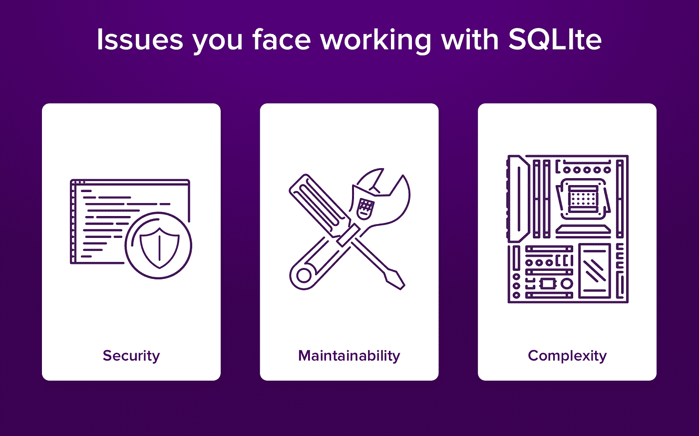
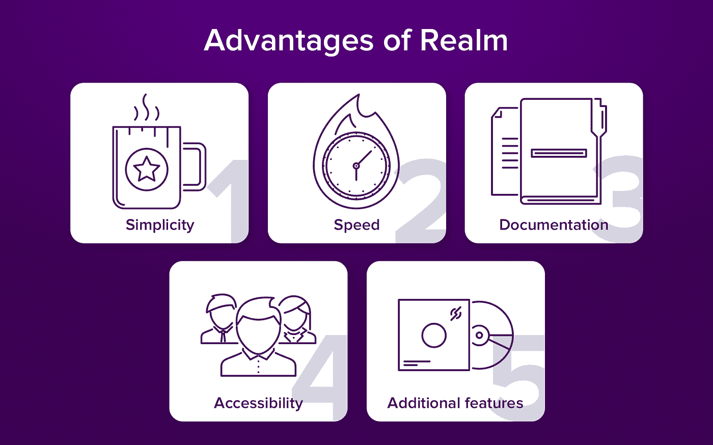
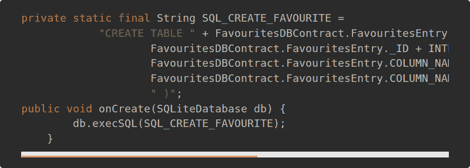
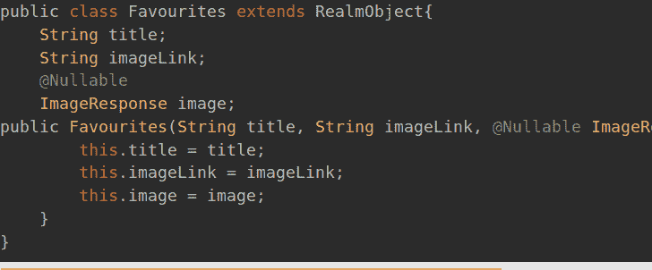
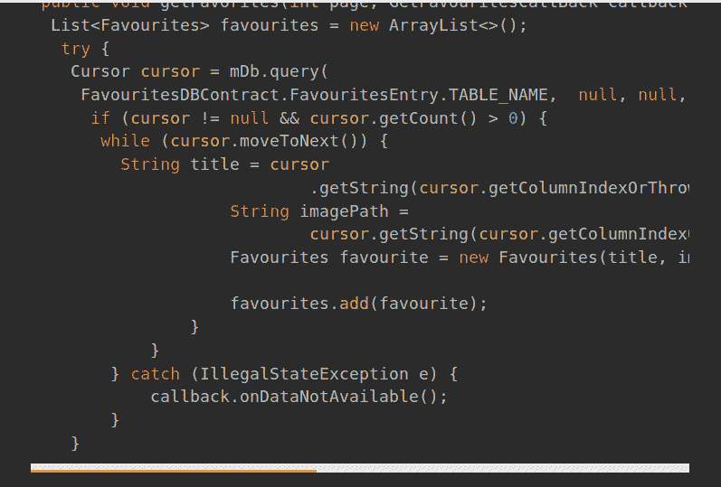
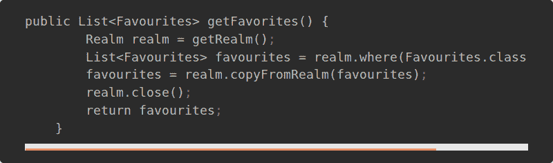
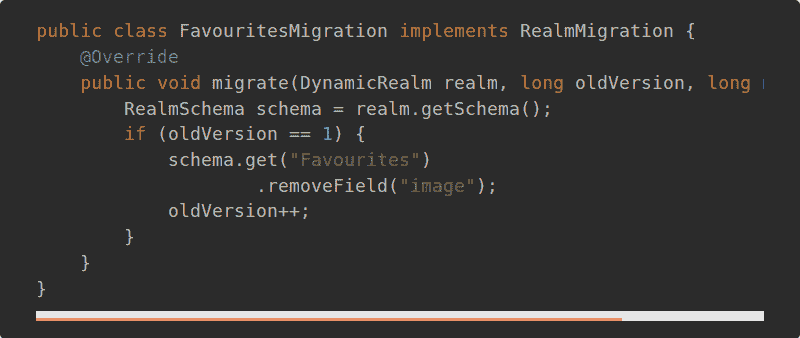
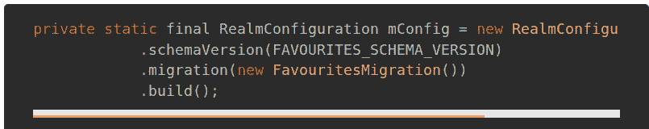
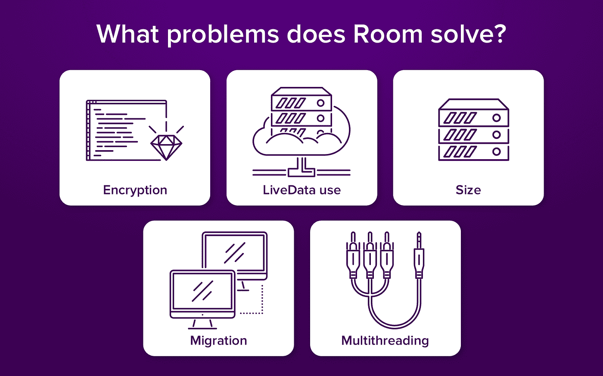

# SQLite 还是 Realm:安卓 App 首选什么？

> 原文：<https://medium.com/hackernoon/sqlite-or-realm-what-is-the-top-choice-for-android-app-2ee07dfcb82f>

当用户启动移动[应用](https://hackernoon.com/tagged/application)时，他或她与客户端或前端交互。然而，这只是冰山一角。移动应用程序是一个包含大量信息的复杂结构，它是基于各种 [Android 框架](https://www.cleveroad.com/blog/android-application-development-framework-see-all-benefits-frameworks-have)创建的。为了使它快速可靠，你需要弄清楚在哪里存储数据。在这一点上，你应该注意 SQLite 和 Realm——最受 T4 Android T5 应用程序欢迎的数据库。此外，我们将详细研究它们，并揭示它们的利弊。

# 存在哪些 Android 数据库

在搜索数据库时，您需要清楚地了解您将在哪里存储数据。如果您打算将它存储在服务器上，那么您可以从大量不同的选项中进行选择。如果您决定将它存储在移动设备上，那么您实际上只有两个数据库可供选择——SQLite 和 Realm。

# 1.SQLite

SQLite 是最早的嵌入式数据库之一。它是由理查德·希普在 2000 年创建的。它的主要思想是脱离客户机-服务器体系结构，将所有应用程序数据放在设备本身上。SQLite 是非常流行的数据库，受到全世界许多 Android 开发人员的喜爱。

它是用 c 写的，支持的编程语言超过 30 种。很可能，很难找到一个没有使用 SQLite 的应用程序的设备。当你决定开发脱离服务器的应用程序时，这是第一个但不是唯一的解决方案。同样众所周知的数据库是 Realm。让我们仔细看看。

# 2.领域

Realm 是基于 SQL 的产品。使用它，您可以像在编程语言的对象 graf 中那样声明对象关系。Realm 通常用于移动应用程序开发。

它在刚刚开始编程之路的年轻开发人员中非常受欢迎。到底是什么让他们选择这个数据库而不使用 SQLite 呢？为了澄清这一点，让我们考虑一下新手在部署 SQLite 时面临的最常见的问题。

# 使用 SQLite 会出现什么问题？

SQLite 是小型简单项目的完美解决方案。如果你的应用程序符合这些标准，你会对这个老派的数据库完全满意。如果没有，你很可能面临以下问题:

*SQLite 问题*

# 安全性

SQLite 有一个非常具体的结构和一组影响应用程序安全性组织的特性。以下是你应该注意的几点:

1.  **数据库存储在一个文件中**

您可以自由地将这样的文件放在目录层次结构中的任何位置。一方面，很方便。另一方面，如果某个不受控制的进程清除了文件，您就有丢失所有数据的风险。为了防止这种情况，您应该在文件级别设置强有力的保护。设置文件权限时要小心，避免将文件放入文档根目录。

**2。日志文件并不总是被删除**

您有机会回滚，因为系统会将日志文件保留一段时间。这当然是一个好消息。然而，不好的一点是，有时这些文件不会消失。这可能会导致数据损坏等负面影响。

另一个坏消息是，你不能关闭日志功能，因为如果应用程序崩溃，你的数据库可能会受损。为了避免这些问题，请确保您的数据是高度加密的。只有在那之后，把它放入数据库。你甚至可以使用专门为此设计的应用程序。

# 灵活性

应用程序越老，数据库中积累的数据就越多。为了保持高水平的应用程序生产力，您需要编写更复杂的查询并正确组织数据迁移。在大多数情况下，程序员新手在这方面没有足够的经验，在使用结构化查询语言时会遇到困难。

# 复杂性

如果您已经处理 SQL 和 SQLite 很长一段时间了，那么您在处理上述情况时不会有任何困难。与此同时，复杂的数据库结构可能会成为 Android 应用开发新人的一个完整的噩梦。出于这个原因，绝大多数新手倾向于不依赖于 SQL 的数据存储的替代选择。这是当境界来拯救带着它的易用性徒劳无功。

# SQLite 和 Realm 有什么不同？

Realm 是一个非常受欢迎的数据库，因为它有很多优点。Cleveroad 开发人员对它并不陌生。他们已经在多个项目中测试过了。以下是我们在实践中发现的主要优势:

*安卓应用领域数据库的优点*

1.  **整体简单性**

Realm 非常通俗易懂，简单易用。与 SQLite 相比，它非常简短。使用它时，您将需要编写更少的代码行。

看看下面的例子。下面是使用 SQLite 创建表时的代码:

这是它如何与 Realm 一起工作。你应该只接管 RealmObject。

让我们看另一个例子。以下是 SQLite 中结果列表查询的代码:

这是你将在领域中得到的:

在设置数据迁移时，您需要编写相当复杂的代码。如果您需要使用 Realm database 为 Android 项目迁移数据，这是一个很好的例子。

此外，您需要在 config 中添加以下几行:

使用 SQLite，在数据迁移过程中会遇到一些陷阱。最大的缺点是不能完全删除或重命名表或列。您只能将数据从旧表复制到新表。之后，删除旧表并重命名新表。如果您想从表中删除约束或向表中添加约束，您应该以类似的方式操作。

说到 Realm 的简单性，我们不能不提到它非常直观和用户友好。毫无疑问，你会比 SQLite 更快地解决这个问题。由于 Realm 是一个全功能的 ORM 平台，读取和保存一个对象不会花很长时间。此外，不需要担心内部集合。一切都已成定局。

**2。高速**

Realm 是一个真正快速的数据库。在某些情况下，例程的性能甚至比 SQLite 中的还要快，尽管 SQL 算法并不复杂。

**3。清除文档**

Realm 有一个用简单语言编写的结构良好的文档。你可以很容易地找到任何问题的答案。该文档可在官方网站上在线获得。

**4。快速访问**

您可以复制在领域数据库之外仍然可用的对象。

**5。额外选项**

一个年轻的公司领域提供了各种有趣的高级功能选项。在其他服务中，您可以受益于 JSON 和加密支持。此外，您可以为您的 Android 项目使用免费的 API，并在数据发生变化时接收通知。

以上解释了为什么很多开发者更喜欢 Realm。它的简单性和灵活性使它成为新人和专业人士的真正发现。然而，SQLite 不会放弃。在这一点上，我们不能不提到最近发布的房间。

# 什么是空间，它是如何工作的？

房间是一个特别设计的图书馆。Google 创建它是为了消除 SQLite 令人讨厌的缺点。它就像一个抽象层，覆盖了数据库并改变了系统的工作方式。在某些方面，它甚至让 SQLite 比 Realm 更有优势。以下是 Room 解决的主要问题:

*房间如何改善 SQLite*

**加密**

SQLite 在组织适当的加密方面确实有些不足。在空间的帮助下，它为 Realm 提供了激烈而艰苦的竞争。

**实时数据**

Room 有助于快速轻松地使用实时数据。不再有令人困惑的干扰！

**尺寸**

与王国相比，房间真的很小。想想 50KB 和 3 MB 就知道了。明显的优势是有利于这里的空间。

**数据迁移**

借助 Room，您可以快速轻松地执行数据迁移。

**多线程**

与 Realm 不同，Room 不会在多线程模式的过程中造成任何困难。一切顺利。

# 结果

正如你所看到的，每个用于 Android 应用程序开发的数据库都有其优点和缺点。虽然 Realm 看起来很简单，但 SQLite 可能会因为复杂性和操作中的一些问题而感到害怕。

另一方面，Realm 不能覆盖大型项目的所有需求，更适合小型应用程序。SQLite 与 Room 合作可以成为复杂任务的优秀解决方案。

尽管 SQLite 有许多缺陷，但您不太可能会觉得它不好用。谷歌在创造空间时努力消除这些弊端。

所以，不要急，分析你的项目规模，决定哪个数据库符合你的需求。