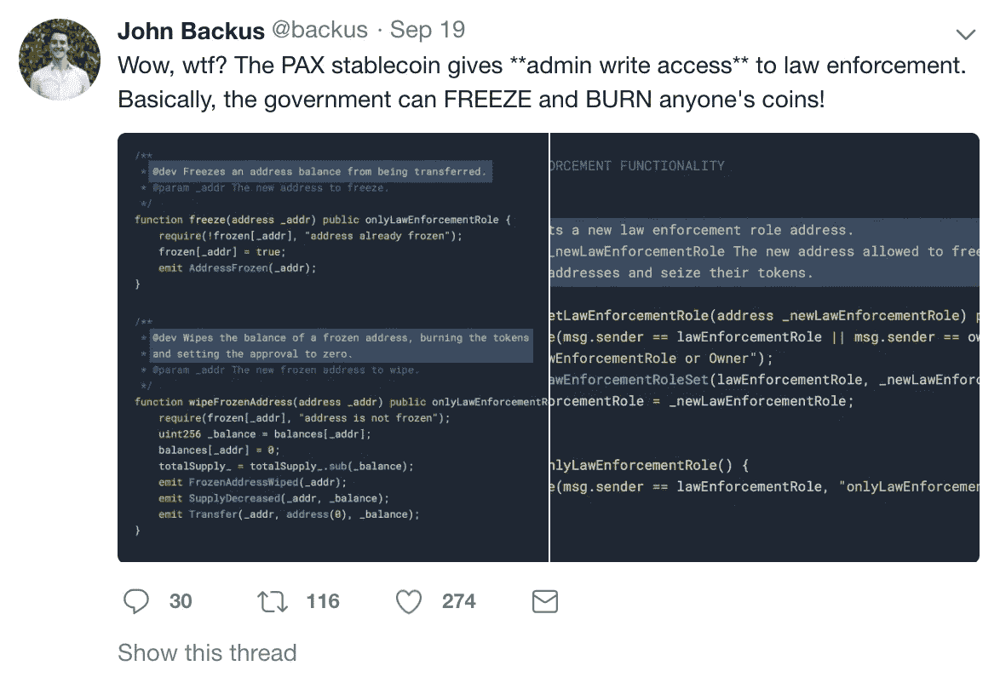

# 稳定的唤醒呼叫

> 原文：<https://medium.com/hackernoon/stablecoin-wake-up-call-58b906ceac00>

就这样，一种新的硬币诞生了！最新进入公众视线的硬币被称为 Paxos Standard(“Pax OS”)，是由 Pax OS 公司创造的，该公司还经营着 itBit 子公司。itBit 因交易比特币/美元和欧元对而出名。这家公司是纽约司法部长上周发布的虚拟市场报告的一部分，该报告分析了一些大型加密交易所和这些平台上的投资者行为。itBit 是自愿回答司法部长问题的公司之一。

Paxos 背后的想法是发行一种由可核实的美元支持的稳定货币。这意味着每创造一个 Paxos，银行里就有一美元作为抵押品。

你怎么知道美元确实存在银行里？这个问题是围绕另一个早期稳定币系绳的[争议的基础。答案在于信托和审计机构的介入。信托是一家保管资产的银行，在这种情况下，美元充当 Paxos 的抵押品。使用信托，这是一个可靠的来源——因此得名，和审计，你可以向投资者保证钱真的在那里，万一你需要把你的 Paxos 转换成美元。假设每个 Paxos 用户都可以立即兑换成美元，如果他们愿意的话。](https://www.ccn.com/controversial-stablecoin-tether-is-now-the-10th-largest-cryptocurrency/)

Paxos 可能也有某种保险政策。FDIC 保险(联邦存款保险公司为美国银行的所有储户提供保护的保险)每人最多只能投保 25 万美元，但私人保险政策可以投保更多。

然而，关于 Paxos 的真实故事是这样的:一名软件开发人员在 Paxos 的开源库中发现了一行奇怪的代码。

Paxos Trust Company LLC 发布了 stablecoin 的源代码，因此任何能够阅读代码的人都可以看看 Paxos 是基于什么构建的。为什么？大多数区块链项目都是开源的。任何人都可以获取代码，修改它并创建自己的版本。这是社区和企业精神的一部分。以太坊社区的程序员约翰·巴科斯审查了代码，发现了一个有趣的后门。

The “Find”

根据 John 的说法，联邦监管机构有一种方法可以使用以下函数访问 Pax OS stable coins:“setLawEnforcementRole”、“freeze”或“wipeFrozenAddress”。这些功能允许监管机构冻结 stablecoins，这意味着没有所有者可以交易他们的硬币，更重要的是，擦除它们，或者将 Paxos stablecoins 烧成不存在。

该公司对此表示支持，并声称允许监管机构控制货币是正常的，“Paxos 一直将合规作为核心原则，”Paxos 发言人说。“能够冻结系统是保持令牌 KYC 友好的理想能力，”发言人继续并重申，他们只会在法律要求的情况下使用 setLawEnforcementRole 函数。

然而，这些职能是对分权规则的真正破坏。第三方为所欲为的能力不属于无信任的概念。试想一下，如果比特币有这个功能。这将如何改变比特币获得的成功？

事实上，监管是分权的敌人，我在[的上一篇文章](https://hackernoon.com/regulation-is-the-enemy-of-decentralization-5a00470791ad)中写道。我很清楚，金融业的未来和区块链的未来在于监管和分权的融合，而不是纯粹的分权系统网络。

在一个法治社会中，不可能建立一个不受政府管辖和控制的分权体系。系统将与之斗争，直到它屈服。

更正:这个帖子错误地陈述了 Paxos 是由 itBit 创建的。对 Paxos 标准是由 Paxos 公司创建，并由该公司操作 itBit 进行了更正。

*StartEngine 是一个领先的股权众筹平台，已经帮助 250 多家公司筹集了超过 8000 万美元。我们目前也在筹集资金。加入已经投资我们的近 3500 名 StartEngine 所有者。* [*这里投资 start engine*](https://www.startengine.com/own?utm_source=Medium)*。*

*更多信息，查看我们的* [*发售通函*](https://www.sec.gov/Archives/edgar/data/1661779/000114420419013344/tv515967_253g2.htm) *。*