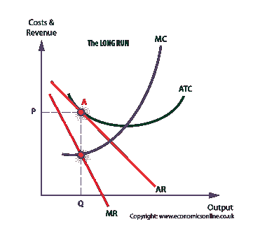
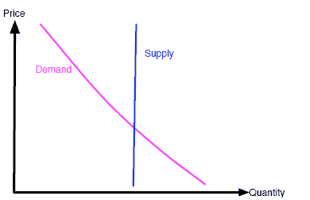

# 稳定的硬币:经济视角

> 原文：<https://medium.com/hackernoon/stablecoins-an-economic-perspective-66d4b7a2e6c8>

最近有很多人在讨论稳定币的概念——一种不会像 T2 比特币 T3 那样受到高价格波动影响的加密货币 T1。

在很大程度上，他们关注的是在加密货币中实现*挂钩*的技术挑战。简而言之，钉住汇率制度确保了一种货币的价格尽可能接近另一种货币的价格——在几乎所有加密货币的情况下，钉住美元。

乍一看，这似乎很有趣。由于美联储的努力，美元相当好地发挥了价值储存、交易媒介和记账单位的功能——这是一种成功货币的三个关键特征。如果一个分散的密码可以与美元挂钩，那么我们将能够享受两个世界的好处，对不对？

很遗憾，没有。

每一个尝试过这种方法的项目要么没有被远程分散(我看着你的系绳……)要么有其他缺点。但除此之外，将加密货币与美元挂钩还有一个内在缺陷。

这一缺陷是对央行的依赖，尽管这种依赖是间接的。这违背了比特币所代表的一切。比特币和其他去中心化的加密货币的全部魅力在于银行缺乏需求。这几乎是整个该死的点。

也有一些热门项目提出了与其他密码(或密码指数)挂钩的价格。这也有问题。挂钩永远不会像(值得信赖的)法定货币那样稳定，因为它与不稳定的加密货币有着内在的联系。

在我看来，最大的问题是，有没有可能创造一种稳定的货币，它是价值储存手段、交换媒介和记账单位，而不与法定货币挂钩或有任何联系。要回答这个问题，我们需要了解法定货币是如何运作的。然后我们可以以分散的方式重新创建那些相同的功能。很简单…

让我们开始吧。

美元是一种很好的交易媒介。它有大量的供应，并有一个强大的(中央)系统，这使得它很容易进行交易。它在短期内也足够稳定，人们可以放心地用它来交换商品和服务。

然而，从长期来看，美元不是很好的保值手段。众所周知，100 年前，美元的价值远高于今天。这是货币供应不断增长的结果。美联储发行新的国债，瞧，新的钱被创造出来了。私人银行可以根据 T2 的部分准备金制度以 10:1 的比例贷出这些资金。这意味着美联储每创造 1 美元，经济中就有 10 美元被创造出来。更多细节可以在[这里](https://www.investopedia.com/articles/investing/081415/understanding-how-federal-reserve-creates-money.asp)找到。

垄断的美联储如何知道何时创造更多的货币？事实是，他们并不真的*了解*。监管者尽最大努力预测经济将如何运行，并根据预期需求创造新的货币。但经济是复杂的，因此出现许多相互矛盾的观点和理论也就不足为奇了。

最后，记账单位部分相对简单。人们愿意用美元来衡量真实商品和服务的价值。一旦他们不再愿意这么做，美元就不再是记账单位了。这只是信任的问题。

让我们把话题转回到加密，但使用上面的经济学定义来尝试理解比特币的优势和劣势。

比特币已经是一种非凡的价值储存手段。2100 万比特币的供应量是固定的，因此，随着比特币需求的增加，其价格也必然会上涨。虽然比特币可能会受到短期波动的影响，但从长期来看，其价格将一直上涨。这也是比特币常被称为数字黄金的原因。

然而，由于完全相同的原因——固定供应，比特币作为交易媒介的地位不够高。短期波动和长期价格上涨抑制了消费主义。去 HODL 比用你的比特币要好。

作为一种记账单位，比特币非常有效，因为我们信任它。使用比特币来衡量商品和服务的成本是可能的，并且正在做出许多努力来扩大你可以用比特币购买的东西的数量。

在我看来，最终会越来越受欢迎的稳定币将会成功地模仿法定货币所使用的货币供应和杠杆概念，但是是以一种分散的方式。这是一个巨大的挑战。这种事情怎么可能发生还不清楚。或许通过利用某种 p2p 信贷结构？如何做出货币供应决策？根据哪个货币供应政策？

找到这些问题的解决方案是当今密码领域最紧迫的研究领域之一。如果完成，这将意味着密码从强大的价值储存演变为法定货币的真正替代品，甚至可能使整个传统银行系统过时。