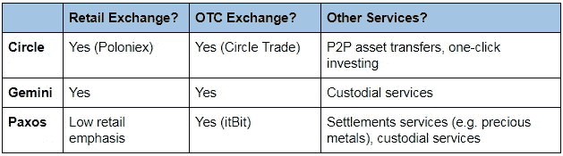
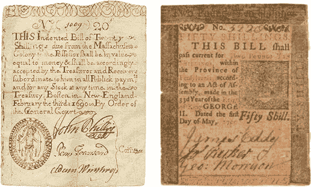

# 稳定的硬币现在又正式流行起来了

> 原文：<https://medium.com/hackernoon/stablecoins-are-now-officially-in-vogue-again-7ae746c44c62>

似乎每隔一周就有一个新项目获得数百万美元的资金，没有人会责怪你质疑有太多稳定的投资。关于项目用来维持稳定性的各种方法，已经有很多文章—在这方面，我们要特别感谢 blockchain.com 的[研究团队，感谢他们的*力作*题为*稳定的状态*的作品，以及那里的许多稳定币爱好者将他们的研究集中到一个方便的](https://www.blockchain.com/research)[目的地](https://stable.report/)。

然而，这篇文章的目的不是比较各种稳定性机制，也不是支持某个特定的论点(它还假设对 stablecoins 的概念和特性有一定程度的理解。稳定币被宽泛地定义为具有加密货币*技术优势的交换媒介，减去价格波动性—* 点击上一段中的研究链接了解更多信息。更重要的是，这篇文章旨在探索稳定币行业作为一个整体的发展方向，包括最近这一波资金雄厚的大玩家——特别是 [Circle](https://www.coindesk.com/usd-coin-arrives-circles-crypto-stablecoin-is-now-trading/) 、 [Gemini](https://www.coindesk.com/gemini-launches-nydfs-regulated-crypto-pegged-to-the-dollar/) 和[Pax OS](https://cointelegraph.com/news/blockchain-trust-company-paxos-launches-ny-regulator-approved-usd-backed-stablecoin)——可能的动机。

**Stablecoins 已经杀了它**

stablecoins 已经有几个杀手级应用了。首先，稳定货币被积极用于加密货币交易所的交易和对冲目的，允许交易者以更无摩擦的模式暂时改变他们在加密货币和法定货币之间的交易敞口头寸。

其次，stablecoins 有助于为大型场外交易(OTC)提供另一种“法定到加密”的网关。这种网关充当机构投资者的入口和出口，为他们提供广泛接受的稳定货币来换取法定货币。然后，交易者将使用稳定币投资其他加密货币，因为与直接接受法定货币的交易所相比，接受稳定币的交易所要多得多。场外交易通常是由大型交易者完成的，他们不希望自己的大宗买卖订单影响规模较小的常规交易所的价格。

最后，还有一些专注于加密相关服务的公司，如内容本地化或社区管理服务，现在接受 stablecoins 中的支付，因为它是一种 24/7 结算的国际即时交易媒介。

前两个应用程序暗示了 Circle、Gemini 和 Paxos 等大型机构可以利用它们各自的 stablecoins 做什么。Circle 自 2015 年以来一直得到高盛的稳定[支持-除了最近收购的加密货币交易所 Poloniex 之外，还提供机构场外法定加密交易。自 2014 年以来，文克莱沃斯旗下的 Gemini Exchange 一直在为零售和机构 OTC 客户提供成功的 fiat-crypto 交易服务。Paxos 利用区块链技术为机构提供结算服务，还经营一家名为 itBit 的场外交易和托管服务子公司。](https://www.crunchbase.com/organization/circle-2#section-funding-rounds)

> 稳定的货币将成为三家公司在现有核心业务中增加收入的推动者和催化剂。

由于本质上是可编程的，stablecoins 使那些大型场外交易能够自动发生*——这只是一种奇特的科学说法，“要么交易完全发生，交易双方都通过，要么根本不发生”。因此，这完全消除了某人通过电汇移交大笔美元，但未能收到 BTC 的风险，也称为结算风险。自然，这种原子交易也以类似的方式极大地有利于结算解决方案。*

*此外，Gemini 和 Paxos 作为提供加密资产托管服务的 NYDFS 许可的信托公司的地位也可能表明他们对 T2 安全令牌领域的潜在入侵。例如，他们可以为投资者提供合规交易证券代币的平台，并将他们的稳定收入嵌入到自动股息和利息支付用例中。*

*最后，这些玩家的*【顶部樱桃】*将使他们自己的美元稳定币获得*在零售用户和相互支付的企业之间的*事实上的地位——本质上取代[有争议的](/@bitfinexed/bitfinex-and-tether-is-unauditable-why-they-will-never-do-a-real-audit-3324e002b185)美元系链(它本身值得一个故事)成为当今加密支付的主导稳定币。*

> *对于服务于这样一个战略总体目标的东西，难怪他们每个人都会选择走自己的路。*

*到目前为止，我们已经讨论了 3 个现有的 stablecoin 项目；根据 blockchain.com 的研究，全球有超过 50 个(还在增加)正在进行的 stablecoin 项目。有人高度怀疑他们是否会和平共处。*

***倒回时钟***

*就像有多少人将互联网的形成与区块链的形成相提并论一样，分析国家资金的历史也可以被证明对理解我们稳定的资本走向具有洞察力。今天，我们本能地期望每个国家只有一种形式的国家货币流通——很难想象你的钱包里有多种版本的国家货币，每一种都由不同的银行发行(和兑付)!但是对于大多数国家来说，这正是过去某个时候的情况。*

**

**Massachusetts Bay Colony and Pennsylvania Colony promissory notes. Same country, different money**

*我们所知的美国现行纸币系统是在 19 世纪 60 年代对国家银行法案进行了一系列修订之后才出现的。在此之前，许多不同的商业银行都在发行自己的纸币，承诺可以兑换黄金或白银。人们只与他们信任的银行打交道，将他们的黄金或白银存入银行以换取利息。随后，他们只愿意用他们知道会被别人接受的钞票来支付。*

*缺乏信任*

*是什么迫使政府颁布这种自上而下的方法并实现标准化？主要是战争——统治精英们每天印更多的钱来资助不断上升的开支。*

*一旦可赎回性成为持有人的一个问题，信心很快就消失了，很明显，发行中的货币流通量超过了作为抵押的黄金和白银的价值。*

*银行挤兑也很常见；情况可能变得如此糟糕，以至于这种传染病甚至会迅速蔓延到健康的银行。因此，可赎回性成为当务之急，确保这一点的最佳方式是在一个公认的可信中央机构的监督下进行整合，以规范和监管该行业。*

> *有了这种信任，国家资金就开花了。国家纸币——与发行纸币或金银相反——现在是一种交换媒介，每个人都可以放心地同意轻松进行交易，随着时间的推移，它在经济的所有领域都产生了网络效应。*

**

**The Qin Dynasty in China already had a unified system of money in place around 200 BC**

*这种命运可能也会降临到稳定的货币部门，最终每种国家货币的稳定货币会少于一把。即使没有监管机构的干预，大多数稳定的创业项目失败也是不可避免的。*

*大多数非抵押的、基于算法的稳定债券还没有经过足够长时间的充分考验。*

*抵押贷款项目也面临着自己的挑战。大型黑天鹅事件( [Mt Gox 2.0 或许](https://www.theguardian.com/money/us-money-blog/2014/feb/25/bitcoin-mt-gox-scandal-reputation-crime)？)可能会极力考验大多数加密担保项目的承销模式。*

*法定抵押的稳定硬币项目受到监管不确定性的影响。理论上，他们的中央集权性质也允许他们用他们的法定抵押品进行消失的行动。*

*最后，这三种模式中任何一种模式下的任何给定项目都可能无法获得足够的受欢迎度，并逐渐消失。*

***但是你必须参与进来才能赢得比赛***

*再以美国银行体系为例，JP 摩根(1799 年)、道富银行(1792 年)和纽约梅隆银行(1784 年)的成立都大大早于《国家银行法》。所有人都继续巩固他们在当今美国金融体系中的巨大影响力。正如一句老话所说——你必须参与其中才能赢得胜利。*

> *私人部门的创新从根本上改变了货币的历史由来已久。*

*1967 年，巴克莱银行开通了第一台 ATM 机。第一笔电汇由西联汇款公司于 1872 年发起。我们今天所知的代理银行系统的支柱——Nostro accounts 起源于 15 世纪，是美第奇家族的产物，他们被要求在国外开设银行，以便代表纺织品商人兑换货币。自 4000 年前的《圣经》时代起，货币兑换商就已开始运作，而早在公元前 5000 年，支付利息在中东文明中就已司空见惯。这些标志性的货币创新都不是由中央政府以自上而下的方式实施的——它们都是在流行起来之前以一种分布式的有机方式涌现出来的。未来货币的创新将再次由私营部门主导。*

***用例是什么？***

*从近期来看，[跨境支付](https://www.moneyandbanking.com/commentary/2018/2/18/the-stubbornly-high-cost-of-remittances)和[小额支付](https://www.businessinsider.com/micropayments-report-2017/?IR=T)，这两类支付如今都受到高费用的困扰，它们将从转账的速度和低成本中受益匪浅。想象一下一个用例，向一家国际新闻机构支付基于每篇报道阅读的小额费用，而不是订阅模式。或者网飞可以提供按小时计费的服务来迎合全球的临时用户。这种支付模式在当今的支付基础设施中并不可行。*

*像凯西这样精通加密货币的颠覆者已经开始[以*租赁小额支付*的形式](https://bitcoinmagazine.com/articles/abra-closes-16m-funding-and-looks-venture-consumer-product-space/)迈出早期步伐。这种想法本质上是一种新的消费者资产融资模式，在为 SIM 连接产品(如冰箱)支付少量押金后，消费者将需要继续进行日常小额支付，否则产品将无法继续运行。凯西首席执行官比尔·巴海德特称赞太阳能产品初创公司 M-Kopa Solar 提供了灵感。*

*从全球来看，目前支付市场的总规模超过了数千亿美元。想一想在不同的支付用例中，通过廉价、快速、全天候结算支付的效率，可以释放出多少未来潜力。*

*另一个明显的早期采用途径可能是加密部门本身，通过在 *DApps* ( *分散应用*——想想优步、Fiverr 或 Airbnb 的分散版本*)内支付。*一些人已经将此称为*DApp 内支付*，类似于“移动革命”期间出现的术语*应用内支付*。*

> *事件驱动的支付模式是事情开始变得有趣的地方。*

*事件驱动的支付类似于某人在其他事情发生的情况下接收支付。例如，阿里巴巴运营一项托管服务，只有在买家确认所订购的商品已经收到，或者已经过了规定的时间后，才电汇支付给其市场上的卖家的款项。使用 stablecoins 处理此类交易的应用程序可以通过*编程*内置上述逻辑并自动执行，从而无需中介来监控事件并手动启动银行电汇。*

*有大量的用例将受益于事件驱动的支付，包括股票股息支付、飞行保险支付、发票折扣退款、电子商务税收、政府税收分配和众筹等。*

*就像在 ADSL 拨号调制解调器时代，人们不太可能预见到网飞和优步的出现一样，stablecoins 的最佳用例迄今为止可能还没有概念化，可编程货币为产品创新创造了一个全新的设计空间([自主物联网机器对机器小额支付](https://datafloq.com/read/future-iot-machine-to-machine-payments/4788)有人知道吗？).*

***人人都爱豚鼠***

*虽然多个政府正在不同阶段进行探索，包括[加拿大](https://www.payments.ca/sites/default/files/29-Sep-17/jasper_report_eng.pdf)、[新加坡](http://www.mas.gov.sg/Singapore-Financial-Centre/Smart-Financial-Centre/Project-Ubin.aspx)、[中国](https://www.coindesk.com/pboc-official-pushes-centralized-state-digital-currency/)和[俄国](https://www.coindesk.com/bank-russia-time-develop-national-cryptocurrencies/)的政府，但由于许多困难问题，这些都需要几年时间才能在各自的金融系统中实施。*

*例如，贸易融资中涉及的数十亿美元的全额抵押会对一个经济体的部分银行体系和货币供应产生什么影响？*

**

**Exhibit A: Meet Startup #13153**

*在 2017 年 3 月新加坡对 CBDCs 的第一阶段探索结束时，该团队指出，他们有*“计划验证围绕新加坡元作为 CBDC 的愿景及其对货币政策的影响的政策问题”*，这雄辩地低估了他们战略的任何误判可能对该国货币体系产生的纯粹后果。*

*这是私营部门的创业公司可以带着他们的*“快速行动，打破常规(小规模)，重申并再次尝试”*咒语介入的地方。从他们进入这一新领域的冒险中获得的可观察的现实世界的经验将证明对许多幕后政策分析师是无价的，减轻了他们从旧框架中为这一新范式拼凑政策建议的需要。*

***让美国的稳定再次变得伟大***

*稳定的乌鸦已经在野外出现了。以美元计价的货币领先，以其他国家货币计价的货币明显落后。*

> *它使美国处于领先地位，成为利用可编程资金的下一波创新的温床。*

*正如历史所表明的那样，很自然地会预期在这一早期冲刺之后会出现一波整合，包括生态系统信任和网络效应在内的决定性因素将决定谁会留下来。就像过去早期的美国金融巨头一样，为未来成功的 stablecoin 项目提供动力的开创性协议和技术也可能在未来的金融系统中发挥重要作用。在引入政府支持的稳定币之后，他们会做得很好，提供未来智能经济所需的其他增值服务。*

*现在回到这个问题——外面有太多稳定的硬币吗？鉴于该行业的潜力，我们希望证明这种可能性太小，特别是在非美元变量方面。*