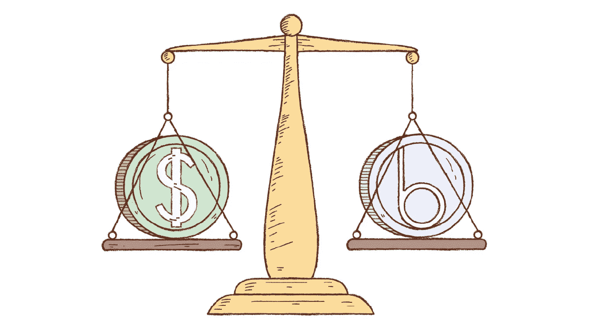
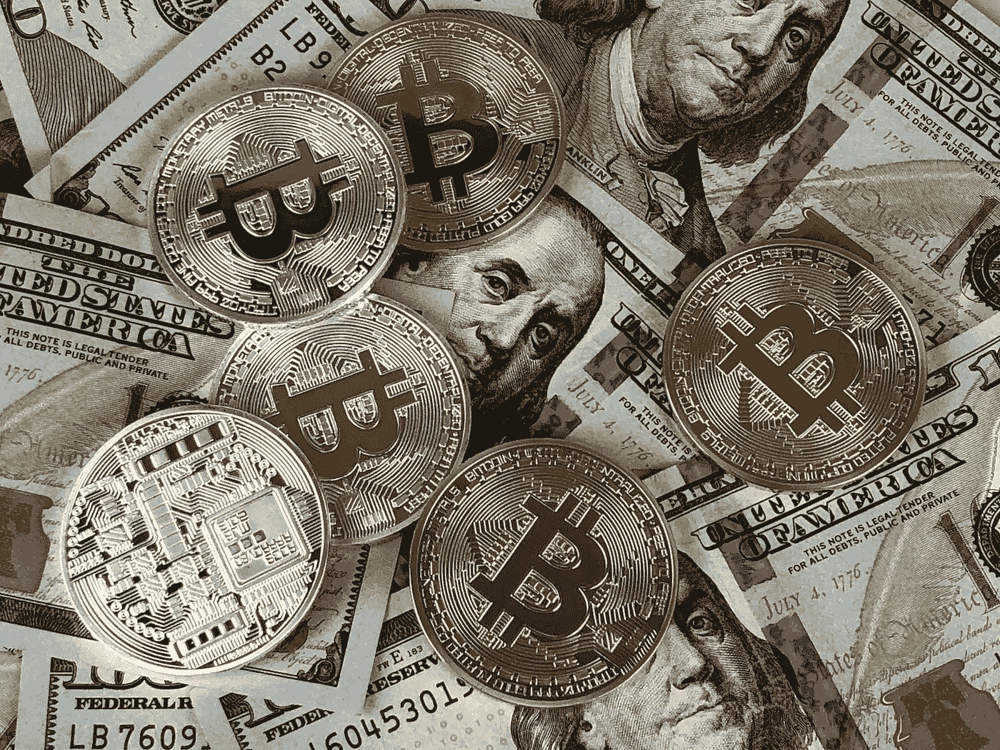
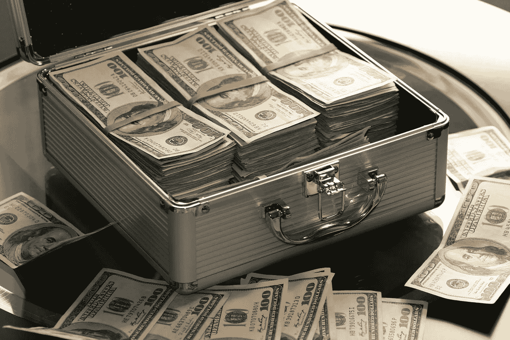
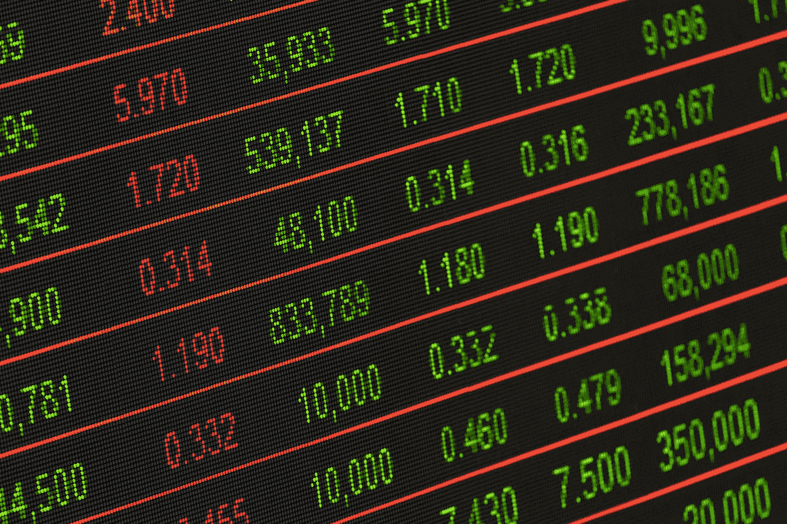

# stable coins——通往加密货币乐土的道路

> 原文：<https://medium.com/hackernoon/stablecoins-carrying-the-way-to-the-crypto-promised-land-c124b2db8ea3>

# 拥有分散的美元，而不必与菲亚特打交道

在[加密货币](https://hackernoon.com/tagged/cryptocurrency)中，大多数狂热的交易者更喜欢有一个稳定的选择来交易他们不稳定的持有，同时仍然保持分散的资产，避免兑换成法定货币的需要。我们交易者有时需要一段时间的休息，以使我们的加密投资组合不具有显著增加或减少价值的潜力。这正是适当命名的 stablecoins 允许我们完成的任务。

这些加密代币被设计成以大约 1:1 的比例将它们的价值与各种货币的价值紧密挂钩，例如曾经流行的美元。通过这样做，交易所和算法平台(如 [Level](http://lvl.co/?r=CxEGyn1x) )上的加密货币交易商能够将它们作为一种交易手段，以便从本质上清算他们的其他波动性加密货币。这样做可以消除投资组合中价格大幅波动的风险。

stablecoins 的可用性仍然只有三年半的历史，它们拥有的力量完全取决于市场。但是，根据 Bitwise Asset Management 的菲尔·格雷泽(Phil Glazer)的说法，他认为随着时间的推移，一种相对于我们主要法定货币具有固定价格的成功加密货币将对加密货币整体产生重大积极影响。他说，

> “固定价格的加密货币将比当前的加密货币允许的使用案例数量更多。目前，加密货币主要由寻求从价格升值中获利的投资者和投机者持有。很少有人像持有和使用美元一样持有和使用加密货币(领取工资、支付食品杂货等)。)因为价格每天都在大幅波动。”

在当前的加密货币交易所中，只有选定数量的加密资产可以交换当前可交易的稳定货币。包含稳定硬币的交易对是交易最频繁的。事实上，交易 USDT(又名 Tether，我将在本文稍后详细介绍)和[比特币](https://hackernoon.com/tagged/bitcoin)的组合是目前交易所中最受欢迎的交易对。

当 USDT 的价值故意不获取利润或损失时，为什么它的交换率如此之高？好吧，从设计上来说，稳定币的价值不会像大多数其他加密货币那样起伏不定，这正是它们的吸引力所在。如果你正处于比特币的近期高点，并决定是时候暂时抛售一部分，Tether 允许你以比特币的市场价格这样做。如果第二天 BTC 相对于美元贬值 15%,你被转换成系绳的股票实际上没有损失任何价值。

系绳和其他稳定的硬币让你在任何时候都可以从市场的高点和低点“坐”出来，并且放心地知道这些硬币相对于美元的价值不会改变。

交易所中稳定硬币的存在，使得交易者可以轻松地在比特币和其他波动性较大的硬币中循环进出，同时将他们的持有量保持在中央银行系统之外。在交易者选择的任何时间，用波动性最小的硬币(稳定硬币)交换波动性较大的硬币(如比特币),对于任何希望在任何给定时间范围内降低风险和保护投资组合价值的人来说，都是一个巨大的优势。投资者和交易者需要稳定他们自己的持有量，以应对短期和长期时间范围内加密市场波动性的大幅上升。他们还需要一个快速的方法来退出和进入他们的位置，当重大新闻发生时，价格可能会立即做出反应。

但是，为什么我们不能立即将我们持有的任何加密货币转换成实际的美元呢？为什么我们甚至需要一种专门设计的稳定代币来全天候复制美元的真实价值？我们已经有了一些可以很容易地用来交换商品和服务的东西，无论是面对面还是在互联网上。它叫做美元。此外，传统的股票和权益可以在几乎所有的网上经纪公司用美元买卖。然而，有几个原因可以解释为什么大多数交易所都提供稳定的股票:

*   没有适用于将加密货币从一个位置发送到另一个位置的货币传输法律。美元就不一样了。
*   绝大多数替代硬币根本没有交易量和追随者，因此交易所无法提供直接的法定买卖。但是记住关键词是“还”。
*   从全球角度来看，许多国家正在经历恶性通货膨胀，加密交易商正在寻找方法，轻松地将其持有的资产兑换成与美元挂钩的资产。在尼日利亚或埃及等国家，其本国货币的波动性远远超过美元，这使得 Tether 成为一种方便、简单且不复杂的交易和兑换本国波动性货币的选择。

# **Crypto 顶级稳定币不太稳定的历史**

自 2016 年初以来，经常臭名昭著和两极分化的系绳硬币(USDT)一直在全球各地的加密货币交易所和钱包中流通。世界上目前交易量最大的稳定币的可疑之处在于它们在基金支持透明度方面令人担忧的不良记录。 ***硬币的团队声称每枚 USDT 硬币都有一美元的硬通货储备做后盾*** 。然而，只有模糊的，备受质疑的证据被提供来反驳他们没有真正的美元支持他们的代币的观点。通过对公司的定期审计来提供硬通货美元支持的证据将会减轻担忧，并在交易者的头脑中注入信心。

系绳团队经常询问这一说法的证据，但大多都没有回应。截至 2018 年 6 月 1 日，stablecoin 的市值达到了惊人的 25.5 亿美元。此后不久，一份由律师事务所 Freeh spor kin&Sullivan LLP 支持的透明度报告发布，该报告非正式地表示，他们的调查发现泰瑟拥有他们声称的资金支持。该公司据称在没有警告的情况下受到了律师事务所的调查，据宣布，Tether 的银行账户记录超过了其 6 月 1 日的市值 700 万美元，从而表明它完全支持其代币的市场供应。然而，这份报告的模糊性和许多具体细节的缺乏只是暂时让批评者保持沉默。

在撰写本文的一周前，彭博进行了一次调查报告[,对泰瑟的透明度报告提出了强烈质疑。在这篇文章中，他们指出，广受欢迎的加密货币交易所北海巨妖一直是众多可疑系绳交易的主机，其中许多交易都是公然操纵市场的迹象。Wash 交易和非常具体的交易金额已经被触发，并且在 Tether 的总价值中几乎没有遇到暂时的价格变动。目前还不清楚是否有与 Tether 或交易所有关的人与这些市场操纵策略有任何关系，但似乎 Tether 至少知道这些交易，因为这些交易的价格波动通常会大幅影响硬币的价值。](https://www.bloomberg.com/graphics/2018-tether-kraken-trades/)

洗盘交易是指同时买入和卖出一枚硬币的行为，目的是误导交易者对某枚硬币或整个市场做出错误的判断。许多人怀疑这些特殊的交易是在没有适当的价格变动的情况下在交易所发生的。由于这些丑闻和其他几个涉及最大的稳定硬币的丑闻，危险信号出现了，系绳作为合法的稳定硬币仍然有争议。

是的，正如我在本文前面所说的，稳定的硬币被设计成不会有显著的价格变动。然而，几个调查此事的人得出结论说， [***这些重大交易至少应该暂时将 Tether 的价格移动到 1.10 美元左右***](https://www.coindesk.com/tether-on-strings-crypto-debates-fresh-round-of-manipulation-claims/) ***，*** 这将导致 Tether 发行更多的硬币进入流通，并不可避免地将它们的价值带回预期的 1.00 美元。相反，价格似乎只在大约 0.99 美元到 1.01 美元之间，这让分析师们怀疑这些订单是真的，还是只是出现在订单簿上，以制造市场需求旺盛的假象。

此外，彭博报告引用了德克萨斯大学教授约翰·格里芬的一段话，他说有一些非常具体的订单“暗示了清洗交易”。

除了围绕这份所谓的透明度报告的所有混乱和它收到的大量两极分化的意见之外，2017 年 11 月已经有一个价值 3300 万美元的系绳硬币黑客。这引发了人们对这种硬币的安全性、脆弱性以及未来安全漏洞的易感性的质疑，具有讽刺意味的是，这种硬币旨在为剧烈波动的市场注入一种平静感。

尽管缺乏基金支持的证据，这在世界上几乎任何其他可投资领域都是一个主要问题，但 Tether 仍然是一个高度拥有的令牌，在整个加密货币世界中不断被交换。不仅如此，许多人都不知道美国的 Tether (USDT)目前是仅次于比特币的第二大交易加密货币。稳定指数也可以作为有用的市场指标，根据交易方式反映市场的整体情绪。据 BTC 新闻的分析师约瑟夫·杨称，

> “USDT 的每日交易量可以被认为是加密货币市场波动性的直接代表；如果在下跌趋势中，Tether 的量异常大，这表明交易商正在向 USDT 出售加密货币，如果在牛市中 Tether 的量异常大，这表明交易商正在出售他们的 USDT 储备，以获得更多的加密货币。”

# **可用的稳定币选项**

最近，许多交易所都在跟随比特币基地的脚步，慢慢地为比特币和以太坊等顶级交易的硬币实施美元交易。但是，如果你相信分散货币是未来的趋势，那么交易集中法定货币并不是一个很好的选择。我将在下面列出的这些与法定货币挂钩的稳定货币是为了方便用户兑换，而不是作为美元的替代品让交易者感到被迫承受的负担。交易者目前可以获得三种主要类型的稳定点数:

*   **法定抵押硬币**是一种拥有中央实体的硬币，该实体持有与它们打算在货币中代表的货币等量的货币。这些基金支持的代币预计将基于法定货币的储备，允许它们在单个代币和单个美元之间设定适当的 1:1 比率。这些硬币的例子有:

*   ***系绳(USDT)*** ，我已经深入讨论过的领先稳定币，从 2016 年初开始在交易所流通。最初被称为 Realcoin，它是目前最大的资产支持令牌，充当 crypto 和 fiat 之间的链接。由于有关其美元储备的安全和流动性问题，该公司迄今尚未存在的外部审计意图，以及 2017 年 11 月 3100 万美元 USDT 被盗导致交易暂时停止，他们的声誉受到了轻微但尚未毁灭性的打击。

*   ***【TUSD】***是一种相对较新的投资者法定抵押期权，已经在多家交易所上市。他们利用了围绕 USDT 的争议，并试图解决人们担心的细节问题，如通过每日银行账户信息证明和每月审计实现资产透明度。创建 TUSD 的目的是为了解决一些用例，比如金融服务和在线商务。他们理想地将自己视为加密交易所美元的替代品。值得一提的是，代币在以太坊区块链运行，而不是在 Tether 的比特币区块链。
*   **加密货币抵押稳定币**是对法定抵押币的去中心化回答。这些硬币不是由法定货币支持，而是由实际的加密货币支持，如比特币或以太坊以及智能合约的使用:

*   ***【道】*** *【戴】*与系绳币和其他稳定币有一些相似之处，比如它们与美元软挂钩的价格、不可开采的性质、抵押支持的资产类型。然而，戴使用的不是法定美元支持，而是超额抵押的以太坊智能合约。它也在以太坊区块链发行，而不是比特币区块链。他们的用例旨在向四个市场提供贷款:
*   赌博市场
*   金融市场
*   国际贸易
*   透明的会计系统

*   ***【BitUSD】***是一种有趣的价格稳定的加密货币，因为它由 BitShares 核心货币 BTS 支持。交易者有能力将它们转换成依赖于他们的“值得信赖的价格馈送”的汇率，该“值得信赖的价格馈送”基于每小时更新的几个来源的中间值。BITUSD 的一个有趣的说法是，他们的代币总是被认为至少值 1.00 美元，这意味着硬币有能力在任何时候都至少值 1 美元，但永远不会更低。我们已经看到 USDT 和 TUSD 的币值低于一美元，所以这将是稳定硬币的一个非常有价值的方面。然而，请记住，它们专门用于购买 BitShares，这使得转换为 Fiat 比其他选择更加繁琐。
*   **无抵押稳定硬币**有趣的是，这类硬币没有抵押支持。这些硬币通常实现一种算法或某种形式的自身价值的扩大和收缩供应，这是基于交易者对它的价格和需求。

*   ***Basis*** 是一种即将推出的非抵押稳定货币，它根据收到的需求通过算法调整自己的供应量，以便准确地将自己与一美元的价值挂钩，而不需要任何法定或加密支持。随着这枚硬币越来越接近公开发售，我将很快发布一篇关于它的专题文章。许多人认为这一想法对密码世界来说是革命性的，如果成功，可能会成为对美联储及其中央货币政策的实际威胁。

*   ***【XAV】***号称无法追踪的 Havven，是时下流行的隐私币 Monero (XMR)的一个分支。这种硬币的工作原理是实现一个“铸造和燃烧”系统，该系统从用户的钱包中提取交易，并将其发送到一个智能合同，该合同反过来在交易时保留避风港的价值。这种余额停留在区块链上，并且不可能追踪到进行交易的人。通过使用这种独特的方法，XHV 的用例允许用户将资金发送到离岸存储合同，同时能够保留区块链基金的价值，使用户能够交易其避风港并应对市场波动。

除了我提到的几种代币之外，在不久的将来，加密货币交易者还可以使用其他几种 stablecoins，包括 Kowala、Augmint 和 Carbon。在稳定的硬币格局中，有几个现有的、新兴的和即将规划的选项，交易者和投资者在如何防止他们的加密投资组合的部分剧烈波动方面有一些选择。如果稳定货币能够完成人们对它们的期望和要求(在一个极度动荡的行业保持稳定)，而不怀疑它们的有效性，它们的存在将是加密货币的一大福音。

如果没有这些安全、可靠、稳定的密码供交易者在波涛汹涌时买卖，普遍采用加密技术将是一场极其艰难的战斗。如果能够扩大到全球受众，与货币挂钩的代币将为比特币、以太坊和其他顶级硬币打开大门。《Cointelegraph》的作者 Chrisjan Pauw 说，

> “要让真正分散的稳定货币发挥作用，还必须有一个系统能够可靠地获得稳定货币和挂钩资产之间的汇率，而不依赖于可被操纵的第三方机构。”

这正是我们需要稳定的硬币来提升所有加密货币的原因，我们将在未来的几个月和几年里看到这些硬币能够很好地实现它们设定的目标。

***我在*** [***水平***](http://lvl.co/?r=CxEGyn1x) ***写了深入的加密货币分析，用于加密的被动投资工具。参见我们在做的***[***Lvl.co***](http://lvl.co/?r=CxEGyn1x)***以及参见我们的其他分析在*** [***我们的杂志***](https://medium...m_content=all) ***。如果你喜欢你所看到的，给这篇文章 50 个掌声！如果你讨厌它，就用 49 表示你的不满。***

*本文及相关内容仅供参考。这不应被视为投资建议，你应该咨询财务顾问，并在进行任何投资之前进行自己的研究和尽职调查。在引用证券或商品时，仅用于说明目的，并不意味着对证券或商品分类的任何立场。就提供或讨论的* [*级*](http://lvl.co/?r=CxEGyn1x) *服务而言，这些服务仅可用于* [*级*](http://lvl.co/?r=CxEGyn1x) *白名单资产。*