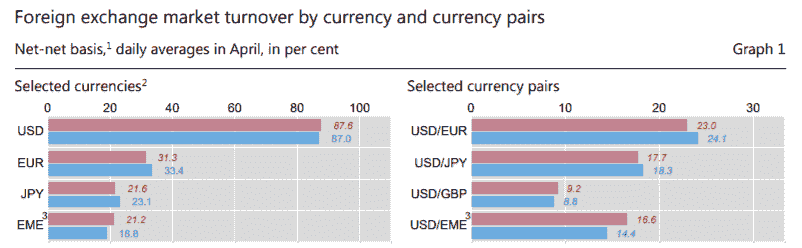

# Stablecoins:支付行业的真正颠覆者

> 原文：<https://medium.com/hackernoon/stablecoins-the-true-disruptor-of-payments-industry-c29d7b3b1781>

即使在加密货币市场最近的熊市趋势中，Stablecoins 也是大赢家。这是因为它们的功能性加上投机者缺乏兴趣。

当比特币最初由昵称为中本聪的神秘家伙或一群人发布时，支持者声称它将彻底改变金融领域的几个领域，包括支付。然而，自[万张 BTC 披萨](https://www.bloomberg.com/news/articles/2018-02-26/crypto-legend-who-bought-pizza-with-10-000-bitcoin-is-back-at-it)以来，许多事情都发生了变化，最古老的加密货币成为投机者的主要目标。数百种其他虚拟货币出现了，但其中大多数都像比特币一样高度不稳定。

很自然，消费者和商家会避开容易出现高度波动和市场不稳定的支付工具，这就是为什么他们将注意力转向稳定的硬币——由法定货币或商品支持的区块链驱动的虚拟硬币。Tether 的 USDT 是最受欢迎的例子，但 2018 年带来了更多的例子，特别是在围绕 Tether 的争议中。

**为什么稳定的硬币有用？**

[稳定。Report](https://stable.report/) 是一个监控 stablecoins 和 stable tokens 的网站，它显示了大约 120 个目前正在运行或仍在开发中的相关项目。超过 50%的展示 stablecoin 项目是在 2017 年之后出现的，这证明了这个子市场扩张的惊人速度。围绕 stablecoins 的热潮并没有白费——它们将成千上万的互联网和区块链生态系统与传统经济联系起来，通过自动化简化支付流程，并确保透明度、可扩展性和流动性。

stablecoin 项目 Xank 的创始人兼首席执行官 Ryan Kim 最近[告诉](https://www.bloomberg.com/news/articles/2018-11-07/crypto-2-0-may-be-digital-cash-you-can-actually-use-to-buy-stuff)彭博:

“Satoshi 对金钱有着革命性的理念，而 stable coins 正在为这一愿景点燃火炬。比特币已经成为一种投机游戏，它太不稳定，无法用于商业。”

Stablecoins 用于平滑常规加密货币的高波动性和噪音。此外，它们大多倾向于适用了解客户(KYC)和反洗钱(AML)要求，这有助于商家以安全和合法的方式开展业务。

**稳定曲线的类型**

截至今天，最稳定的货币以 1:1 的比率得到美元的支持。这是因为根据国际清算银行(BIS)提供的数据，美元具有世界储备货币的地位，并且是交易量最大的法定货币，约占外汇交易量的 87%。

*资料来源:国际清算银行*

虽然用美元支持稳定债券有助于发行者确保更广泛的覆盖面，但一些项目选择实施替代方法。[爱沙尼亚的 PlasmaPay](https://plasmapay.com/) 公司，目前正在开发一个面向区块链的支付生态系统，由 Plasma Token 驱动，这是一种稳定的货币，类似于国际货币基金组织(IMF)的特别提款权(SDR)篮子。

PlasmaPay 创始人兼首席执行官 Ilia Maksimenka 透露，由区块链提供支持的 Plasma Token 将代表 PlasmaPay 生态系统中最稳定的货币，其中还将包括约 30 种法定货币和加密货币。它将依赖于一种价格形成算法，该算法将根据交易量考虑网络内的所有货币，这将平滑价格并确保尽可能低的波动性。Plasma Token 的特殊之处在于，它可以减轻加密货币和法定货币的波动风险，而美元支持的稳定货币则不然。

Plasma Token 目前处于测试阶段，可能会在 2019 年 1 月在演示平台上推出。

**为什么类似 SDR 的稳定器代表未来？**

围绕 stablecoins 的炒作仍在继续，甚至在最近整个加密领域的崩溃中，该领域的股价从今年迄今的峰值水平下跌了 80%以上。

据报道，TrueUSD 发行人 Rafael Cosman 说:

*“稳定的硬币可能是开启密码广泛应用的钥匙。”*

然而，尽管美元支持的稳定货币成功解决了加密货币的高波动性，但它们也面临着与美元本身相关的相同风险。从长期来看，由于持续的通货膨胀，美元贬值，而美国、欧盟和中国处于前沿的货币战争给法定货币带来了额外的压力。

类似 SDR 的稳定币可能是更好的选择，因为它有助于用户解决加密货币和法定货币的风险。此外，类似特别提款权的硬币，如血浆代币，坚持分散的模式，而美元支持的代币未能做到这一点，因为它们依赖于一个集中的货币。

此外，这些创新的稳定币支付系统是可扩展的。

*Maksimenka 透露:“今天，在支付方面，我们可以在速度上与 VISA 和 MasterCard 竞争，它们是最快的支付系统。*

**“我们正在实施我们的项目，因为当前的全球化和电子商务的发展需要一种新的方式来处理双方之间的金融关系，这将减少中介，并减少对老派模式的需求，”*他补充道。*

*Stablecoins 是当今的一大趋势，它们正在重塑电子商务基础设施、发票支付模式、工资和租金支付、借贷市场和财富管理等。*