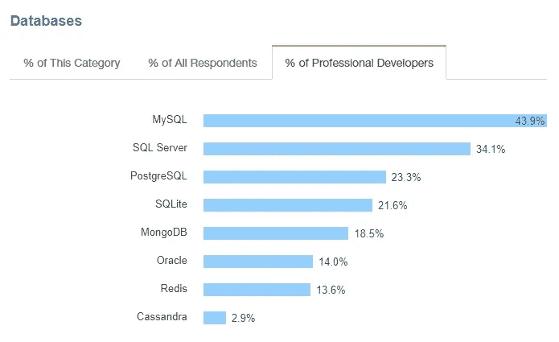
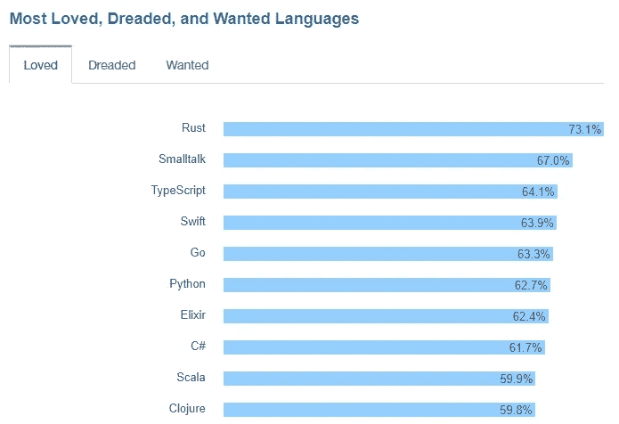

# Stack Overflow 的 2017 年与 2018 年调查

> 原文：<https://medium.com/hackernoon/stack-overflows-survey-2017-vs-2018-8ce3f8a2aa5e>

不久前，Stack Overflow 发布了他们的年度开发者调查结果。

今年，他们有超过 **10 万**的受访者，而 2017 年这个数字是**6.4 万**。太神奇了！这是目前世界上最大的开发者调查。

这里我从“技术”部分整理了一些观点。那么现在让我们来看看软件开发职业在 [**2018**](https://insights.stackoverflow.com/survey/2018/) 和 [**2017**](https://insights.stackoverflow.com/survey/2017) 中的样子。

**2017**

# 1 编程语言

连续第六年， **JavaScript** 是最常用的编程语言。 **Python** 排名上升，今年超过了 **C#** ，很像去年超过了 **PHP** 。

**2018**

**2017**

# 2 框架、库和工具

**Node.js** 和 **AngularJS** 只是**和**交换了位置，仍然是这个类别中最常用的技术，而 **React** 和**。Net Core 对许多开发者来说也很重要。**

**2018**

**2017**

# **3 个数据库**

和去年一样， **MySQL** 和 **SQL Server** 是最常用的数据库。

**2018**

**2017**

# 4 个平台

**Linux** 和 **Windows 桌面**或**服务器**是受访者表示他们为今年做开发工作的最常见选择。

**2017**

# 5 种最受欢迎的语言

**Rust** 连续第三年成为受调查者最喜爱的编程语言，紧随其后的是 **Kotlin** ，这是一种在今年的调查中首次被问到的语言。这意味着按比例来说，更多的开发人员希望继续使用这些语言而不是其他语言。

**2018**

**2017**

# 6 个最受欢迎的框架、库和工具

**TensorFlow，**栈溢出上发展最快的技术之一，最受开发者喜爱。React 是开发人员说他们最想使用的框架，如果他们还没有的话。

**2018**

**2017**

# 7 开发环境

Visual Studio 代码刚刚取代 Visual Studio 成为 web 开发人员最受欢迎的开发环境工具。

**2018**

**2017**

# 8 项顶级支付技术

也是最有趣的地方。这里谁是有钱的猫？从全球来看，使用 **F#** 、 **Ocaml** 、 **Clojure** 和 **Groovy** 的受访者收入最高，平均收入超过 7 万美元。想想吧！))

**2018**

[*纳塔利娅·库库什金娜*](https://www.linkedin.com/in/natalia-kukushkina-b62397132/)