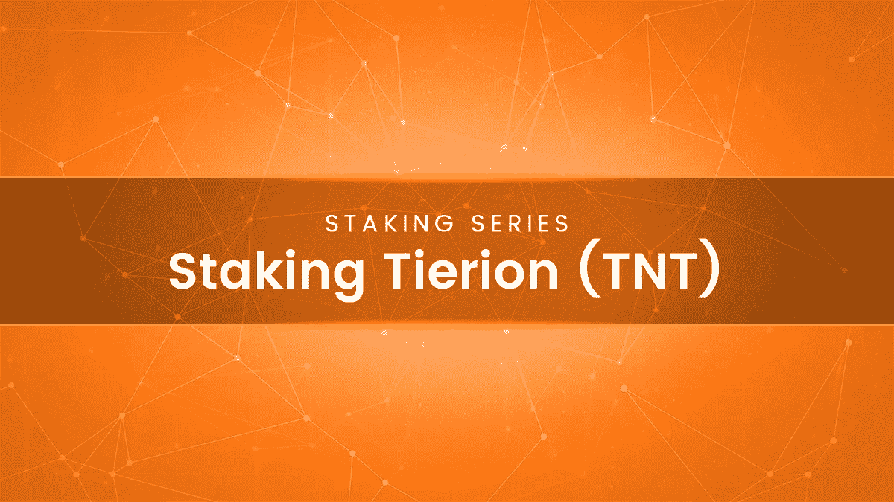

# 打桩铁离子(TNT)

> 原文：<https://medium.com/hackernoon/staking-tierion-tnt-8c808e0f0ce0>

**锁紧系列(5 部分系列—第 3 部分)**

在过去的几个月里，由于高需求，采矿硬件的价格飞涨，打桩变得流行起来。如果你是赌注的新手，你可以阅读我们最初的赌注指南和你可以下注的流行硬币。

一种这样的硬币是 Tierion(TNT)。这是一种你可以下注并获利的新硬币。在这篇文章中，我们将通过一个简单的指南来股权 TNT。此外，我们还将讨论入股 TNT 是否有利可图，以及如何出售 TNT 以获得账面利润。在写这篇文章的时候，我们也在关注 TNT，想把这些信息传播给我们的读者。然而，要参与，你首先需要做节点注册。目前，他们不时进行注册(一般每月一次)。要了解更多关于他们的注册过程，你可以访问他们的[注册更新](/tierion/tierion-registration-update-6f89fa309c45)媒体帖子。

# 打桩指南(TNT)

与其他赌注硬币相比，赌注铁里奥的工作方式略有不同。你只需要把硬币转移到一个赌注钱包，它就完成了。以 NEO 为例，只需转入 neotracker.io 等线上钱包，就能以气体的形式获得 5–5.5%的年回报。气体是另一种加密货币，是近地天体生态系统的一部分。

我们将使用亚马逊来设置 Tierion 节点。节点很重要，没有它，你根本无法入股 TNT。然而，不要被这些步骤弄得不知所措。即使你不精通技术，你也可以很容易地按照指南来设置你的 TNT 节点。

# 购买 ERC20 兼容钱包

第一步非常简单。您需要创建一个 ERC20 兼容的钱包。你只需去 https://www.myetherwallet.com 的[创建一个就可以了。还有，你需要把最低额度的 ETH 和 TNT 转到钱包里。ETH 的最小值为 0.01 ETH 和 5000 TNT。](https://www.myetherwallet.com)

# 亚马逊 Lightsail 帐户创建

下一步是创建一个亚马逊 Lightsail 账户。你需要买一台服务器。但是，不要购买他们提供的客户支持或追加销售功能。

# 购买 Ubuntu 虚拟服务器

创建帐户后，您需要创建一个实例，您的节点将在其中活动。为此，你只需要遵循下面提到的基本步骤。

1.点击“创建实例”

2.现在，选择您希望节点活动的区域。选择离你最近的地区总是明智的。

3.现在只选择操作系统，然后继续选择“Ubuntu”。我们将运行下面的几个命令来设置基本节点。

4.为了确保正常的功能，您需要选择最低 10 美元的计划。如果你想对资源格外小心，那么建议你选择 20 美元计划。

5.最后，但同样重要的是，你需要为你的 Ubuntu 服务器选择一个名字。

# 给你的服务器一个静态 IP

静态 IP 是使您的服务器对互联网或其他资源可用所必需的。为此，您需要点击“创建静态 IP”。

现在点击 Ubuntu 服务器的区域和位置，并连接静态 IP。最后，您需要命名您的静态 IP，以便于以后访问。

# Ubuntu 服务器设置

太好了，你已经安装了 Ubuntu 服务器，并且还附加了一个静态 IP。现在，您需要设置。在这一部分，我们将使用命令。如果您以前没有使用过命令，请不要担心。你只需要复制并粘贴命令。

**须藤一号**

**apt 更新**

**apt 升级**

**y**

将上面的命令一次放一行。以上命令将帮助你简单的更新和升级你的 Ubuntu 包。

# 启动你的 Tierion 节点

要启动并运行 Tierion 节点，您需要安装一些核心软件。一旦安装，简单的编辑将使他们有用。你需要在你的 Ubuntu 操作系统中安装 4 个主要软件。分别是 Docker、Google NTP 服务、Ubuntu 16.04 更新、Chainpoint Node。

所有这些软件都可以使用我们创建的简单脚本来安装。只需复制并粘贴以下脚本命令即可完成。

curl-sSL[https://cdn . raw git . com/chain point/chain point-node/13 b 0 C1 b 5028 c 14776 BF 4459518755 b 2625 ddba 34/scripts/docker-install-Ubuntu . sh](https://cdn.rawgit.com/chainpoint/chainpoint-node/13b0c1b5028c14776bf4459518755b2625ddba34/scripts/docker-install-ubuntu.sh)| bash

恭喜你！您已经成功安装了 Tierion 软件。现在是时候编辑它了，这样它就可以工作了。

**VI ~/链点节点**

上面的代码将打开配置文件。你只需要编辑并保存它。

使用箭头键移动到**。env”。**到达后，按回车键。

现在，您需要按**“我”**来编辑条目。

您需要将**“NODE _ TNT _ ADDRESS”**编辑为您在步骤 1 中创建的节点 wallet 地址和**“chain point _ NODE _ PUBLIC _ URI”**到你的静态 ip 地址。它应该遵循“http://ipstaticadress”的格式

完成后，点击 ESC 键并输入 **":wq"**

就是这样！

# 最后一步:启动并验证 TNT 节点

最后一步是启动并验证节点。这也将帮助您检查是否有任何潜在问题。让我们开始吧。

**cd ~/chainpoint-node**

这将把您移动到节点目录。

**进行升级**

**制作日志**

上面两个命令将启动您的节点并开始创建日志。如果没有错误，您已经成功启动了 TNT 节点。如果您看到一些错误，您需要检查他们的文档，看看如何修复它。

最后一步是简单地监视你的 Tierion 节点几个小时。如果一切顺利，你将被 TNT 网络验证，奖励将开始流入。

那么，你觉得教程怎么样？请在下面评论并告诉我们。

*信用—* [*凯尔*](https://www.accrubit.com/how-to-easily-setup-tierion-node.html) *。*

**赌注系列(5 部分系列—第 1 部分)** : [在没有强大的采矿钻机的情况下获得加密](https://hackernoon.com/earning-crypto-without-a-powerful-mining-rig-stake-your-crypto-today-889df80c8641)
**赌注系列(5 部分系列—第 2 部分)** : [赌注池—它们如何工作](https://hackernoon.com/staking-pools-how-they-work-aaf7f8c0f81)

*渴望了解更多关于 FundYourselfNow 的信息吗？在我们的* [*电报*](https://t.me/fundyourselfnow) *群上加入我们的众筹革命对话，或者在* [*推特上关注我们。*](https://twitter.com/fundyourselfnow)