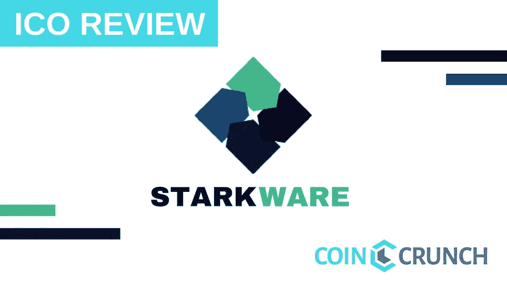
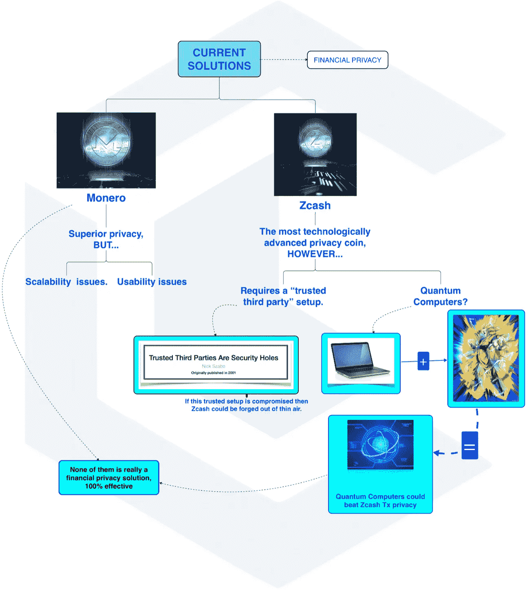

# Starkware Industries 展示 zk-STARKS 的超强区块链可扩展性、隐私性和透明度

> 原文：<https://medium.com/hackernoon/starkware-industries-presents-zk-starks-for-supercharged-blockchain-scalability-privacy-c42e15a74f98>

*ZK-斯塔克斯或****Z****ero****K****knowledge****S****calable****T****transparent****Ar****gument of*

**

*比特币的产生引入了一种新的安全手段，无需可信的第三方即可转移货币价值，然而，这是以金融隐私为代价的，区块链上的每一笔交易都被记录下来并向所有人公开。*

*隐私的价值不仅限于财务，还涉及健康、政治、宗教和个人观点等领域。*

*如果你被抢劫了，并且你的钱包地址因为不小心被公开了。这一错误可能会永远困扰你，因为公众将能够跟踪你的资产动向，并监控你的加密货币净值，使你面临再次受到攻击的风险(物理和数字)。*

**

*目前，加密货币主要处理金融性质的金融交易，如比特币网络上的价值转移，或在以太坊上结算“智能合约”。*

*加密交易缺乏隐私是加密货币更广泛采用的障碍，可以说阻碍了这一革命性创新发挥其全部潜力。*

*如果敏感数据(构成当今时代的大部分数据)将存储在区块链上，这些数据将需要遵守世界各地的隐私标准。*

*感谢 Starkware Industries 和他们开发的 zk-STARKS 技术，一种更新、更透明和更性感的零知识证明，在为区块链提供可扩展性的同时维护隐私的问题正在到来。*

**

# *问题*

*生活是一个永无止境的问题之旅，希望我们大多数人都能克服我们面临的问题，当我们这样做时，另一个问题降临到我们身上只是时间问题。*

*当涉及到加密时，永无止境的问题无一例外！*

*比特币的引入提供了一种在全球范围内转移货币价值的解决方案*而不需要可信任的第三方，然而这种解决方案带来了一个新问题:**

***财务隐私！***

*由于比特币网络是一个点对点网络，为了防止双重消费攻击和欺诈交易，解决方案包括确保每个人都能访问公共分类账的当前状态。*

*这实质上意味着每个人都可以公开访问网络上所有交易的记录，包括每个比特币钱包持有的比特币总量。*

*交易和钱包本质上是假名的——这意味着你无法破译谁拥有钱包，谁最终进行或接收交易，你只知道交易是从一个钱包地址到另一个钱包地址进行的。*

*(然而，有一些团体跟踪最大比例的硬币持有者的交易，因此即使他们可能不知道钱包的确切所有者，但通过足够的观察，可能有机会将钱包的所有者缩小到几个人——例如跟踪 Mt. Gox cold wallets 活动的以下网站。)*

**

*然而，当你用密码与某人交易时，这就破坏了所有的假名成分，从而暴露了你的一部分身份，失去了所有的金融隐私。*

*与你交易的任何人都可以推断出你可能是你发送或接收加密货币的钱包的所有者，因为区块链的开放透明性质，他们可以很容易地窥探你拥有多少加密货币，你还与谁交易，以及你将加密货币发送到哪里。这对以太坊区块链和位于其中的 ERC 20 代币来说尤其如此。*

*这就像有一个熟人，邻居，家人或朋友给你的银行账户汇钱，唯一的区别是，如果他们想，他们可以看到谁给你汇了钱，或者你给谁汇了钱，你以前做过的所有交易，以及你拥有多少密码！*

*这种金融隐私的缺乏会让许多人感到不安，在极端的情况下，这可能会使人们成为 T2 绑架和勒索的目标。*

***所以我们现在面临的大问题是…***

**我们如何在区块链上实现隐私保护，同时确保交易的有效性和底层代码的“完整性”?**

*换句话说，我们如何在保持隐私的同时实现所谓的“计算完整性”?*

*就目前而言，大多数加密货币都是公开的(见[比特币](https://blockchain.info/)或[以太坊](https://blockchain.info/)的区块链探险者),这就是为什么我们可以信任网络。*

*我们可以检查自第一个 genesis block 诞生以来的每一笔交易，因此我们相信网络是健全的，没有人凭空秘密印刷加密货币或以其他方式欺骗系统，从而破坏网络的完整性。*

*但是如果我们把隐私引入区块链，我们还能相信一切都正常运转吗？*

***月亮包先生的故事..***

*MoonBag 先生通过投资加密货币赚了数百万美元，并决定将他的一些新财富花在兰博基尼上。自从 2016 年参加 Consensus 以来，他的梦想目标是有一天在他的*自己的*兰博基尼参加一个秘密活动。*

**

*在打电话给当地的兰博基尼经销商询问他是否可以在扣动扳机前进行试驾后，经销商对他的要求嗤之以鼻，说:*

*我们这里不提供免费的游乐设施，只有认真的买家才可以试驾。如果你能证明你是一个认真的买家，请随意进来。”*

*销售员告诉 MoonBag 先生，他需要提供足够资金的证明，或者通过信用检查，才能被认为是一个认真的买家。*

*MoonBag 先生知道展示他的 Delta 投资组合不足以作为证据。他需要向销售人员展示他的加密钱包，证明他拥有它们，并且他有足够的密码来完成购买。*

*唯一的问题是，MoonBag 先生对其他人知道他的新发现的财富很偏执… ( *是的，这是非常讽刺的，因为他正在购买兰博基尼，但这是一个虚构的故事，所以只是合作好吗！*)*

*那么，MoonBag 先生怎么可能向推销员证明他有足够的加密货币来购买一辆全新的 Galardo 而不损害他的财务隐私呢？*

*在听过无数人通过加密赚了数百万成为黑客、骗子和罪犯的目标的故事后，MoonBags 先生宁愿安全也不愿后悔…*

# *解决办法*

***当前解决方案*财务*隐私***

*在我们继续 MoonBags 先生的兰博基尼冒险之前，让我们简要介绍一下目前在区块链实现金融隐私的一些解决方案。*

*Monero 和 ZCash 可以说是加密货币启用隐私保护的两大领跑者。*

*普遍的共识似乎是，Monero 在确保隐私方面是更好的选择，然而，在令牌的可扩展性和可用性方面面临着自己的挑战。*

*ZCash 经常被吹捧为技术最先进的隐私硬币，但是它也有一些自己的问题，特别是:*

1.  *ZCash 的隐私功能背后的技术是*不*抵抗量子计算；和*
2.  *ZCash 需要一个“可信的”设置来实现其隐私功能，这违背了区块链不需要可信的第三方来处理交易的目的*

**

***1。量子计算***

*量子计算机可以被认为是高度增压的计算机——如果你愿意的话，是普通计算机的超级赛亚人版本。*

*目前量子计算机仍处于初级阶段，还有待开发。*

*然而，预计在未来，量子计算机将能够以比目前可能的速度更快的速度进行计算，这可能使它们能够解决目前被认为无法解决的问题。*

*这意味着，当量子计算机出现时，确保 ZCash 隐私的底层技术 zk-SNARKs 可能会被破解，从而使 ZCash 交易的“隐私”变得毫无用处。*

***2。ZCASH(ZK-斯纳克)的“可信”设置***

*zk-SNARKs，这是一种“零知识证明”(稍后当我们回到 MoonBags 先生的时候会有更多关于它的内容！)，增强了 ZCash 的保密性，并且由于它的工作方式，它需要一个设置阶段来指定零知识证明的公共参数。*

*这个设置阶段的唯一问题是，如果设置遭到破坏，那么无论是谁，都有可能凭空伪造 ZCash*

*很明显，如果发生这种情况，那就不好了，因为这会破坏 ZCash 的完整性！*

*这里真正的问题是，比特币被创造出来，因此不需要可信的第三方，然而在 ZCash 的情况下*有*一个可信的第三方。*

**

*可信第三方是执行初始设置阶段的六个人。因此，为了让公众信任 ZCash 的网络，他们需要相信这六个人没有破坏设置，以便他们能够神奇地凭空打印 ZCash，而没有人知道！*

***回到月亮包先生…***

*快速回顾一下 MoonBag 先生的困境，他想用他的新加密财富购买一辆兰博基尼，但是需要通过证明他有足够的资金向销售员表明他是一个认真的买家。*

*这里的问题是，MoonBag 先生想保护他的财务隐私，不希望推销员或那里的任何其他工作人员知道他拥有多少密码，他的钱包的地址是什么，甚至不知道他一直在与谁交易。*

*这就是“零知识证明”发挥作用的地方！*

*使用“零知识证明”，MoonBag 先生有可能向兰博基尼推销员证明他拥有至少价值 500，000 美元的加密货币(*对于一个兰博基尼来说绰绰有余)*然而，他能够证明这一点，而无需透露任何进一步的细节，例如他的钱包地址、他总共拥有多少加密货币以及其他隐私事项。*

*今天，加密货币中使用最广泛的零知识证明之一是 zk-SNARKs，它由 ZCash 使用，但正如您可能记得的那样，ZCash 有一些问题，这就是 Starkware 更新、更好、更改进的版本出现的地方…*

***zk-STARKs！***

*建立在 zk-SNARKs 之上的是 zk-STARKs，它是:*

*   ***S** calable 更快的证明生成和验证*
*   *透明:这样就不需要像 zk-SNARKs 那样的外部“可信”设置阶段*
*   ***AR**Kknowledge-证明已使用正确的输入和数据来计算输出。(因此，在 MoonBag 先生的情况下，证据将显示他使用了他自己的*加密钱包地址，而不是其他人的地址，来证明他拥有至少 500，000 美元，这是输出)**
*   *后量子安全——ZK-STARKs 的隐私特性所基于的假设不容易受到大规模量子计算机的攻击。*

# *主要功能—技术概述*

*如前所述，Starkware 将建立在现有的 zk-SNARKs 协议之上，增加了 zk-STARKs 的透明度*

*zk-Starks 的实现将提供高度可扩展的、更快的计算和更小的证明。这种功能组合加上对大规模量子计算机的“免疫力”，应该会引起加密货币世界及其他领域的高度兴趣。*

*为了让您了解与当今市场上顶级的隐私币相比，这种币的价值如何，我们提供了下表:*

***隐私币对比***

**

*从上表可以看出，具有 ZkStarks 协议特征的硬币将是市场上最先进的硬币。*

# *路标*

*路线图尚未发布。*

# *象征经济学*

*Starkware 目前没有计划 ICO，并宣布他们将探索 [Tech4Tokens (T4T)](/@StarkWare/tech-4-tokens-a-framework-for-venture-technologists-in-the-blockchain-ecosystem-56e8ae763deb) 的潜力，在那里他们投资他们的技术以换取代币，从而成为“风险技术专家”或“技术加密基金”。*

# *潜在考虑因素*

*令牌/协议/项目将面临或可能忽略的潜在问题列表。*

*   *与 zk-SNARks 相比，zk-STARKs 中证明的大小从 288 字节增加到几百千字节，需要进一步的研究和创新来降低证明的大小。*
*   *尽管很容易理解这项技术的重要性及其在现实世界中的潜在应用，但目前还没有一个 MVP 或用例被发布。*

# *团队+顾问*

**

*[**伊莱·本·萨松**](https://www.linkedin.com/in/eli-ben-sasson-9b7959/) *—联合创始人/首席科学家**

*   *Eli 于 2001 年在希伯来大学获得计算机科学博士学位。主修他的激情——“月球数学”理论和透明计算完整性的实现。*
*   *他在麻省理工大学完成了博士后研究。*
*   *自 2015 年以来，他目前还是 Technion 以色列理工学院的教授。在那里他与人合作创办了“ [SIPR 实验室](http://www.scipr-lab.org/)项目。SCIPR 实验室是一个由研究人员组成的多机构学术合作组织，旨在将提供简洁的完整性和隐私的加密证明系统付诸实践。*
*   *他还参与了一个[手机应用](https://baby.croinc.org/index.html)——利用群体智能一起理解儿童发展。*
*   *还共同发明了零现金分散支付系统和 Zcash 公司的创始人科学家。*

**

*[**亚历山德罗·基耶萨**](https://www.linkedin.com/in/alessandro-chiesa/) *—联合创始人/首席科学家**

*   *Alessandro 目前也是加州大学伯克利分校计算机科学系的助理教授。*
*   *他是 sccinct 零知识证明开源软件 libsnark 的合著者*
*   *他在麻省理工学院完成了计算机科学的理学学士、工程学硕士和哲学博士学位。*
*   *共同创办“ [SIPR 实验室](http://www.scipr-lab.org/)项目。*
*   *共同发明了 Zerocash 分散支付系统，是 Zcash 公司的创始人。*
*   *还作为加密货币顾问参与了 Algorand 项目。*

**

*[**Uri Kolodny**](https://www.linkedin.com/in/urikolodny/)*—联合创始人/首席执行官**

*   *Uri 是一位连续创业者，在过去的 13 年多时间里，他创办了许多科技公司。公司包括:*
*   *[Modria 技术有限公司](https://www.linkedin.com/company/mondria-technologies-ltd./) —软件公司*
*   *[Greylock Partners](https://www.linkedin.com/company/greylock-partners/)&ICV——风险投资&私募股权*
*   *Tim ba——面向心血管市场的基于超声波的治疗产品*
*   *[OminGuide](https://www.linkedin.com/company/omniguide/) —一家技术公司，为微创手术、腹腔镜手术和机器人辅助手术提供增强手术准确性、通路和控制的产品。*
*   *他获得了希伯来大学的计算机科学学士学位和麻省理工学院斯隆管理学院的 MBA 学位。*
*   *专利:*
*   *光子晶体波导和使用这种波导的系统*
*   *[专利发布日期 2004 年 11 月，专利发布人，专利号 US 7，310，466](http://www.google.co.in/patents/US7310466)*

**

*[**迈克尔·里亚布采夫**](https://www.linkedin.com/in/riabzevmichael/) *—联合创始人/首席架构师**

*   *Michael 拥有超过 14 年的软件开发经验，包括英特尔和 IBM 实验室。*
*   *数学学士和计算机科学硕士。*
*   *Technion 以色列理工学院计算机科学博士候选人，专注于零知识计算完整性实用系统的开发，最终开发并实现了 zk-STARK 系统。*
*   *还从事过硬件加速、加密算法、GPGPU、SDN、web 开发等工作。*

# *合作伙伴和投资者*

**

***来源:***

*   *布塔林维塔利科。[“STARKs，第一部分:多项式证明”](https://vitalik.ca/general/2017/11/09/starks_part_1.html)*
*   *布塔林维塔利科。[《斯塔克斯，第二部:谢天谢地，今天是星期五】](https://vitalik.ca/general/2017/11/22/starks_part_2.html)*
*   *Weuse.Cash. [“不可信的设置—为什么你不应该信任 ZCash”](http://weuse.cash/2016/10/28/the-untrusted-setup/)*

***获取我们的免费投资论文***

*注册获得我们确切的投资策略，从开始到结束。它包括我们在 Coin Crunch 的哲学，以及我们的顶级长期选股。*

**

# *想要了解区块链和加密货币的最佳新闻、评论和信息，请访问 [coincrunch.io](https://coincrunch.io) 或查看我们的网站:[Youtube](https://www.youtube.com/channel/UCXyrBCWaRJzHfOtnWaR47Qw)|[Twitter](https://twitter.com/coincrunchio)|[脸书](https://www.facebook.com/realcoincrunch/) | [Reddit](https://www.reddit.com/user/coincrunchio)*