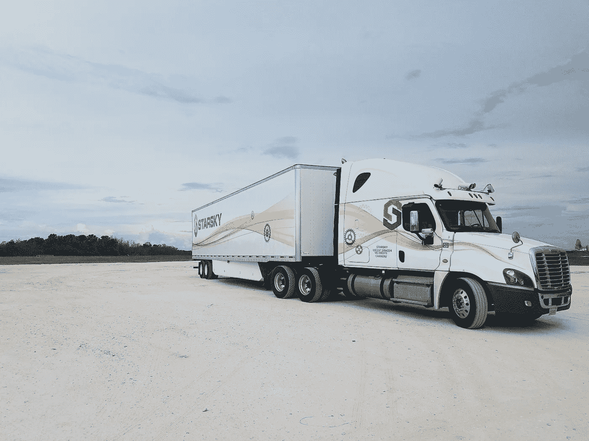

# Starsky Robotics 驾驶全无人驾驶卡车(并从 Shasta Ventures 融资 1650 万美元)

> 原文：<https://medium.com/hackernoon/starskyunmanned-de7af7e5a38b>

我很难把一辆卡车从一片大海开到另一片大海。漫长的一天，数周不与家人在一起，永远存在的危险:让人们一次在卡车里呆上一个月真的很难。这是卡车运输业面临的主要问题。

只有让司机下车才能解决问题。任何仍然需要物理驾驶员的自动驾驶卡车都不能解决问题。

截至今天，Starsky Robotics 是 ***车队中唯一拥有一款产品的*** 自主卡车。

我很激动地宣布，我们驾驶了一辆卡车，全程无人驾驶，行驶了 7 英里。方向盘后面没有安全驾驶员，没有躲在铺位上的工程师。我们是第一家让无人驾驶卡车成为现实的公司。观看下面的 GoPro 视频。

Starsky Robotics — First Drive, directed by Ben Strang at Blueprint Motion Pictures

我也很高兴地宣布，我们已经完成了由 Shasta Ventures 牵头的 1650 万美元的 A 轮融资。我们非常感谢我们之前的投资者在这一轮中的大量参与，包括 Y Combinator、Trucks.vc、50 Years、9Point Ventures 和许多其他投资者。

沙斯塔风险投资公司的创始人兼董事总经理罗布·科内比尔说:“卡车运输业无法满足今天所有的工作岗位。“货物运输没有任何进展，但该行业的劳动力短缺问题日益突出，威胁着它的长期增长。这就是斯塔奇适合的地方。该公司不仅提高了经验丰富的司机的生产率，帮助该行业继续增长，而且正如我们所知，它也在改变物流。”

Starsky Robotics truck “Buster” aiding Hurricane Irma relief in Florida, September 2017 (Courtesy of Dan Feldman)

**在过去的一年里，我们走了很长的路**

今年 4 月，我们开始定期使用自动驾驶卡车运送商业货物。我们让我们的系统在卡车场和主要货运车道上工作，拖运从 5000 磅牛奶板条箱到 40000 磅瓷砖的所有东西。

9 月，我们完成了有史以来最长的端到端自主旅行——*。飓风 Irma 袭击佛罗里达州西南部后，我们用我们的一辆卡车来帮助恢复工作，在没有人工干预的情况下运送了 68 英里的水，创下了行业纪录。*

*自 2015 年成立 Starsky Robotics 以来，我们从未停止设想技术如何帮助解决卡车运输行业的挑战，并为心怀不满的工人提供更新、更安全的机会。我们正在让卡车在漫长、枯燥的高速公路上自动驾驶，在这些地方驾驶很容易；在驾驶需要人工干预的地方可以遥控。而不是在遥远的卡车停靠站度过周末；我们希望司机们把时间花在看他们女儿的足球比赛上。下面是我们在九月里程碑之后用[蓝图电影](http://www.blueprintmotionpictures.com/)制作的纪录片。*

*Starsky Robotics — The Long Haul directed by Ben Strang at Blueprint Motion Pictures*

***前方的路***

*今天的新闻让我们离实现我们的愿景又近了一大步。*

*今年，我们用无人驾驶卡车运输商业货物。*

*这标志着未来自主、无人驾驶地面交通的一大进步。是时候让 autonomy 走出原型阶段，进入商业部署了。我们将与合作伙伴合作，在 2018 年使用无人驾驶卡车运输货物。*

**

*A Starsky Robotics remote truck driver*

***我们正在壮大我们的团队。***

*我们需要所有热情、有创造力和聪明的人加入进来，帮助我们的愿景上路。在接下来的六个月里，我们计划有意义地扩大我们的卡车司机和工程师团队。*

*如果你是一名经验丰富的司机，关心安全并对技术充满热情，请申请。*

*如果你是一名工程师，想要帮助开创交通运输的未来，请在这里申请。*

*凭借我们团队中的新人才，我们相信我们可以在市场其他人之前安全地实现真正的无人驾驶交通。我们认为 0 年是 2018 年。*

*继续前进*

*斯特凡+卡蒂克*

**

*Photo credit: David Rorex*