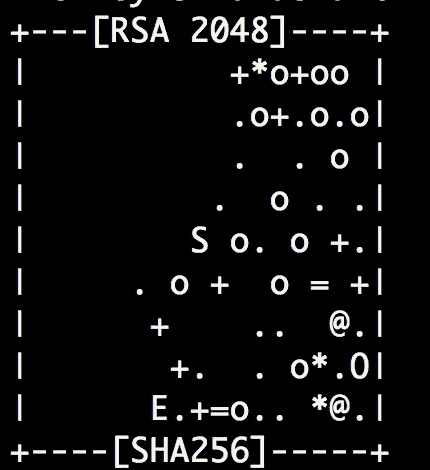

# 从头到尾:在数字海洋上部署 React 应用程序

> 原文：<https://medium.com/hackernoon/start-to-finish-deploying-a-react-app-on-digitalocean-bcfae9e6d01b>

最近在部署一个应用程序时，我经历了许多伴随着部署的各种细微差别的挫折，其中大部分都因缺乏关于它的在线集中信息而变得更加困难。当然，这是多种部署方式的结果(这意味着本指南只是一种方式)。

本指南旨在为使用**数字海洋**创建 [React](https://hackernoon.com/tagged/react) 单页应用程序的人提供一个从头到尾的指南，包括每一个重要的细节。我们将使用 **NGINX** 作为反向代理(并解释*为什么*你要这样做)，使用 **PM2** 作为流程经理，使用 **Serve** 实际处理应用程序的服务。一旦您可以通过 shell 访问您的服务器，这里关于设置您的[数字海洋](https://hackernoon.com/tagged/digitalocean)服务器的大多数概念都可以转移到 **AWS EC2** 平台。这里的概念也可以用于其他 spa、基于 Express.js 的服务器等。

本指南将假设您已经拥有一个 DigitalOcean 帐户，并且已经将您的域名注册商的名称服务器指向 DigitalOcean。有关更改域名服务器的信息，请查看数字海洋的这篇文章:[如何指向普通域名注册商的数字海洋域名服务器](https://www.digitalocean.com/community/tutorials/how-to-point-to-digitalocean-nameservers-from-common-domain-registrars)

**如果你还没有账户，** [**这里有一个互利的推荐链接，让你从 50 美元(！)信用(够他们最便宜的服务器 2 个月左右的服务器时间)**](https://m.do.co/c/2523d33dca05) **。**

## 步骤 1:创建一个水滴

Droplets 是 DigitalOcean 聪明命名的服务器。我们要创造一个。单击屏幕顶部的绿色大创建按钮。

**分配**

DigitalOcean 以“一键式应用”而闻名，它提供了你需要的一切，但为了明确地添加我们需要的东西，我们将从一个空的发行版开始。

至于发行版，有多种选择。Ubuntu 很常见，我喜欢它，所以我们就用它吧！目前，有一个新的 LTS 版本即将推出——17.10——但我们将坚持使用 16.04，因为这是我习惯使用的版本。

**尺寸、位置、选项**

对于一个简单的 React 应用程序来说，您不需要太多的功能，它旨在作为您部署工作的投资组合或起点。出于我们的目的，我将选择 51gb/1GB vCPU/25GB SSD/1TB 传输选项。

对于位置，选择离你最近的或者你希望你的用户在的地方。

你有一些非常棒的选择，例如专用网络(例如，一个只能与你的其他 DO 服务器通信的服务器)和每周备份，但我们现在不需要这些。

**SSH 按键**

这个真的很重要！SSH(或安全 SHell)对于以安全的方式与您的服务器直接联网至关重要。其他文章讨论了这一点，但是我们应该避免混淆。

首先，检查您是否有现有的 SSH 密钥。如果你是一名程序员，你可能遇到过这种情况，或者至少已经有了一个。为此，打开命令提示符/终端并输入`ls -al ~/.ssh`。这个命令列出了您的主目录中的`.ssh` 目录中的所有内容(您可能看不到，因为默认情况下它是隐藏的)，其中的`-a` 标志显示了所有文件(意味着隐藏的文件和正常的非隐藏文件)，而`-l`显示了关于其中每个子目录的更多信息。如果你已经有了一对钥匙，它们可能会被称为`id_rsa`和`id_rsa.pub`。如果是这样，你可以跳过一段。

You’ll get some fancy art when you make your key.

如果您没有 SSH 密钥，我们需要创建一个新的。使用命令`ssh-keygen -t rsa`创建它。按照提示操作——您需要指定文件(通过将您的回答留空，将其保留为默认的`id_rsa`选项)和密码短语(如果您愿意，再次将其留空)。关于这一过程的更多细节，请查看另一篇便捷的数字海洋文章。

现在你有了 SSH 密钥，`cd ~/.ssh`并打开`id_rsa.pub`。这是您的公钥，意味着服务在连接时可以使用该密钥来验证您的身份。`id_rsa`是私钥——不要把这个传出去。复制整个`id_rsa.pub`文件的内容，返回到浏览器中的 DigitalOcean“创建 Droplet”选项卡，单击“添加您的 SSH 密钥”下的“新建 SSH 密钥”,并将其粘贴到那里。将密钥命名为与您的计算机相关的名称，以便您可以在需要时识别密钥存放的位置。

你现在可以给你的水滴命名了！最好是按照你计划给网站起的名字来命名，因为如果你部署更多的话，可能会变得混乱。再次点击绿色的“创建”按钮！

## 步骤 2:设置 Droplet

点击“创建”一分钟后，你的水滴应该准备好了。前往数字海洋的水滴区，在那里你会找到你的水滴列表。将 IP 地址复制到列表中您的 droplet 名称旁边。因为你包括了一个 SSH 密钥，我们不需要你的电子邮件密码或任何东西来登录！

**通过 SSH 连接**

回到您的命令提示符/终端。为了通过 ssh 连接到服务器，我们将使用 SSH 命令(duh！)，并在提供的 IP 地址上指定帐户的用户。因为我们是从`root`开始的，所以命令看起来像这样:`ssh root@[YOUR IP HERE]`。可能会有一个安全提示来确保您想继续(是的，您想继续)，如果您在创建 SSH 密钥时指定了密码，还会有一个密码，但仅此而已。就这样，你就成功了！当你的提示改变以反映你所在的用户和服务器时，你就会知道，例如`root@[SERVER NAME]`。

**更改默认用户**

设置服务器时的一个主要安全点是更改您正在连接的用户。同样地，一个人应该在他们的代码中明确地最小化不稳定的结果，一个人应该明确地授予用户特权。您登录的帐户将是您的应用程序使用的帐户，这意味着如果有任何东西受到损害，您的整个系统将因此处于危险之中。摧毁你的服务器只需要一个大范围的“rm -rf”就可以了。

在我们到服务器的 SSH 连接中，我们现在创建一个新用户:`adduser [USERNAME]`。你会被提示输入一个密码*(这样做)*和一些其他不必要的信息。我们还想确保这个用户在必要的时候可以访问`sudo`组——这意味着`root`的权力。为此，我们将执行以下操作:`usermod -aG sudo [USERNAME]`。

*   `usermod`下面是用于修改用户帐户和权限的命令
*   `-a`标志表示追加/添加，意思是。这只能与`-G`一起使用，它…
*   `-G`允许您选择要将用户添加到哪个组。
*   `sudo`是群体和等级的特权！(有趣的事实— `sudo`来自“超级用户 do”)

如果您做得正确，您应该能够在任何命令前添加`sudo`来以 root 权限运行它！我们来快速测试一下。使用`su [USERNAME]`切换到您的新用户，并尝试`sudo echo ‘Hello!'`。您不需要 root 权限来完成这项工作，但是它会提示您输入密码，这表明您做得很正确。如果您无法访问它，请再次尝试此过程。

**为新用户设置 SSH**

我们还希望能够 SSH 到这个用户，而不是必须通过`root`。让我们为此设置这个用户。以新用户身份登录，输入以下命令:

*   `cd ~` —返回您的主目录。
*   `mkdir .ssh` —为 SSH 创建目录，因前缀`.'而隐藏
*   `touch .ssh/authorized_keys` —创建用于存储您的公钥的文件，以便用户能够识别您。
*   `chmod 700 .ssh` —更改目录的权限；其他人看不到，但你仍然可以访问。
*   `chmod 644 .ssh/authorized_keys` —更改文件的权限；所有人都可以读取它，但只有当前用户可以更改它。

太多了！但是我们还有最重要的一步:添加您的公共 SSH 密钥。希望你仍然有你的' id_rsa.pub '文件的内容仍然复制到你的剪贴板，但如果没有，回到你的计算机并复制它。现在，我们将使用 VIM 编辑该文件！作为一个相对较新的程序员，VIM 对我来说有些吓人，但是一旦你知道一些基本的命令，它实际上是非常方便的。让我们使用下面的命令从服务器上的主目录中编辑您的授权密钥:`vim .ssh/authorized_keys`。

**警告:我不是 VIM 专家，所以我可能没有有效地使用它。不要恨我！它工作了。**

目前，我们只是在查看`.ssh/authorized_keys`文件。要编辑它，我们将按下`i`。现在，粘贴你的密钥。接下来，我们可以使用`[CTRL]+ [`退出插入模式。接下来，输入`:wq`来写入(保存)您的文件并退出(对于它们自己，`:w`处理写入，`:q`处理退出)。宋承宪都设置好了！当您使用您的私钥 SSH 进入该用户时，该用户会认出您。

现在我们已经有了新的用户设置，我们没有理由再和`root`一起工作了！在终端中输入`exit`退出 SSH 提示符。*现在*，让我们用您的新用户名通过 SSH 登录您的服务器！和之前的类似，但是我们将使用你的新用户名`ssh [USERNAME]@[IP ADDRESS]`，而不是`root`。

**安装环境依赖关系**

我们需要安装 node 来使用 React 应用程序。下面的代码将在编写 9.10 运行时获取 Node 的最新版本。这是最新的版本，而不是 LTS 发布，所以在继续之前，请确保这对你来说是可以的。[这篇文章更深入地讨论了通过包管理器和其他版本的安装选项。](https://nodejs.org/en/download/package-manager/#debian-and-ubuntu-based-linux-distributions)

> `curl -sL [https://deb.nodesource.com/setup_9.x](https://deb.nodesource.com/setup_9.x) | sudo -E bash -`
> 
> `sudo apt-get install -y nodejs`
> 
> `sudo apt-get install -y build-essential`

这将安装节点、npm 和为 npm 提供便利的构建工具。

现在是安装你的应用程序可能需要的任何其他依赖项的好时机，但对于一个普通的 React 应用程序，你可能对此没有问题。

一旦安装了节点和 npm，我们将需要安装两个工具:

*   `npm i -g pm2` —安装 PM2，又名流程经理。如果这个名字没有提示你，它将帮助我们处理在你的服务器后台运行我们的应用程序。
*   `npm i -g serve` —安装 Serve，这是一个非常方便的应用程序，可以在服务器上提供单个页面。因为单页应用程序只在一个页面上，并且修改那个页面，所以这对于 React 是有效的。

## 步骤 3:在服务器上设置 React 应用程序

从现在开始，它应该是一帆风顺的，因为剩下的事情你可能已经在日常生活中遇到过了！你需要将你的 React 应用从 Github 克隆到服务器上。如果您使用了`create-react-app`来引导这个项目，那么您可以运行`npm run build`来将您的资产打包成一个对生产更有效的缩小版本。这将在项目的根目录下创建一个`build`文件夹。

现在，为主要事件！运行`pm2 serve build`。在这里，PM2 将使用 Serve 来显示您的网页。我相信 Serve 使用的默认端口是 5000，所以您应该能够看到您的项目在`[YOUR PUBLIC IP ADDRESS]:5000`运行。如果它不起作用，检查`pm2 list`——它会让你知道你所有进程的状态，每个进程重启了多少次，等等。当你这么做的时候，熟悉一下 PM2 命令行参数——它在管理你的应用程序时会派上用场。

如果有效，那太好了！我们还有一点工作要做。

## 步骤 4:用 NGINX 设置反向代理

在我们开始“如何做”之前，先说说“为什么”:

除了标准防火墙之外，*反向代理是服务器和互联网其他部分之间的缓冲。可以这样想——有一个中介来检查每个请求，从服务器获取请求的信息，并将其发送回来，而不是与服务器周围的各种资源进行对话。在我们的例子中，我们让 PM2/Serve 把你的网页放在端口 5000 上(或者你电脑上的任何东西)。您的应用程序不会暴露该端口，而是在这个缓冲区后面受到保护，不会暴露。*

使用 PM2 为网站提供服务并不是绝对必要的。另一种选择是使用 NGINX 来服务静态文件。但是我想这么做😁。

让我们确定你已经安装了 NGINX】。

NGINX 是一种与默认 Ubuntu 防火墙协同工作的服务，可以通过`ufw`访问。如果你输入`ufw app list`，它应该会显示出来。应该有 3 个选项:

*   `Nginx-Full` —启用端口 22 和 88，分别用于 HTTP 和 HTTPS 访问。
*   `Nginx-HTTP` —仅为 HTTP 启用端口 22。
*   `Nginx-HTTPS` —仅启用端口 80 & HTTPS。

安装 SSL 证书和设置 HTTPS 超出了这篇文章的范围，[但是可以随意查看这篇可靠的 DigitalOcean 文章。](https://www.digitalocean.com/community/tutorials/how-to-install-an-ssl-certificate-from-a-commercial-certificate-authority)无论如何，启用任何一个适合你的。我们假设您只是想开始工作，所以使用`sudo ufw allow 'Nginx HTTP’`来允许尽可能少的端口。

接下来，我们需要设置 NGINX 服务的配置。使用`cd /etc/nginx/sites-enabled`应该会把你带到一个有`default`文件的目录。`vim default`在 VIM 中打开这个文件。不要忘记:`i`插入，`[CTRL] + [`退出插入模式，`:w`写入/保存文件，`:x`退出。

你将会想要 ***几乎*** 复制并粘贴我在下面的块中列出的所有东西到你的`default`文件中，但是有一些东西我们需要个性化。

*   `server_name` —您可以随意称呼您的整个服务器。
*   这也可以被命名为任何东西，但是最好以你指向的应用程序命名。确保端口地址是正确的-您想要指向运行应用程序的本地端口。上游本身就像它听起来的那样——你的一个应用程序生活在你的代理服务器的“上游”，因此受到保护。
*   `proxy_pass` —您将在这里以上游的名义传递，因为此刻它实际上是在这里转发所有请求。

> 上游**my _ nodejs _ upstream**{
> 服务器**127 . 0 . 0 . 1:5000**；
> keepalive 64；
> }
> 
> 服务器{
> 监听 80；
> 服务器名**我的节点名服务器**；
> 根项目 _ 根；
> 
> location/{
> proxy _ set _ header X-Forwarded-For $ proxy _ add _ X _ Forwarded _ For；
> proxy _ set _ header Host $ http _ Host；
> Proxy _ set _ header X-NginX-Proxy true；
> proxy _ http _ version 1.1；
> proxy_set_header 升级$ http _ upgrade
> proxy_set_header 连接“升级”；
> proxy _ max _ temp _ file _ size 0；
> proxy _ pass[http://**my _ nodejs _ upstream**/](http://my_nodejs_upstream/)；
> proxy _ redirect off；
> proxy _ read _ time out 240s；
> }
> }

一旦您将这个`/etc/nginx/sites-enabled/default`文件更新成这样，您就完成了！现在穿过它。

输入`sudo ufw enable`确认默认防火墙已启用。然后，`sudo service nginx start`让 NGINX 运行起来。再说一次，你的应用应该可以从你的 IP 地址访问，除非你不需要指定端口。指定一个端口不会给你带来任何东西。

祝贺你，感谢你坚持阅读本教程！您的应用程序现在再次完全可用。它应该可以通过 IP 地址访问，如果您正确设置了域名服务器，也可以通过您的域名访问！

如果你看到任何错误或错别字，或者只是一般想取得联系，[打我！](http://www.twitter.com/julesdotnyc)