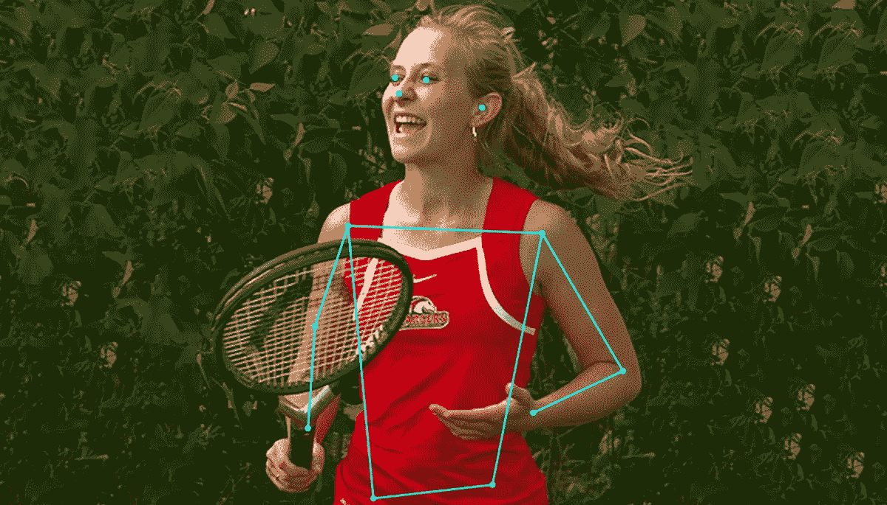

# 开始使用 tensor flow . js——不要离开本文

> 原文：<https://medium.com/hackernoon/start-using-tensorflow-js-without-leaving-this-article-fb683ac509ed>



老实说，新手获得人工智能和机器学习经验的最大障碍之一可能是设置。

我不打算撒谎，完全溜走的日子还有很多，只是想让 Python，TensorFlow 和我的 GPU 配合一下。这是否让我质疑自己作为一名合格软件工程师的能力？是的，是的，它是。

我跑题了。

那么 TensorFlow.js 是什么，它能如何帮助我们呢？从[官方页面](https://js.tensorflow.org)来看，TensorFlow.js 是“一个 JavaScript 库，用于在浏览器和 Node.js 上训练和部署 ML 模型。”

这对我们意味着什么？我们可以从这篇中型文章开始尝试！

# 演示

在这个演示中，我们使用了一个名为“MobileNet”的深度学习模型。MobileNet 是一种卷积神经网络，是一种擅长图像分类的模型架构。


> **注:**要了解更多人工智能实际看到的东西，请查看我的[另一篇文章](https://hackernoon.com/understanding-what-artificial-intelligence-actually-sees-7d4e5b9e648e)。

# 代码

使用 TensorFlow.js 和 MobileNet 对图像进行分类只需 3 行代码:

```
mobilenet.load()
  .then(model => model.classify(myImage))
  .then(predictions => // Use predictions)
```

# 最后的想法

在写这篇文章的时候，TensorFlow 提供了 5 个同样易于使用的官方模型:

*   `[mobilenet](https://github.com/tensorflow/tfjs-models/tree/master/mobilenet)`:用来自 [ImageNet 数据库](http://www.image-net.org/)的标签对图像进行分类。
*   `[posenet](https://github.com/tensorflow/tfjs-models/tree/master/posenet)`:实时姿态检测。博文[此处](/tensorflow/real-time-human-pose-estimation-in-the-browser-with-tensorflow-js-7dd0bc881cd5)。
*   `[coco-ssd](https://github.com/tensorflow/tfjs-models/tree/master/coco-ssd)`:基于 [TensorFlow 对象检测 API](https://github.com/tensorflow/models/blob/master/research/object_detection/README.md) 的对象检测。
*   `s[peech-commands](https://github.com/tensorflow/tfjs-models/tree/master/speech-commands)`:对来自[语音命令数据集](https://www.tensorflow.org/tutorials/sequences/audio_recognition)的 1 秒音频片段进行分类。
*   `[knn-classifier](https://github.com/tensorflow/tfjs-models/tree/master/knn-classifier)`:创建一个自定义的 k 近邻分类器。可用于迁移学习。

然而，如果这些模型都不满足，您还可以创建/训练您自己的模型，但这是另一篇文章的内容。

为了好玩，我挑战你看看 PoseNet 文档，并尝试匹配封面照片的结果。但是，如果您遇到困难，这里有代码和演示:

感谢阅读！如果你有任何问题，请随时联系 bourdakos1@gmail.com，通过 [LinkedIn](https://www.linkedin.com/in/nicholasbourdakos) 联系我，或者通过 [Medium](/@bourdakos1) 和 [Twitter](https://twitter.com/bourdakos1) 关注我。

如果你觉得这篇文章很有帮助，给它一些掌声会很有意义👏并分享出来帮别人找！并欢迎在下方发表评论。