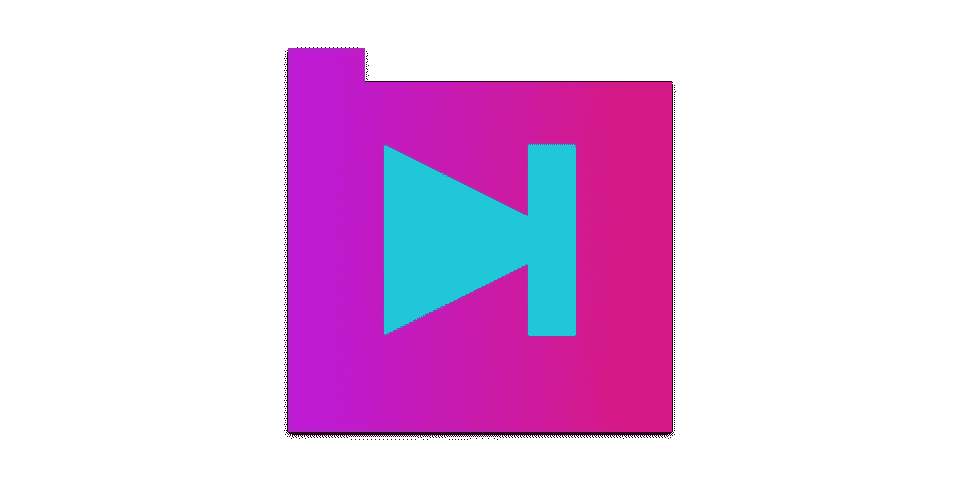
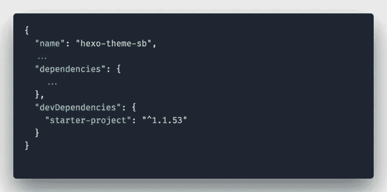
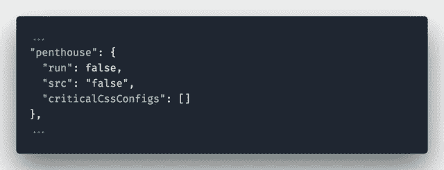

# 启动项目——一组最新的最佳实践，包含在大量任务中

> 原文：<https://medium.com/hackernoon/starter-project-286c3b58e78f>

这篇文章是关于 [Starter Project](https://starter.silvestarbistrovic.from.hr/) 的系列文章的第一篇，这是一组打包在 Gulp 任务中的最新最佳实践。在这篇文章中，我将解释这个项目背后的想法，它如何帮助你的项目，以及如何使用它。

# 第一种情况

每个项目都有它的环境。项目之间的切换意味着环境的切换。切换环境意味着记住运行项目任务的命令，比如 Gulp 或 webpack。但是命令经常被遗忘。这种情况每天都发生在我身上，即使是在类似的项目中。

# 第二种情况

考虑两个不同的项目。首先是自定义 Wordpress 主题开发，其次是中间人博客。这两个项目都使用 Gulp 任务运行器来编译和优化资产。为任一项目设置吞咽任务都是耗时的工作。每个项目都有自己的架构，这使得开发人员无法将 Gulp 任务从一个项目复制到另一个项目，而无需花费时间来单独重新配置每个 Gulp 任务。

# 第三种情况

在没有编码约定的情况下从事一个项目可能是一场噩梦。每次合并都会出现 Git 冲突，关于制表符和空格的无休止的讨论，丑陋和不一致的代码只是可能出现的一些问题。

# 这个想法

我相信这些场景听起来很熟悉。这些在我身上发生过很多次。我甚至不记得有多少次我在一个项目上创建了一个 Sass mixin 或 JavaScript 函数，我想在另一个项目上使用，但我懒得去搜索代码，最终，我从头开始。

Starter Project 是我为解决这些问题所做的努力。这是一个包含前端开发中最新最佳实践的大型任务的集合。但不仅仅是狼吞虎咽的任务。它包含了构建成功项目的所有资源，从 HTML 和 CSS 到 JavaScript 和图像。

# 包裹

该软件包可在 [npm](https://www.npmjs.com/package/starter-project) 上获得。你可以在[官方文件](https://starter.silvestarbistrovic.from.hr/)中找到安装说明。安装完成后，您将拥有启动项目的软件包网站的副本。这可能是你新项目的良好开端。

Starter Package 也是一个静态页面生成器，非常简单。最初的网站是使用 Starter Project 构建的，托管在 Netlify 上。它非常快，参见 [PageSpeed Insights](https://developers.google.com/speed/pagespeed/insights/?url=https%3A%2F%2Fstarter.silvestarbistrovic.from.hr%2F&tab=desktop) 和 [WebPageTest](https://www.webpagetest.org/result/180323_7F_8cd32d6a04d395ff01839c921d82047d/) 的分数。

该包应该作为开发依赖项使用。这将允许您更新包并更有效地维护您的项目。

package.json example

# 用法

Starter project 针对不同的环境提供了三种不同的 Gulp 命令:

*   `gulp dev`和`gulp dist`对于开发构建，
*   `gulp docs`用于文档构建，以及
*   `gulp`用于生产构建。

要了解更多关于命令的信息，请参见[官方文档](https://starter.silvestarbistrovic.from.hr/commands/)。

借助 Starter Project，您可以获得以下架构:

*   HTML，
*   CSS，
*   JavaScript，
*   图像(。png，。jpg，。svg)，
*   收藏夹图标，
*   字体，
*   还有更多。

你可以在`new_src`文件夹中找到所有资产。一旦您运行其中一个构建命令，`new_dist`文件夹将被创建，其中包含已编译的静态内容。点击了解更多关于结构[的信息。](https://starter.silvestarbistrovic.from.hr/structure/)

# 配置文件

Starter Project 是可配置的，应该能够在每个项目中运行，不管是什么架构。主配置文件可以在项目的根目录`config.json`中找到。对于每个任务，都有一个选项`run`。如果设置为 true，任务将运行。例如，你可以关闭`[penthouse](https://www.npmjs.com/package/gulp-penthouse)`，一个用于生成关键 CSS 的库。

config.json example

点击阅读更多关于配置[的信息。](https://starter.silvestarbistrovic.from.hr/configuration/)

# 特征

我在上一节提到了关键 CSS。Starter Project 还有其他很棒的特性。

Pug 是默认的模板引擎。通过 Pug 过滤器[js transformer-Markdown-it](https://github.com/jstransformers/jstransformer-markdown-it)也支持 markdown。如果有兴趣的话，我会考虑增加对更多模板引擎的支持。

Sass 默认自带 [normalize.css](https://www.npmjs.com/package/normalize.css) 、 [modularscale-sass](https://www.npmjs.com/package/modularscale-sass) 和 [sass-mq](https://www.npmjs.com/package/sass-mq) 库。它将帮助您创建更加一致的页面，严格定义排版和媒体查询。

Starter 项目通过 babel 插件支持 ES6。你会发现延迟加载 CSS 文件的脚本(与临界 CSS 结合使用)和用临界 FOFT 方法加载字体的脚本。

如果您没有使用第三方服务来托管图像，那么 Starter Project 可以优化您的图像。Starter 项目支持
`.gif``.png``.jpg``.svg`文件。

文档是每个项目不可或缺的一部分。您可以使用 Starter Project 生成优秀的文档。 [SassDoc](http://sassdoc.com/) 将解析 Sass 注释并创建 Sass 文档。JSDoc 将解析 JavaScript 注释并创建 JavaScript 文档。你甚至可以创建生活方式指南。为此，Starter 项目使用 [KSS](https://kss-node.github.io/kss-node/) 来解析 Sass 注释。

还有其他好东西，比如浏览器同步、Favicons、Sourcemaps、Gzip、Linters、Standards、editorconfig 等等。我会试着记录所有的事情，并写一些关于这些的新文章。敬请期待！

# 网站

到目前为止，我已经在几个不同的项目中使用了 Starter Project。

*   [韩网站](https://hanhanxue.com/)——加拿大蒙特利尔设计师兼 FX 技术总监韩的博客网站。这个网站是通过中间人运作的。
*   [Irina & Matej 网站](https://irinaandmatej.com/)——Irina 和 Matej 的网站，他们是克罗地亚的婚礼和肖像摄影师。该网站在 WordPress 上运行。
*   Silvestar Bistrovi 网站——一个有博客的个人网站。该网站在 Hexo 上运行。
*   [首发项目网站](https://starter.silvestarbistrovic.from.hr/) —首发项目网站。该网站仅在启动项目上运行。

# 结论

Starter Project 并不是一套严格的规则。此包应配置为满足每个项目规范；您可以提出新的特性，派生存储库或者关闭配置文件中的一些任务。

展示你的支持:提供反馈，打开[一个新问题](https://github.com/maliMirkec/starter-project/issues/new)，创建[一个新的拉动式请求](https://github.com/maliMirkec/starter-project/compare)，或者留下评论。

*最初发布于*[*www . silvestarbitrovic . from . HR*](https://www.silvestarbistrovic.from.hr/articles/starter-project-a-set-of-latest-best-practices-packed-in-gulp-tasks/)*。*