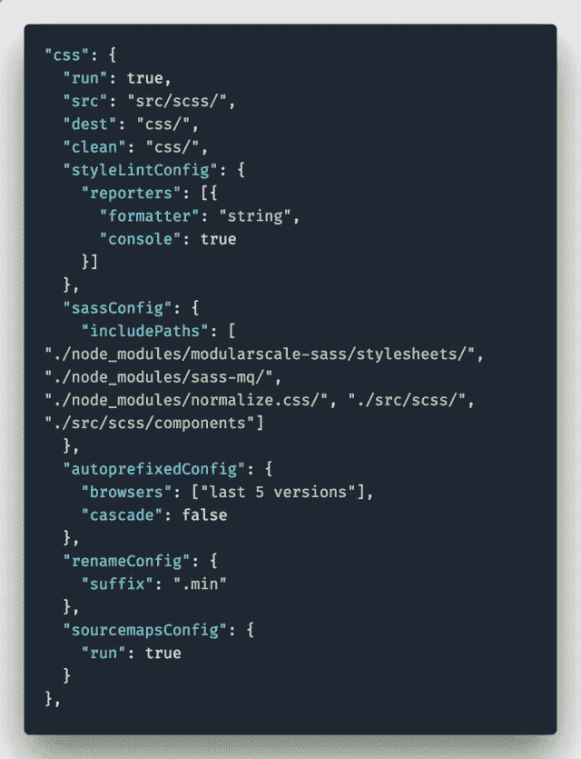
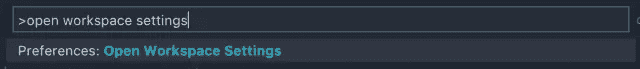

# 吞咽 CSS 的任务

> 原文：<https://medium.com/hackernoon/starter-project-9961ecf28a41>


这篇文章是关于 [Starter 项目](https://starter.silvestarbistrovic.from.hr/)的系列文章的一部分，这次我将解释所有关于 CSS 的 Gulp 任务。

# 设置

Starter Project 的想法是为所有 Gulp 任务创建一个单独的配置文件。如果你打开`[config.json](https://github.com/maliMirkec/starter-project/blob/master/config.json)`文件，你可以看到一个 CSS 部分。



第一个选项是`run`。如果设置为 true，将执行 CSS 吞咽任务。CSS 还有另外三个强制选项:

*   `src` -一个带有 Sass 文件的文件夹路径，
*   `dest` -保存编译后的 CSS 文件的文件夹路径，以及
*   `clean` -执行吞咽之前将被清理的文件夹的路径(几乎总是与`dest`选项相同)。

*所有路径前都有全局* `*root*` *路径。*

其他选项有[吞咽-cssimport](https://www.npmjs.com/package/gulp-cssimport) 、[吞咽-自动修复](https://www.npmjs.com/package/gulp-autoprefixer)、[吞咽-重命名](https://www.npmjs.com/package/gulp-rename)和[吞咽-源映射](https://www.npmjs.com/package/gulp-sourcemaps)。

# 厚颜无耻

Starter 项目使用 [Sass](https://sass-lang.com/) 作为 CSS 的预处理器。正如其官网所说，萨斯是“拥有超能力的 CSS。”相当多的开发人员是这个健壮程序的支持者和用户。它有一些有用的特性，比如变量、函数和混合。

> *拥有超能力的 CSS。*

Starter 项目使用 [gulp-sass](https://www.npmjs.com/package/gulp-sass) 插件将 sass 编译成 CSS。

# 进口

[gulp-cssimport](https://www.npmjs.com/package/gulp-cssimport) 是一个插件，允许通过将内容包含到 CSS 文件中来导入链接文件。这意味着你不能使用原生 CSS `@import`实现，但是在大多数情况下这被认为是一个不好的实践。

要使用这个插件，在 Sass 文件中添加`@import`语句。

```
// Plugins
@import ‘normalize’;
@import ‘modularscale’;
@import ‘mq’;// Configuration
@import ‘variables’;
@import ‘fonts’;
@import ‘locks’;
@import ‘helpers’;
@import ‘typography’;
@import ‘theme’;
```

您可以将`includePaths`选项添加到`sassConfig`设置中，以避免写入包含的库的完整路径。

```
“sassConfig”: {
    “includePaths”: [
    “./node_modules/modularscale-sass/stylesheets/”,
    “./node_modules/sass-mq/”,
    “./node_modules/normalize.css/”,
    “./src/scss/”,
    “./src/scss/components”
  ]
},
```

# Sass 库

Starter 项目导入了三个库:

*   Normalize.css，
*   模块化秤，以及
*   媒体询问。

```
@import ‘normalize’;
@import ‘modularscale’;
@import ‘mq’;
```

如果你的网站在不同的浏览器上看起来不一致，你可能需要使用 CSS 技术来重置浏览器的行为。在 Starter 项目中， [Normalize.css](https://necolas.github.io/normalize.css/) 用于此任务。

> *Normalize.css 让浏览器渲染所有元素更加一致，符合现代标准。它只针对需要规范化的样式。*
> 
> 尼古拉斯·加拉格尔

[模块化比例](http://www.modularscale.com/)有助于字体大小的一致性。 [modularscale-sass](https://www.npmjs.com/package/modularscale-sass) 是一个数值列表，用于确定字体大小并在设计中营造和谐感。

[sass-mq](https://www.npmjs.com/package/sass-mq) 是一个 Sass mixin，它帮助开发人员以优雅的方式编写媒体查询。

# 自动修复

Starter Project 使用 [gulp-autoprefixer](https://www.npmjs.com/package/gulp-autoprefixer) 插件为 CSS 文件添加供应商前缀。这个插件很方便，因为开发者不必手动添加这些前缀。在`config.json`中，您可以将[自动修复选项](https://www.silvestarbistrovic.from.hr/articles/starter-project-gulp-tasks-for-css/(https://github.com/postcss/autoprefixer#options))添加到`autoprefixedConfig`设置中。

```
“autoprefixedConfig”: {
  “browsers”: [“last 5 versions”],
  “cascade”: false
},
```

# 源地图

源代码映射允许开发人员查看压缩资产的源代码。在 Starter 项目中， [gulp-sourcemaps](https://www.npmjs.com/package/gulp-sourcemaps) 插件用于为 CSS 和 JavaScript 文件创建源地图。如果您的环境不需要源地图，您可以通过将`sourcemapsConfig`中的`run`选项设置为`false`来禁用它。

```
“sourcemapsConfig”: {
  “run”: true
}
```

# 使变小

[gulp-clean-css](https://www.npmjs.com/package/gulp-clean-css) 是一个 gulp 插件，充当 [clean-css](https://github.com/jakubpawlowicz/clean-css) 的包装器。在 Starter 项目中，这个插件用于 CSS 缩小。为了减少与文件名的混淆，`gulp-rename`插件用于通过给文件名添加前缀或后缀来重命名缩小的资产。

```
“renameConfig”: {
  “suffix”: “.min”
}
```

# 林挺

> 林挺是运行一个程序的过程，该程序将分析代码中潜在的错误。
> 
> *来源:* [*堆栈溢出*](https://stackoverflow.com/a/8503586)

在 Starter 项目中， [gulp-stylelint](https://www.npmjs.com/package/gulp-stylelint) 插件用于 lint CSS 文件。您可以在`config.json`文件中配置插件。

```
“styleLintConfig”: {
  “reporters”: [{
    “formatter”: “string”,
  “console”: true
  }]
},
```

默认设置将控制台中的错误输出为字符串。在此查看所有可用设置[。](https://www.npmjs.com/package/gulp-stylelint#options)

Stylelint 选项存储在`.stylelintrc`文件中。

```
{
  “plugins”: [
    “stylelint-scss”,
    “stylelint-order”
  ],
  “extends”: “stylelint-config-sass-guidelines”
}
```

Stylelint 也有它的插件。在 Starter 项目中，使用了 [stylelint-scss](https://www.npmjs.com/package/stylelint-scss) 和 [stylelint-order](https://www.npmjs.com/package/stylelint-order) 插件。此外，还有用于扩展默认 Stylelint 设置的 [Stylelint Sass 指南](https://github.com/bjankord/stylelint-config-sass-guidelines)。在官网了解更多关于 Stylelint [的信息。](https://stylelint.io/)

# 奖金

对于所有 VS 代码用户，这里是如何在编辑器中使用 Stylelint 的技巧。首先，为 VS 代码安装 [stylefmt](https://marketplace.visualstudio.com/items?itemName=mrmlnc.vscode-stylefmt) 和 [Run On Save](https://marketplace.visualstudio.com/items?itemName=emeraldwalk.RunOnSave) 扩展。然后按`cmd + shift + p`调用命令面板，输入`open workspace settings`。



打开工作空间设置时，添加这些设置。

```
{
  “emeraldwalk.runonsave”: {
    “commands”: [{
      “match”: “\\.scss?$”,
      “cmd”: “cd ${workspaceRoot} && stylefmt -c .stylelintrc ${file}”
    }]
  }
}
```

当您保存`.scss`文件时，这应该会运行 stylelint。如果不起作用，[联系我](mailto:%20admin@silvestarbistrovic.from.hr?Subject=VSCode)寻求帮助。

# 结论

在之前的文章中，我试图解释这个项目的想法。这篇文章将帮助你理解如何使用 Gulp 来优化、lint 和交付最好的 CSS 输出。

启动项目被认为是一个样板文件，包含产生最佳结果的最新最佳实践。如果你对这个项目如何变得更好更有趣有任何想法或建议，请[联系我](mailto:%20admin@silvestarbistrovic.from.hr?Subject=Starter)，打开[一个问题](https://github.com/maliMirkec/starter-project/issues/new)，或者在 [GitHub](https://github.com/maliMirkec/starter-project) 上创建[一个拉取请求](https://github.com/maliMirkec/starter-project/compare)。

请分享！🙏

*最初发布于*[*www . silvestarbitrovic . from . HR*](https://www.silvestarbistrovic.from.hr/articles/starter-project-gulp-tasks-for-css/)*。*