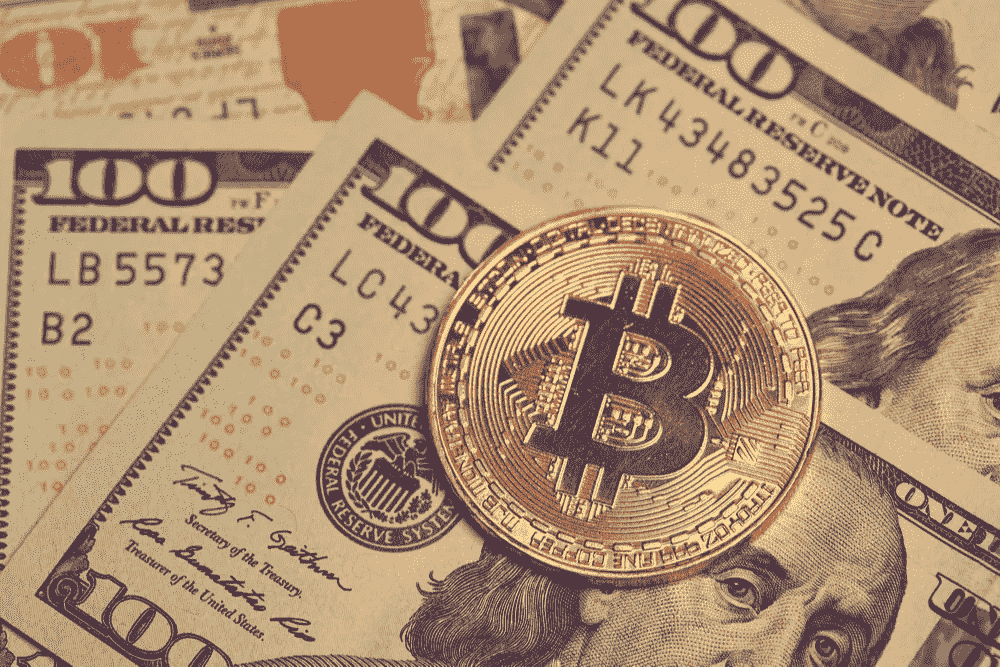
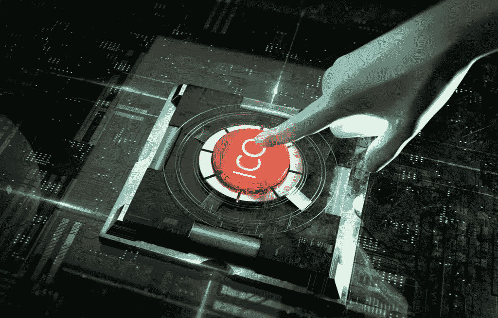
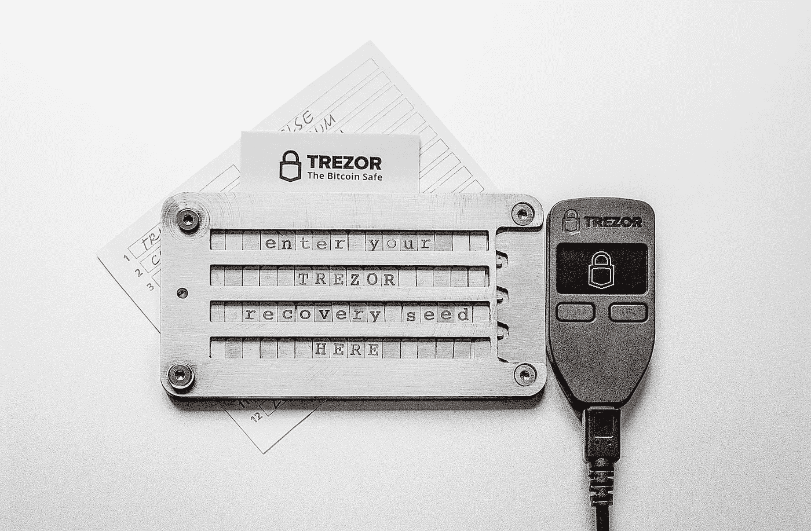

# 开始加密之旅

> 原文：<https://medium.com/hackernoon/starting-the-crypto-journey-15bfed866693>

了解如何开始加密之旅。在这个过程中，你将从一个新手投资者转变为一个成熟的个人数字财富的统治者。

# 发现

大多数人第一次听说比特币时，他们会对它不屑一顾，包括许多今天从事这项工作的密码学家和开发人员。对大多数人来说，钱的概念和实现是我们从未质疑过的。在接受一种新的“赚钱”方式之前，我们必须首先超越我们现代经济思想的一个支柱:国家货币的强制普及。我们还没准备好。

当我们质疑我们的现实时，比特币价格诱惑着更高的高点和孤独的低点。记者们先是奉承，然后不屑一顾，用金融八卦填满我们的新闻。稳定的秘密点滴淹没了我们的意识。我们对它的颠覆软化了。“如果这东西起飞了呢？也许我应该投点钱在这上面……”

# 首次购买

大多数人从比特币基地开始。比特币基地经营着一家加密货币交易所，看起来像熟悉的银行软件。它可以将法定货币(美元)转换为加密货币(比特币、比特币现金、以太币或莱特币)。

比特币是最保守的购买选择。它是交易资金的数字记录；它是由对等网络编写和保护的，对等网络操作一个叫做区块链的加密分布式数据库。没有人负责这个无主的、无边界的、不可改变的数字货币分类账。由于其革命性的去中心化，比特币很大程度上不受内部和外部政治的影响。没有其社区压倒性的共识，很难改变。

一些人对莱特币的低得多的价格做出反应，选择投资比特币的小兄弟，比特币的数字黄金白银。其他人，寻求一个熟悉的品牌，但价格更低，选择比特币现金，一个比特币克隆执行如何发展技术的竞争愿景。我们选择了熟悉的比特币:这是我们对加密时尚的首次表达。

# 膨胀

随着游戏中的皮肤，我们开始更加关注加密现象。我们想知道让屏幕上的数字支配我们的情绪是否健康，但无论如何都要检查我们的比特币余额；太晚了，我们已经上钩了。

每一次，我们都注意到以太坊的价格跟踪比特币的涨跌。有一天，我们注意到它的价值已经飙升。“好吧……这是什么？”

研究以太坊告诉我们，加密货币不仅仅是数字货币。保持分散的书面记录的能力不仅对跟踪账户余额有用，而且对跟踪计算机程序的状态也有用。在以太坊区块链上部署被称为智能合约的代码，使我们能够创建去中心化的应用程序，或 dApps。一旦启动，dApps 就不再受任何人的控制。它们允许我们构建强大的应用程序，而不会被这种能力所破坏。

# ICOs

由于没有人来制定路线，dApps 必须发行一种货币，记录在他们的区块链上，以激励网络参与者做有价值的工作并防止滥用。在一个分散的网络之上，用本国货币推出区块链是一项挑战。以太坊允许开发者托管加密货币，称为代币，记录在以太坊区块链上。发布托管令牌降低了构建分散式应用程序的门槛，让开发人员专注于他们的特定用例，而不是维护区块链。

开发商可以在建立 dApp 之前，通过首次发行硬币(ico)向投资者发行这种代币。投资者购买代币是期望一旦产品被制造和采用，代币会因其对 dApps 操作的必要性而升值。通过这种方式，开发商为创业努力创造了一种新的融资机制，但也引起了监管机构对投资者保护不足的关注。

加密货币的世界融合了金融、计算和通信的前沿，就像狂野的西部一样，有无限的机会和危险的陷阱。对于每一个由开发商运营的改变世界的项目，我们都了解到另一个由窃贼运营的项目，他们滥用天真的投资者的财富。我们将 DYOR(做你自己的研究)的咒语铭记于心，以便在贪婪的滚滚浪潮面前保持清醒。

在了解了托管代币和运行在自己的区块链上的“纯”加密货币(如比特币)之间的区别后，我们意识到这两种货币都有数千种。我们研究了能引起我们共鸣的项目，我们认为这些项目能给世界带来价值，我们选择投资他们的硬币，但比特币基地不支持它们……该怎么办？

# 交换

比特币基地不是唯一的交易所。事实上有数百个，分布在全球各地。如果我们想购买一种货币或代币，我们必须注册北海巨妖或币安这样的交易所，它们的硬币选择比比特币基地多得多。

报名参加币安后，我们知道了为什么每个人都从比特币基地开始。他们不允许我们用美元兑换他们提供的数千种货币。我们如何购买 EOS 或 IOTA 呢？

这就是为什么比特币是加密世界的储备货币。要购买没有法定交易对的更深奥的硬币，我们必须将比特币基地账户中的比特币存入我们的币安账户。然后，我们可以用比特币交易任何可用的硬币。在较小的程度上，以太坊也可以做到这一点。

不是每个交易所都有所有的硬币，即使他们有，另一个交易所也可能有更好的价格(以比特币计价)。为了获得我们想要的硬币，或者一笔真正的好交易，我们可能必须在多个交易所保持加密货币余额。我们发现自己登录了几个网站，只是为了查看我们投资的表现。这就是 Cryptograf 这样的加密投资组合跟踪器的用处。我们可以同步我们的加密投资组合跟踪器来跟踪我们的投资，而不是处理许多网站，无论它们在哪个交易所。

我们现在已经接触到了 cryptoverse，以及正在建设的各种分散的项目。有些已经引起了我们的共鸣，我们已经进行了投资以加速它们的发展，并从我们的远见中获利。但我们还没有行使加密货币赋予我们的权力。事实上，尽管将我们的投资放在交易所很方便，但它也有风险…

# 硬件钱包

每隔一段时间，我们都会读到一家交易所被黑客入侵数百万美元的消息。正确实施的加密货币极难破解，但交易所则是另一回事。

加密货币余额使用公钥加密技术记录在区块链上:生成一对链接的数字，一个作为我们的公共身份和公钥，另一个作为与该身份关联的密码。区块链保证只有那些有权使用我们的私钥的人才能使用与我们的公钥相关的余额。

因为交易所通常用于交易加密货币，所以它们需要能够实时发送和接收加密货币。这意味着在一个连接到互联网的“热”钱包中存储私人密钥，控制用户资金。如果黑客能够获得私钥，他们就可以将资金发送给自己。

认识到这一风险，我们决定对自己的安全负责，并通过将我们的资金从交易所托管转移到我们自己的硬件钱包来行使我们的数字主权。Trezor 和 Ledger 等硬件钱包就像是专门为存储私钥而设计的 u 盘。只有当我们需要发送或接收存储在它们上面的密码时，它们才插上电源并连接到互联网。与互联网断开连接意味着黑客无法访问私钥，也无法访问密钥控制的资金。

# 启迪

将我们的密码从交易所发送到我们的硬件钱包后，我们就承担了投资的责任和控制权。在遇到无数致力于破坏整个行业的 dApps 后，我们惊讶地发现，加密最具革命性的东西是人们从没有人能审查我们的数字财富的知识中获得的独立感。

当金钱是数据时，金库就是你的思想。

*原载于 2018 年 4 月 24 日*[*cryptograf . io*](https://cryptograf.io/blog/2018/04/24/Starting-the-Crypto-Journey/)*。*