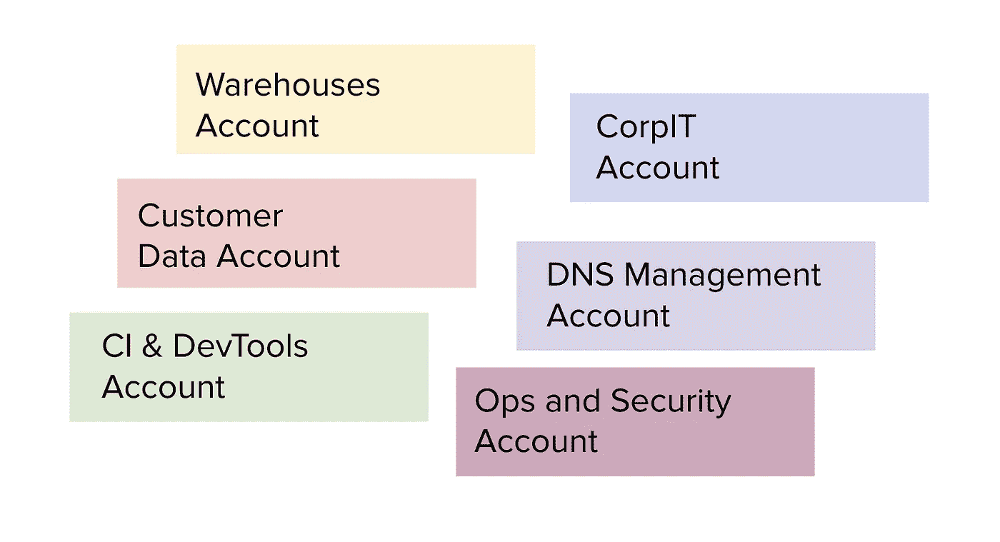
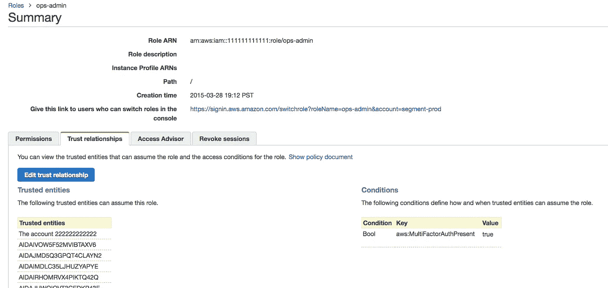
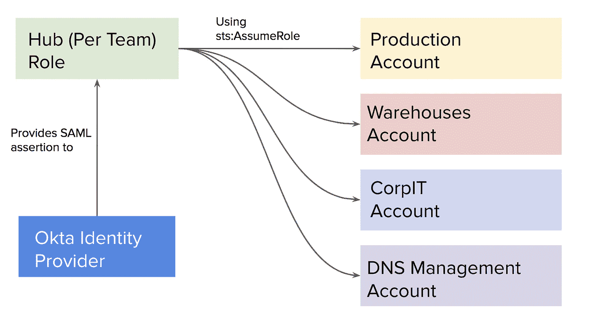
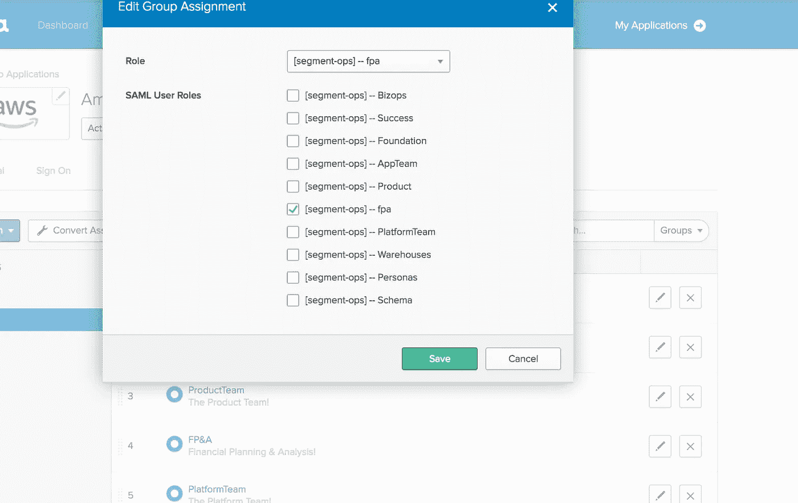
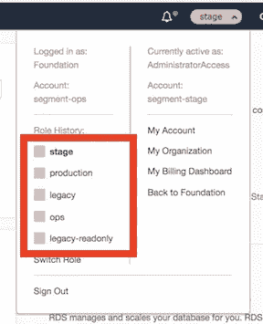
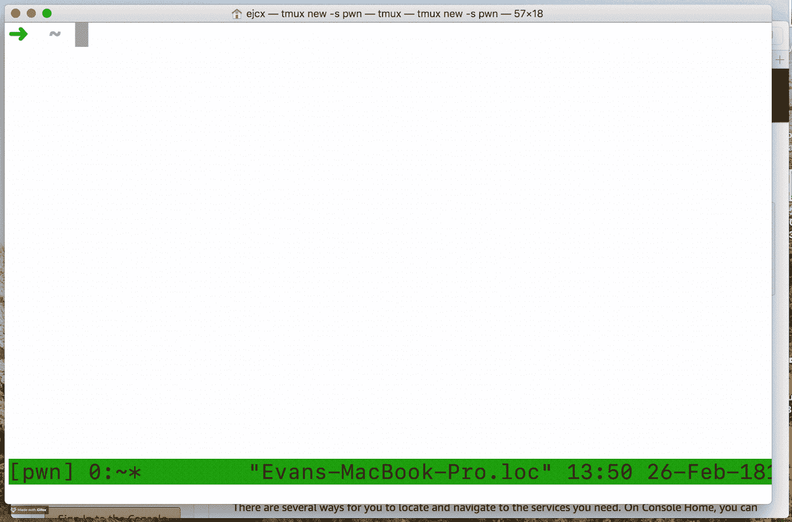

# 启动工程:从 1 个 AWS 帐户到 100 个

> 原文：<https://medium.com/hackernoon/startup-engineering-from-1-aws-account-to-100-81616ac3e89e>


> 这篇文章最初出现在[的博客](https://bit.ly/2J0mhcp)上。 [Segment](https://segment.com/?utm_source=hacker%20noon%20blog%20post) ，Hacker Noon 的每周赞助商，目前正在提供 90 天的免费试用——发送电子邮件给 friends@segment，并提及 Hacker Noon 进行兑换。

细分市场每天从我们的客户那里接收数十亿次活动，并且已经发展到几十个 [AWS](https://hackernoon.com/tagged/aws) 账户。为了更好地与我们的 [GDPR 和安全计划](https://segment.com/blog/segment-and-the-gdpr/)保持一致，扩展到更多客户是必要的，但这需要付出巨大的复杂性成本。为了继续适度扩展，我们正在投资构建工具，供员工使用许多帐户，并通过 terraform 和我们的身份提供商集中管理员工对 AWS 的访问。

细分市场从单一 AWS 客户开始，去年我们完成了向开发、阶段、生产和“运营”客户的转移。在过去的几个月里，我们一直在以大约每一两周一个新 AWS 客户的速度增长，并计划继续扩大到每个团队和每个系统的客户。通过限制 AWS 速率限制的爆炸半径，拥有许多“微帐户”提供了系统之间的高级安全隔离和可靠性优势。



当 Segment 只有几个帐户时，员工将使用他们的电子邮件、密码和 2FA 令牌登录 AWS“ops”帐户。然后，员工将使用`AssumeRole` api 连接到 dev、stage 和 prod 帐户中的`ops-admin`角色。



细分市场现在有几十个 AWS 帐户，并计划继续增加更多帐户！为了组织这种扩展，我们需要一种机制来控制我们的帐户，员工可以访问哪些帐户，*和*每个员工在每个帐户中的权限。

我们也*讨厌*在不必要的时候使用 AWS API 键，所以*我们转移到一个员工没有任何 AWS 键的系统*。相反，员工只能通过我们的身份提供商访问 AWS。今天，我们没有员工拥有 AWS 钥匙，未来也没有必要让员工拥有个人 AWS 钥匙。这是一个巨大的安全胜利！

# 设计可扩展的 IAM 架构

Segment 使用 Okta 作为身份提供商，并参考了他们的[集成指南](https://support.okta.com/help/servlet/fileField?retURL=/help/articles/Knowledge_Article/Amazon-Web-Services-and-Okta-Integration-Guide&entityId=ka0F0000000MeyyIAC&field=File_Attachment__Body__s)来管理多个 AWS 帐户，但为了更好的员工体验，对其进行了微小的改进。集成指南建议将身份提供者连接到每个 AWS 帐户，但这破坏了 AWS 对帐户切换的内置支持，并且审核哪个团队有权访问哪个角色变得更加复杂。

相反，员工使用我们的身份提供商连接到我们的“ops”帐户，然后使用简单令牌服务`assume-role` API 连接到他们有权访问的每个帐户。使用我们的身份提供者，每个团队在我们的中心帐户中被分配到不同的角色，每个团队角色可以访问每个帐户中的不同角色。这是典型的“中心辐射式”架构。



为了简化我们的星型架构的维护，我们构建了一个 terraform 模块，用于在我们的辐条帐户中创建一个角色，还构建了一个单独的 terraform 模块，用于在我们的中心帐户中创建一个角色。这两个模块只是创建一个角色，并为其附加一个策略 ARN，这是模块输入的一部分。

模块之间唯一的区别是它们的信任关系。中心角色模块允许从我们的身份提供者进行访问，而分支模块只允许从中心帐户进行访问。下面是我们用来允许从我们的身份提供者访问中心角色的模块。

```
resource "aws_iam_role" "okta-role" {
  name               = "${var.name}"
  assume_role_policy = <<EOF
{
  "Version": "2012-10-17",
  "Statement": [
    {   
      "Effect": "Allow",
      "Principal": {
        "Federated": "${var.idp_arn}"
      },  
      "Action": "sts:AssumeRoleWithSAML",
      "Condition": {
        "StringEquals": {
          "SAML:aud": "https://signin.aws.amazon.com/saml"
        }   
      }   
    }   
  ]
}
EOF
}
resource "aws_iam_role_policy_attachment" "okta-attach" {
  policy_arn = "${var.policy_arn}"
  role       = "${aws_iam_role.okta-role.name}"
}
```

为了让每个团队能够精确地访问他们需要的资源，我们使用我们的中心角色 terraform 模块为中心客户中的每个团队创建了一个角色。这些角色*大多*包含针对其他账户`sts:AssumeRole`的 IAM 策略，但也有可能在我们的 hub 角色中提供粒度访问。

粒度策略的一个具体而简单的例子是我们的财务规划和分析团队的角色，[密切关注我们的 AWS 支出](https://segment.com/blog/the-million-dollar-eng-problem/)。我们的 FP & A 团队*只有*可以访问计费信息和有关我们预留容量的信息。

```
module "fpa" {
  source = "git@github.com:segmentio/access//modules/okta-role"
  name       = "fpa"
  idp_arn    = "${module.idp.idp_arn}"
  policy_arn = "arn:aws:iam::aws:policy/job-function/Billing"
}
resource "aws_iam_policy" "fpa_reserved_policy" {
  name        = "fpa_reserved_policy"
  description = "FP&A team needs ability to describe our reserved instances."
  policy = <<EOF
{
  "Version": "2012-10-17",
  "Statement": [
    {   
      "Action": [
        "ec2:GetHostReservationPurchasePreview",
        "ec2:DescribeReservedInstancesModifications",
        "ec2:DescribeReservedInstances",
        "ec2:DescribeHostReservations",
        "ec2:DescribeReservedInstancesListings",
        "ec2:GetReservedInstancesExchangeQuote",
        "ec2:DescribeReservedInstancesOfferings",
        "ec2:DescribeHostReservationOfferings",
        "ec2:CreateReservedInstancesListing"
      ],  
      "Effect": "Allow",
      "Resource": "*" 
    }   
  ]
}
EOF
}
resource "aws_iam_role_policy_attachment" "fpa_reserved_attach" {
  role       = "fpa"
  policy_arn = "${aws_iam_policy.fpa_reserved_policy.arn}"
}
```

但是，FP&A 团队无权访问我们的发言客户。需要完全访问我们的大部分基础设施和所有客户的一个团队是我们的基础和可靠性团队，他们参与我们的随叫随到。我们为我们所有客户的基础团队提供了一个`ReadOnly`角色和一个`Administrator`角色。

```
module "foundation" {
  source = "git@github.com:segmentio/access//modules/okta-role"
  name       = "Foundation"
  idp_arn    = "${module.idp.idp_arn}"
  policy_arn = "${aws_iam_policy.foundation-policy.arn}"
}
resource "aws_iam_policy" "foundation-policy" {
  name        = "foundation-policy"
  description = "A policy for foundation to access all AWS accounts, as on-call"
  policy = <<EOF
{
  "Version": "2012-10-17",
  "Statement": [
    {   
      "Action": [
        "sts:AssumeRole"
      ],  
      "Effect": "Allow",
      "Resource": [
        "arn:aws:iam::${var.ops_account}:role/AdministratorAccess",
        "arn:aws:iam::${var.ci_account}:role/AdministratorAccess",
        "arn:aws:iam::${var.dns_account}:role/AdministratorAccess",
        "arn:aws:iam::${var.customerdata_account}:role/AdministratorAccess",
        "arn:aws:iam::${var.customerdata_account}:role/ReadOnly",
        "arn:aws:iam::${var.dns_account}:role/ReadOnly",
        "arn:aws:iam::${var.ci_account}:role/ReadOnly",
        "arn:aws:iam::${var.ops_account}:role/ReadOnly",
        ...
      ]   
    }   
  ]
}
EOF
}
```

为 hub 帐户中的每个团队创建每个团队的角色后，员工被分配到 Okta 中代表其团队的组，然后每个团队可以被分配到 hub 帐户中与其相关的角色。



Okta 允许在 hub 帐户中为每个组分配不同的 IAM 角色，使用他们的 UI，我们可以将 FP&A 团队分配到我们的“Amazon Web Services”应用程序，并限制他们访问我们在 hub 帐户中为他们创建的 fpa 角色。

构建完成后，我们需要工具为我们的员工提供惊人的[工程](https://hackernoon.com/tagged/engineering)体验。尽管这个系统要安全得多，但我们希望它能像我们只有少量 AWS 帐户的系统一样可用和高效。

# 维护 aws-okta 的可用性

我们的旧 IAM 设置的一个优点是，每个拥有 AWS 访问权限的员工都可以使用`aws-vault`从他们的本地计算机使用 AWS APIs。每位员工都将其 IAM 用户凭据安全地存储在笔记本电脑的钥匙串中。然而，完全通过 Okta 访问 AWS 对我们的旧工作流来说是一个巨大的突破性变化。

我们的工具团队接受了挑战，创造了一个(接近)drop 来替代我们的工程团队广泛使用的 aws-vault，称为`aws-okta`。aws-okta 现在已经[开源，可以在 github](https://github.com/segmentio/aws-okta) 上获得。

`aws-okta`的质量是部门工程师能够顺利撤销其 AWS 证书的主要原因。员工能够使用他们被授予的权限和角色执行命令，就像他们使用 aws-vault 时一样。

```
$ aws-okta exec hub -- aws s3 ls s3://<some-bucket>2018/02/08 15:40:22 Opening keychain /Users/ejcx/Library/Keychains/aws-okta.keychain
INFO[0004] Sending push notification...
```

aws-okta 处理了 aws-vault 无法处理的许多新的复杂性。aws-vault 使用 IAM 用户凭证来运行命令，而 aws-okta 使用您的 okta 密码(存储在您的钥匙串中)来验证 Okta，等待对 2FA 的推送通知的响应，最后为 aws 提供 SAML 断言来检索临时凭证。

为了向 okta 认证，aws-okta 需要知道您的 Okta“应用程序 id”。我们冒昧地扩展了`~/.aws/config` ini 文件以添加必要的 id。

```
[okta]
aws_saml_url = home/amazon_aws/uE2R4ro0Gat9VHg8xM5Y/111
```

当细分市场只有几个 AWS 帐户和`ops-admin`角色时，细分市场的工程师都共享同一个`~/.aws/config`。一旦每个团队都可以访问不同的账户和系统，我们就需要一个更好的系统来管理每个团队的`~/.aws/config`。我们的系统还需要一种方法，在创建新帐户和角色时，快速更新员工的访问权限。

我们决定将该解决方案与该部门已建立的现有技术紧密结合。每个团队的配置都存储在一个 git repo 中，里面有我们公司的 dotfiles。每个团队都可以使用我们的内部工具`robo`初始化他们的 aws 配置，这是一个在员工之间共享有用命令的工具。

```
$ SEGMENT_TEAM=foundation robo config.aws
✔️ : Your old aws config has been backed up in /tmp/awsconfig-318c16acc2b25bed2eb699e611462744
✔️ : Your aws config was successfully updated.
$ shasum ~/.aws/config                   
c2734b78e470c51a26d8c98e178d4ec2ed1b1b06  /Users/ejcx/.aws/config$ SEGMENT_TEAM=platform robo aws.config
✔️ : Your old aws config has been backed up in /tmp/awsconfig-d5688401634de0e8b2f48b11377d0749
✔️ : Your aws config was successfully updated.$ shasum ~/.aws/config                 
283053d6f5a23ca79f16c69856df340b631d3cdf  /Users/ejcx/.aws/config
```

这是唯一可能添加的，因为所有部门工程师都已经有了一个名为`SEGMENT_TEAM`的环境变量，它表示该工程师所属的团队。运行`robo aws.config`将克隆 dotfiles repo，保存旧的`~/.aws/config`，并为他们的团队初始化最新的配置。

[当我们使用较少的帐户时，AWS 书签](https://docs.aws.amazon.com/IAM/latest/UserGuide/id_roles_use_switch-role-console.html)是工程师在我们的环境中导航的主要方式。当我们摆脱了`ops-admin`的角色，工程师们的登录书签就停止工作了。此外，AWS 书签最多只支持五个不同的假设角色目标，而我们现在拥有的帐户远不止五个。



为了支持更多的账户，我们大部分都放弃了书签，取而代之的是确保`aws-okta`支持需要经常切换 AWS 账户的工程师。我们之前对`aws-vault`的使用意味着我们很多人都熟悉`aws-vault login`命令。我们发现给 aws-okta 增加一个登录命令，对经常换账号的工程师有帮助。



在响应 Duo push 通知后，aws-okta 将打开一个浏览器，并在几秒钟内登录到指定的角色。AWS [定制联邦登录](https://docs.aws.amazon.com/IAM/latest/UserGuide/id_roles_providers_enable-console-custom-url.html)特性支持这个特性，但是使用起来感觉更像是魔术。它使伐木变得轻而易举。

# 超过 100 个帐户

我们预计到今年年底将有近 50 个 AWS 客户。默认情况下帐户完全关闭的安全性，以及隔离每个帐户的费率限制的可靠性优势是引人注目的。

我们构建的这个系统足够健壮和可用，足以将我们的 AWS 应用扩展到数百个 AWS 客户和更多的工程团队。

*从安全角度来看，删除所有员工 AWS 密钥非常令人满意*,仅此一点就足以成为将您的身份提供商与您的 AWS hub 帐户相集成的令人信服的理由。

> 这篇文章最初出现在[板块博客](https://bit.ly/2J0mhcp)上。 [Segment](https://segment.com/?utm_source=hacker%20noon%20blog%20post) ，Hacker Noon 的每周赞助商，目前正在提供 90 天的免费试用——发送电子邮件给 friends@segment，并提及 Hacker Noon 进行兑换。