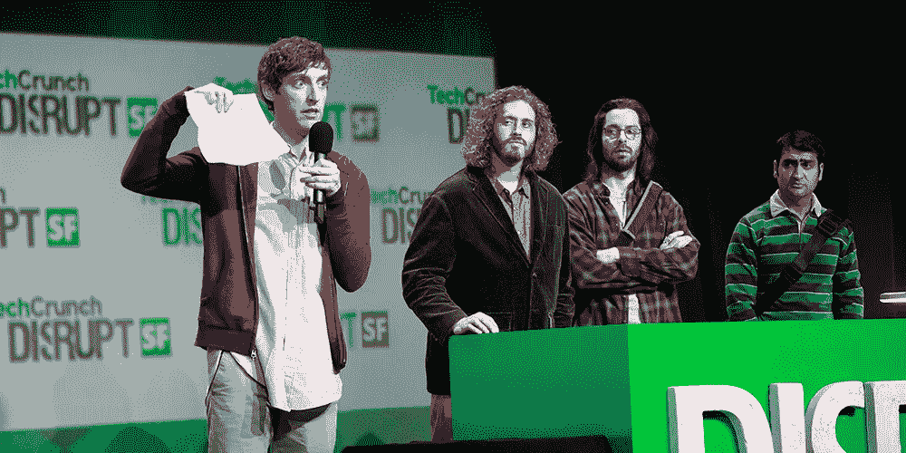

# 2018 年秋季创业:今年秋天去哪里推销自己

> 原文：<https://medium.com/hackernoon/startup-fall-18-where-to-promote-yourself-this-autumn-4f56783bef7d>

即使我们听到很多关于全球数字化和在线会议，个人通信仍然是必须的，并在商业网络和自我推销中发挥巨大作用。如果你是一家初创企业，不想错过被关注和被倾听的机会，这里有一份今秋最有希望的活动清单，你可以在其中推销自己的企业。

# [TechCrunch 扰乱 SF](https://techcrunch.com/events/disrupt-sf-2018/)

**时间:**9 月 5 日至 7 日

**地点:**美国三藩市

价格:1595 美元到 2495 美元

如果你不知道 TechCrunch，现在就去看看吧。如果你每天都在关注它，你应该明白这个会议是世界上最大最酷的会议之一。

除了优秀的演讲者，会议还设有创业战场，在这里你可以与其他公司竞争，并获得潜在投资者的关注。评委中包括 TechCrunch 的代表以及世界知名的企业家和风投。去年的一些赢家是 Dropbox 和 Yammer——你可以成为下一个游戏规则改变者！最棒的是什么？参与战场 100%免费！

# [Os！o 创新周](https://oiw.no/)

**时间:**9 月 24 日至 28 日

**地点:**挪威奥斯陆

**价格:**免费

这项活动被认为是欧洲最大的创新会议之一。它承诺举办大约 50 场活动，并且总是有杰出的演讲者——它甚至曾经是巴拉克·奥巴马！

对于初创公司来说，它提供了一个从创新周阶段开始的机会。该比赛在 100 多家公司中举行，旨在寻找关注可持续发展的最佳创业公司。正如他们在网站上描述的那样:“展示最优秀的早期创业公司，打造有价值的东西”。哦，我们有没有提到迈克·布彻本人也是评委之一？

# [比特&椒盐卷饼](https://www.bitsandpretzels.com/)

**时间:**9 月 30 日—02 年 10 月

地点:德国慕尼黑

价格: €399 — €1699

Bits & Pretzels 是一个仅限应用的节日，有 5 000 多名参与者(投资者、决策者和初创公司代表)，实际上是任何初创公司学习、建立关系网和推广自己的一个令人惊叹的地方。

议程包括创业展览、创业学院、聚光灯舞台和许多其他活动区，在这里，每个创业公司都有机会发光发热。不要忘记令人敬畏的扬声器、流动的网络和整体有趣的氛围——Bits & Pretzels 知道如何为专业活动增添亮点。

# [欧洲知识产权博览会](https://www.ipexpoeurope.com/)

**时间:**10 月 3 日至 4 日

**地点:**英国伦敦

**价格:** 499 — 650

该会议是欧洲 IT 领域的顶级事件之一。它涵盖了最新的 It 趋势，如区块链、物联网、网络安全和人工智能分析。

对于初创公司来说，参加会议将是一个向最优秀的人学习并了解当今 IT 界热点的好机会。思科、联想、甲骨文、NSL——所有这些公司以及更多公司都将作为参展商出现在大会上，并有机会进行交流。会议还将提供免费啤酒——这似乎是经典茶点的一个很好的替代品，不是吗？

# [FastCompany 创新节](https://events.festival.fastcompany.com/)

**时间:**10 月 22 日至 26 日

**地点:**美国纽约市

**价格:**799-2900 美元

就规模和壮观程度而言，这一事件有时被比作扰乱。它将有超过 300 名演讲者，150 场会议和 10，0 00 名与会者——这是一个联网，宣传自己和学习新事物的地狱般的会议。

主题发言人将包括来自微软、苹果和 Airbnb 等巨头的代表，他们将涵盖各种主题，不一定与 IT 行业相关。会议大力提倡创造力，旨在激励来宾，让他们向最优秀的人学习。所以你可能想参观创新节，只是为了获得一些无价的知识，谁知道呢——也许会引起苹果高管的注意！

[*娜塔莉亚·库库什金娜*](https://www.linkedin.com/in/natalia-kukushkina-b62397132/)