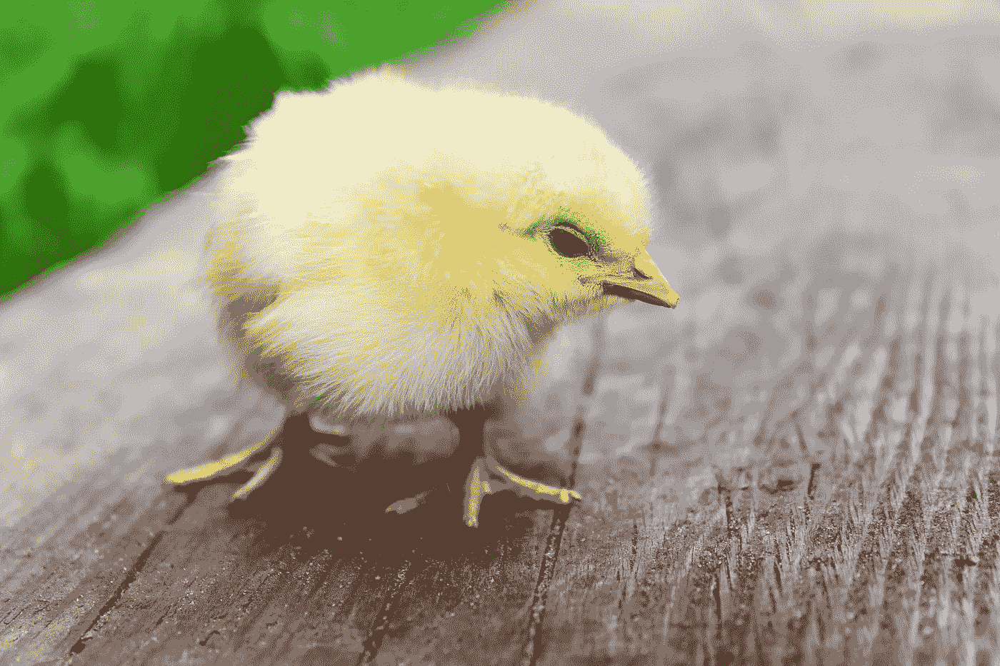
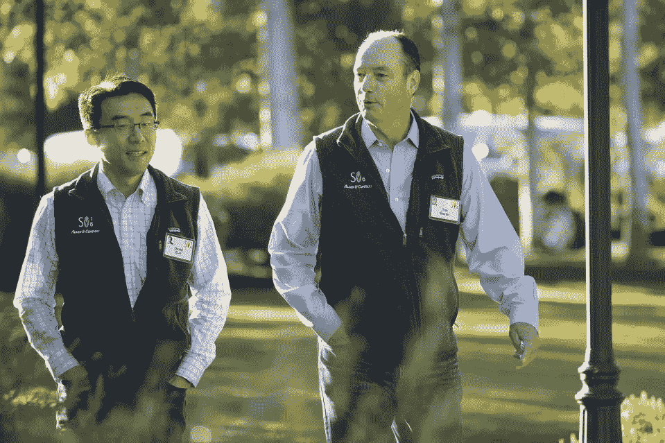

# 新员工创业术语和定义指南

> 原文：<https://medium.com/hackernoon/startup-glossary-of-terminology-and-definitions-2d9c6cd6763e>

## 创业公司简介

Everyone loves a know-it-all

科技创业公司的世界是一个快节奏、残酷的活动旋风。作为一名没有技术背景的“创意”人员，在一家小型初创公司工作时，我经常听到“pivot”、“benchmark”或“让开”这样的词，这让我感到困惑。我把这一点告诉了我的老板，她概述了我写在这里的常用术语表。

# 获得物ˌ获得

这是一个别出心裁的名字，指的是当外卖送来时，起身去吃午饭的行为。

# 天使投资者

一个被认可的投资者，他或她投资他或她与上帝的个人关系来给公司带来好运。他们有时会强制员工洗礼。

# arrive）

当一个真正令人沮丧的软件错误出现时，工程师们，像[的海盗](https://hackernoon.com/tagged/pirates)一样，大喊“ARR！”

# 基准

代码冲刺后在软件工程师的椅子上留下的印象。

# 拔靴带

在代码冲刺阶段用鞋子把工程师捆在地上以提高效率的行为。

# 企业对企业

“背靠背”的缩写，这是联合创始人在公司外露营时被狼袭击时的姿势。

# 消耗速度

为了在创业初期节省电费，创始人经常买蜡烛通宵工作。蜡烛燃烧的速度称为燃烧速率。燃烧率越低，蜡烛越好。

Light in the seemingly never ending dark

# 买断

一种时髦的舞步。

# 资本

硅谷，科技之都的别称。

# 兑现券

这是一张纸条，也叫罚单，当你把特斯拉敞篷车停在 2 小时停车区 4 小时时，贴在上面。

# 稀释

使液体变得更稀的行为。例如，在你的威士忌里掺水，因为喝醉还为时过早。

Beer is already diluted so no need to dilute further

# 扣除利息、税项、折旧及摊销前的盈利

过度疲劳的创始人试图解释一个想法但找不到合适的词时经常发出的噪音。

# 股权

优于平等；是股权！

# 退出策略

因为初创公司的员工通常每周工作 80 多个小时，所以每当他们想休息一下的时候，就必须计划一个退出策略。

9 more hours until I can see my newborn son

# 上市

初创公司员工下班后很少见到他们生活中的其他人。

# 独立承包人

当你需要干掉竞争对手时，你雇佣的人，真的，通过暗杀。

# 知识产权

当你开了一家公司，却付不起房租时，你可以假装它是北海滩的一栋豪宅，以此来安慰自己的聪明才智。这叫知识产权。

# 孵卵器

在创业公司工作压力很大。养宠物是缓解压力的一种有效方式。这就是为什么创业公司往往会有一个孵化器来养小鸡，以缓解压力。向任何一位创始人询问他们的孵化器，看看他们的鸡怎么样了。

Very cute stress relief

# 首次公开发行

公司在元旦举行的祭祀仪式，向公众提供鸡，以求来年好运。

# 清算瀑布

这是自举到地上很长时间后必然要尿尿。

# 锁起来

如果自举在确保效率方面不够成功，则需要锁定。这通常会导致更糟糕的清算瀑布。

# 保密协议

[披露](https://www.disclosureofficial.com/)是一个演奏美妙音乐的电子音乐二人组，但是美妙的音乐可能会在日复一日的工作中分散注意力。有了保密协议，每个人都约定不听泄露。

Disclosure

# 选择

这么多，却这么少。

# 投

休闲运动是创业者减压的好方法。一项普通的美国运动是“[棒球](https://en.wikipedia.org/wiki/Baseball)投球是棒球的第一步，一个人将球扔给另一个人用“球棒”(一根长棍，不是夜莺)击打。

Waiting for a pitch.

# 在枢轴上转动

当你在街上看到一个你在社交活动中见过的人，但你不记得他的名字时，转向另一个方向的动作。

# 跑道

当人们因为你连续三天穿同一件衬衫而对你评头论足时，你走过的共同工作空间的主要通道。

# 种子回合

从前，两个孩子在争论他们在地上找到的种子是长方形还是三角形。他们为此争论了几个小时，直到第三个孩子来了。“孩子，”他们问，“我们在地上找到的这颗种子是长方形还是三角形？”孩子疑惑地看着他们。“种子回合。”这个经典的童话故事启发了许多创始人，并继续作为一个最简单的解决方案，往往是你最后想到的隐喻引用。

# 搜索引擎优化

这是经典表达“看-哦”的简写因为有人分享了他们的想法，却发现这是不可执行的。

# 社会证明

在你的 Instagram 和脸书上放上你自己的照片，并将其 PS 成社交活动的照片，以向你的家人、朋友和你自己证明你已经平衡了工作和生活。

# 估价

这是一个特殊的创业行话，指的是一个创始人在评估另一个竞争对手，讨论是否值得雇佣一个独立的承包商。

# 副主席

代表非常小心。经常用在谈论如何告诉父母你要辞职去开科技公司的时候。

These happy parents won’t be happy for long

# 保留退休金的权利

今冬的科技潮流是穿背心。当团队中的每个人都碰巧穿着背心时，一家初创公司就被称为“归属”

These employees accidentally wore the SAME vest!