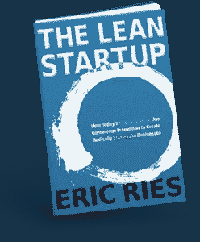
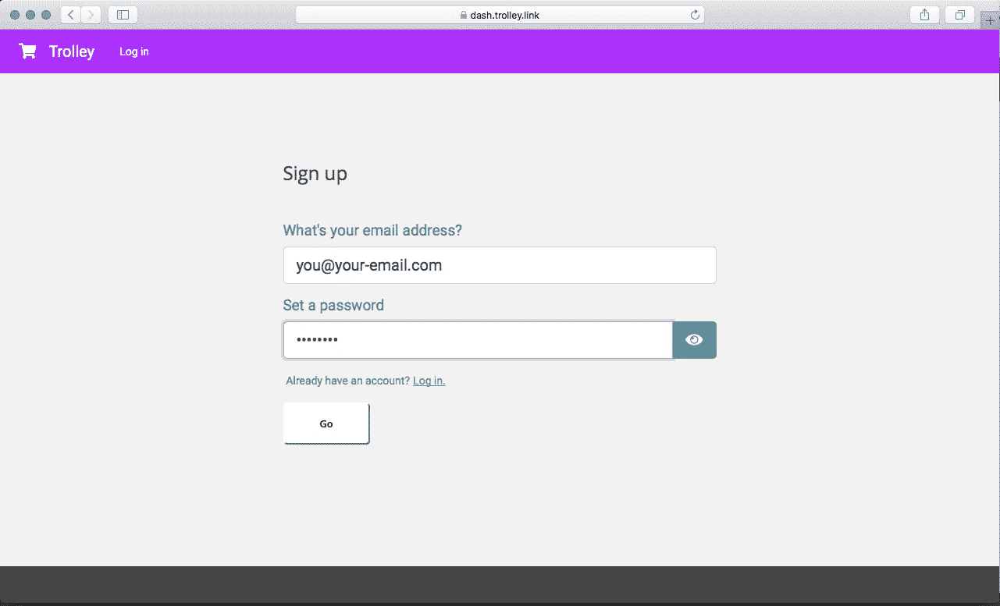
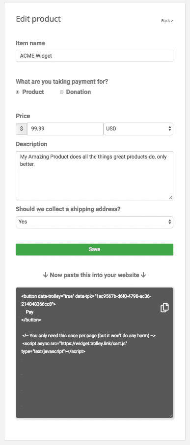
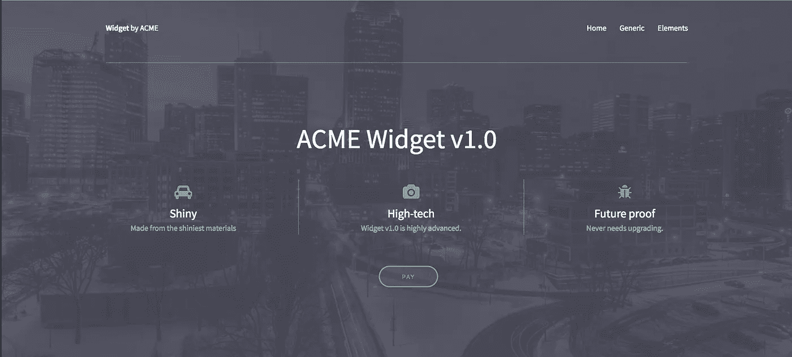
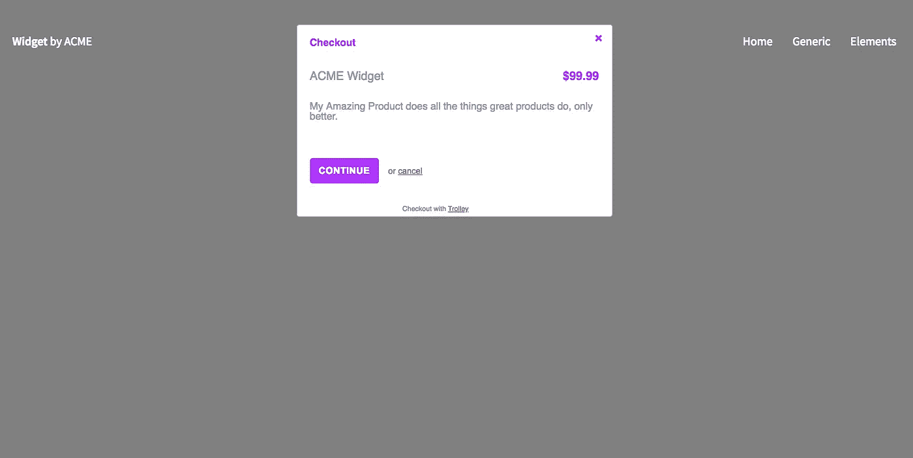

# 启动验证:在 10 分钟内从一个简单的登录页面销售产品并接受付款

> 原文：<https://medium.com/hackernoon/startup-validation-sell-products-take-payments-from-a-simple-landing-page-in-10-minutes-eed9f66e22f>

你读过精益创业书籍，听过播客，你想尽快用真实的客户来验证你的创业想法。



一个经典的技巧是放一个带有支付按钮的登录页面，在你有完整的产品之前，证明你是否能说服真正的客户付钱给你。

唯一的问题是，你不想花费时间和精力——或雇佣开发人员——来构建一个安全的后端服务器应用程序来帮助你进行支付(这是你使用 Stripe 之类的东西来处理信用卡所必须做的)

直到最近，这比你想象的要困难得多，但是现在，随着一些新工具的出现，你可以真正地在几分钟内完成这一切。

以下是方法。

# 这个计划

我们将使用一个免费的纯 HTML 模板建立一个完整的网站。

我们将使用[手推车](https://trolley.link)接受产品订单和实际资金，这是一个面向初创公司、创业者和小企业的超级简单的支付系统。

然后我们将使用 [Netlify](http://netlify.com) (一个非常酷的主机设置)来部署它。)

我们将在 10 分钟内完成。

## 假设

*   你熟悉基本的 HTML 和 CSS
*   你有一个文本编辑器，知道如何打开终端。
*   您或者已经拥有，或者很乐意创建具有台车和条纹的账户

# 1.获取网站模板

现在有很多免费的模板网站(尽管要注意那些声称免费的网站，但是它们的小字上写着“除非你是商业性的，否则要 500 美元”)

我喜欢[模板](https://templated.co/)——他们有很多现代外观的模板可供选择。

我们举一个例子:[https://templated.co/projection](https://templated.co/projection)

下载完成后，将其解压缩到您选择的目录中。

# 2.做一些基本的内容编辑

在新的 director 中，在文本编辑器中打开`index.html`。

更改`<title>`、`<h1>`、`<header>`元素和各个内容块的内容。

向下滚动到`<footer>`元素并删除它——我们不需要这个例子中的联系表单(尽管一旦你在 Netlify 上运行，你可以使用他们的)

# 3.设置您的购物车

电车是一个简单的电子商务系统，非常适合像这样的网站。你可以创造产品，也可以接受捐赠；您只需将简单的按钮标签复制粘贴到您的网站上，即可触发支付流程。

去 [https://trolley.link](https://trolley.link) 注册一个账号:免费。

按照提示将其链接到一个新的或现有的 Stripe 帐户，以便将实际的信用卡付款处理到您的银行帐户中(如果您手头有详细信息，填写表格大约需要 2 分钟)



## 创造产品

一旦您创建了您的购物车帐户，您就可以创建您的第一个产品了。点击**产品**，然后点击**新产品。**



Adding a product

# 4.把产品放在你的网站上

一旦你保存了你的产品，你会看到 Trolley 要求你抓取一大块 HTML 并粘贴到你的网站上。

选择代码(上面深灰色框中的单词…)并复制它——使用键盘或通过单击小复制图标。

现在翻到你的文本编辑器，在第 59 行左右找到这个:

```
<a href="#" class="button">Get Started</a>
```

用从台车上复制粘贴的代码替换该行，就像这样:

```
<button data-trolley="true" data-tpk="UNIQUE_RANDOM_STRING">
    Pay
</button><!-- You only need this once per page (but it won't do any harm) -->
 <script async src="[https://widget.trolley.link/cart.js](https://widget.trolley.link/cart.js)" type="text/javascript"></script>
```

*(使用来自电车的文本，包含* ***你的*** *唯一 ID，不要复制粘贴来自这篇博文的那个！)*

保存文件并刷新浏览器选项卡。

我的页面现在看起来是这样的:



Edited template

如果你点击支付按钮，你应该会看到购物车弹出。



# 5.把它放到网上

首先确保你有一个(免费的)虚拟主机账户——如果你还没有的话，你可以在这里得到一个。

[https://www.netlify.com/docs/manual-deploys/](https://www.netlify.com/docs/manual-deploys/)

登录后，您可以使用拖放操作来激活它；只需将解压后的整个目录拖到浏览器的 Netlify“部署”框中。卡住了就看视频！

一旦完成，打开他们给你的自动生成的网址，看到你的网站在互联网上直播！

现在你所要做的就是营销它，验证它，并把它变成一个真正的业务… :o)