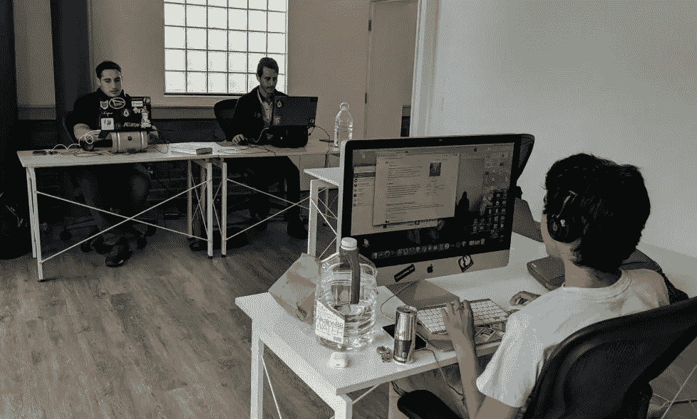

# “创业荒地”vs“少数人的秘密天堂”:纽约 vs 洛杉矶的黑客技术文化

> 原文：<https://medium.com/hackernoon/startup-wasteland-hacker-tech-culture-in-nyc-vs-la-5dc6237bf486>

everipedia santa monica HQ

人类文化是一条直线——当我们从西方到东方旅行时，事物变得更加封闭，变得不那么有趣。科技远不如我们向东旅行重要。

在我的创业经历中，我在纽约开了一家公司(说唱天才)，在洛杉矶开了另一家公司(Everipedia)。Rap Genius 是一家价值 10 亿美元的公司，我在其中拥有大量股权——但我仍然认为 Rap Genius 是一个失败者。尽管它是权威的互联网歌词平台，但它从未成为应有的通用知识注释者。这是一家十亿美元的公司，而不是万亿美元的公司。

[Everipedia](https://everipedia.org/) 将成为一家价值万亿美元的公司——我们正在为所有知识和社交网络构建加密货币平台——它将成为“加密 facebook”。我认为 Everipedia 会成功，而 Rap Genius 会失败的主要原因是，这些公司都是在纽约成立的，纽约是美国最虚假的科技城，而 Everipedia 是在洛杉矶成立的，洛杉矶是“少数人的互联网天堂”。

我不打算进入旧金山或硅谷，因为这只是一个简单的古老的怪异。他们有很多像这样的大公司，但是他们仍然还处于测试阶段。还有，我从来没有在顺丰开过公司。最后，我认为加密货币会让硅谷屈服，他们的中央集权机构，如脸书和谷歌，唱他们的绝唱，洛杉矶成为更具统治地位的加密发电站。

**纽约烂透了**

说唱天才获得的第一笔资金来自 2011 年的 Y Combinator。虽然我的联合创始人汤姆·雷曼和伊兰·泽乔里在 YC 之前住在纽约，但我一直希望公司的未来会在加州。

2011 年末，我猛然醒悟。汤姆和伊兰让我非常失望，他们说他们要回纽约找一间办公室。他们的借口是因为许多纽约的投资者已经像本·勒勒这样投资了。然而，我们在马里布还有一栋洛杉矶海滩别墅，我一年中在纽约和洛杉矶度过。

纽约没有好的科技创业公司。有史以来最受欢迎的是 Tumblr，这是一个不起眼的狗屎，时髦的首席执行官带着他的十亿美元，现在举办了很多可卡因派对。他甚至从来不关心自己的平台。

纽约没人有万亿美元的科技愿景。在纽约设立技术办公室的一个主要问题是，大楼很高，互联网很慢。以我的经验来看，在 Rap Genius，所有的办公室互联网都是廉价的、低劣的体验。当互联网速度很慢时，员工很难获得灵感——没有人会发现一万亿美元的愿景。

我从 2013 年开始接触 crypto。5 年前，没有一个城市像纽约一样像 crypto 一样落后——几乎所有纽约的科技企业家都会对这个想法嗤之以鼻。如今，纽约市似乎终于赶上并咬下了加密子弹——他们正在成为 fairweather 的粉丝，但似乎没有什么真诚的技术。

纽约有一家令人印象深刻的加密公司叫做 [Consensys](https://new.consensys.net/) ，除此之外，Consensys 实际上什么都不做。他们与大公司有关系，但事实上，他们完全是假的。Consensys 是纽约市加密技术场景的转喻，事实上，是整个技术场景的转喻。我不认为加密在纽约会有任何成功，因为为什么加密经济会在肮脏的中央金融霸主的城市受到欢迎？这没有任何意义。

**洛杉矶很冷**

2012 年，就在本·霍洛维茨投资说唱天才之后，他邀请我们去他家吃饭。这是我们最早一起出去闲逛、拍些照片的时候之一——在接下来的几年里，这样的机会会变得数不胜数。

那次吃饭，我跟他说了一件事:“本:你需要投资 Tinder 和 Snapchat”。

我知道 Tinder 和 Snapchat 会搞砸，我特别自豪他们是洛杉矶的公司。当时，很多人似乎认为 LA tech 很一般，但我已经好几年没有看到任何东西像来自 SF 或 SV 的 Tinder 或 Snapchat 一样接近消费者互联网了——实际上是从 Instagram 开始。

本说没有——他实际上说在之前的几个月里，Tinder *和* Snapchat 都找过他，而且估值太高了。

在这方面，本为没有接受我的建议付出了惨痛的代价——也为不尊重洛杉矶的技术舞台。

不像纽约和(我听说的)旧金山，洛杉矶没有很多高楼，所以有很多空间可以快速上网。洛杉矶就像硅谷——它是低层建筑，所以对互联网很有利。

2015 年，我在加州大学洛杉矶分校遇到了 Everipedia 的“波斯扎克”联合创始人 [Sam Kazemian](https://everipedia.org/wiki/samkazemian12/) ，这是一所相当变态的黑客学校——比斯坦福好。斯坦福有富裕势利的孩子，而加州大学洛杉矶分校有中产阶级黑客暴徒。我们的首席技术官和首席区块链开发人员都来自加州大学洛杉矶分校。

波斯扎克和我长期痴迷于加密货币。我是早期比特币投资人，他挖矿比特币交大学学费。但直到 Everipedia 推出一年后，我们才把“加密维基百科”——该网站与智商令牌和加密货币的集成——变成了我们的 3000 万美元融资。

洛杉矶有很多加密货币，因为这个城市按照自己的方式前进。加密货币是一项巨大的技术，但出于某种原因，SF/SV 中的人们对加密有些疏远，因为他们知道，在内心深处，它会吃自己的午餐。加密货币最终将把谷歌和脸书这样的硅谷中央集权机构变成盐的支柱:这只是时间问题。

我们的筹款导师之一是加密货币天才 Brock Pierce。他在洛杉矶工作，现在在波多黎各，这让我想起了洛杉矶。他的威尼斯公寓可能是运河中最棒的房子，他还有一个巨大的独角兽浮标，是他用以太坊从邻居那里买来的。如果 Everipedia 的总裁萨姆是“密码扎克”，那么布洛克肯定是“密码彼得·泰尔”。

洛杉矶的两大巨头 Tinder 和 Snapchat 根本没有涉足加密领域。太可惜了！尤其是有了 Snapchat，crypto 本可以给他们战胜脸书的优势。

**肯定**

有一次，在我们筹集到 3000 万美元之前，我们甚至想过和 Everipedia 一起搬到帕洛阿尔托——2016 年，山姆看了看马克·扎克伯格在斯坦福附近的“脸书之家”，他们在那里举办可卡因派对，就像电影《社交网络》中描绘的那样。

然而，最终，洛杉矶是我们的家。脸书可卡因交易所的安全保证金太高了，我们筹集了 3000 万美元来建立一个主要的加密平台:这确实是硅谷所厌恶的。是时候留在洛杉矶了。

最后一件事:Everipedia 是洛杉矶的代表，因为我们的员工包括许多奇怪的种族。没有一个大城市像洛杉矶一样是“美国小镇”——正是这一点使这个城市成为互联网和加密的伟大代表。世界变得无国界，而洛杉矶正站在它的前沿。

Everipedia 刚刚搬进了我们在圣莫尼卡的第一个商业办公室，地址是威尔希尔 201 号。它在平房的街对面。如果你想来看看洛杉矶最大的科技公司——比 Snapchat 还大的 crypto 脸书——那么请加入我们的社区，创建一个 Everipedia 页面。这是 FACEBOOK 的秘密——没有人能像洛杉矶那样建立这个万亿美元的公司…..