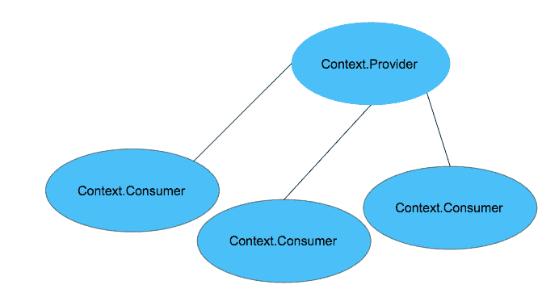
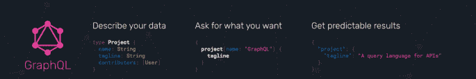
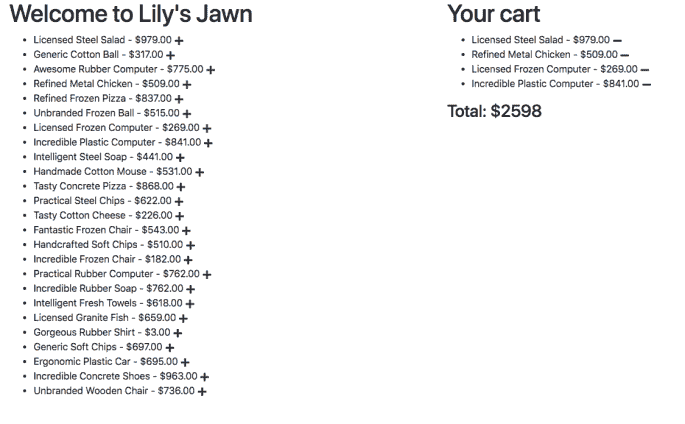
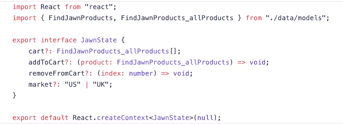
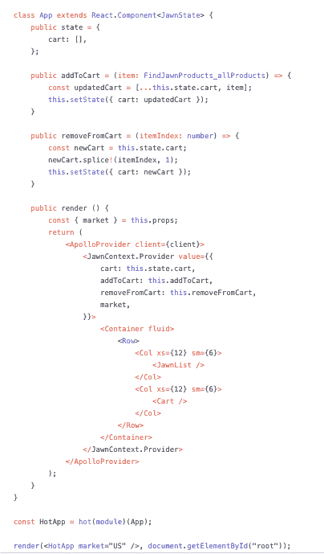
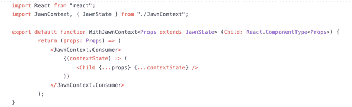
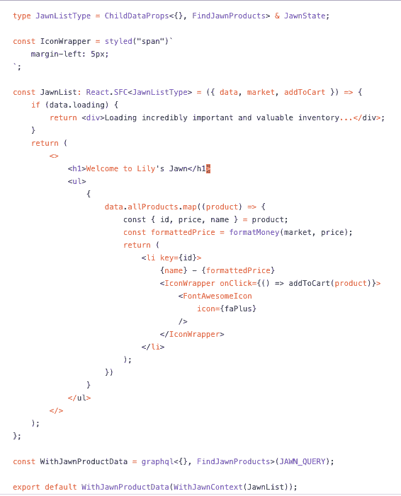
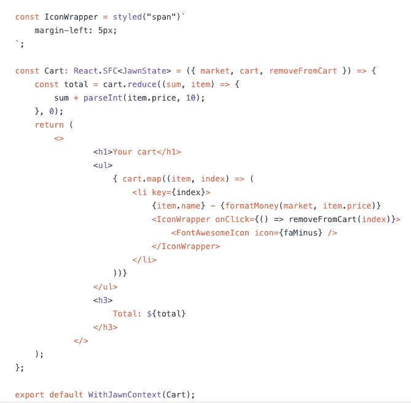

# 使用 React 上下文、类型脚本和 GraphQL 进行状态管理

> 原文：<https://medium.com/hackernoon/state-management-with-react-context-typescript-and-graphql-fb6264314a15>

厌倦了在你的状态下调试类型错误？想要 React 应用的最新文档吗？请继续阅读！


Side effects of type errors: Lost dev time and increased irritability

当我第一次遇到 [**TypeScript**](https://www.typescriptlang.org/) 的时候，我感到了相当程度的绝望:为什么我不得不写更多的样板代码？当与 React 一起使用时，为什么我必须确定每个单独的 [**React**](https://reactjs.org/) 属性的类型，以及异步调用的请求和响应对象？交集和并集到底是什么类型？

然而，在花时间使用 TypeScript 之后，我很快就爱上了它。它使我避免了在愚蠢的类型错误上浪费时间，提供了动态的自我文档，并且使我的同事更容易理解对代码的期望。

随着我探索 React 应用程序中不同的状态管理方法，我对 TypeScript 的兴趣越来越大。我对 React 的新 [**Context API**](https://reactjs.org/docs/context.html) 感到特别兴奋，我相信它会非常强大，尤其是在与 [**GraphQL**](https://graphql.org/) 和 TypeScript 结合使用时。

10 月份，我的兴奋之情在波士顿 TypeScript meetup(我现在也是该会议的共同组织者)的一次演讲中得到了体现，在那次演讲中，我讲述了我在使用 TypeScript 的 React 应用程序中进行状态管理的方法。

# 但是 Redux 呢？


[https://redux.js.org/](https://redux.js.org/)

但是在我们进入所有这些之前:我们需要简单地谈论一下 [**Redux**](https://redux.js.org/) 。它已经得到了很好的确立，可以说是 React 的默认状态管理模式。那我们为什么不直接用它呢？

*   根据应用程序的需求，Redux 可能过于复杂/笨拙
*   你可能不想使用*整个* Redux 生态系统，包括动作创建者、还原者等。
*   你最终会得到大量的样板代码

# 什么是上下文 API，我为什么要关心？

今年，我开始在 Redux 上的一些应用程序中使用上下文 API，我发现它实现起来既优雅又快速。上下文 API 是“React 中旧的上下文概念的升级版本，它允许[s]组件在父子关系之外共享数据”， [Rakshit Soral](https://hackernoon.com/@rakshitsoral) 在"[中恰当地写下了你需要知道的关于 React 的上下文 API 的一切。](https://hackernoon.com/everything-you-need-to-know-about-reacts-context-api-e5c8c32ef202)

我自己的短定义？

上下文 API 是一种共享状态和避免正确钻探方法(从 React 16.3 开始)。归根结底，这是一种在应用程序中共享信息的干净、漂亮的方式，而不用通过不关心它的组件发送信息。

我的上下文 API 图可能过于简化了，尽管你会发现除此之外真的没有什么了。您使用了一个`Provider`，它是树中所有组件的根信息源，您还使用了一个`Consumer`，它的职责包括从`Provider`中获取数据或功能，并将其直接提供给需要该信息的组件。



首先，您得到了`React.createContext`，它初始化并向上下文传递一个初始值。在这个来自[上下文 API 文档](https://reactjs.org/docs/context.html)的例子中，`React.createContext`返回一个带有提供者和消费者的对象。

`const {Provider, Consumer} = React.createContext(defaultValue);`

下面代码中的`Provider`——也来自[文档](https://reactjs.org/docs/context.html)——接受一个表示信息、数据、函数等的值属性。，通过上下文共享。

`<MyContext.Provider value={/* some value */}>`

下例中的`Consumer`——同样来自[文档](https://reactjs.org/docs/context.html)——包装了一个函数，该函数从提供者处获取一个值，并以组件的形式返回`JSX`，这些组件是`Provider`信息的私有部分。

```
<MyContext.Consumer>
   {value => /* render something based on the context value */}
</MyContext.Consumer>
```

# GraphQL 是什么，我为什么要关心它？

GraphQL 和 React 一样，是由 [**脸书**](https://github.com/facebook/graphql) 创造的。与 [**REST**](https://www.howtographql.com/basics/1-graphql-is-the-better-rest/) 不同，GraphQL 仅使用*一个*单一端点，允许您一次通过多个查询获取数据。它允许您仅请求您想要的数据，就在您想要的时候。



[**https://graphql.org/**](https://graphql.org/)

正如您在上面看到的，GraphQL 还有一个内置的类型系统，随着 API 的增长和发展，它有助于提供动态的 API 自文档。更好的是，您可以为您的查询生成静态类型，作为[**Apollo**](https://github.com/apollographql/apollo-tooling)**工具系统的一部分。**

# **向您的应用程序添加 GraphQL**

**`$ npm install --save apollo-boost react-apollo graphql`**

**[**阿波罗助推**](https://www.apollographql.com/docs/react/essentials/get-started.html) 给你一堆开箱即用的包。**

****

**Getting a boost with Apollo**

*   **[**Apollo-client**](https://www.apollographql.com/docs/react/essentials/get-started.html#packages)是一个缓存的 GraphQL 客户端，可以和 React(以及 Angular 和其他框架)一起使用**
*   **[**Apollo-cache-in memory**](https://www.apollographql.com/docs/react/essentials/get-started.html#packages)是一款标准的内存缓存，建议与 **apollo-client** 配合使用**
*   **[**Apollo-link-http**](https://www.apollographql.com/docs/react/essentials/get-started.html#packages)只是通过 HTTP 连接从 GraphQL 端点获取 GraphQL 结果**
*   **[**graphql-tag**](https://github.com/apollographql/graphql-tag) 导出了`gql` 函数，它允许你为我们的查询和变异编写容易解析的字符串**

**`react-apollo`包含将`apollo-client`与 React 一起使用的绑定，`graphql`只是脸书对 GraphQL 的参考实现。**

# **配置阿波罗客户端**

**这里有一个来自 [React Apollo docs](https://www.apollographql.com/docs/react/api/react-apollo.html) 的例子:**

```
import { ApolloClient } from 'apollo-client';
import { HttpLink } from 'apollo-link-http';
import { InMemoryCache } from 'apollo-cache-inmemory';const client = new ApolloClient({
   // By default, this client will send queries to the `/graphql` endpoint on the same host
   // Pass the configuration option { uri: YOUR_GRAPHQL_API_URL } to the `HttpLink` to connect to a different host
   link: new HttpLink(),
   cache: new InMemoryCache(),
});
```

**在这里，您导入了`ApolloClient`、`HttpLink`和`InMemoryCache`。如果您更喜欢使用 GraphQL 端点而不是默认端点，默认端点与客户机驻留在同一个主机上，`HttpLink`接受一个配置对象。**

**这意味着，例如，如果您正在使用一个驻留在不同主机上的微服务，您将为您的 GraphQL 端点传入一个自定义配置对象。**

**接下来，您将根组件包装在从`react-apollo`导入的`ApolloProvider`中。这使得应用程序中的每个组件都可以通过 Apollo 访问 GraphQL。下面的例子也来自 [React Apollo 文档](https://www.apollographql.com/docs/react/api/react-apollo.html):**

```
import { ApolloProvider } from 'react-apollo';ReactDOM.render(
   <ApolloProvider client={client}>
      <MyRootComponent />
   </ApolloProvider>,
   document.getElementById('root'),
);
```

# **用 Apollo 生成类型**

**`$ npm i --save apollo-codegen`**

**我更喜欢使用的`package.json`脚本如下:**

```
"introspect": "apollo-codegen introspect-schema GRAPHQL_ENDPOINT --output PATH_TO_SCHEMA_FILE",
// this fetches the schema and saves it in our project
"generate": "apollo-codegen generate GLOB_PATH_TO_QUERY_FILES --schema PATH_TO_SCHEMA_FILE --target typescript --output PATH_TO_GENERATED_TYPES_FILE --add-typename --tag-name gql",
// this generates type interfaces from our schema
"typegen": "npm run introspect && npm run generate"
```

**在我的`introspect`脚本中，我用我的端点调用`apollo codegen introspect-schema`，并请求 GraphQL 将我的模式文件输出到一个指定的文件。**

**我的`generate`脚本查看我自动生成的模式文件和我的查询和变异，并为我的查询和变异生成类型。**

**最后，我的`typegen`脚本结合了前面提到的两个脚本。**

**我运行`npm run typegen,`并且我很适合我的 GraphQL 类型！**

**请再次注意:这是我的首选方法。当然，每个人都应该自由地配置他们的`package.json`脚本，只要他们觉得是最好的！**

# **演示时间**

****

**前几天我喝了太多咖啡，决定重建和重塑亚马逊。**

**谢天谢地，我决定从小处着手。**

****

**我的搭档刚搬到费城，那里的人们对各种事情都有自己的行话。比如这个:**

```
Jawn: noun, chiefly in eastern Pennsylvania, used to refer to a thing, place, person, or event that one need not or cannot give a specific name to.
```

**我的 Jawn Store MVP 应该最终显示一个产品列表及其价格，并让我能够将东西添加到我的购物车中。我也应该能够从我的购物车中删除项目，并立即看到更新的总数。**

**当我在本文的剩余部分解释如何用 GraphQL 和 TypeScript 设置 React 上下文时，您也可以在这里找到完整的源代码。**

**对于我的原型，我使用的是 [**Faker.js**](https://github.com/marak/Faker.js/) ，这是一个生成假数据的极好的库。Faker.js 托管了一个 [**FakerQL**](/@notrab/fakerql-is-ultimate-graphql-endpoint-for-fake-data-bd83f4cd6ad1) 端点，允许我从一个 GraphQL 端点获取我的假数据。它为我提供了以下类型的查询:**

*   **邮政**
*   **产品**
*   **用户**
*   **待办事项**

**出于我的目的，因为我在经营一家商店，所以我将通过 FakerQL 为要销售的产品获取数据。**

**我的应用还使用了以下技术:**

*   **使用 [**Parcel.js**](https://parceljs.org/) 键入脚本，这是一个开箱即用的支持 ts 的捆绑器**
*   **React 的上下文 API**

# **设置我的 GraphQL 客户端**

****

**Getting my store ready for the grand opening!**

**我的应用程序已经安装了所有必要的 Apollo 依赖项，这些脚本包含在我的`package.json`中:**

```
"scripts": {
   "test": "npm run test",
   "dev": "parcel ./index.html",
   "introspect": "apollo-codegen introspect-schema [https://fakerql.com/graphql](https://fakerql.com/graphql) --output ./data/models/index.json",
   "generate": "apollo-codegen generate ./data/**/*.ts --schema ./data/models/index.json --target typescript --output ./data/models/index.ts --add-typename --tag-name gql",
   "typegen": "npm run introspect && npm run generate",
   "build": "tsc"
}
```

**您会注意到使用了 FakerQL 端点和一个到`data`文件夹的路径，我在这里自动生成模式模型并设置我的查询类型。**

**这里是我的`data`文件夹的实际结构:**

```
- data
   - formatters
   - models
   - queries
```

**我的`formatters`是计算不同国家价格的函数(已经实现)。当我运行我的`introspect`脚本时，Apollo 会将模式输出到我的`models`文件夹中的`index.json`文件中。文件夹`models`中的所有文件都将自动生成。**

**当我运行我的`generate`脚本时，Apollo 将结合端点模式查看我的查询，并将类型输出到我的`models`文件夹中的`index.ts`文件中。**

**接下来，我需要创建一个`ApolloClient`的实例，这样我就可以使用它的功能。**

```
// ./index.tsx
import React from "react";
import { ApolloProvider } from "react-apollo";
import { ApolloClient } from "apollo-client";
import { HttpLink } from "apollo-link-http";
import { InMemoryCache } from "apollo-cache-inmemory";const client = new ApolloClient({
   link: new HttpLink({
      uri: "[https://fakerql.com/graphql](https://fakerql.com/graphql)",
      // Remember, we only need ONE endpoint!
   }),
   cache: new InMemoryCache(),
});class App extends React.Component {
   public render () {
      // App contents
   }
}
```

**就像我们之前看到的例子一样，我们使用了`ApolloClient`、`HttpLink`和`InMemoryCache`。我将传入一个带有 FakerQL 端点的 URI 配置对象。**

**我还确保根组件被包装在`ApolloProvider`中，因此树中的所有组件都可以利用 GraphQL。**

**让我们进入正题:我需要一个查询来通过 FakerQL 获取所有产品。我更喜欢在我的数据文件夹中为每个查询准备一个文件。**

```
// data/queries/JAWN_QUERY.tsimport gql from "graphql-tag";export default gql`
   query FindJawnProducts {
   // The FakerQL docs tell me I can query "allProducts" and get a  
   list of products back
   // I'm also specifying the fields I want returned for each
   Product: id, name, price
      allProducts {
         id
         name
         price
      }
   }
`;
```

**这里，我使用`gql`将我的查询放到一个易读的字符串中。当我查看 FakerQL 文档时，他们告诉我可以查询`allProducts`,并指定以上字段——以及其他字段——为每个产品返回。**

**当我运行`npm run typegen`时，下面是生成的类型:**

```
export interface FindJawnProducts_allProducts {
   __typename: "Product";
   id: string;
   name: string;
   price: string;
}export interface FindJawnProducts {
   allProducts: (FindJawnProducts_allProducts | null)[] | null;
}
```

**`FindJawnProducts_allProducts`代表单个项目或商品的类型，`FindJawnProducts`是我们商店中产品阵列或列表的类型。这些类型对于设置我们的上下文和输入利用这些数据的组件非常有用。**

**在我使用来自 GraphQL 的数据得到我们的组件之前，我停下来问自己:除了从 FakerQL 获取的产品细节之外，我还想要什么信息？**

**事实证明，我想支持两个不同的市场:美国和英国**

****

**为了提供产品价格的正确计算，我需要我的组件了解我的市场。在这种情况下，我将把市场作为一个道具传递到根组件中。**

```
class App extends React.Component {
   public render () {
      const { market } = this.props;
      return (
         <ApolloProvider client={client}>
            <Container fluid>
               <Row>
                  <Col xs={12} sm={6}>
                     <JawnList market={market}/>
                  </Col>
                  <Col xs={12} sm={6}>
                     <Cart market={market}/>
                  </Col>
               </Row>
            </Container>
         </ApolloProvider>
      );
   }
}const HotApp = hot(module)(App);
render(<HotApp market="US" />, document.getElementById("root"));
```

**但是我不想仅仅为了提供关于我的市场的认知而从根组件向下钻取道具。**

**我还有两个组件——`JawnList`和`Cart`——它们可能需要知道我从 API 中获取的产品，但是我也不想把这些数据作为道具传递下去。**

**我的理由？随着应用程序规模的增加，适当的钻探会变得非常混乱。我的 MVP 可以成长为一个更大的应用程序，我不想最终通过不关心它们的组件传递细节。**

# **进入上下文 API！**

****

**Context API magic!**

**我创建了一个名为`JawnContext.tsx`的文件，在这里我为应用程序定义并创建了我的上下文:**

****

**这就是阿波罗生成的类型开始派上用场的地方。`Cart`将是一系列 FakerQL 产品。`addToCart`将接受一个 FakerQL 产品作为参数，并将其添加到`Cart`。`removeFromCart`会做听起来完全一样的事情。最后，`market`可以被类型化为`"US"`或`"UK"`。**

**然后，`React.createContext`发挥它的魔力！(`null`，顺便说一下，是我对上下文的默认值)。**

**接下来，让我们将我的上下文连接到我的根组件。**

****

**您会注意到`App`被类型化为`JawnState`——上下文类型——因为组件的道具之一是`market`，我现在想从上下文中派生出来。**

**您还会注意到我用`JawnContext.Provider`和它的值对象包装了组件，它包含了每个上下文属性的值——`addToCart`和`removeFromCart`的实现，传递到根的`market`,以及购物车的当前状态。**

**转到消费者:这是个人偏好——有些人喜欢创建新的函数来包装每个消费组件——但是我想在这里建立一个可重用的`WithJawnContext`提供者，这样我就可以在需要的时候用 GraphQL 提供者和消费组件轻松地组合它。**

****

**这里，我的`Props`扩展了`JawnState`，这是上下文的类型，并且该函数接受一个 React 组件作为子组件。然后它返回一个孩子，由`JawnContext.Consumer`包装，在其中传播给定的属性和上下文状态。**

**为了让`JawnList`能够以一种类型安全的方式成功地使用我的上下文，我需要将`JawnListType`定义为一个子元素，它结合了来自`JawnState`上下文和 GraphQL 自动生成的数据类型`FindJawnProducts`的属性。**

****

**这使我能够访问来自 GraphQL 端点的数据，以及来自我的上下文的`market`和`addToCart`。**

**在上面代码的底部，您会看到我已经创建了一个函数来对产品数据进行必要的 GraphQL 查询。我正在用`withJawnContext`提供者和我的组件进行组合。React Apollo 给了我`ChildDataProps`，由`ApolloProvider`包装的组件的通用类型。**

**类似地，我需要允许 Cart 使用上下文。**

****

**在这里，我用`Cart`——类型化为`JawnState`——组成了`withJawnContext`提供者，这使我可以从上下文中访问`market`、`cart`和`removeFromCart`。**

**也就这样了！我的应用程序允许用户从购物车中添加和删除商品，并查看更新的总价，我可以避免在应用程序中钻取道具。我赢了！**

# **外卖食品**

*   **Apollo 帮助我们查询单个端点，并为我们的模式、查询和变异生成 GraphQL 类型**
*   **上下文 API 与 TypeScript 一起工作，提供了一种类型安全的、轻量级的方式来共享状态和数据，而无需深入研究属性**

**这篇文章的一个版本最初发表于[lilydbarrett.com](https://lilydbarrett.com/)。你可以在这里找到 Jawn 商店[的完整源代码。](https://github.com/lilybarrett/jawn-with-graphql-and-react-context)**

****其他有用资源:****

*   **[graph QL 简介](https://graphql.org/learn/)**
*   **[阿波罗客户端文档](https://www.apollographql.com/docs/react/)**
*   **[“关于 React 的上下文 API 你需要知道的一切”](https://hackernoon.com/everything-you-need-to-know-about-reacts-context-api-e5c8c32ef202) ( [Rakshit Soral](https://hackernoon.com/@rakshitsoral) )**
*   **[反应上下文文档](https://reactjs.org/docs/context.html)**
*   **[打字稿文件](https://www.typescriptlang.org/docs/home.html)**