# 比特币的现状(2018 年秋季)

> 原文：<https://medium.com/hackernoon/state-of-bitcoin-fall-2018-9ccddba55e54>

*合著* [*加里盆地*](https://twitter.com/garybasin) *和* [*泰勒皮尔森*](https://twitter.com/TaylorPearsonMe)

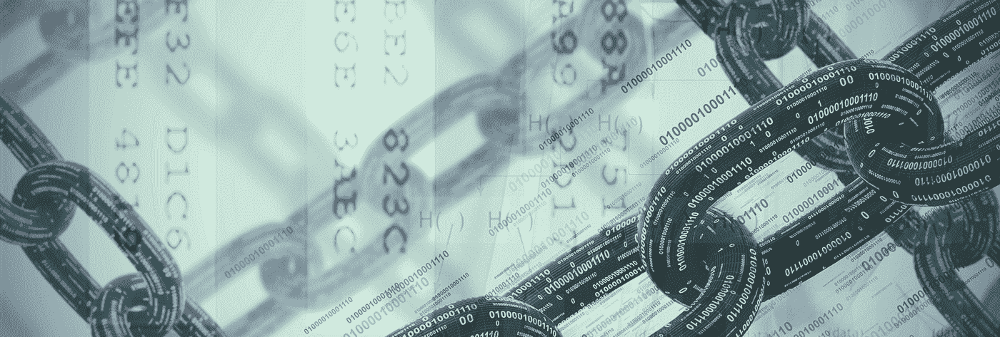

比特币世界里发生了很多事情，很难对所有事情都进行跟踪。这份报告旨在为市场参与者提供关于比特币现状的一站式服务。

我们涵盖了估值、技术、监管/法律以及不同的曝光方式。这并不意味着要从头到尾阅读，所以如果有一部分是特别感兴趣的，请随意浏览。

***如果您想下载副本，请点击此处下载 PDF 版本。***

# 关键要点

**估价**

总的来说，应该记住，我们正处于加密资产估值工具的石器时代，因此所有的估值模型(或我们在这里介绍的模型集合)都应该持怀疑态度。

话虽如此，几乎所有的指标都表明，2018 年的熊市将至少持续几个月。NVT 和 NVM 都处于超买区域，情绪指标主要是看跌。

**技术**

比特币在加密资产中是独一无二的，因为在未来五到十年内，它不需要太多的技术来使其成为一种可行的数字黄金。即使交易费用高达几十美元，它仍然可以作为主权级别的抗审查财富库。

也就是说，Segwit 的采用有意义地增加，随着网络活动的减少，交易费用中位数下降到 0.10 美元以下。

年初至今，衡量比特币安全性和审查阻力的重要指标 Hashrate 上涨了 300%以上。

闪电网络是目前比特币上谈论最多的技术发展，但它可能接近高德纳炒作周期的顶峰。有很多关于可以用它做什么的讨论，但是我们可能至少还需要几年才能看到有意义的采用。

围绕可替代性的长期担忧(因为比特币有限的隐私和假名而不是匿名性，这使得一些硬币可能被认为是“受污染的”)和在未来没有采矿奖励的情况下比特币的稳定性是真实的，但看起来不像是短期担忧。

**法规/法律**

比特币是加密资产中最受监管的黑/白。尽管 ETF 遭到拒绝，该领域的一些公司参与了监管套利，但比特币似乎有相当有利的监管顺风。

**曝光方式**

对于考虑如何获得敞口的投资者，我们将投资工具分为三类

*   通过传统经纪账户提供的非托管公开上市期权
*   仅限于合格投资者和高净值个人的非托管选项
*   个人监护选项

公开上市的选择仍然有限，现有的选择也有明显的缺陷。这种情况在未来 12 个月内似乎会有所改变，但在未来三个月内可能不会。

在 2017 年的繁荣之后，为合格投资者提供了一些非托管的新选项，HNWI 存在，而且总体上很好，尽管投资者被迫在低费用和很少定制(加权指数基金)或高费用和更多定制(主动管理基金)之间做出选择。

在过去的几年里，个人监护权的选择没有太大的变化，也许是因为现有的选择被普遍认为是非常好的。对于选择自我监管的个人和机构来说，对[运营安全](/@masonic_tweets/minimum-viable-security-32e61d10aee4)的工作理解至关重要。

如果你觉得这个报告有帮助，请[让我们](https://twitter.com/garybasin) [知道](https://twitter.com/TaylorPearsonMe)。如果您希望收到未来版本，[请给我们留下您的电子邮件以获得未来版本的通知](https://taylorpearson.me/state-of-bc/)。

这是一份冗长的报告。 [***点击此处下载 PDF 版本。***](https://taylorpearson.me/state-of-bc/)

# *1。估价*

# 网络价值与交易比率(NVT)

[所有用于计算 NVT 和 NVM 的数据可在此下载](https://drive.google.com/open?id=1HkJZ5Z6uZofUiaxHcIcZhW2a8jKiYLM9)。

**为什么有意义**

NVT 比率是由分析师 Willy Woo 开发的，被称为比特币的市盈率。NVT 衡量相对于加密资产交易价值的网络价值(市值)。这是一个简单的方法来比较市场如何定价一个单位的链上交易。

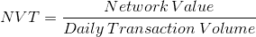

当你看一家传统公司的市盈率时，收益被用来代表公司提供的真实效用。使用 NVT 比率，我们假设每天的链上交易量(但不是更具投机性的交易活动)是网络真实潜在价值的良好代理。

因为 NVT 很吵，我们做了一些调整。首先，我们忽略了周末的交易量，因为有明显的季节性——周末的交易量远低于工作日的交易量。第二，由于每日交易量中的显著噪声，我们平滑了该度量(使用 30 天移动平均线)。

另一个提出的变体是“NVT 信号”。平滑整个 NVT 值的一个问题是这会降低其对价格(网络价值)急剧变化的响应能力。相反，我们可以保留“原始”分子，平滑分母(在这种情况下，使用 90 天移动平均线)。

在最近的一条推文中，NVT 创始人 Willy Woo 表示，他的最新作品是“NVT 衡量短期交易者与长期投资者投机之间的比率。”根据这一理论，低 NVT 比率表明长期投资者持有相对较多的 BTC，高 NVT 比率表明短期交易者持有相对较多的。

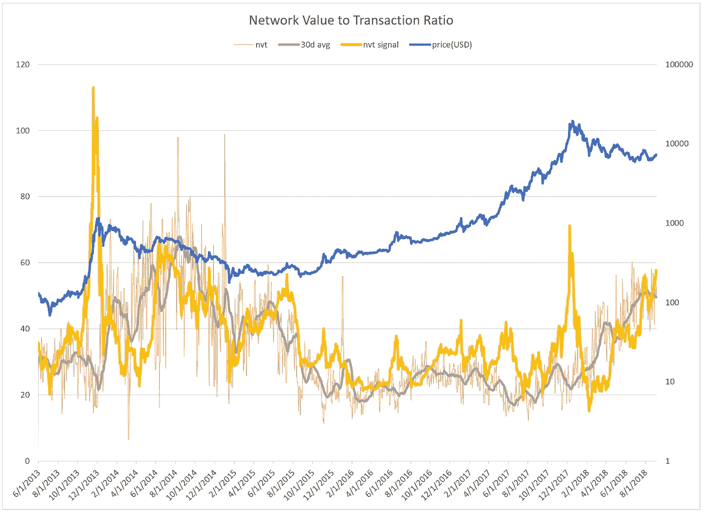

**为什么它不**

这种模型的一个潜在缺陷是，它假设交易是比特币价值的一个很好的替代指标，就像传统公司的收益一样。不清楚是不是这样

甚至不清楚 NVT 是否是货币价值的直接衡量标准。由于网络价值是市场资本总额，这等于每比特币$美元的价格乘以现有比特币的总数。

每日交易量就是链上交易的比特币数量(尽管，见下文关于调整的内容)乘以每个比特币的美元价格。如果我们排除比特币价格方面的因素，我们剩下的是 NVT =流通比特币数量/比特币每日链上交易量。从这个角度来看，NVT 似乎根本没有捕捉到价格信息。更确切地说，这是一个衡量[逆]T2 速度的指标——一枚比特币转手的速度有多快。

这意味着 NVT 从根本上看待比特币作为交易媒介的价值。如果越来越多的市场开始将比特币视为数字黄金(w [似乎就是这种情况](/@nic__carter/visions-of-bitcoin-4b7b7cbcd24c))，其价值就不是来自于充当交易媒介，而是来自于储存价值。NVT 捕捉得好吗？大概不会。

**分析**

目前，BTC 正在从 2017 年的狂热阶段中走出，这与它在 2014 年从 2013 年的狂热中走出没有什么不同。这意味着比特币 NVT 比率看起来很高，并且在 2018 年的大部分时间里都是如此。BTC 已经进入超买区域，2018 年大部分时间都是如此。

如果在当前的市场范式下，NVT 和 NVS 指数仍然是准确的估值指标，我们仍有相当多的解套工作要做。

# 网络价值与 Metcalfe 比率(NVM)

**为什么有意义**

梅特卡夫定律是由罗伯特·梅特卡夫提出的，用来解释网络价值与其规模之间的关系。这种关系是基于网络效应的理念:对于网络来说，每一个额外的用户都会增加它对其他人的价值。如果世界上只有两部电话，它们就没那么有用了。随着你添加更多的手机，原来的两个变得更有价值。

2015 年，张等人发现，[的收入与其月活跃用户数(MAU)](https://link.springer.com/article/10.1007/s11390-015-1518-1) 的平方成正比。肯·阿拉比在这项工作的基础上证明了[比特币、以太坊和 Dash 已经被梅特卡夫定律](https://www.sciencedirect.com/science/article/pii/S1567422317300480)很好地模拟了。

比特币表现出一些网络效应是有道理的，因为它是一种货币形式，而货币解决了[需求重合问题](https://en.wikipedia.org/wiki/Coincidence_of_wants)(本质上，物物交换是低效的，因为人们有不同的需求——例如，如果一名音乐家以啤酒支付，而他的房东不接受啤酒，那么他就无法赚取租金，他需要钱)。

Fundstrat 分析师汤姆·李(Tom Lee)发现，截至 2017 年底， [94%的比特币价格变动可以用 NVM](https://www.businessinsider.com/bitcoin-price-movement-explained-by-one-equation-fundstrat-tom-lee-metcalf-law-network-effect-2017-10?r=UK&IR=T) 来解释(尽管这在我们看来是糟糕的统计数据)。

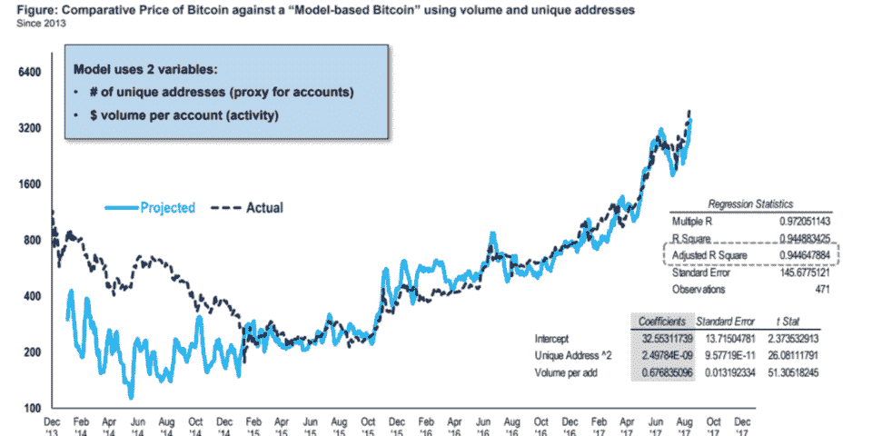

分析师 Dmitry Kalichkin 提出了一个更精确的模型，使用两种不同的方法计算与比特币价格密切相关的梅特卡夫定律。

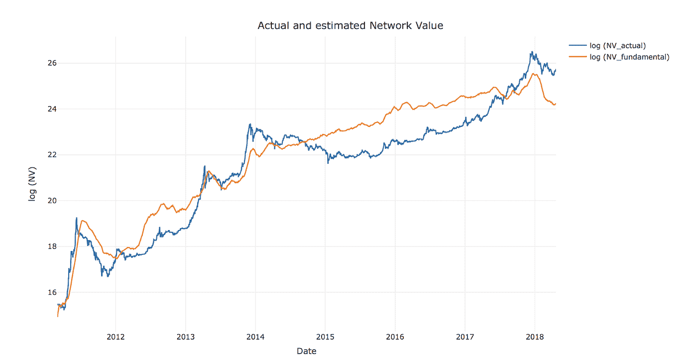

上述方法的主要问题是，它们使用所有数据来拟合模型的变量——当然，它在样本中看起来很好，但将其用于预测有意义吗？铼

**为什么它不**

尽管梅特卡夫定律显然对比特币有一些影响，但每当你假设旧工具(在脸书和腾讯等以前的资产上运行良好)将完美地用于显示出明显不同特征的东西时，这让我们有点谨慎。

从价格预测的角度来看，这在统计学上也是可疑的。乍一看，仅使用梅特卡夫定律作为网络价值自然对数 ln(市值)的预测值(每日活跃地址平方的自然对数)ln(DAA)似乎并不那么有用。它们大致一起移动，并有相似的规模，但这仍然是一个有用的市场时机工具。在某种程度上，其他交易者正在看它，但是，它可能与预测他们的行为有关。

为了更加精确，我们进行了滚动回归，使用 ln(DAA)作为预测。滚动回归意味着一个移动的回顾窗口(这里是 360 天)和预测窗口(30 天)，这样回归的 betas 能够随时间更新以适应变化的行为。这也避免了一次考虑所有数据并拟合变量以确保良好结果的方法所产生的前瞻和曲线拟合偏差——这仅在事后才起作用。

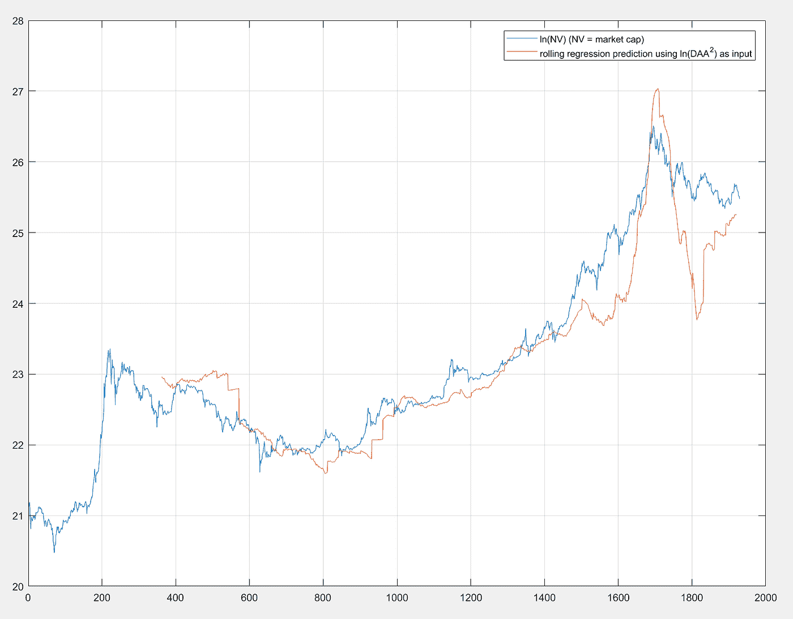

我们可以从上面看到，预测(样本外，橙色线)不是特别有用，因为它通常落后于目标(蓝色线)。

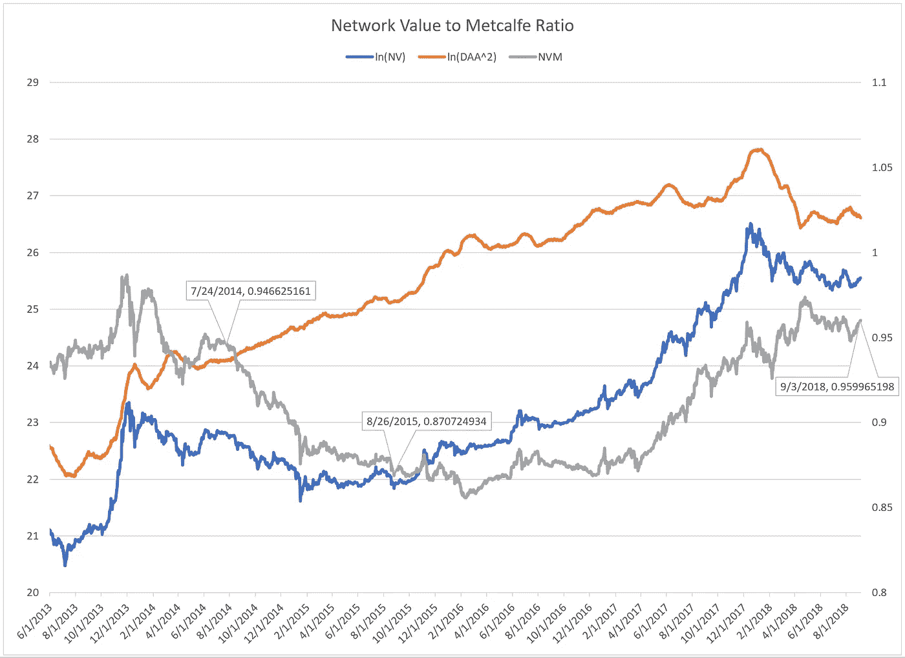

**分析**

总体而言，尽管当前的价格水平比 2017 年 12 月更健康，但相对于每日活跃地址来说，似乎仍然相当高。上一次熊市大约一年后(大约 2014 年 8 月)，NVM 约为 0.95，BTC 直到大约一年后(大约 2015 年 8 月)才进入长期牛市，NVM 接近 0.87。

# 比特币的统治地位

**为什么有意义**

BTC 主导地位衡量的是以比特币为代表的加密资产总市值的百分比，比特币是加密资产的王者。

在 2017 年的 ICO 大繁荣之前，比特币主导了加密货币叙事。有迹象表明，我们正在回到那个世界。《丰厚的金钱》一文——见 Arjun Balaji 的[解释——认为下一波投资者将专注于金钱，因此比特币是中短期的主要机会。在那种情况下，从资本配置的角度来看，我们可能会预计比特币将重新占据主导地位，其他几个主要硬币将争夺次要用例。我们没有预料到的是实用令牌(ICO 热潮的大部分)或更不受欢迎的协议(因为它们不能产生太多的实用工具，也不能成为新资金的候选对象)会产生太多的价值。](https://www.tokendaily.co/blog/the-best-fundamental-indicator-new-inflows)

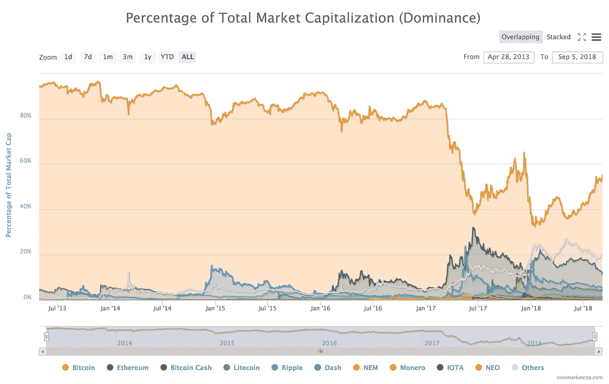

**为什么它不**

即使我们能够成功预测比特币占主导地位的百分比，如果我们只是押注比特币的价格，我们仍然可能会赔钱。比特币的主导地位很有可能会回到 80%以上的旧水平，但加密资产的总市值仍可能下降，比特币的价格可能会继续下跌。要直接押注于此，你需要通过做空(买入)其他加密资产来创建一个 BTC 多头(空头)的价差头寸。Tetras capital 最近发布了一篇[以太短论文](/@tetrascapital/ether-eth-bearish-thesis-the-flippening-of-market-irrationality-8633e70ab498)鼓吹这个立场。

**分析**

目前比特币的主导地位徘徊在略高于 50%的水平。对于那些不相信 Fat 协议的人来说，这仍然是一个巨大的购买机会。另一方面，它已经从今年早些时候接近 30%的低点反弹。认为其他协议将获得加密资产领域大部分价值的投资者可能希望减少对比特币的敞口，并分散投资于其他货币。

# 感情

众所周知，对一种新的资产类别进行估值是非常困难的，而大多数加密资产产生的现金流的缺乏让这变得更加棘手。传统的方法，如 DCF(贴现现金流)分析，根本不适用。

不过，一个仍然相关的因素是情绪。情绪是一种主要由投机驱动的资产，因为加密资产往往如此，对于缺乏合理估值模型的资产，加密资产也是如此。

我们在下面考察了几种不同的衡量比特币人气的方法。情绪指标的一个缺点是，它们可能会快速变化，因此通常只对短期价格预测有用。

# Bitfinex 多头/空头

**为什么有意义**

Bitfinex 报告的保证金多头与保证金空头。

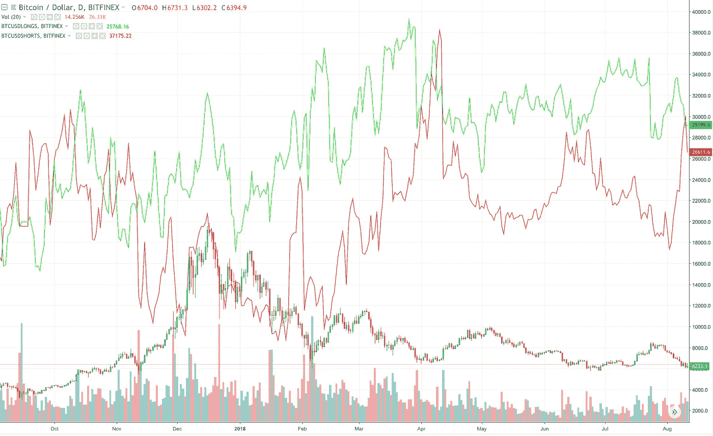

*Source:* [*https://www.tradingview.com/chart/k8IXd6tN/#*](https://www.tradingview.com/chart/k8IXd6tN/#)

交易所 Bitfinex 在其平台上公开披露保证金(杠杆)多头和空头的头寸规模。这是衡量激进投机者相对和总体仓位的一个很好的指标。除了捕捉他们的情绪，它还可以表明我们可以预期过度杠杆化头寸的自动平仓自我强化的程度。

例如，当投机者存在异常大的杠杆空头敞口时，价格的大幅上涨可能会通过这些空头耗尽保证金抵押品而被迫通过买入上涨的市场来平仓来维持(反之亦然，对于下跌市场中的杠杆多头也是如此)。

**为什么它不**

Bitfinex 只是一家交易所，因此他们的保证金多头/空头数据可能并不代表投机者在比特币中的整体头寸。此外，通过观察多头/空头头寸和 BTC 价格之间的关系，你可以看到，这种关系充其量是嘈杂的。从这些数据中建立一个预测模型可能需要更多的努力。

**分析**

杠杆化的空头仓位超过了杠杆化的多头仓位——这在这个数据集中是相对罕见的。从历史上看，这大致与 BTC 价格的本地低点相对应。

# 加密恐惧和贪婪指数

**为什么有意义**

Alternative.me 发布了一个专有的[加密恐惧&贪婪指数](https://alternative.me/crypto/fear-and-greed-index/)。它由市场和价格因素组成，如波动性和动量，以及社交媒体活动、调查和其他数据。对于一般情绪指标，我们预计贪婪指标将在市场顶部附近达到极端，恐惧指标将在市场底部附近达到极端。

在一定程度上，这些指标与市场参与者的头寸相关，这可以预测——当每个人都贪婪并已经买入时，市场上的额外买家就会减少，最终贪婪者会开始卖出(反之亦然，因为恐惧)。

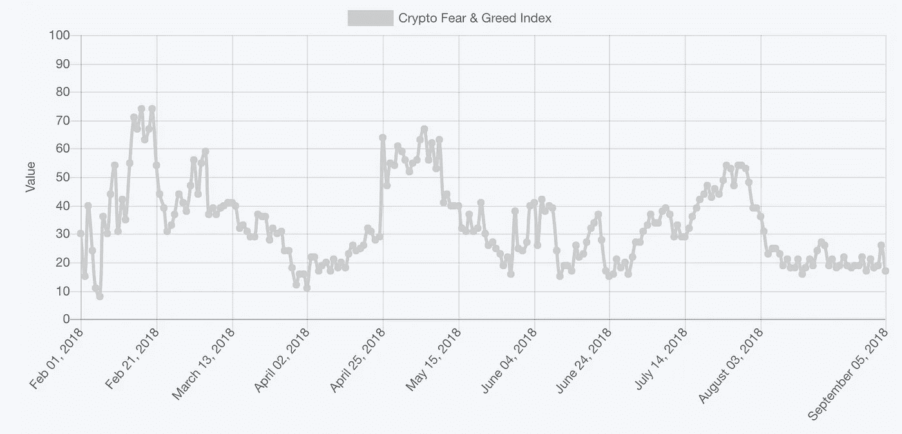

*Source:* [*https://alternative.me/crypto/fear-and-greed-index/*](https://alternative.me/crypto/fear-and-greed-index/)

同期的 BTC:

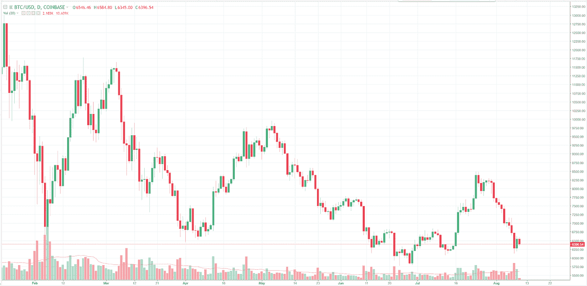

**为什么它不**

这类指标的普遍问题是，极度贪婪和恐惧的状态可能会持续很长时间，并很快恢复。例如，当价格继续下跌时，我们可以连续几天处于该指数的低水平(表明恐惧)，然后在价格反弹一两天后，它迅速恢复到中性水平。

**分析**

我们正在接近恐惧的极端水平，这表明当前的抛售可能过度了，我们可能很快就会看到短期价格底部。

# 交易商的 CBOE 期货承诺

**为什么有意义**

CFTC 每周发布一份报告，按持有人类别(大投机者、小投机者和商业对冲者)对各种期货市场持有的头寸进行细分。这份报告被称为[交易员承诺](https://en.wikipedia.org/wiki/Commitments_of_Traders)。由于 BTC 现在有几个上市的期货合约，我们可以看到这个数据。使用 CBOE 的比特币 COT 数据。

一些交易者喜欢用这个数据来确定小投机者的总仓位。这些玩家通常被认为是“傻钱”，从他们那里拿相反的位置是有利可图的。

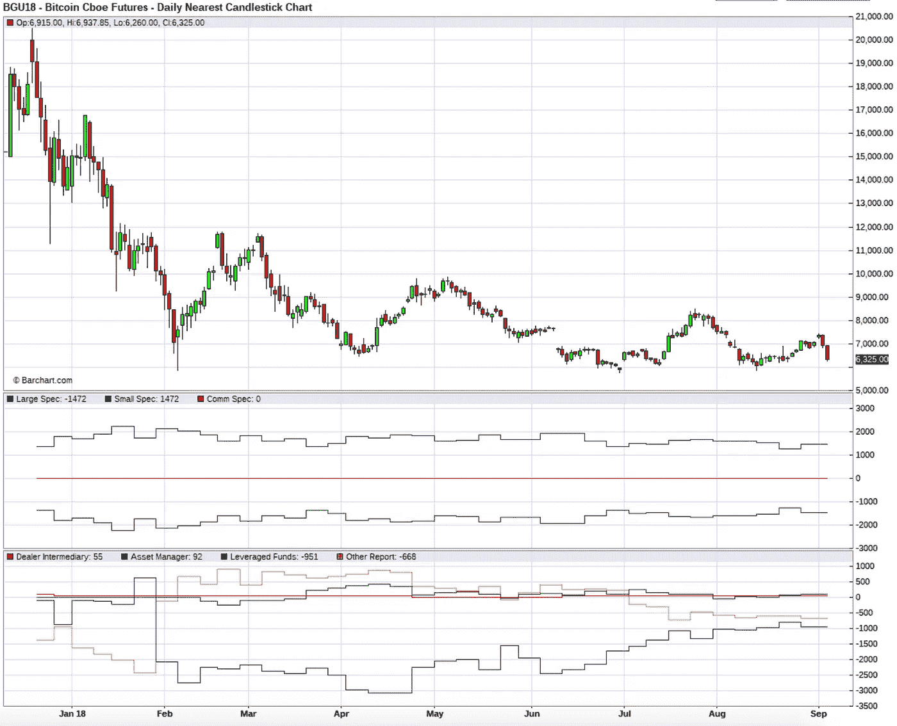

*Source:* [*barchart.com*](https://www.barchart.com/futures/quotes/BG*0/technical-chart?plot=CANDLE&volume=0&data=DN&density=H&pricesOn=1&asPctChange=0&logscale=0&indicators=COTLC;COTFIN&sym=BG*0&grid=1&height=500&studyheight=200)

**为什么它不**

期货交易虽然在增长，但在美国比特币交易量中仍占少数。因此，这些位置代表相对较小的暴露。此外，我们可以看到，它们往往并不那么重要，历史上也没有与价格变化非常相关。最后，比特币奇怪的市场结构——没有真正的商业对冲活动(理论上，这应该是矿工，但实际上并不真正存在)，以及很少有做空现货市场的机制，可能会使这种分析不那么有效。

**分析**

自这个市场创建以来，小投机者一直是净投资者，这或许预示着 BTC 价格将进一步下跌。相对于小规格头寸的历史范围，我们目前接近中间水平，这可能表明他们的看涨情绪有所减弱。

# 估价摘要

对于任何估值方法，总是存在对历史上有效的方法进行优化的危险——市场是动态的，因此随着越来越多的市场利用信号，信号往往会随着时间的推移而变弱。

总的来说，应该记住，我们正处于加密资产估值工具的石器时代，因此所有的估值模型(或我们在这里介绍的模型集合)都应该持怀疑态度。

话虽如此，几乎所有的指标都表明，2018 年的熊市将在未来几个月持续。

# *2。技术*

# 比特币总供应量

截至 2018 年 7 月 30 日，2100 万枚比特币中已发行 1718.6 万枚(最终供应量的 81.8%)。矿工目前的集体奖励是 12.5 比特币，下一次减半将于 2020 年达到 6.25 比特币。以目前的块报酬计算，比特币的年通胀率为 4.12%。

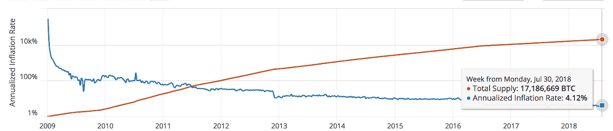

# 闪电

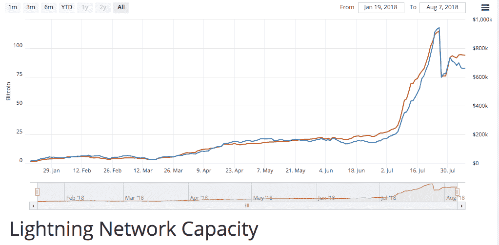

*Lightning Network Capacity. Source:* [*https://bitcoinvisuals.com/ln-capacity*](https://bitcoinvisuals.com/ln-capacity).
*The large increase and subsequent drop was from an* [*experiment*](https://www.shitcoin.com/blog/bitcoin-lightning-network-2-we-must-first-become-the-lightning-network) *run by the founder of Shitcoin.com.*

今年，Lightning 的产能一直在稳步增长，但仍处于玩具阶段，产能仍未达到 100 万美元。

最受欢迎的闪电应用是 [Satoshi 的 place](https://satoshis.place/) ，这是一个数字涂鸦墙，重写一个像素需要花费 1 satoshi，以及 [Lightning Spin](https://www.lightningspin.com/) ，一个赌博应用。([查看 lightning 应用的完整列表](https://dev.lightning.community/lapps/index.html))。

对于任何具有比特币基础知识的开发人员来说，设置 lightning 节点(编译、安装和运行 Lightning Network Daemon，lnd)相当简单，文档似乎也相当不错。然而，维持一个闪电节点作为支付中心是困难的，也是不盈利的。在一次测试中，一个闪电节点为其他用户路由了 260 笔支付，平均每笔交易获利 0.0012 美元。优化这些费用有很大的[空间，但是否存在运行闪电节点的经济激励仍有待观察(即，这是一项好业务吗？)](https://twitter.com/alexbosworth/status/1019985943321706496)

使用闪电支付购买商品和服务确实比使用基础层比特币区块链便宜，但路由错误和钱包漏洞使其目前甚至对技术用户来说都不切实际。

有很多关于闪电的研发活动。值得注意的是[阿历克斯·博斯沃思](https://twitter.com/alexbosworth)一直致力于[潜艇互换](https://github.com/submarineswaps/swaps-service)，这允许用户使用链上代币支付闪电发票付款。这允许某人支付 lightning 发票，即向某人(如朋友或商家)付款，而不必通过利用 Dash 或 Litecoin 等其他协议的跨链交易来设置自己的 lightning 钱包。

# SegWit 领养

SegWit(隔离见证的缩写)是一种协议升级，它改变了区块链数据的存储方式。Segwit 最初旨在解决比特币的可延展性限制，这种限制阻止了更复杂功能的开发，如第二层协议(如闪电)和智能合约。SegWit 的一个附带好处是，它减少了交易的规模，因此比特币区块链可以在不增加交易费用的情况下，每秒钟容纳更多的交易。

截至 8 月初，SegWit 的采用率接近 40%。

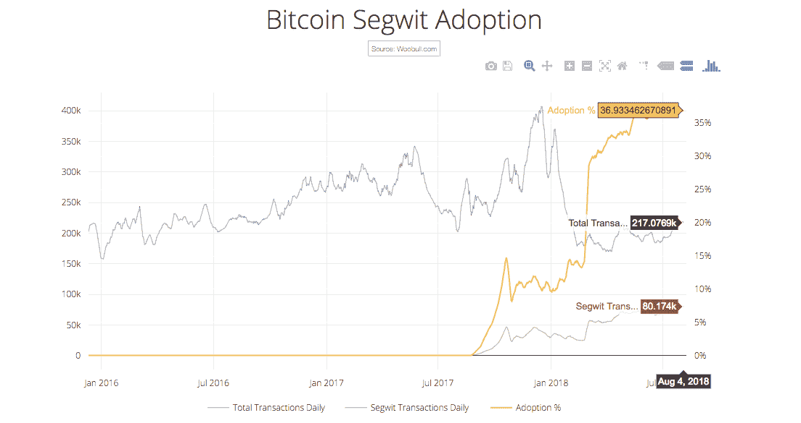

*Bitcoin Segwit Adoption. Source:* [*http://charts.woobull.com/bitcoin-segwit-adoption/*](http://charts.woobull.com/bitcoin-segwit-adoption/)

比特币每天的交易总量在 2017 年 12 月 11 日达到峰值，为 403，134 笔交易。

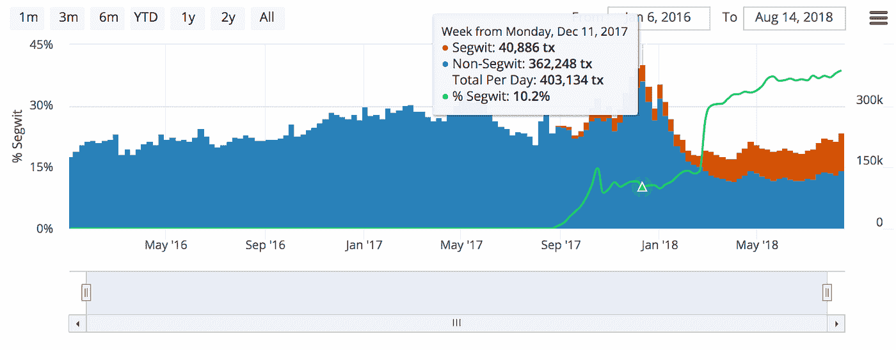

*Source:* [*https://bitcoinvisuals.com/chain-tx-day*](https://bitcoinvisuals.com/chain-tx-day)

截至 8 月 13 日，该网络每天处理 23.5 万笔交易，与 2016 年 10 月的水平大致相同。

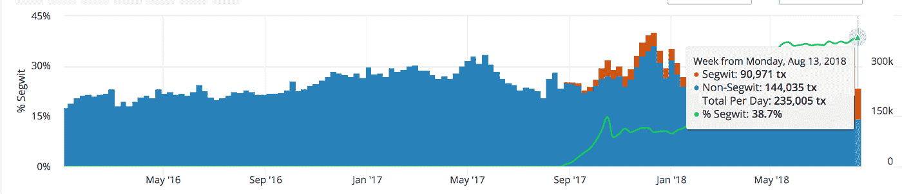

*Source:* [*https://bitcoinvisuals.com/chain-tx-day*](https://bitcoinvisuals.com/chain-tx-day)

# 交易费用

加上网络使用的减少，平均交易费从 12 月份的 50 美元涨到了 0.5 美元。费用中位数从 30.86 美元降至 0.09 美元。

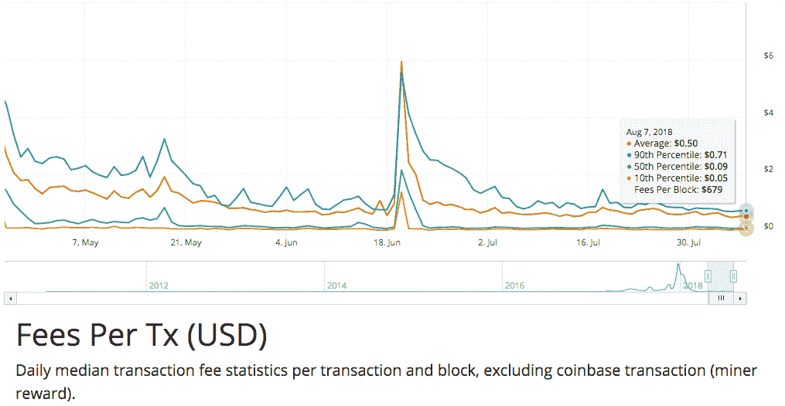

*Fees per Tx (USD). Source:* [*https://bitcoinvisuals.com/chain-fees-tx-usd*](https://bitcoinvisuals.com/chain-fees-tx-usd)*. Daily median transaction fee statistics per transaction and block, excluding coinbase transaction (miner reward).*

# 哈希拉特

即使价格下降，hashrate 也从 2018 年 1 月 1 日的 15 万亿次/秒急剧增加到 2018 年 8 月 11 日的 54 万亿次/秒。

历史上，比特币 hashrate 以每年 300%左右的速度增长。尽管价格下降，但截至 2018 年 8 月，我们已经看到了这一增长。

这对比特币的安全性有好处。截至 2018 年年中，购买足够的计算机和电力来发动 51%的攻击将需要[大约 100 亿美元。这将可能的攻击者限制在一个相当小的民族国家和大公司的范围内。](https://gobitcoin.io/tools/cost-51-attack/)

除非比特币的价格迅速反弹，否则这可能意味着许多在 2017 年看到升值后加入的矿商将变得无利可图。

对于比特币采矿的确切盈亏平衡价格，估计各不相同，但在这一点上，我甚至不会研究它，除非你以低于 0.05 美元/千瓦时的价格获得电力。美国只有少数几个地方有这样的电力供应。

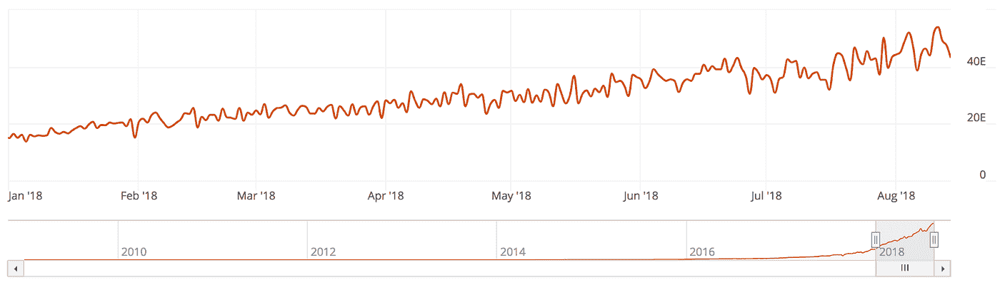

*Source:* [*https://bitcoinvisuals.com/chain-hash-rate*](https://bitcoinvisuals.com/chain-hash-rate)

# 技术总结

比特币在加密资产中是独一无二的，因为在未来五到十年内，它不需要太多的技术来使其成为一种可行的数字黄金。

即使交易费用高达几十美元，它仍然可以作为主权级别的抗审查财富库。当前市场的存在很大程度上是因为它们的抗审查特性，包括黄金市场(est。[、6 万亿美元](https://schiffgold.com/commentaries/just-how-big-is-the-gold-market/)和离岸银行业(美国东部时间。[20 万亿美元](http://www.businessinsider.com/cryptocurrency-value-explained-by-crypto-hedge-fund-cio-ari-paul-2017-11))。

也就是说，Segwit 的采用有意义地增加，随着网络活动的减少，交易费用中位数下降到 0.10 美元以下。

年初至今，衡量比特币安全性和审查阻力的重要指标 Hashrate 上涨了 300%以上。

闪电网络是目前比特币上谈论最多的技术发展，但它可能接近高德纳炒作周期的顶峰。有很多关于可以用它做什么的讨论，但是我们可能至少还需要几年才能看到有意义的采用。

围绕可替代性的长期担忧(因为比特币有限的隐私和假名而不是匿名性，这使得一些硬币可能被认为是“受污染的”)和在没有采矿奖励的未来比特币的稳定性是真实的，但看起来不像是短期担忧。

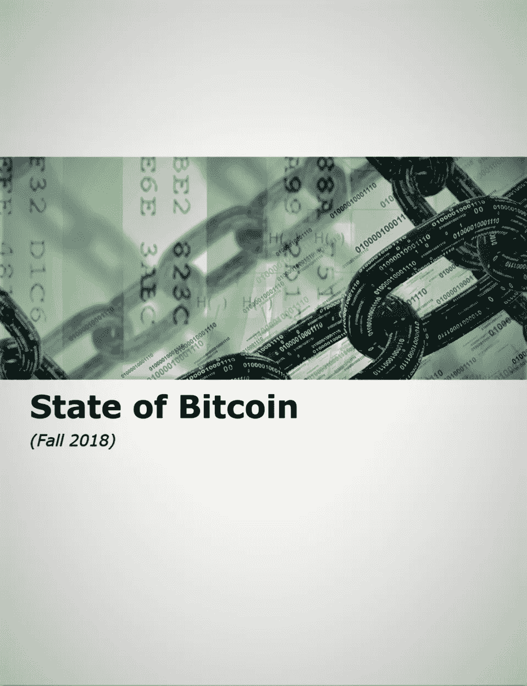

***想稍后阅读更多这份报告吗？***

[***点击这里下载一个格式精美的 PDF 版本。***](https://taylorpearson.me/state-of-bc/)

# 3.法规/法律

## 比特币仍然是一种商品

2015 年，CFTC 裁定，比特币是一种商品，将受他们的监管。今年 3 月，美国地区法官杰克·温斯坦(Jack Weinstein)支持 CFTC 的声明，称该声明得到了“商品”一词的简单含义的支持，CFTC 在解释监管商品的联邦法律方面有很大的回旋余地。

这很好，因为这意味着比特币面临的监管不确定性是所有加密资产中最小的。

## SEC 拒绝文克莱沃斯比特币交易所交易基金

Winklevii 提出了一个 ETF，持有 BTC 通过 Gemini 购买的现货，每份价值 0.01 BTC。SEC 拒绝了这一提议，主要是因为他们认为现货市场有太多的操纵空间。

这在很大程度上是因为市场将完全依赖于双子座交易所的市场，而不是一个更广泛的市场。利用一个交易量和流动性更大的市场可能会改变这一裁决。

## 监管套利将会继续

由于监管要求的提高，交易所转移到了马尔他，币安成了头条新闻。马耳他利用这个机会吸引了更多的区块链创业公司。由于世界各地的监管环境仍然无法明确如何对待比特币和其他加密资产，资本和企业家都可能继续转移到更友好的司法管辖区，以避免越来越多的审查。

瑞士楚格历史上是许多加密项目的所在地，直布罗陀似乎正在开放。尽管这些司法管辖区在监管方面取得了进展并受到青睐，但在许多大型机构愿意参与之前，需要像英国或美国这样的更大市场来澄清他们的监管立场。

## 国际监管机构保持相当中立

尽管一些比特币忠实者认为比特币即将成为储备资产，但国际监管机构似乎并不太担心这种情况会很快发生。

20 国集团金融稳定委员会在 2018 年 3 月表示，他们不认为比特币和其他加密资产对全球市场的稳定构成威胁。

IMF 似乎也保持中立，总裁克里斯蒂娜拉加德(Christine Lagarde)主张采取公平的监管方式，在保护投资者和允许创新之间取得平衡。

# 法规摘要

比特币是加密资产中最受监管的黑/白资产，尽管 ETF 遭到拒绝，该领域的一些公司参与了监管套利，但似乎有非常有利的监管顺风。

# 4.获得曝光的方式

## **概述:**

对于考虑如何获得敞口的投资者，我们将投资工具分为三类:

*   通过传统经纪账户提供的非托管公开上市期权
*   仅限于合格投资者和高净值个人的非托管选项
*   个人监护选项

# 公开上市的期权

## 封闭式基金

许多机构希望通过费用相对较低的公开上市工具持有加密风险敞口:交易所交易基金或封闭式基金，如 gray 的比特币投资信托基金。灰度的 *GBTC* 是为数不多的选择之一，但费用理想上可以更低(目前为 2%)。一个更大的问题是，它的交易价格相对于资产净值的[溢价非常高](https://www.investopedia.com/terms/p/premium_to_nav.asp)，[截至 2018 年 7 月](https://grayscale.co/bitcoin-investment-trust/#market-performance)约为 50%，尽管它的交易价格溢价高达 100%。我们预计，随着更多的竞争进入市场，如 Coinshares 最近上市的比特币 ETN，溢价将会下降。

**优点**

*   在证券交易所公开交易

**缺点**

*   费用
*   相对于资产净值的大幅溢价交易

**谁适合**:

希望使用其 IRA/401k 中的资产进行投资的人，以及希望向客户提供资产但没有可信托管解决方案的机构。(因此溢价——这是这些细分市场获得曝光的唯一途径。)总的来说，如果你能避免支付溢价(暂时避开 GBTC，试试 Coinshares 产品)，那么这是一种相对容易获得的工具。

## 交易所交易基金

美国证券交易委员会最近将对五个比特币相关的交易所交易基金的裁决推迟到 9 月，我接触过的大多数消息来源认为批准的几率为 10-15%。Atlantis Asset Management 首席投资策略师迈克尔·科恩表示，批准意味着“他们正在给(比特币)资产盖上橡皮图章，我认为政府还不想这么做。”

因此，ETF 仍然不是一个选项，尽管这种势头已经存在，而且似乎有可能在未来 12 个月内获得批准。如上所述， [Coinshares 确实成功上市了一个比特币 ETN](https://www.bloomberg.com/news/articles/2018-08-15/lovelorn-u-s-bitcoin-etf-fans-may-find-satisfaction-in-sweden) 。

**优点**

*   熟悉的公开交易工具
*   会比 CEF 更接近资产净值

**缺点**

*   尚不存在或更难购买(Coinshares ETN 有类似于离岸共同基金的居住限制。这不是嘉信理财等一些券商准备监控的事情)
*   在某些方面，比特币的波动性使其更适合主动管理，因此 ETF 可能不是最好的工具。
*   你没有监护权。托管人可能会受到影响，在这种情况下，损失似乎可能会落在 ETF 的持有人身上。

**适合谁:**

相同的各方对 CEF 感兴趣，由于 ETF 相对于 CEF 结构的定价改善，他们的兴趣稍微广泛一些。

## 公开上市的矿业公司和芯片制造商

一些比特币采矿公司是公开交易的，投资这些公司是投资比特币的一种方式。同样在这个阵营的还有芯片厂商。

公开上市的矿业公司包括:

*   360 区块链(CSE:代码)
*   DMG 区块链(TSXV:DMGI)
*   哈希链技术(TSXV:KASH)
*   蜂巢区块链(TSXV:HIVE)
*   海王星破折号

公开上市的芯片制造商包括:

在美国。

*   英伟达
*   超微半导体公司
*   微米

在亚洲

*   TSMC
*   GUC
*   JCET
*   联发科
*   南亚科技

**优点**

*   公开交易

**缺点**

*   你在赌一家特定公司采矿业务的盈利能力。股票价格可能与 BTC 价格弱相关。比特币完全有可能升值，这些公司的股价也完全有可能下跌。
*   这很可能是正确的，因为所有迹象都表明现在进入矿业不是时候。鉴于上面提到的能源价格上涨，大多数矿商需要说 BTC 的价格大幅上涨才能保持盈利。如果矿业增长停止或逆转，这将在整个供应链中受到影响。

**谁适合**:

对于已经对特定采矿作业进行了深入分析，并对在这样一个竞争激烈的领域继续获利的能力感兴趣的人来说，这可能是一个很好的赌注。

# 对于合格投资者和高资产净值人士

## 逐位(以及其他低费用、只做多的基金)

虽然 ETF 还不可用，但已经出现了许多基金，试图为合格投资者提供类似 ETF 的服务。

Bitwise 是过去 12 个月涌现的一系列指数基金中最知名的一只。Bitwise 的主要(也是目前唯一的)产品是 Bitwise HOLD 10，这是一篮子 10 个最大的硬币，占市场的 80%,每月重新平衡一次。

竞争对手

*   [新月密码](https://www.crescentcrypto.com/)
*   潘迪拉的比特币基金

**优点**

*   直接接触硬币
*   索引可以让你对整个空间下赌注，而不需要一个具体的论题
*   非监禁(取决于你如何看待它)
*   没有演出费
*   每周流动性(取决于你如何看待它——在加密中，一周可以发生很多事情)

**缺点**

*   非监禁(可能是专业的，取决于你如何看待它)
*   在前 12 个月，赎回产生 3%的提前支取费用。12 个月后，提现不收任何费用。
*   暴露于“狗屎硬币”(如 XRP)及其带来的风险(监管和其他)

## 积极管理的对冲基金

**优点**

*   通过主动管理从波动中获利的潜力

**缺点**

*   大多数人不知道他们在为运营安全做些什么
*   高性能费用
*   长期锁定

**谁适合**:

投资者希望利用市场的不成熟来获得 alpha，并在这个领域有所投资。鉴于加密市场的不成熟，主动管理对我们来说很有意义。

## 机构监护

出现了许多机构托管解决方案，包括比特币基地托管、北方信托和高盛，它们通过受监管的机构经纪交易商提供托管服务。

**优点**

*   冷藏

**缺点**

*   月度流动性

# 个人监护权

## 比特币基地和其他交易所

个人购买比特币最简单和最常见的方式是通过交易所(比特币基地在美国最受欢迎——尽管其他公司包括 Square、Circle Robinhood 和 Gemini 也在增加市场份额。)

**优点**

*   最佳用户体验
*   可能比那些几乎一无所知的人有更好的安全和监管

**缺点**

*   “不是你的钥匙，也不是你的比特币”——这些都是无记名工具，因此比把股票交给托管人风险大得多。
*   最近几个月，越来越多的问题报告撤回资金(轶事)

**适合谁:**

散户投资者对这个领域了解不多，但希望“投入 100 美元，这样我就能在游戏中有所了解。”

## 硬件钱包

你可以在使用 fiat 的交易所购买比特币，并将其转移到你的硬件钱包中。硬件钱包是存储比特币最安全的选择。硬件钱包(基本上是一个时髦的 u 盘)是一种双重认证的形式。为了窃取你的比特币，黑客需要获得你的密码和设备的物理所有权。由于大多数比特币盗窃都是纯虚拟的，因此拥有一个物理组件可以显著提高安全性。

**优点**

*   “不是你的钥匙也不是你的比特币”——你对比特币拥有完全的控制权。
*   几乎很难破解

**缺点**

*   你需要良好的程序来储存种子
*   更容易失去你的比特币

**适合谁:**

技术上更成熟的散户投资者，具备一些基本的操作安全知识。

# 获得曝光的方式:总结

公开上市的选择仍然有限，现有的选择也有明显的缺陷。这种情况在未来 12 个月内似乎会有所改变，但在未来三个月内可能不会。

在 2017 年的繁荣之后，为合格投资者提供了一些非托管的新选项，HNWI 存在，而且总体上很好，尽管投资者被迫在低费用和很少定制(加权指数基金)或高费用和更多定制(主动管理基金)之间做出选择。

在过去的几年里，个人监护权的选择没有太大的变化，也许是因为现有的选择被普遍认为是非常好的。对于选择自我监管的个人和机构来说，对[运营安全](/@masonic_tweets/minimum-viable-security-32e61d10aee4)的工作理解至关重要。

# 想要将未来的报告发送到您的收件箱吗？

[**在这里注册以获得未来报告的通知，并收到一份精美的 PDF 格式的报告**](https://taylorpearson.me/state-of-bc/) **。**

我们错过的，你希望我们包括的东西？不同意或有反馈？请通过推特([泰勒](https://twitter.com/TaylorPearsonMe)和[加里](https://twitter.com/garybasin))或电子邮件告知我们

*披露:这不是财务建议。我们是做多比特币。*