# 加密货币的状态:2018 年夏季

> 原文：<https://medium.com/hackernoon/state-of-cryptocurrencies-summer-2018-932016549375>

由[亚当·塔奇](https://twitter.com/adam_tache)完成。

# 序

本文将全面概述截至 2018 年夏季的[加密货币](https://hackernoon.com/tagged/cryptocurrency)生态系统的现状。

这包括对当前和即将到来的顶级项目的高级别介绍和讨论:比特币、比特币现金、Chia、Decred、智能合约平台(Ethereum、DFINITY、Cosmos、EOS、Filecoin、Rchain、Tezos、Algorand)、隐私币(Zcash、Monero、Grin/MimbleWimble、Mobilecoin)和 stablecoin 项目(Basis、MakerDAO)。

## 比特币

*概述:* [比特币](https://hackernoon.com/bitcoin-past-and-future-f2feba1f419d)是最初的去中心化、[可编程](https://en.bitcoin.it/wiki/Contract)加密货币和市场领导者，于 2009 年 1 月由匿名开发者使用化名中本聪推出。它主要被称为“声音货币”和数字黄金；支持者认为，它最终可能超越价值储存功能，成为世界储备货币和国际价值标准，其他人则认为它是对不利宏观经济情景的对冲。

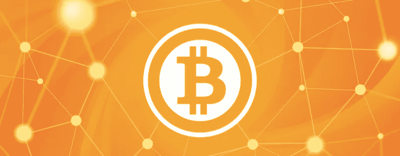

比特币有两个主要组成部分:通过工作证明使用专用芯片解决计算问题的矿工，以及存储[区块链](https://hackernoon.com/tagged/blockchain)并中继和验证矿工建立的交易和区块的完整节点。当前的路线图强调保持块尽可能小，以最大限度地降低对矿工创建的块进行无信任验证的成本，并主要将区块链用作结算层，用于将复杂的上层系统中的任意数量的事务结算到一个系统中。

比特币社区认为，小区块至关重要，可以让所有用户验证交易并执行共识规则，进行更私人的交易，并在 mempool 中建立持续的积压交易，以通过交易费支付矿工安全，因为通货膨胀进一步下降，导致每块新铸造的比特币为零。

比特币人士认为，区块链的杀手级应用已经在这里:一种不可膨胀、反通胀、抗审查、固定供应的资产，任何政府都无法关闭，并且在没有任何可信第三方的情况下，在有史以来最可靠的金融系统上运行。他们将大多数 [alt-coin](https://blog.coinbase.com/ethereum-is-the-forefront-of-digital-currency-5300298f6c75) 创始人和 crypto[VC](http://www.usv.com/blog/fat-protocols)视为[江湖骗子](https://nakamotoinstitute.org/mempool/everyones-a-scammer/) [抽水](https://www.youtube.com/watch?v=2wyC9AEUoYI)数字’[傻瓜黄金](https://www.youtube.com/watch?v=NUyCO3FXHS4)。”

> “社会中任何数量的货币都是‘最优’的。”一旦一种货币被确立，其供应量的增加不会带来任何社会效益。穆雷·罗斯巴德
> 
> “SV 已经对 BTC 失去了耐心，因此转向更闪亮的东西，但 BTC 仍有 99%的价值，是商业崛起的大好机会。”— [李家鼎](https://twitter.com/moneyball/status/928723161352347648)，谷歌前产品总监
> 
> “大多数新加密投资者炒作‘效用假说’的原因是，你无法获得比特币预售的 75%折扣。”— [阿尔琼·巴拉吉](https://twitter.com/arjunblj/status/995343678641246208)

[闪电网络](https://bitcoinmagazine.com/articles/future-bitcoin-what-lightning-could-look/) (LN)是一个使用比特币智能合约构建的无信任支付通道的点对点网络，是一个提议的可扩展性解决方案，可以在不牺牲去中心化的情况下增加交易吞吐量。使用名为 SegWit 的 2017 [更新中的延展性修复，支持支付渠道的智能合同现在更容易实现。](https://bitcoincore.org/en/2016/01/26/segwit-benefits/)

LN 允许任何两个用户从主链打开彼此之间的支付通道，如果付款人和收款人没有打开的直接通道，则使用[散列时间锁合同](https://hackernoon.com/what-are-hashed-timelock-contracts-htlcs-application-in-lightning-network-payment-channels-14437eeb9345)通过其他支付通道路由支付。LN 目前处于测试阶段，已经有超过 2000 个节点和 5000 个频道[开放](https://lnmainnet.gaben.win/)，并且展示微支付潜力的某些 LApps(闪电应用)已经推出，如 [Satoshi 的 Place](https://satoshis.place/) 和 [Poketoshi](https://poketoshi.com/) 。

货币政策:比特币永远只会有 2100 万个。[供给](https://nakamotoinstitute.org/mempool/the-bitcoin-central-banks-perfect-monetary-policy/)是反通胀的，产量大约每四年减半，即 21 万块。最初，每块铸造了 50 个比特币，到 2020 年，这一比率将再次减半，达到每块 6.25 个，预计新比特币的最后一部分将在 2140 年铸造。

## 比特币现金

*概述:*比特币现金是比特币的一个分支，强调增加链上吞吐量，而不是链下吞吐量。[路线图](https://youtu.be/By0w43NQdiY)包括大约每六个月稳步增加块大小，系统目前支持 32 MB 的块大小。这一限制与比特币的 4 MB [块重](/@jimmysong/understanding-segwit-block-size-fd901b87c9d4)限制形成对比，后者导致块大于 2 MB。

比特币现金计划逐步扩大到无限制的块大小，社区不相信普通用户能够负担得起矿工生产的验证块。支持者强调低交易费用，鼓励增加效用的链上应用，并花费和取代 BCH，而不仅仅是 [hodling](https://en.wikipedia.org/wiki/Hodl) 。开发者正在努力支持链上[令牌化](https://coingeek.com/bitcoin-cash-bch-tokenization-contest-5-million-prize/)，包括 ico 和令牌化资产，比如通过[智能合约引擎](https://www.meetup.com/SF-Cryptocurrency-Devs/events/251480208/?_cookie-check=X9YgzmTqpbGeggRK)，以及 [UTXO 承诺](https://www.yours.org/content/first-utxo-commitment-on-testnet-db7bf45bf83d)。

*货币政策:*比特币现金通过硬分叉引入了一种新的难度调整算法(DAA ),与 BTC 相比，该算法增加了约 90，000 个 BCH。它也有 21 米的硬顶。

## 芡欧鼠尾草

*概述:* Chia 是一种即将推出的加密货币，由 [BitTorrent](https://www.bittorrent.com/) 的创始人、 [MojoNation、](https://www.youtube.com/watch?v=r76WIdqjw4s)的前开发者布拉姆·科恩领导，被宣传为比特币的“更好”版本，可以更分散、更安全、更环保。

该网络由存储区块链和中继事务和块的完整节点以及使用[空间证明](https://youtu.be/iqxkO7C-cyk)和[时间证明](https://cyber.stanford.edu/sites/default/files/bramcohen.pdf)的农民(类似于矿工)组成(Bram [认为](https://youtu.be/2Zlcgt8FVz4?t=561)利害关系证明很糟糕，并在利益相关者之间建立了一个“分散的集中系统”，他不喜欢绑定和削减动态)，以利用全球未利用的大规模存储空间，而不是用工作证明来解决高能耗的计算问题。

> “存储是一个年销售额超过 1000 亿美元的行业，利用率约为 50%”

为了证明空间，农民用数据填充硬盘作为他们为挑战分配空间的证据，然后搜索他们最好的空间证明。因为空间的证明不花费(太多)能量，如果仅使用空间的证明，链将容易受到所谓的"[研磨](https://www.youtube.com/watch?v=2Zlcgt8FVz4)"攻击。例如，一个农民可以尝试在创世纪后的几年内重新耕种整个链条，这在理论上是可能的，因为与链条开始时相比，硬盘容量增长迅速。

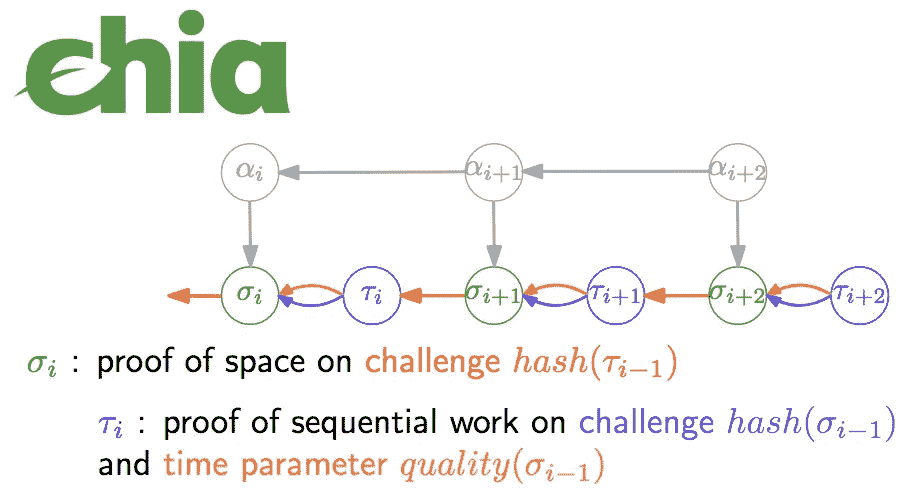

Chia 通过交替使用空间证明(可并行)和时间证明(顺序)来解决主要的研磨攻击。时间证明的正式名称是顺序工作证明，或[可验证延迟算法](https://eurocrypt.iacr.org/2018/Slides/Tuesday/TrackA/01-04.pdf)，是一种特殊类型的工作证明，需要特定次数的迭代，证明已经过了一定量的挂钟时间(迭代次数，而不是实际时间)。因为 VDA 证明了挂钟时间，一个磨工永远也赶不上，因为他们要花两年时间来重写两年的历史。

对于每个区块，农民首先要挑战空间证明，这需要获取最后一个时间证明的散列，并将其随机映射到[0，1]上的点，然后是时间证明，以最终确定该区块。“最佳”或最接近挑战的空间证明点是首先完成，因为完成时间证明所需的迭代次数取决于空间证明的结果。

时间证明输出一个证明，它向验证者证明生成输出花费了一定的时间(迭代)，并且该输出是正确的规范输出(单个正确的输出)。VDA 可能会提供一个 SNARK proof 来加速验证——Chia 将[要求](https://youtu.be/UT0LtMLDJiI?t=972)一个可信的设置；如果发现虚假设置，设置仪式将不得不重新进行，但资金不会有风险，链将正常运行，验证速度较慢。

Chia 将基于比特币代码库，具有闪电网络兼容性，支持 [MAST](https://bitcointechtalk.com/what-is-a-bitcoin-merklized-abstract-syntax-tree-mast-33fdf2da5e2f) 和 [SegWit](https://bitcoincore.org/en/2016/01/26/segwit-benefits/) ，并计划在推出可升级的基于堆栈的 [Chia 脚本](https://www.youtube.com/watch?v=Og52VDU-pjc)之前先从比特币脚本开始，该脚本具有 [BLS](https://en.wikipedia.org/wiki/Boneh%E2%80%93Lynn%E2%80%93Shacham) 签名(而不是 ECDSA 或 Schnorr)和一组新的操作码，包括新的流量控制。布拉姆指出，他是比特币核心路线图的粉丝，希望 Chia 永远不必硬分叉。

*货币政策:* [大多是](https://techcrunch.com/2018/03/28/chia-vs-bitcoin/) [不为公众所知的](https://chia.net/faq/)。迷你上市前。计划向公众、非授权投资者提供股权，可能将其庞大的 pre-mine 部分分配给股东。永久通货膨胀。

# 颁布法令

*概述:* Decred 是一种以混合工作证明和利益证明协议而闻名的加密货币，于 2016 年 12 月推出。Decred 的主要区别因素是其社区驱动的链上治理结构，旨在让股东在[共识](https://blog.decred.org/2016/11/16/Upgrading-Consensus/)和未来系统的硬分叉中有发言权。

> “Decred 的杀手锏是良好的治理，有了良好的治理，你可以拥有任何你想要的功能。”— [占位符](https://www.placeholder.vc/blog/2018/5/12/decred-investment-thesis)

所有用户都能够通过一个利益相关过程参与治理。用户使用 DCR 购买“门票”，这需要在一定时间内(平均约 28 天)将代币的价值锁定在彩票池中，并支付门票费，以激励矿工将购买纳入区块。门票价格由一种类似于赌注难度的算法决定。

每个街区都有一次抽奖，随机抽取五张彩票。获胜的利益相关方需要投票批准采矿者提议的区块有效；要将状态更改记录到区块链，需要五分之三的投票，利益相关方必须在线投票。门票在~142 天或 40，960 块后过期；如果利益相关者从未被随机选择投票，他们将收回他们的初始存款。

这个标桩过程不仅用于对挖掘块的有效性进行投票。获胜的利益相关者也能够对系统的任何改变进行投票。当对网络提出共识规则改变时，有一个 8064 块长(~28 天)的投票窗口。如果超过这个时间，75%的利益相关者投票和 75%的 hash power 信号改变，硬分叉被批准，用户必须更新他们的软件来应用分叉。

作为投票的奖励，每个利益相关者将获得 6%的整体奖励。煤矿工人得到 60%，剩下的 10%留作发展补贴。如果股东拒绝某个区块，PoW 和开发奖励就不会发放。

2018 年颁布的[路线图](https://blog.decred.org/2018/02/28/2018-Decred-Roadmap/)包括闪电网络兼容性，一个名为 [Politeia](https://blog.decred.org/2017/10/25/Politeia/) 的新提案系统，以创建一个带有时间戳的用户提案公共存储库，[去中心化交换](https://blog.decred.org/2018/06/05/A-New-Kind-of-DEX/)，去中心化自治实体，以及可扩展性改进。

货币政策:法令规定了 2100 万硬币的固定供应量。供应计划与比特币的不同之处在于，genesis block 补贴从大约 31.2 个硬币/块开始，补贴每大约 21.33 天减少 100/101。目前有 715 万枚 DCR 代币在流通，其中超过 [45%](https://dcrstats.com/) 被下注。

# 智能合约平台

## 以太坊

*概述:*以太坊是由[维塔利克·布特林](https://davidgerard.co.uk/blockchain/buterins-quantum-quest/)牵头的虚拟计算机。与比特币脚本的图灵不完全智能合约相比，它旨在通过提供更可扩展的([几乎](https://www.youtube.com/watch?v=cGFOKTm_8zk))图灵完全智能合约能力，成为一台“去中心化的世界计算机”。以太坊没有选择 [UTXO](https://www.safaribooksonline.com/library/view/mastering-bitcoin/9781491902639/ch05.html) 型号的币；[代替](https://github.com/ethereum/wiki/wiki/Design-Rationale#accounts-and-not-utxos)，以太坊有账户，有余额的合约。与比特币不同，在比特币中，矿工执行所有交易的成本大致相同，以太坊合约在带宽、存储和计算方面的复杂程度差异很大。出于这个原因，以太坊选择了一种天然气模型，在这种模型中，每笔交易的定价取决于矿工执行合同时消耗的每单位天然气量的成本。矿工能够动态地[调整](https://www.etherchain.org/tools/gasLimitVoting)系统支持的*气体限制*每个区块的某个系数，这类似于比特币中的区块大小。

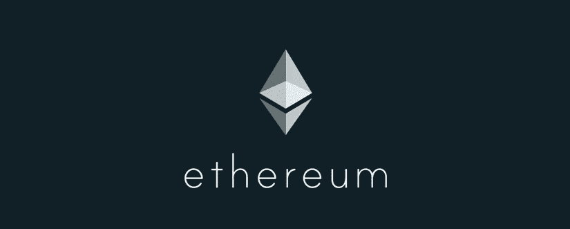

该网络目前由*矿工*、*满节点*、*一*、[T21、*光节点*、](/zkcapital/a-primer-on-ethereum-blockchain-light-clients-f3cadde49137)、*组成。*轻节点依靠全节点实现安全，可以通过从最长的 PoW 链下载块头来验证与用户相关的状态，全节点大多由 go-ethereum (geth)和奇偶校验节点组成。这些提供了完全或“快速/扭曲”同步和修剪模式。完整节点的一个子集是*完全存档节点*，它完全验证所有的矿工区块，执行所有的合同，并存储整个区块链状态。以太坊提供[多种](https://medium.freecodecamp.org/lets-talk-about-the-ethereum-token-standards-you-need-to-know-8af9fcb7e54b)代币标准:平台代币 [ERC-20](https://theethereum.wiki/w/index.php/ERC20_Token_Standard) ，收藏品等不可替代代币 [ERC-721](https://github.com/ethereum/eips/issues/721) 最为突出。

以太坊当前的[路线图](https://github.com/ethereum/wiki/wiki/Sharding-roadmap)包括三个基本的设计变化:分片，一个叫做 Casper 的新共识协议，以及用 eWASM 取代以太坊虚拟机(EVM)。 [eWASM](https://paritytech.io/wasm-smart-contract-development/) 将允许开发人员使用编译成 Wasm (Web Assembly)的高级编程语言编写智能合同，而不是使用以太坊当前类似 JavaScript 的 Solidity 语言。

未来两年以太坊最重要的变化是 [Casper](https://notes.ethereum.org/SCIg8AH5SA-O4C1G1LYZHQ?view) + [分片](https://github.com/ethereum/wiki/wiki/Sharding-FAQ)，这是以太坊的提议，即(大部分)从工作证明切换到利益证明(作为 Casper 的一部分)，并将网络状态分解成一堆称为分片的分区。每个碎片都有独立的状态和事务历史，网络上的所有验证器不会负责处理所有事务；相反，每个碎片中的公证人将对他们自己的碎片负责。跨碎片事务和碎片的碎片都是可能的。有一个[提议](https://ethresear.ch/t/pragmatic-signature-aggregation-with-bls/2105)集成 BLS 签名和 zk-STARKs 进行验证，以提高可伸缩性。

Casper 开发者已经学会了“热爱”微弱的主观性,并致力于通过对验证者的经济处罚威胁(通过拿走存款来打击不诚实的行为者)来模拟 PoW 的安全性，而不是燃烧能量。他们认为有可能设计出一种 PoS 协议，这种协议更加安全、分散，提供更快的阻塞时间、终结性，并且比受物理“限制”的 PoW 更灵活。

以太坊因通过 ico 将有毒投机引入加密货币生态系统而受到比特币创造者的高度批评，并随着时间的推移促进验证的集中化。Vitalik 和其他以太坊开发者[不相信](https://twitter.com/VitalikButerin/status/873177382164848641)为普通用户提供廉价的完全验证节点。

以太坊 dApps 目前的 dau(每日活跃用户)非常少，尽管有成千上万的 dad(每日活跃开发者),其中大多数是 Solidity 开发者，而不是协议开发者。以太坊社区就乐观多了；成员们指出，大多数 dApps 尚未推出，批评早期的区块链缺乏 DAU 是徒劳的，因为他们相信 DADs 是未来 DAUs 的准确预测者，“杀手级应用即将到来”他们对各种当前和即将到来的项目感到兴奋，如[等离子](https://www.youtube.com/watch?v=jTc_2tyT_lY)、[等离子现金](https://www.youtube.com/watch?v=uyuA11PDDHE)、[雷电网络](https://www.youtube.com/watch?v=93qOwUSj4PQ)、广义[国家频道](/spankchain/a-state-channels-adventure-with-counterfactual-rick-part-1-ce68e16252ea)、[链外计算](https://www.youtube.com/watch?v=7uQdEBVu8Sk)、侧链如 [DAppChains](/loom-network/dappchains-scaling-ethereum-dapps-through-sidechains-f99e51fff447) 、[借贷](https://blog.dharma.io/dharma-an-open-protocol-for-generic-tokenized-debt-agreements-9a4e6a4e6fc0)、[游戏](https://funfair.io/)、[金融衍生品](/dydxderivatives/introducing-dydx-2d0f0f326fd)、 [0x](https://0xproject.com/) 和

*货币政策:*确切的货币政策目前不得而知。最终，以太坊被[预期](https://twitter.com/VitalikButerin/status/879858608091144193)要么有每年 0.5%-2%的通货膨胀[率](https://blog.ethereum.org/2016/07/27/inflation-transaction-fees-cryptocurrency-monetary-policy/)，要么有以太的硬上限。Vitalik 最近[提出](https://github.com/ethereum/EIPs/issues/960)一个硬上限，但是 Vlad Zamfir [不同意](https://coinjournal.net/ethereum-vlad-zamfir-ethereum-hard-cap-eip960/)，这个话题正在以太坊研究中争论。以太坊最初是通过一个 ICO 发起的，但被 SEC 认为不是证券。

## 确定性

*概述:* DFINITY 是以太坊“区块链计算机”宝座的竞争对手，计划于 2018 年第四季度推出。工程团队在分布式系统和密码学方面有着丰富的经验，他们的目标是建造一台更高性能、更可扩展、更安全的分布式计算机，最终提供无限的计算能力。

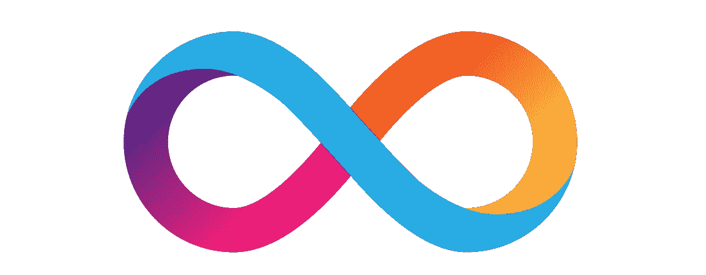

> 的确,“代码即法律”取决于神经系统的决定。BNS 的全能是非常重要的。AI 就是法律。

DFINITY 以其“[区块链神经系统](/dfinity/the-dfinity-blockchain-nervous-system-a5dd1783288e)”治理模型(liquid democracy)而闻名，在该模型中，分布式智能将充当管理和集成协议更改的慈善超级用户。与传统的区块链相比，BNS 的目标是允许快速升级过程，能够在需要时调整经济参数(如下注存款所需的令牌数量)，增加无限令牌的价值，并利用其对令牌所有权的特权控制(包括冻结账户)和执行任意代码的能力，在没有人工干预的情况下减少盗窃(如比特币的 Mt Gox exchange 和以太坊 DAO hacks)。

BNS 将由人类市场过程来引导，在这个过程中，宪法导向的“神经元”可以提出建议并投票支持变革。投票权与定义到 BNS 的存款成正比，神经元可以通过接入神经元的有向信任图来获得奖励和自主投票。BNS 要分析的是提案背后的[道德权威](/dfinity/the-dfinity-blockchain-nervous-system-a5dd1783288e)。

在高层次上，无限区块链建立在分散的随机性信标之上，充当可验证的随机函数(VRF)和可验证的系统心跳。这允许随机性用于共识过程和应用层。该系统由包括矿工的进程网络和 p2p 广播网络组成，该 P2P 广播网络由无限数量的具有永久假名身份的客户端组成。广播网络被组织成随机的组，这些组可以向其他所有人发送消息。Dfinity 是以太坊兼容的；以太坊代码可以在 DFINITY 上运行。

共识机制是门限中继，其中如果某个门限的组成员同意，则通过生成方法为一个组分配一个公钥，以使用 BLS 门限签名来签署消息。产生的签名是使用 VRF 的随机数，可用于选择下一组。这一阈值过程用于区块公证(时间标记和证明发布)，这使得区块时间只有几秒钟，并在两次确认或大约六秒钟后结束。它优先考虑一致性而不是可用性，并消除了自私的开采和无利害关系的问题，因为它具有耐 sybil 的证据，并将用于促进分片和验证塔。碎片充当存储层，接收事务，记录对其本地状态的更新，然后将事务传递给验证塔，验证塔执行合同(用 Solidity 和编译成 [WASM](https://webassembly.org/) 的高级语言编写)并验证事务。

*货币政策:*大部分代币(52.93%)由 DFINITY 基金会、团队和 for partnerships 所有。45.82%的代币在[预售](/dfinity/announcing-the-dfinity-presale-fundraise-and-public-airdrop-cdea19892ef6)时卖给了投资者。其余的(1.25%)通过社区[空投](/dfinity/liftoff-the-dfinity-community-airdrop-is-here-5a11b94a2d03)分发。

## 宇宙

*概述:* Cosmos 是一个即将推出的生态系统，被称为区块链的*互联网，*，它将是一个由独立的、可互操作的区块链组成的网络，分为多个区域。主枢纽是宇宙枢纽，这是一个由原子标记令牌供电的区块链。拥有自己令牌的独立区块链被称为区域，并且可以有任意数量的拥有自己的公共或私有区域的集线器。集线器使用 IBC(区块链间通信)协议连接到区域，该协议允许令牌从一个区域发送到另一个区域。预计宇宙[将于 2018 年发射](https://cosmos.network/roadmap)，据说在其区域内支持每秒数千次交易(tps)。

Cosmos 团队开发了 [Tendermint](https://tendermint.com/) ，他们称之为*通用区块链共识引擎*，并支持点对点八卦协议和传统的拜占庭容错(BFT)共识协议，这些协议允许多达 1/3 的机器出现故障。 [Tendermint](https://tendermint.readthedocs.io/en/master/introduction.html#what-is-tendermint) 将为 Cosmos 的股权证明提供动力，并为开发者提供应用区块链[接口](https://github.com/tendermint/abci) (ABCI)以任何编程语言编写智能合同。

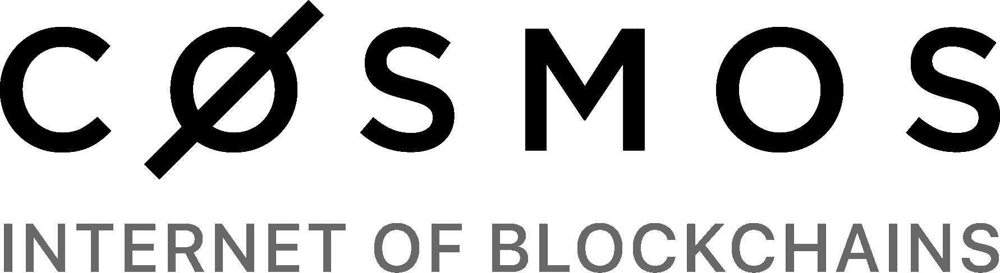

Cosmos 将有一个支付交易令牌，目前称为[光子](https://blog.cosmos.network/cosmos-fee-token-introducing-the-photon-8a62b2f51aa)，将奖励给验证者(绑定原子)，并用于支付接受它的区域的费用。有人提议通过以太坊的[硬勺子](https://blog.cosmos.network/introducing-the-hard-spoon-4a9288d3f0df)将光子分配给以太持有者，这将创建[以太币](https://ethermint.zone/)，一个以太坊镜像账户余额的 PoS EVM 区。

Tendermint [主持](https://blog.cosmos.network/consensus-compare-casper-vs-tendermint-6df154ad56ae)一个弱同步的基于轮次的投票系统，其中[验证者](https://cosmos.network/validators/faq)将原子键作为抵押品，提出区块，发出意向信号，然后签署提交新区块。它需要 2/3 的验证者来提交数据块，优先考虑一致性而不是可用性，并且在完全运行时允许 1-3 秒的终结时间。Tendermint 是一个委托系统，一次只支持 100 个验证者参与。[授权者](https://cosmos.network/resources/delegators)参与共识、监管验证者，并通过佣金率与他们选择的验证者分享收入。

*货币政策:* Cosmos 进行了一次 [ICO](https://blog.cosmos.network/fundraiser-was-a-resounding-success-bf378b96fe00) ，在 BTC 和 ETH 为筹资者[参与者](https://blog.cosmos.network/atom-supply-and-distribution-b4dd3404ff26)募集了超过 60%的初始原子。原子的[膨胀](https://blog.cosmos.network/understanding-inflation-in-cosmos-622651c83303)率将被宇宙中心动态调整到 7%到 21%之间。

## 黎明的女神

*概述:* EOS 是最新推出的通用、图灵-完全智能合约平台，是[丹·拉里默](https://decentralize.today/the-ugly-truth-behind-steemit-1a525f5e156)的第三个区块链。EOS 为了速度和高吞吐量而牺牲了去中心化和审查限制，并利用通货膨胀来支付网络安全费用，以实现用户的零费用支付。它使用拉里默发明的 BFT 委托利益证明(dPoS)模型来达成共识，并将其作为链上治理的一部分。21 假名区块生产者(BP)由持有 EOS 令牌的代表投票选出，并遵守(可演化的)EOS [章程](https://twitter.com/NickSzabo4/status/1008974899690463232)。BPs 还托管一个复制的[存储服务](https://github.com/EOSIO/Documentation/blob/master/EOS.IO%20Storage.pdf)，为令牌持有者使用 IPFS。

阻塞时间大约为半秒，终结时间在两秒内完成，该平台据说可以处理数千个 tps。合同被编译到 WASM，账户是人类可读的用户名，该平台通过账户恢复合作伙伴提供协议级账户恢复。

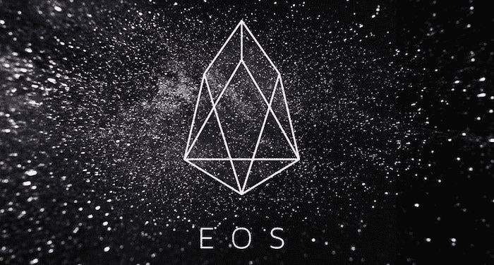

EOS 的启动和选举过程是出了名的混乱；该平台一直受到低投票率的困扰，直到一只拥有超过 5%代币的大鲸鱼投票，该平台第一周崩溃超过五个小时，BPs 已经冻结了 T4 34 个用户账户。尽管启动不顺利，但一些投资者乐观地认为，该项目为需要高吞吐量区块链且没有主权级审查阻力的应用找到了合适的位置。 [Block.one](https://block.one/) 在 EOS ICO 中筹集了超过 40 亿美元，并拥有超过 10 亿美元的生态系统基金来帮助区块链发展。为 EOS 令牌持有者计划了几十次空投。

*货币政策:*代币持有者可以投票决定通胀率；目前的默认利率是每年 5%。

## Filecoin

*概述:* [Filecoin](https://cyber.stanford.edu/sites/default/files/filecoin.bpase-2018.compressed.pdf) 是一个正在进行中的区块链，旨在成为一个去中心化、高效、健壮的存储网络(DSN)，以挑战传统的云平台，如亚马逊 S3、谷歌存储和微软 Azure 云存储。它的目标是通过经济激励扩展到 ZB 和其他地方，允许用户从提供硬盘空间中获利，类似于比特币通过提供哈希速率的激励将安全性扩展到 40 TH/s 以上。它还将支持通用智能合同。

各种平台，如即将推出的个人操作系统和个人服务器 [Urbit](https://urbit.org/) ，已经发现了现代网络的一个挥之不去的问题:你所有的个人数据都存储在集中的私人服务器上，并且这些数据不能保证永远存在。Filecoin 是围绕 [IPFS](https://ipfs.io/) 建立的，这是一种点对点的分布式网络协议，并计划建立桥梁，为其他网络提供文件存储和检索，例如允许以太坊合同使用 Filecoin，以及与比特币和 ZCash 的集成。

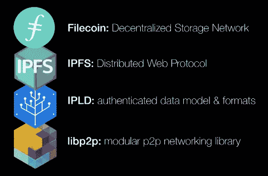

Filecoin 旨在使用 SNARKs 提供一个正式验证的协议和(有状态的)智能合约，以及数据何时存储、数据仍然存储以及参与者可以实际提取数据的证据。诸如复制证明、数据占有和可检索性之类的存储证明将允许证明者向验证者证明数据被存储和复制，并且允许验证者从证明中检索数据以防止扣留。

Filecoin 的目标是促进存储和检索市场的出价和要求，允许价格削减和采矿服务的层次；例如，分层读取访问将允许对不同级别的缓存、放置良好的(物理)节点以及优化的低延迟和高带宽节点给予不同的奖励。Filecoin 计划最初推出纯连锁市场，并在未来发展国有渠道。

这个网络被分成*客户端*(用户)，它们雇佣矿工来存储他们的数据，*矿工*，以及一个*网络*，它组织工作，使用擦除编码(类似于 RAID 阵列)来验证和修复损坏的存储，并根据矿工的*功率*度量来奖励他们使用 Filecoins 的正确行为，该度量衡量矿工提供了多少有用的存储。矿工通过“有用的”工作证明算法来参与共识，该算法通过生成空间时间证明来允许网络审计由矿工超时提供的存储，并且共识将通过使用矿工选举轮次来实现，其中矿工当选的概率与其提供的存储成比例。如果网络中的大多数力量认为时空证明是有效的，它们就会被加入到这个链中。

有些人[怀疑【Filecoin(以及其他区块链存储网络，如](https://blog.dshr.org/2018/06/the-four-most-expensive-words-in.html) [Storj](https://storj.io/storj.pdf) 和 [Sia](https://sia.tech/) )能否与集中式替代方案竞争，原因是速度、访问控制、可靠性、易变和市场 UI/UX 方面的问题。

*货币政策:*将会有有限的 20 亿枚虚拟货币，其中 [70%](https://coinlist.co/assets/index/filecoin_index/Filecoin-Sale-Economics-e3f703f8cd5f644aecd7ae3860ce932064ce014dd60de115d67ff1e9047ffa8e.pdf) 将会被挖掘，并通过一条[更平滑的](/@ryanshea/the-economics-of-filecoin-a8d826774674)指数衰减曲线(与比特币和 ZCash 相比)释放。其余部分将通过一个筹集了 2 . 57 亿美元的 ICO 分发给投资者，以及 Filecoin 基金会和 Protocol Labs(团队)。

## RChain

*概述:* [RChain](https://www.rchain.coop/) 是一个正在开发中的虚拟计算机，旨在成为一个高度可伸缩、并发和高性能的区块链，提供通用的、经过正式验证的图灵完全智能[契约](http://rchain-architecture.readthedocs.io/en/latest/contracts/contract-design.html)，并具有民主的[合作](https://en.wikipedia.org/wiki/Cooperative)治理结构。 [RChain](https://youtu.be/kojlx2ykRsA) 是独一无二的，因为它的[架构](http://rchain-architecture.readthedocs.io/en/latest/)是基于一种叫做 [Rho-Calculus](http://rho.loria.fr/index.html) 的计算模型，而不是具有冯诺依曼架构的机器，比如序列化的以太坊虚拟机。RChain 的目标是支持 40，000–100，000 tps。

Rho-Calculus 支持 4 C:完整性、组合性(用更小的程序制作更大的程序)、[并发性](https://en.wikipedia.org/wiki/Concurrency_(computer_science))和复杂性(能够使用资源测量计算)。RChain contracts 使用并发的功能性 [Rholang](https://github.com/rchain/rchain/tree/master/rholang) 语言进行编程，该语言侧重于消息传递，运行在 Rho 虚拟机(RhoVM)上，并使用 rho-calculus 进行正式建模。合同是为使用 RChain 燃素令牌(类似于以太坊中的气体)支付的，主要的赌注令牌称为 RChain Rev。

网络被分解成节点，每个节点运行 RChain [环境](http://rchain-architecture.readthedocs.io/en/latest/introduction/introduction.html)并相互通信。RhoVM 执行环境运行在 JVM (Java 虚拟机)上，在每个节点上运行多个 rho VM；每个虚拟机执行一个智能契约，该契约并发运行且是多线程的。

RChain 使用类似于 Ethereum 的 Casper 的利害关系证明协议来抵抗 Sybil，而分片(导致多个并行和可同步的区块链可以通过通道进行通信)、并发性和安全性是ρ-calculus 模型的一部分。

货币政策: RChain 通过 ICO 筹集了约 3000 万美元。有 861，185，194 个 RChain 令牌的[固定供应，这些令牌目前是 ERC-20，但将在区块链发布时进行 1:1 转换。团队拥有 30%，20%被烧毁，合作社拥有约 7%。](https://etherscan.io/token/tokenholderchart/0x168296bb09e24a88805cb9c33356536b980d3fc5)

## 泰佐斯

*概述:* [Tezos](https://tezos.com/) 是[期待已久的](https://www.wired.com/story/tezos-blockchain-love-story-horror-story/)区块链，自 [2014](https://tezos.com/static/papers/white_paper.pdf) 开始开发，旨在通过名为 [Michelsen](https://www.michelson-lang.com/) 的基于堆栈的编程语言支持正式验证的智能合约。它被称为“自我修改的加密账本”，这是指利益相关者通过[链上治理](https://www.placeholder.vc/blog/2018/5/12/decred-investment-thesis)机制来“自我升级协议的能力。

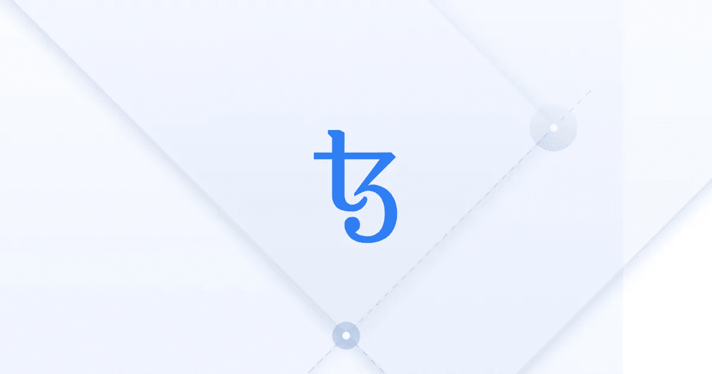

就[网络](/tezos/a-quick-tour-of-the-tezos-code-base-and-the-state-of-its-development-c4e5fcb34b8a)而言，主要组件有:

*   *背书人*(委托人)被要求安全存放债券以获得奖励，并授权给另一个帐户为其烘烤债券并为其生成和签署债券。
*   *节点*中继和验证块和事务，并存储区块链状态。

Tezos 选择不追求[缩放](https://hackernoon.com/scaling-tezo-8de241dd91bd)的分片，尽管他们最初开始时每个区块的气体限制很低，但开发者不相信对所有区块的廉价验证，而是希望缩放到大的区块大小。他们计划最终使用递归 SNARKs，允许用户从零开始同步区块链，并在不到一秒的时间内从 genesis 块验证它；为了做到这一点，每个块将是块内容的 merkle 根的散列，以及状态转换有效的证明(类似于 [Coda](https://codaprotocol.com/static/coda-whitepaper-05-10-2018-0.pdf) 的琥珀区块链设计)。

*货币政策:*每年有 5%的通货膨胀率，最初供应 763，306，930 枚代币，未来有[硬封顶的可能性](/tezos/diff-2014-tezos-2017-tezos-1cb566cca892)。

## 阿尔格兰德

*概述:*[algrand](https://www.algorand.com)是一个即将到来的项目，由麻省理工学院教授和图灵奖获得者[希尔维奥·米卡利](https://people.csail.mit.edu/silvio/)领导，旨在成为一个高度可扩展、抗审查的区块链，具有分区弹性，并在一分钟内实现块终结。一个名为 BA★的新拜占庭协议被用于达成状态转换的共识，而利害关系证明被用于 Sybil 抵抗；用户根据他们的令牌所有权进行加权，一小部分用户(称为委员会)被选择来执行[协议](/algorand/algorands-instant-consensus-protocol-e66ac5807e37)的每个步骤，其他用户对提议的值进行投票。

与 DFINITY 类似， [Algorand](https://www.youtube.com/watch?v=_nQE_HAGlmM) 使用可验证的随机函数(VRF)在协议中使用随机性，并为委员会选择这样做。通过一个称为“加密排序”的过程，每个用户通过抽奖为每个委员会选择自己，并传播他们获胜的证据，以及其他用户确定他们应该接受潜在多个块中的哪个块的优先级。

Algorand 通过在每一步替换参与者来避免对所选参与者的有针对性的攻击，并且只要令牌所有权的 2/3 权重是诚实的，链就具有可忽略的分叉可能性，并保证协议和一致性。与其他 PoS 协议不同，Algorand 不会削减恶意参与者的存款，如果他们为分类帐提出了非法状态。还有一套[领导](https://www.algorand.com/team/)进行项目治理。

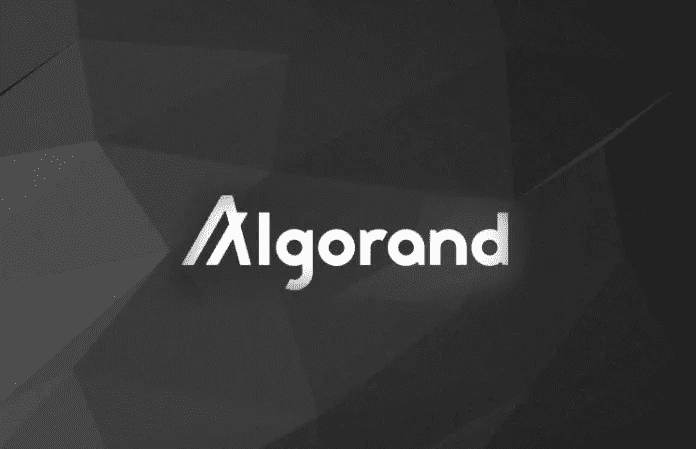

*货币政策:*未知。即将到来的代币销售。

# 隐私币

## Zcash

*概述:*由[佐科](http://twitter.com/zooko)和[其他](https://z.cash/team.html)密码学家于 2016 年创立，Zcash 是 [Zerocash](http://zerocash-project.org/media/pdf/zerocash-extended-20140518.pdf) 协议的一个实现。作为一种以隐私为中心的加密货币，Zcash 是零知识(ZK)加密技术的领导者。Zcash 是第一个使用 zk-SNARKs(简洁的非交互式知识论证，零知识知识证明)的区块链人，ZK-SNARKs 是由团队中的科学家[发明的](http://zerocash-project.org/media/pdf/zerocash-extended-20140518.pdf)。Zcash 是使用比特币代码库构建的，需要一次性的可信多方计算[仪式](https://blog.z.cash/the-design-of-the-ceremony/)来使用[气隙](http://trilema.com/2013/how-to-airgap-a-practical-guide/)计算机生成 SNARKs 的公共参数。

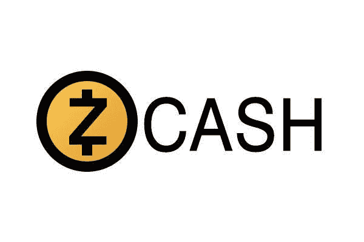

zk-SNARK 证明允许验证器验证完全加密的信息，而验证器不能访问未加密的数据。它们促进了 z 交易，也称为屏蔽交易，其中余额和地址数据对网络是隐藏的。屏蔽交易的发送者构造一个小的证明，该证明目前需要 40 秒来生成，但是可以在几毫秒内被验证。

Zcash 还支持非匿名 t(透明)交易，该交易已被证明通过[可链接性](https://arxiv.org/pdf/1712.01210.pdf)减少了屏蔽交易的匿名性。随着 zk-SNARK 技术速度的提高，预计屏蔽事务的百分比将从目前的约 31.5%的使用率增加。

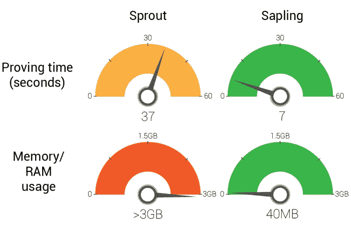

Upcoming upgrade called [Sapling](https://blog.z.cash/cultivating-sapling-faster-zksnarks/) for faster zk-SNARKs, following [Overwinter](https://z.cash/upgrade/overwinter.html).

Zcash 目前使用工作证明，尽管 Zooko 和他的团队似乎愿意转而使用一种可证明安全的替代协议，比如利益证明变体。Zcash 还计划将 zk-SNARKs 升级为一个更具可扩展性、量子安全的零知识变体，称为 [zk-STARKs](https://www.youtube.com/watch?v=VUN35BC11Qw) ，它不需要可信的设置。块时间为 2.5 分钟，最大块大小为 2 MB。

*货币政策:* ZCash 拥有与比特币相同的货币政策(最大 2100 万个硬币)。它于 2016 年底推出，因此仅开采了 410 万枚硬币。所有硬币的 10%将[奖励给 Zcash 公司——创始人、投资者、员工和顾问——来自 block rewards。](/@dhsue/an-analysis-of-zcash-governance-692793f9c9ef)

## 莫内罗

*概述:* Monero 是一种私人加密货币，于 2014 年 4 月由匿名开发者使用笔名 Nicolas van Saberhagen 推出。与 Zcash 不同，Monero 不支持非匿名交易；所有的来源、目的地和金额都是完全模糊的，因此 Monero 代币是可替换的。

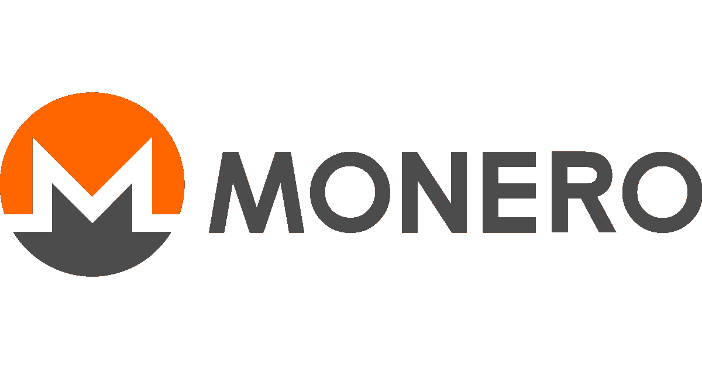

Monero 使用一次性环签名来隐藏发送者，[环保密交易](https://eprint.iacr.org/2015/1098.pdf) (RingCT)来隐藏交易金额，隐藏地址来隐藏接收者，并且有两分钟的阻塞时间。它是使用 [CryptoNote](https://cryptonote.org/whitepaper.pdf) 协议构建的，该协议实现了一个带有增长率上限的[动态块大小](https://monero.stackexchange.com/a/4563)。Monero 是使用工作证明开采的，开发人员正试图通过大约每六个月[改变](https://getmonero.org/2018/02/11/PoW-change-and-key-reuse.html)PoW 算法来实现一个抗 ASIC 的方案。上一次 PoW 变化是在 4 月，哈希率还在恢复中；目前比历史最高水平低了 60%。最新的更新增加了[分类账](https://www.ledgerwallet.com/)硬件钱包支持，并使紧凑块称为[蓬松块](https://monero.stackexchange.com/questions/2633/what-are-fluffy-blocks)默认。

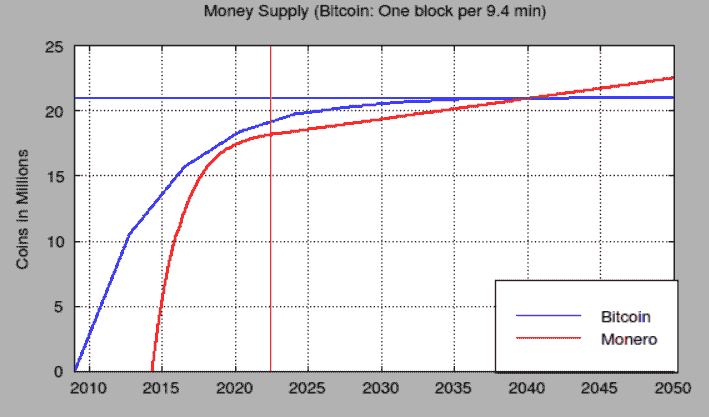

[Source](https://monero.stackexchange.com/questions/1516/comparison-of-monero-and-bitcoin-money-supply-and-block-reward-schedules)

*货币政策:***存在约 1610 万 XMR，主要排放计划将发布约 1840 万 XMR，直到 2022 年。之后，一条“尾部排放”曲线开始出现，每分钟发出 0.3 XMR(每年 157，680)。**

## **研磨和微缩**

***概述:* [MimbleWimble](https://www.youtube.com/watch?v=aHTRlbCaUyM) 是一个基于区块链的大规模可扩展账本的设计[在 2016 年由一位名为](https://download.wpsoftware.net/bitcoin/wizardry/mimblewimble.txt)[汤姆·埃尔维斯·杰杜索](http://fr.harrypotter.wikia.com/wiki/Tom_Jedusor)的匿名工程师将放入比特币 IRC 聊天中。 [Grin](https://grin-tech.org/) 是即将推出的加密货币，是使用 Rust 实现 MimbleWimble。Grin 使用一种被称为[布谷鸟循环](https://github.com/mimblewimble/grin/blob/master/doc/pow/pow.md)的工作验证算法，该算法被认为能够很好地抵抗比特币式的 ASIC 军备竞赛，并且正在由大多数使用其他哈利波特角色名字的假名工程师开发，例如 [Ignotus Peverell](http://harrypotter.wikia.com/wiki/Ignotus_Peverell) 。MimbleWimble 也可以实现为比特币侧链，或者软分叉为扩展块。**

**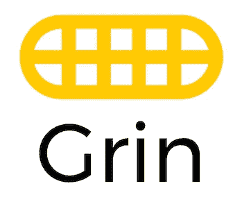**

**MimbleWimble 支持机密交易，通过[同态](https://en.wikipedia.org/wiki/Homomorphic_encryption)加密来加密所有交易数据量，并使用[range proof](https://github.com/mimblewimble/grin/blob/master/doc/rangeproofs.md)来验证有效性，但不支持[脚本](https://en.bitcoin.it/wiki/Script)。相反，椭圆曲线加密的特性被[用于](https://github.com/mimblewimble/grin/blob/master/doc/grin4bitcoiners.md)来实现多重签名交易、原子交换、时间锁定交易和输出，以及闪电网络。**

**有了比特币，加入网络的新验证者必须从起源块同步，并验证每一笔交易都是有效的。[有了 MimbleWimble](https://github.com/mimblewimble/grin/blob/master/doc/grin4bitcoiners.md) ，新的验证器只需要块头、未用完的输出和多余数据(记录输出和输入之间差异的交易数据，以及只为交易中涉及的所有各方创建一个的签名)。交易彼此无法区分；没有地址和金额。**

**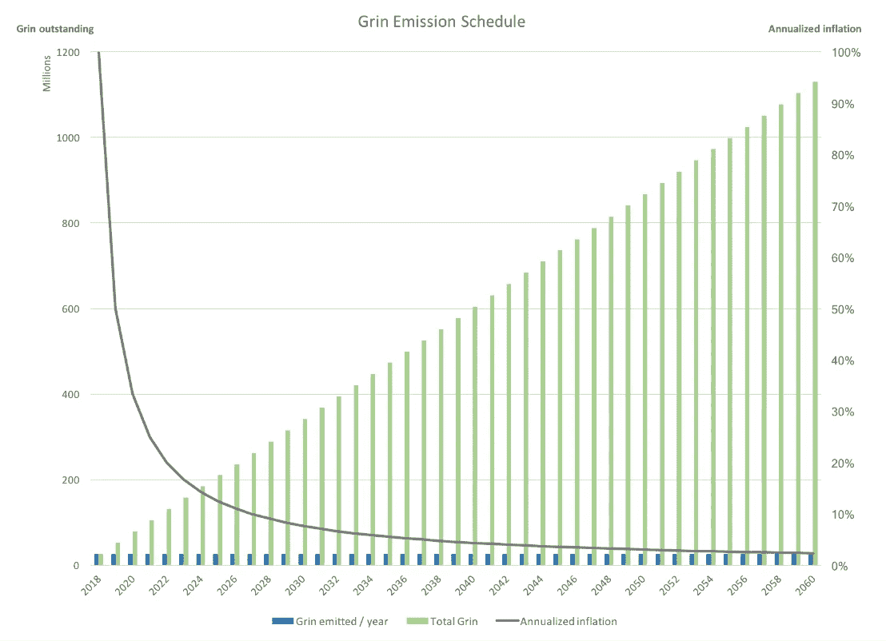**

**[Source](https://twitter.com/nic__carter)**

**货币政策:格林计划[永远每秒钟发行](https://github.com/mimblewimble/docs/wiki/Monetary-Policy)一枚新硬币。目前有一个测试网，硬币计划今年推出。**

## **Mobilecoin**

***概述:* [MobileCoin](https://www.mobilecoin.com/whitepaper-en.pdf) 是一种即将推出的以隐私为中心的加密货币，由 Signal 的创始人[莫邪马林斯派克](https://en.wikipedia.org/wiki/Moxie_Marlinspike)提出。MobileCoin 是移动优先的，因此有前缀*mobile*；这个想法是将 MobileCoin 钱包集成到消息应用程序中，如 Signal、WhatsApp 和 Facebook Messenger，并允许廉价、快速的支付，以及使用 PIN 进行密钥管理和恢复。**

**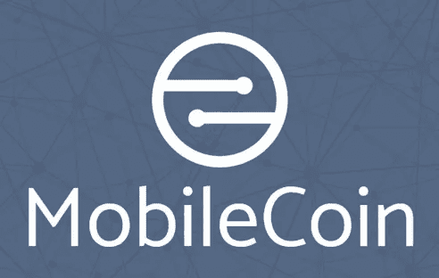**

**MobileCoin 使用 Stellar 的[共识协议](/a-stellar-journey/on-worldwide-consensus-359e9eb3e949) (SCP)，这是一个优先考虑安全的联邦拜占庭协议(FBA)。目标是让一组节点(称为仲裁)获得状态更改的全局共识。节点根据信誉等任意条件选择自己的仲裁子集，称为仲裁片。仲裁片投票使其节点相信任意的语句，并且单个仲裁片可以失败而不会导致整个网络失败。MobileCoin 还使用 [CryptoNote](https://cryptonote.org/whitepaper.pdf) 地址和环签名来实现交易匿名。作为一层安全措施，节点将在 [SGX 安全区域](https://github.com/lsds/spectre-attack-sgx)运行。**

***货币政策:*固定供给。更多细节未知。**

# **稳定的硬币**

**Stablecoins 是试图维持价格稳定的加密货币；大多数国家目前试图将其价格与 1 美元挂钩，但理论上他们可以尝试与任何东西挂钩，如一篮子商品。许多人将功能稳定的硬币描述为加密货币领域的“圣杯”,而其他人则极度怀疑它们是否会在不崩溃的情况下工作。**

**现有加密货币的波动性降低了其作为全球交易和日常货币媒介的潜在用途。人们期望一种功能稳定的硬币能立即用作价值储存手段、交换媒介和记账单位，而不管它的大小和年代。这与常规加密货币不同，常规加密货币需要很长的货币化时间和巨大的市值才能变得相对稳定。**

**存在三种主要的稳定曲线。最常见也可以说是最简单的一种是法定抵押稳定货币，包括 Tether (USDT)和 TrueUSD (TUSD)，并试图与一个法定单位挂钩(如 1 美元)。在假设支持是合法的并定期审计的情况下，法定抵押的稳定债券预计是稳定的。它们高度集中，必然与现有的金融机构和银行联系在一起。**

**另一种稳定币是加密抵押稳定币，一个突出的例子是马可道的戴。加密抵押稳定币试图通过用另一种加密货币(如 ETH)过度抵押稳定币来保持其稳定性，并利用交易机器人来保持所需的挂钩。**

**第三种稳定币是非抵押/算法型的。这些稳定债券没有任何基础抵押品的明确支持；相反，他们的算法实施积极的、自动化的货币政策(即扩张和收缩供应，以保持稳定的货币价格与 1 美元挂钩)。这些系统可以是分散的；然而，如果对整个系统的需求下降得太突然，它们仍然容易受到大规模死亡螺旋的影响。**

## **马克道**

**概述:马克尔道是建立在以太坊区块链上的最著名的分散自治组织之一。他们的核心产品之一是戴稳定币，这是一种“加密抵押”稳定币。**

**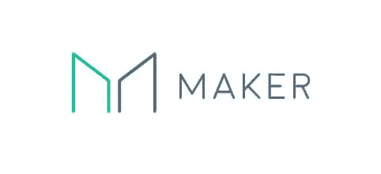**

**该系统由代币和傣代币组成；前者代表系统中的所有权，并允许所有者参与治理决策，后者是实际的稳定币。该系统试图将代币的价值固定在 1 美元，并使用抵押品支持其价值和算法利率调整来稳定其价格。**

**通过修改借款和持有戴的激励机制，人民币汇率得以维持。值得注意的是，DAI 要求至少存入 1.5 倍价值的 ETH，才能获得 1 倍价值的 DAI 稳定存款。该系统是分散的，并使用一系列的甲骨文来提供来自交易所的智能合约价格数据；然而，它需要很高的资本成本，并且很容易受到基础资产黑天鹅价格下跌的影响。**

**当价格低于其目标时，借贷戴的成本变得更高。如果价格上涨超过目标，那么创造新的戴的成本就会降低。这些力量会减少或增加 DAI 的总供应量，确保资产具有低波动性。当相关抵押品的价值大幅下跌时，通过清算抵押债务头寸，DAI 的稳定性也得到了支持。当这种情况发生时，抵押品需要被出售，以弥补其支持的未偿 DAI。**

## **基础**

***概述:* [Basis](https://basis.io/) 是一个稳定的币，预计将于 2018 年推出，已于 2018 年春季从密码领域的各种知名投资者那里筹集了 1.33 亿美元的[资金](/basis-blog/introducing-basis-a-stable-cryptocurrency-with-an-algorithmic-central-bank-7a795393a525)。Basis 称自己是“算法央行”。通过利用由稳定债券(Basis)、债券(Restore Tokens)和股票(Growth Tokens)组成的相对复杂的三令牌系统，Basis 试图利用所谓的算法货币政策将基价固定在 1 美元。**

****

**Basis 将为区块链使用一个待定的 oracle 系统，以持续接收全球加密货币交易所的当前稳定币价。Basis 计划在硬币需求高且价格高于 1.00 美元时扩大稳定硬币的供应，并在需求下降且价格低于 1.00 美元时通过拍卖债券来收缩供应。它承诺当价格回到 1.00 美元时，将向债券持有人返还全额基础稳定币。**

**通过这种方式，Basis 受到了现有中央银行技术的启发，并试图将中央银行行之有效的货币方法与区块链技术的透明度和分散化潜力相结合。基础股提供整个系统的所有权。他们被描述为“就像拥有美联储的一部分”，Basis 系统通常被描述为私人中央银行。每当对稳定币的需求增加，供给扩大时，基础股票就会获得新发行的稳定币。**

**如果 Basis 系统足够大，在全球范围内被用作交换媒介，甚至被广泛接受用于商品和服务，Basis 将能够将稳定的货币与一篮子商品 CPI 指数挂钩，而不是与美元挂钩。**

****

**[3E3EX3kwgXq4j84RELfSaNewAYwUUY3uQ1](https://blockchain.info/address/3E3EX3kwgXq4j84RELfSaNewAYwUUY3uQ1)**