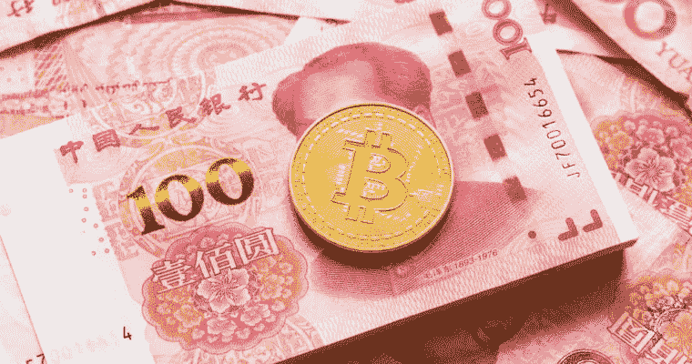
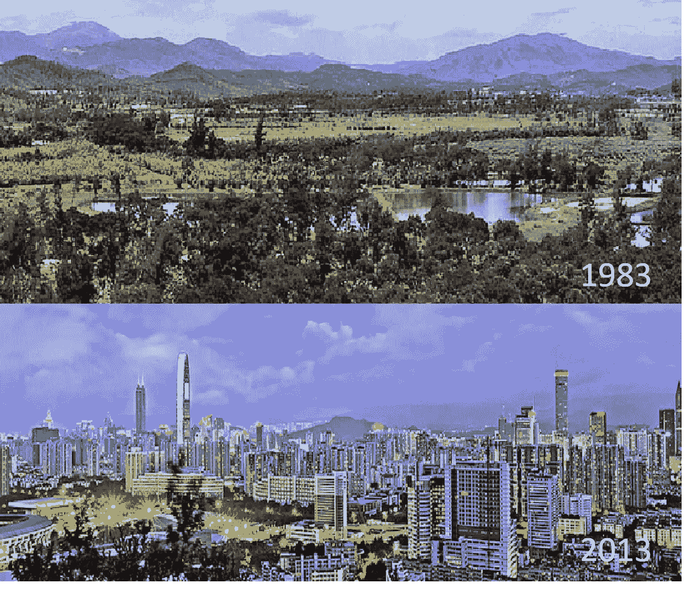

# 使中国成为世界上最大的区块链市场

> 原文：<https://medium.com/hackernoon/state-of-decay-and-opportunity-a-constructive-approach-to-blockchain-development-in-china-a83f3513a58f>

In the Chinese culture, both red and gold symbolize prosperity. But will the shiny golden crypto be accepted here still remains a big question.

尽管中国是世界上审查最严格的加密货币地区，但如今在加密和 T2 区块链 T3 领域已经出现了各种“大牌”。从世界上最大的 crpto 交易所——币安，到快速成长的黑马——Tron，中国与西方同行一起，以同样的严谨和热情直接参与了区块链革命。似乎就像在互联网革命中一样，中国在这场新的变革浪潮中绝不落后。毫无疑问，它拥有世界上最大的市场人口，互联网用户群仍在快速增长。对于许多中国人来说，他们只是刚刚进入互联网带来的便利的黄金时代，没有意识到即将发生的变化与正在发生的变化一样强大。然而，由于审查制度和不支持的政府，人们对中国市场知之甚少。今天，在这篇文章中，我们提出了关于中国密码和区块链空间的最紧迫的问题。

# 背景

正如我看到许多企业家瞄准了世界上最大的市场一样，他们往往会在中国用户群的独特习惯上犯很多错误。最大的错误是 Alibaba.com 打败了易贝——一支文化上更有竞争力的本土球队打败了一个文化上不敏感的外国侵略者。

因此，与我们提出的问题同样重要的是中国用户群独特的文化背景。如果这篇文章有任何意义的话，它是基于对普通中国人在谈到区块链和加密货币等新技术时来自哪里的透彻理解。让我们从钱开始，因为这是中国人最关心的，比你想象的还要多。

# “给我钱”

中国的经济现实与大多数西方国家大相径庭。众所周知，自 70 年代经济开放以来，中国经历了 40 多年令人瞩目的经济增长，社会繁荣和福祉普遍提高。尽管中国经济的成功已经成为纪录片和新闻中的陈词滥调，但许多人忽视了与经济变革同时发生的重要文化心态。比表面的经济统计数据更有影响力的是文化心理学的变化。

Shenzhen, the flagship city of China’s economic leap, is often the go-to example when it comes to the sheer enormity of China’s change over the past decades.

鉴于众所周知的经济增长，因此人们普遍错误地认为中国人已经从贫困状态一夜暴富。像西方国家一样，中国人在享受了资本主义社会的好处后，也接受了西方的消费主义心态。此外，中国文化已经从共产主义时期典型的集体主义现实主义模式转变为西方典型的更加文明和民主的模式。说到例子，就要提到像深圳这样的经济奇迹。

善意的信息，严重出错。就像易贝在中国所做的一样，这些误解落入了这句老话的陷阱:

> 就像你认为你知道一些事情一样，你什么也不知道。

记住这一课，你就准备好进入一个中国人的思维了。

# 几乎太快了

大多数人没有意识到中国市场对更多东西的渴望。这有几种形式。

如果要对 40 年增长期的短暂历史做一个简短的描述，那很可能是**【资本主义繁荣的开端】**。这与美国不同，美国自 19 世纪后期以来就通过资本主义实现了工业化——中国只尝到了资本主义市场的甜蜜果实几十年，而西方国家则是几个世纪。想象一下文艺复兴和工业革命同时发生，但只是在中国，而且仅仅四十多年。

这种快速的社会经济变化的结果是**大规模的物质文化与激烈的竞争相结合。每个人都想变得富有，并在经济好转时快速变得富有。许多人仍然刚刚意识到市场中巨大的资本主义机会。人们想在互联网空间快速赚钱，并欢迎每一个使他们的新财富成为可能的机会。**

然而，这伴随着来自千年文化保守主义的反对力量。

# 机会主义但保守

不像自由主义者坚信一个更好的世界需要分散的技术，中国的密码爱好者基本上来自投机背景。他们有着共同的信念，即“区块链技术在已经成熟的互联网市场中是不必要的”，“加密货币只是我快速赚钱的一种方式”，以及“只要有利润，我为什么需要关心新技术的发展？”所有这些都公正地反映了上述经济现实，它塑造了强调机会主义社会的唯物主义文化心态。

如果你走在中国的大街上，真的问人们对比特币等加密货币的去中心化性质有何看法，答案很可能是“这是多余的”。然而，重要的是要注意，这种答案背后的原因不是人们对货币或经济的性质有基本的了解，而是这也是政府的意见。

> 如果它没有得到当局的批准，又有什么用呢？

**作为儒家文化的传人，中国人重视“和谐”甚于“冲突”，重视“纪律”甚于“创造”，重视“传统”甚于“革命”。**因此，当区块链技术的“革命”旗帜开始进入中国时，怀疑取代了勤奋的研究，这并不奇怪。毫不夸张地说，就新技术而言，中国传统上是最后进入的。

那么如何调和这一切呢？我们在中国拥有世界上最大的市场。我们已经看到了互联网时代的成功。然而，我们有一种根深蒂固的文化心态，它告诫新事物，但欢迎经济增长。区块链用什么方法从中获利？

# 不要革命，只是让它变得更好

根据我在中国参加几十个区块链会议的经验，我得出一个结论，区块链最大的问题是它的高准入水平。当谈到比特币的时候，它还可以，但当谈到除了钱以外的东西时，这项技术很快就耗尽了人们的兴趣。

当互联网和个人电脑首次登陆中国时，易用性掩盖了复杂的后台工作。我认为这正是中国市场希望看到的。**我经常用一个蹒跚学步的孩子来比喻中国不断增长的经济——它增长如此之快，对任何事情的注意力持续时间都很短，所以只要造一些易于使用的东西，看看它是否喜欢就行了。**

你有没有想过为什么我们没有像 Bitcointalk.org 或 Reddit 这样的论坛，在那里可以对区块链的发展进行真正有意义的讨论？这就是答案。

所以现在大问题来了。

**中国市场的哪个领域特别需要区块链的帮助？**

如果说中国市场从比特币背后的复杂技术中学到了什么，那就是消除中间商。据我们所知，这是全面降低成本的部分。说到省钱，中国市场很喜欢。

因此，这是我对任何试图进入中国市场的区块链初创公司的一般建议:**找一个消除中间商最省钱的地方。**

这里我举一个例子。还记得我说过的中国的物质文化吗？竞争异常激烈。通常在西方，有一家公司主导着整个领域。脸书、Twitter 和 Snapchat 都覆盖了不同的领域。然而在中国，一个市场被许多公司瓜分。说到博客，我们有新浪微博，腾讯微博。说到知识分享网站，我们有知乎和豆瓣。在某些领域，有十几个平台在争夺一个市场。他们吸引用户的方式，当然是更多的用户福利。平台让利越多，他们作为中间人收取的费用越少，获取的用户就越多。

这种血腥竞争的结果是，无论用户有多少平台选择，他们都会抱怨存在的中间商费用。根据我的研究，大多数社交媒体平台从用户获得的金钱回报中抽取 40-60%。

现在，我想举一个具体的例子来说明我的意思:移动流媒体服务，用户正在为高昂的交易费用而挣扎。在这个领域，竞争比大多数都激烈。十几个应用程序争夺一个利基市场。用户没有太多的选择，因为他们都收取不合理的费用。综上所述，这是我认为最棒的机会。如果有一个基于区块链的支持免费小额支付的应用，通过适当的营销，它将主导市场。不要说是基于什么新技术，就把自己标榜为“免佣金”。结果会显示出来。

这就是我所说的建设性方法。

在过去的两年中，加密价格经历了难以置信的上涨，然而区块链社区增长缓慢。如果我们想更多地采用我们认为会给我们带来更美好未来的技术，我们需要更有建设性的、用户友好的方法。就中国而言，我希望这篇文章能让我们明白，即使在监管环境不支持的情况下，我们仍然可以推广这种做法。