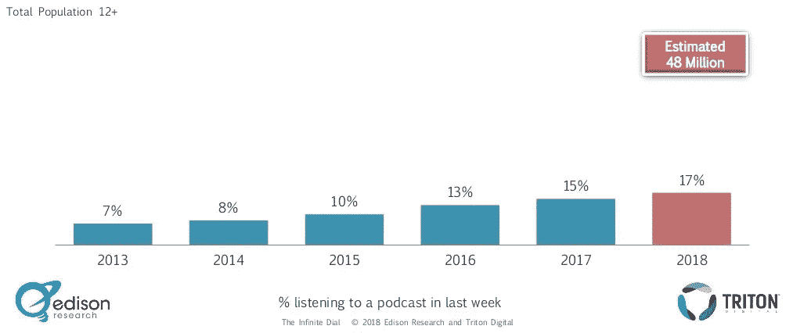
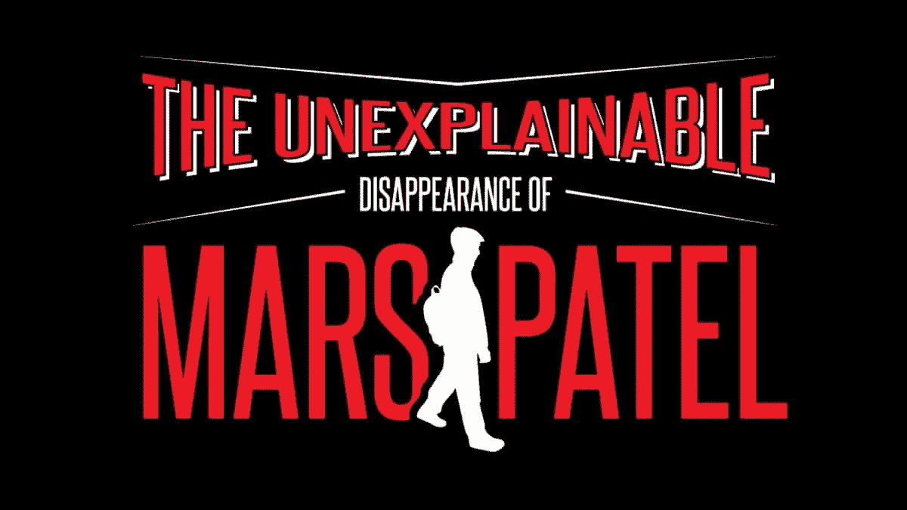
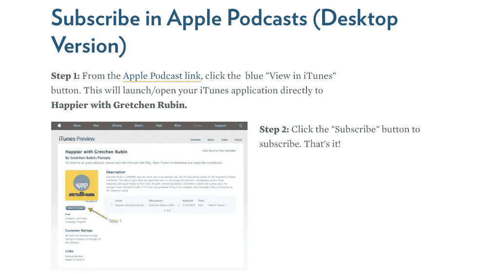
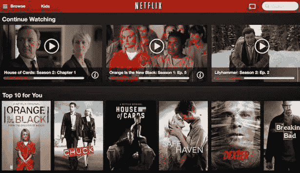
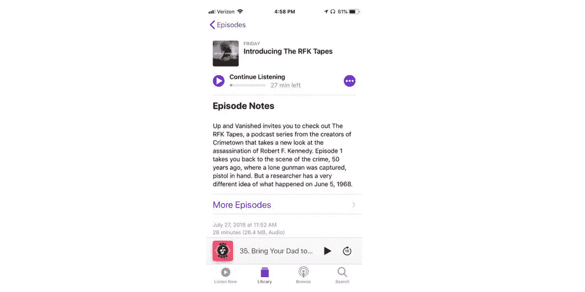
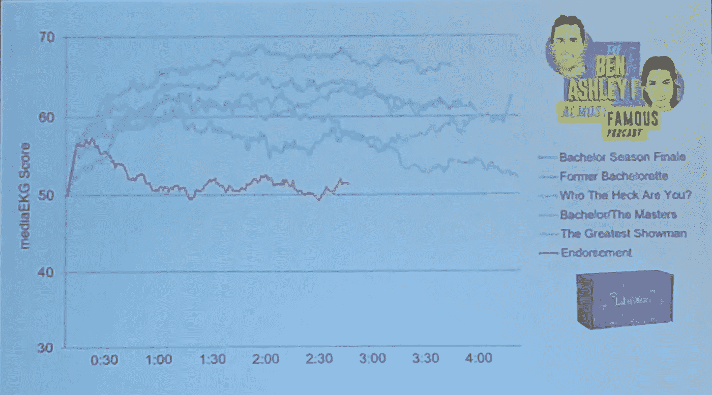
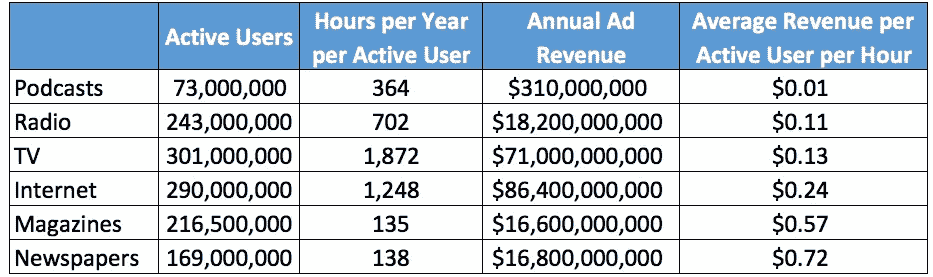
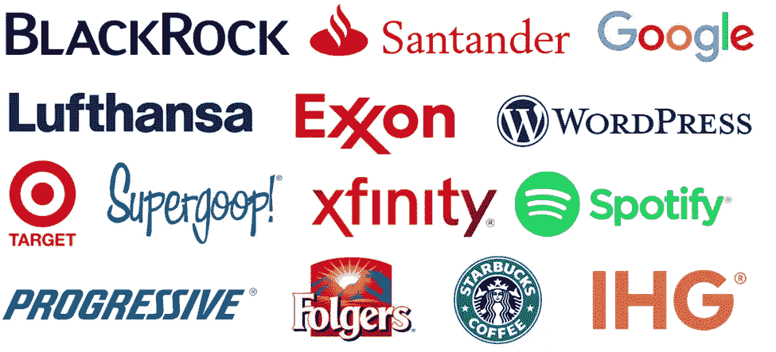
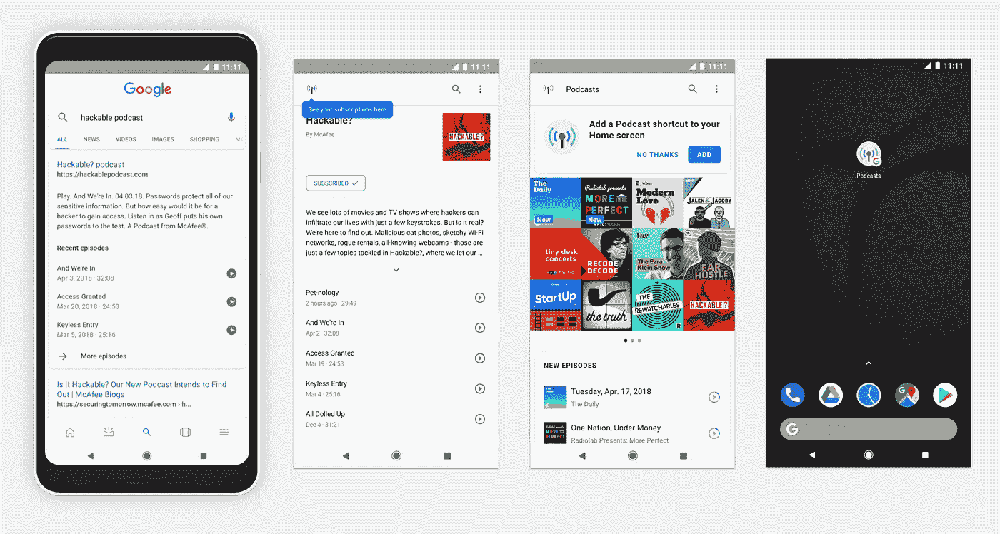
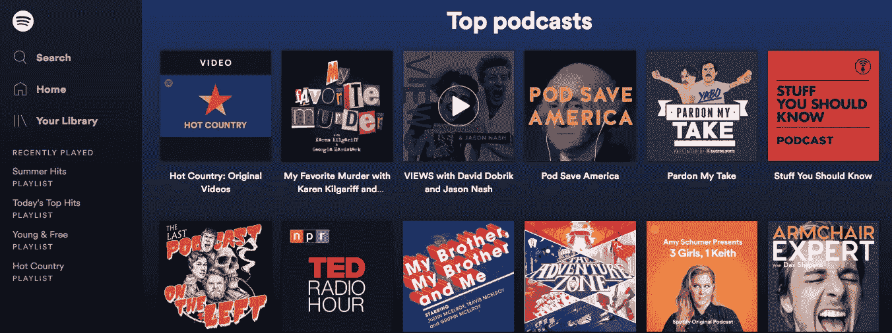

# 2018 年播客现状:播客运动对货币化、多样性和发现的启示

> 原文：<https://medium.com/hackernoon/state-of-podcasts-2018-takeaways-from-podcast-movement-on-monetization-diversity-and-discovery-eea7ccd0eed2>

上周我们在费城参加了播客运动，这是播客行业最大的年度会议。我们是播客的忠实粉丝，很高兴看到会议从 2014 年的数百名与会者(T2 的 Kickstarter 预算为 3.2 万美元)增长到今天的 2500 多名与会者。这次活动汇集了播客和播客公司(Gimlet，Panoply)，科技公司(Spotify，Google)，媒体公司(NPR，Buzzfeed)，甚至消费品牌(闭幕式由 Jack Daniel's 赞助！).

在过去的十年中，美国报告上个月收听播客的人口比例从 9%增长到 26%，这是一个显著的飞跃(在[爱迪生研究](http://www.edisonresearch.com/infinite-dial-2018/)阅读更多数据)。仅在苹果播客应用程序上就有超过 50 万个活跃的播客，每周都有 1 万个新节目创建。然而，播客广告市场的规模远低于这一消费者吸引力水平，2017 年仅为 3.14 亿美元。

今年的播客运动重点关注如何缩小这一货币化差距，同时也涵盖了播客的多样性、吸引年轻听众以及科技行业如何促进播客的创作和发现等主题。以下是我们从此次活动中获得的五个要点。

播客的受众越来越多，但在听众人数和多样性方面还有很长的路要走。

爱迪生研究公司的 [2018 年“无限拨号”调查](http://www.edisonresearch.com/infinite-dial-2018/)发现，只有 17%的受访者报告在最近一周收听了播客。虽然这一比例一直在稳步上升，但我们并没有看到听众人数的指数级增长，即使播客创作在过去几年中出现了爆炸式增长。如何抓住并吸引“另外 83%”的问题是今年会议的主题。我们对播客社区需要欢迎的一些人口统计数据的想法:

*   女人和有色人种。大多数播客的早期采用者是富裕的白人男性，服务于更广泛的受众继续成为[的一个挑战](https://www.wired.com/2015/08/podcast-discovery-vs-diversity/)。这个问题是 Podcast Movement 的核心问题(也是[一个主题会议](https://podcastmovement.com/conference-schedule/#/event/the-key-to-inclusivity-when-it-comes-to-inclusion-the-personal-is-universal)的焦点)——但一些与会者批评会议没有在非多元化小组中有更广泛的代表性。这里我们不会假装有所有的答案，但是我们相信[网络](https://www.cjr.org/the_feature/podcasts-diversity.php)和广播公司需要对雇佣和保留更加多样化的主持人、推广他们的内容和邀请更加多样化的嘉宾参加他们的节目负责。

*   *小孩。得益于像 NPR 的《Wow in the World》和《WHYY’s Eleanor Amplified》这样的节目，儿童播客已经开始起飞。随着父母试图减少屏幕时间，播客是娱乐和教育孩子的好方法。 [Kids Listen](http://www.kidslisten.org/) 最近进行了儿童播客收听习惯的[首次研究](http://docs.wixstatic.com/ugd/10c540_8056b16c7caa47b091ca25a5cc426176.pdf)，发现 80%的人一集听一遍以上，18%的人听十遍以上(！).74%的人在听完播客后开始讨论，56%的人告诉其他人他们学到了什么。孩子们显然喜欢播客，但许多父母很难找到合适的内容，特别是因为苹果的播客应用程序除了为学龄前儿童提供故事外，还为青少年提供戏剧。这是为 18 岁以下人群策划和分类内容的大好机会。*

One of our favorite kids’s podcasts is *The Unexplainable Disappearance of Mars Patel*, produced by Gen Z Media. The show was [optioned for TV](https://deadline.com/2017/07/the-unexplainable-disappearance-of-mars-patel-podcast-tv-series-anonymous-content-paramount-tv-1202135926/) by Anonymous Content and Paramount TV.

*   “休闲娱乐”的粉丝爱迪生研究公司对非听众进行了一项调查，以了解他们为什么没有尝试过播客，78%的人说播客“不适合我”——许多人说它们太长、太有教育意义，或者没有涵盖他们感兴趣的话题。我们需要更多的播客给那些寻找“罪恶快感”的人，比如单身汉 T2、名人新闻、体育内容和情景喜剧。正如爱迪生研究公司的汤姆·韦伯斯特在他的主题演讲中指出的，苹果的“排行榜”并没有给这个行业带来任何好处，因为它被每日新闻节目、政治分析和对信息内容的深度挖掘所主导。播客不仅仅是为那些认为自己是“知识分子”的人准备的，这个行业需要推广其他类型的内容。

发现仍然是一个主要问题。

播客发展的另一个限制因素？访问内容时的摩擦。爱迪生的研究发现，48%的非听众不知道如何访问播客，47%的人说订阅播客需要花钱，80%的人说他们的手机上没有播客应用程序(尽管事实上许多人的 iPhone 上预装了苹果应用程序)。对于以前没有听过播客的人来说，知道如何找到它们可能很难——这不像打开电视或收音机那么容易。

此外，65%的受访者表示，他们被内容的数量淹没了，不知道如何找到感兴趣的东西。许多播客只在其他播客上做广告，因此错过了不是播客听众但可能对他们的内容感兴趣的整个市场。为什么真实犯罪播客不应该向观看犯罪电视节目的脸书用户做广告？当用户点击广告时，他或她可以被引导到如何收听的指南，解决访问和内容发现问题。一个很好的例子是[*与格雷琴·鲁宾*](https://gretchenrubin.com/podcasts/) *【的同名主持人相处得更愉快——鲁宾在成为播客之前是一位畅销书作家，她在一些读书会的座位上留下说明页，向与会者展示如何订阅她的播客。*

Rubin also includes a step-by-step guide on how to subscribe to her podcast across platforms (Desktop, iPhone, Android, etc.) on [her website](https://gretchenrubin.com/podcast-subscription-instructions/).

公平地说，播客收听应用也应该为糟糕的内容发现承担责任。即使你是播客迷，也很难找到新的节目来听。除非你经常在网上搜索新发布的内容或者浏览苹果排行榜，否则你很可能会错过你喜欢的内容。我们已经尝试了很多播客应用程序，但令人震惊的是，没有一个能根据我们已经喜欢的节目为新内容提供好的推荐。随着时间的推移，继续提供相关内容是留住听众的关键，所以我们很高兴与任何致力于这个问题的人交谈。

There’s no reason why podcast apps shouldn’t have Netflix or Spotify-style recommendations or even auto-playlists based on what you’ve already listened to. [*Photo courtesy of TweakTown*](https://www.tweaktown.com/news/37841/netflix-eyes-new-navigation-scheme-for-the-future/index.html).

即使对于老牌播客创作者来说，发现问题也是一大难题，比如[马克·斯默林](https://en.wikipedia.org/wiki/Marc_Smerling) ( *犯罪城，RFK 录音带)。斯梅林说节目的交叉推广(通过另一个节目做广告)是“建立观众群的最快、最有效的方式。”鉴于苹果播客应用程序中播客的数量，斯梅林说，如果没有协调一致的交叉推广努力，即使是高质量的节目也很容易“迷失”。这种观点得到了《工作原理》总裁康纳尔·伯恩的认同。)的广告印象来推广他们的每个新节目——即使每分钟 15 美元，这也相当于 25 万美元以上的广告活动。*

This is a standard example of a cross-promotion ad — Up and Vanished is promoting the RFK Tapes in its feed through airing its first episode. This is a somewhat controversial practice among listeners (who might not want another “random” show in their feed), but given hurdles in discovery, it is still one of the most reliable ways to build an audience.

**播客上的广告通常比其他形式的媒体更受欢迎。**

根据 IAB 最新的[播客广告收入研究](https://www.iab.com/wp-content/uploads/2018/06/2018_IAB_Podcast_Ad_Rev_Study_vFinal.pdf)，绝大多数播客广告(67%)是由主持人发布的。另外 32.5%是由单独的播音员发送的——这通常发生在新闻机构不允许记者阅读广告的时候。只有 0.5%的广告是由广告商提供的，这是你通常会在电视、广播甚至 YouTube 视频上看到或听到的广告类型。

这对广告商来说太棒了。主持人阅读的广告通常比其他类型的广告更具娱乐性，更令人难忘，也更难“跳过”，原因如下:

*   **每个广告都不一样。传统广告最令人讨厌的一点是，你反复看到和听到同样的广告，所以即使是最好的广告也会很快变质。很多播客主持人每集都会录制新的广告，所以你很少会听到同一个广告两次。你可能会在多个节目中听到同一家公司的广告，但每个主持人可能会有不同的选择。**
*   主持人融入个人趣闻。听众通常把播客主持人视为朋友和导师，并重视他们的意见。个人轶事可能很有影响力。一个很好的例子是——《真实犯罪档案》的主持人之一 Lisa Zambetti 向听众讲述了她在家中使用染发剂时的挣扎。她现在正在用麦迪逊里德公司的色彩工具包染她的头发(“西耶娜红”)，并让听众了解这一过程。

Gimlet’s Sandra, another great fiction podcast, starred Alia Shawkat and Kristen Wiig (an increasingly common example of Hollywood to podcast talent crossover), and was notable for its fairly natural incorporation of ads into the story. The show was also [recently acquired](https://variety.com/2018/tv/news/sandra-podcast-tv-series-paul-lee-gimlet-1202801182/) to be developed as a premium television series.

Gimlet 的脚本内容总监米米·安东内尔在该网络最近的人工智能/技术聚焦小说节目[中把广告带到了一个新的水平——广告几乎融入了故事情节。安东内尔说，节目创作者实际上“喜欢”制作广告的机会，因为他们在如何将广告放入播客中有更多的发言权，因此可以让听众了解故事的世界。](https://www.gimletmedia.com/sandra)

*   **播客是伟大的故事讲述者。**最好的主持人能把广告变成有趣或难忘的瞬间，围绕广告内容创造故事。当马特·古利的节目 [*我也在那里*](https://www.earwolf.com/show/i-was-there-too/) 被添加到 Stitcher Premium 时(广告被移除)，粉丝们在 Twitter 上要求将广告添加回来，因为它们是该节目中最有趣的部分。

One of the best ever podcast ads, in our opinion.

Coleman Insights 在《单身汉》的不同部分做了一项关于听众亲和力的研究。听众被要求转动一个转盘，表示他们对播客内容的满意程度(Coleman 称之为“媒体 EKG”)。他们发现，一旦听众意识到这是一个代言，EKG 的得分就会在 FabFitFun 盒子的近三分钟长的广告开始时立即下降。然而，在广告结束时，分数几乎恢复到了实际播客内容的水平——听众评论说，他们喜欢听主持人的滑稽表演，或者他们学到了关于产品的一些新东西。

Coleman Insights’s Media EKG for the *Almost Famous podcast showed that a three-minute ad (pink line on graph) performed surprisingly close in terms of listener sentiment to the actual podcast content (blue lines on graph). Please excuse our somewhat blurry photo!*

然而，由于多种原因，货币化滞后于观众的增长。

根据尼尔森的数据，每月有超过 7300 万人收听播客，每年有超过 150 亿集被下载。3.14 亿美元的年度广告收入绝对不算少，相对于其他类型的媒体也是如此。利用尼尔森的数据，我们计算了美国不同类型媒体的每位消费者每小时的广告收入，发现播客的平均盈利仅为每位听众每小时 1 美分。

这比紧随其后的竞争对手 radio 低 10 倍以上。鉴于播客广告特别有效，这种差异令人困惑，如上所述——尼尔森的一项研究发现，前滚动播客广告增加了 10.8%的购买意愿，略高于视频广告的 10.3%。播客的听众往往是年轻的、城市的和富裕的，这是对广告商有吸引力的人群。Panoply 提供的苹果分析数据显示，不管节目持续时间长短，普通听众完成一集的 85-95 %,因此前滚动和中间滚动广告都应该有非常高的完成率。

那么，为什么播客在盈利方面如此落后呢？品牌似乎在适当的水平上评估播客广告——CPMs(每千次展示的成本)通常在 25 美元到 50 美元之间，实际上随着更多听众数据的可用而增加。主要的问题似乎是，据估计只有 15%的播客能够赚钱，现有的广告标准没有考虑到许多节目的“常青树”性质。以下是一些起作用的因素:

*   主导平台没有货币化。 通过替代播客平台(Stitcher、Pocket Casts 等。)已经成长，苹果[仍然拥有](https://powerpresspodcast.com/2017/06/14/podcast-statistics-ns-2017/) 55%的播客市场份额。在 YouTube 上，品牌可以通过 TrueView 程序轻松投放广告，而在苹果播客上赚钱要复杂得多。品牌和播客必须直接连接，通常是通过网络。大多数网络只会接收月下载量超过 5 万的播客，这是一个非常难达到的基准。Radio Public 推出了一个付费收听平台来部分解决这个问题——在 Radio Public 上发布的任何节目的任何收听者都可以保证获得 20 美元的 CPM。
*   关于听众的详细数据现在才变得可用。 可以理解的是，品牌需要受众和投资回报率的数据，才愿意将部分营销预算分配给相对较新的媒体。苹果播客对数据的保密是出了名的——它刚刚在 2017 年 12 月开启了一项分析功能的测试版，该功能仍然提供关于听众、设备和每次会话收听时间的基本数据。像 Panoply 的[扩音器瞄准 Marketplac](https://megaphone.fm/) e 这样的项目，允许动态瞄准听众群体，以及[尼尔森研究](http://www.nielsen.com/us/en/insights/reports/2018/nielsen-podcast-insights-q1-2018.html)显示显著的品牌提升将帮助品牌获得信心——但这需要时间。

Some of the major brands working with Panoply on the launch of itsMegaphone Targeted Marketplace for podcast ads.

*   *缺乏连贯的广告标准，对“倾听”的衡量不一致(有时甚至不公平)*到目前为止，品牌和播客还没有真正一致的方法来衡量品牌活动的 KPI，因为每个人对一些问题都有不同的答案，比如:“下载算听吗？”和“什么是一个听的可接受的时间范围来货币化？”互动广告局(IAB)最近发布了一套[指导方针](https://www.iab.com/guidelines/podcast-measurement-guidelines/)，这将大大有助于解决这些不一致——大多数播客网络计划在 2018 年之前采用它们。动态广告市场的持续发展(广告不是永久地放在节目中，而是可以随着时间的推移被删除和替换)也应该有助于解决这些问题。

> “很明显，除非我们有一个设定的标准，否则品牌会说，‘我们不明白，我们不确定数字是否正确，在电视或脸书上花费会更容易些。’是 V2，我们都必须上那辆巴士，不管有没有短期的不适。"
> 
> -广告结果媒体公司(全球最大的播客广告购买者)首席执行官马歇尔·威廉斯

对于“常青树”节目来说尤其如此，比如连续剧*，即使在第一季发布三年后，它仍继续获得巨大的月下载量。像这样的节目中的广告应该与特定时间的播客区别对待，如 NYT 的 *The Daily* ，后者可能在 24 或 48 小时的时间段内获得每集的大部分下载。*

*除了直接回应广告(占播客收入的 73%)，我们预计品牌内容和知识产权许可将成为越来越大的收入来源。第一个品牌节目之一是 GE 与 Panoply 合作制作的科幻播客*。通用电气团队对这些内容非常满意，他们要求去掉通用电气的广告，因为它们打断了节目的流程。Gimlet 在品牌内容领域也很积极，与万事达卡( [*《财富》青睐大胆的*](https://www.mastercard.us/en-us/consumers/fortune-favors-the-bold.html) )、易贝(*)和 Tinder([*【DTR】*](http://creative.gimletmedia.com/shows/dtr/))等达成了协议，但品牌合作伙伴关系副总裁安娜·沙利文(Anna Sullivan)表示，这笔钱仍然主要来自品牌的营销实验预算，“不可持续或不可扩展”***

**在知识产权许可方面，Gimlet 已经成立了 Gimlet Pictures 向好莱坞出售节目，目前有七个项目正在开发中。沙利文说，好莱坞对播客新知识产权的渴望是“非常出人意料的”上周，由茱莉亚·罗伯茨执导的改编自吉姆莱特的《返校节》的预告片在亚马逊上架。Byrne 同意这个观点:“我相信洛杉矶已经被投资了。当我听到“播客是新的剧本”这样的口号时，我相信了，人们认为在大屏幕上播放音频甚至比文本更好。”**

**Amazon has been an early adopter in translating podcasts to TV— aside from the upcoming Homecoming show, they also adapted Aaron Mahnke’s Lore into a [two-season show](https://www.amazon.com/Lore-Season-1/dp/B074N8Y95X).**

**科技公司开始投资播客。**

**苹果长期以来一直被批评基本上忽视了播客市场——苹果播客应用程序极难导航，分析有限，而且如前所述，没有内置的货币化。虽然苹果的听力应用程序长期以来一直主导着市场，但谷歌现在正在大力推动在该领域占据更大的份额。谷歌[在六月中旬发布了安卓播客应用](https://www.wired.com/story/google-podcasts-app-hands-on/),总理扎克·雷诺-韦丁在播客运动上发表了关于科技巨头进军该领域的主题演讲。**

**目前的应用程序集成了搜索和助手，为听众提供个性化的节目推荐，并允许他们轻松地在各种设备上开始和停止播放。为什么是现在？Reneau-Wedeen 说，他的团队已经注意到“播客的数量、质量和多样性已经真正起飞”，并相信谷歌有能力应对分类和管理内容的挑战。谷歌的目标是将全球播客听众人数增加一倍，该公司已经推出了一个播客创建程序，以帮助培训和放大不同播客的声音。**

****

**Screengrabs of Google’s new podcasts app, courtesy of [Lifehacker](https://lifehacker.com/how-to-use-googles-new-podcast-player-1825479269).**

**又一家科技公司在这一领域有所动作？据报道，Spotify[花费 100 万美元](http://www.vulture.com/2018/05/amy-schumer-spotify-podcast-deal.html)获得了艾米·舒默新播客的独家发行权。该公司全球播客合作负责人 Dossie McCraw 不愿证实这一数字，但评论说，100 万美元可以说是一笔从一线明星那里获得独家内容的“好交易”。**

**Spotify 的支出不仅限于舒默的新节目。McCraw 指出，该公司在过去一年里投入了“越来越多的钱”来让消费者意识到 Spotify 上播客的存在。这些营销活动似乎已经奏效——根据 Libsyn 的数据，Spotify 现在是世界上第二大最受欢迎的播客收听平台，占 6.8%的收听量。面对来自 Pandora、Apple Music、iHeartRadio 和许多其他公司的音乐流的激烈竞争，Spotify 通过强大的播客产品脱颖而出是有意义的。**

****

**Spotify’s app has now has a dedicated “Podcasting” section.**

**感谢阅读我们对播客的看法！如果你对我们更多的播客相关内容感兴趣，可以看看我们去年发布的五集系列文章，总结了播客的空间、历史、收听统计、以及产业扩张需要做的事情。**

**我们热爱我们在播客运动的时光，并建议任何对播客感兴趣的人去看看明年在奥兰多举行的[会议。即使只是一个粉丝，这也是一个在现实生活中见到你最喜欢的播客的好机会(我们](https://www.eventbrite.com/e/podcast-movement-2019-registration-48288793080)[见到了几个](https://twitter.com/venturetwins/status/1022548970223136770)！)**

****如果你正在播客领域建立一家公司，或者对本文有任何想法或反馈，请给我们发邮件至 twins@crv.com，或者在 Twitter 上发邮件至**[**@ venture twins**](https://twitter.com/venturetwins)**。****