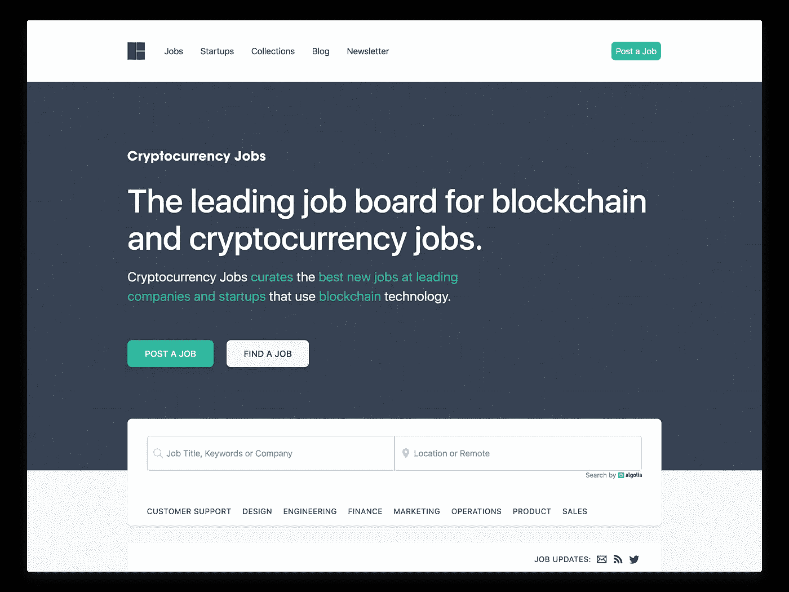

# 2018 年区块链和加密货币就业市场的状况

> 原文：<https://medium.com/hackernoon/state-of-the-blockchain-and-cryptocurrency-job-market-in-2018-aa3c0b58451f>

在加密货币就业一周年之后，我在 Twitter 上发布了一条关于区块链和加密货币就业市场状况的[帖子。这篇文章是那个帖子的修改版本。](https://twitter.com/jobsincrypto/status/1055528680699686913)

1/尽管价格正从历史高点回落，但区块链和加密工作的需求很大。需求实际上在增长。这似乎表明人们对技术和生态系统感兴趣，而不仅仅是价格。

2/自推出以来，[加密货币职位](https://cryptocurrencyjobs.co/)已经在 **1100 个**区块链和 **400 多家**公司和初创公司的加密货币职位中亮相，遍布 100 多个城市和 50 多个国家。

3/跨角色分配的工作:

*   客户支持:8%
*   设计:6%
*   工程:47%
*   营销:10.5%
*   运营:12%
*   其他(金融、产品):11%
*   销售额:5.5%

4/最受欢迎的技术角色:

[区块链工程师](https://cryptocurrencyjobs.co/blockchain-engineer/)、 [dApp 和智能合约开发者](https://cryptocurrencyjobs.co/smart-contracts/)、[协议工程师](https://cryptocurrencyjobs.co/protocol-engineer/)、 [Solidity 开发者](https://cryptocurrencyjobs.co/solidity/)等类似。

由于供应有限，这些角色通常是最难填补的。如果你是一名[开发人员](https://cryptocurrencyjobs.co/developer/)或[工程师](https://cryptocurrencyjobs.co/engineer/)，你的需求量很大。

5/最受欢迎的非技术角色:

[客户支持](https://cryptocurrencyjobs.co/customer-support/)和[社区经理](https://cryptocurrencyjobs.co/community-manager/)角色。

社区经理的崛起很有意思。应聘者有时会误解这个职位的性质，认为它是一份入门级的社交媒体类型的工作。同样，一些公司似乎让社区经理成为一个囊括多种责任的头衔，这一角色失去了价值。

If you’re interested in learning more about community, you should read [Why Crypto Community Building Matters](https://tokeneconomy.co/why-crypto-community-building-matters-b604b83c813c) and [The Playbook for Crypto Community Building](/provably-neutral/the-playbook-for-crypto-community-building-d065802b8e3f) by [medium.com](https://medium.com/u/55f8de7afe95#建造#运输！</h3>
<div class=) 

**4。网络**

**5。写入**

**6。冷邮件**

15 对雇用公司的说明。

[入门级](https://cryptocurrencyjobs.co/entry-level/)和[实习](https://cryptocurrencyjobs.co/internship/)角色太少。随着高等教育中加密的兴起，年轻、有创造力和才华的个人申请人越来越多。打开你的大门，你会得到回报。

16/让我们谈谈多样性。

鉴于比特币旨在挑战我们社会中一些最强大的机构，或许我们也应该挑战我们雇佣和建立团队的方式。如果建设这个新未来的创业公司和公司是平等和多样化的，那不是很好吗？

一个很好的起点是回顾你的工作描述。通读这条[线索](https://twitter.com/JohnONolan/status/997569165824176128)，了解如何让它们更具包容性。

考虑接触[隐女](https://twitter.com/crypto_chicks)、[区块链多样性](https://twitter.com/DivinBlockchain)、 [she256](https://twitter.com/SHE_256) 、[区块链女性](https://twitter.com/WiBlockchain)等群体。

17/作为一个旁注，这里有一个伟大的[区块链/加密事件的女性发言人名单](https://docs.google.com/spreadsheets/u/2/d/e/2PACX-1vSaa3O5rCCgsko7w11UmHm31U4-7DM7dhvqmjGHlIYu2f54JFI1Ol3Z0XzbKna-XfxwJow_EwahP7PY/pubhtml?ref=cryptocurrencyjobs.co)。

18 最后，谢谢你。

感谢你对加密货币工作的支持，特别是所有与我们合作的初创公司和公司。

如果你想雇佣，我们可以帮你！

在 [Twitter](https://twitter.com/jobsincrypto) 上关注加密货币职位，订阅我们的时事通讯了解[职位更新](https://cryptocurrencyjobs.co/newsletter/)。

*如果你喜欢这篇文章，请点击👏好让其他人也能看到。*