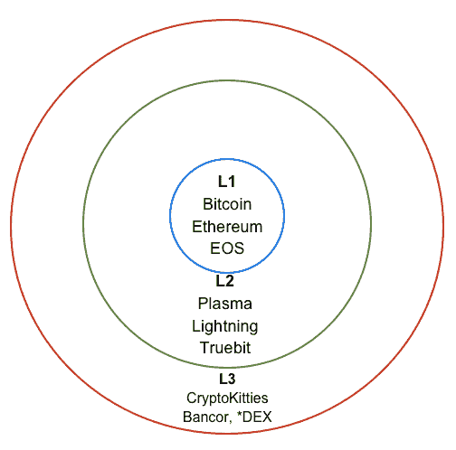
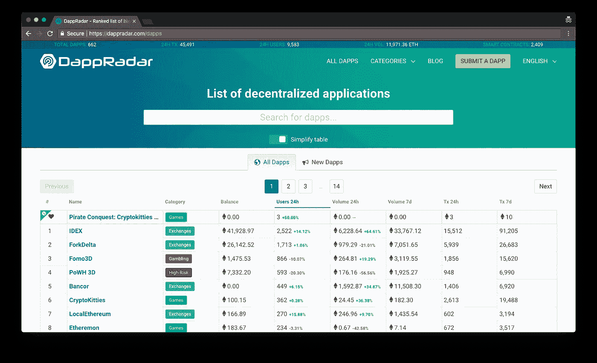
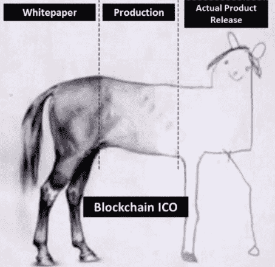
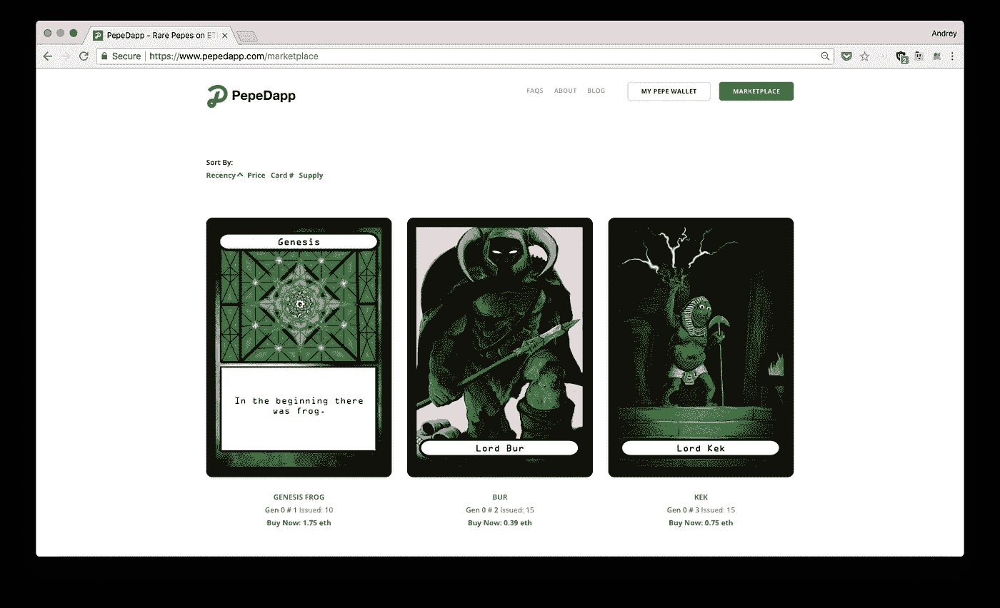
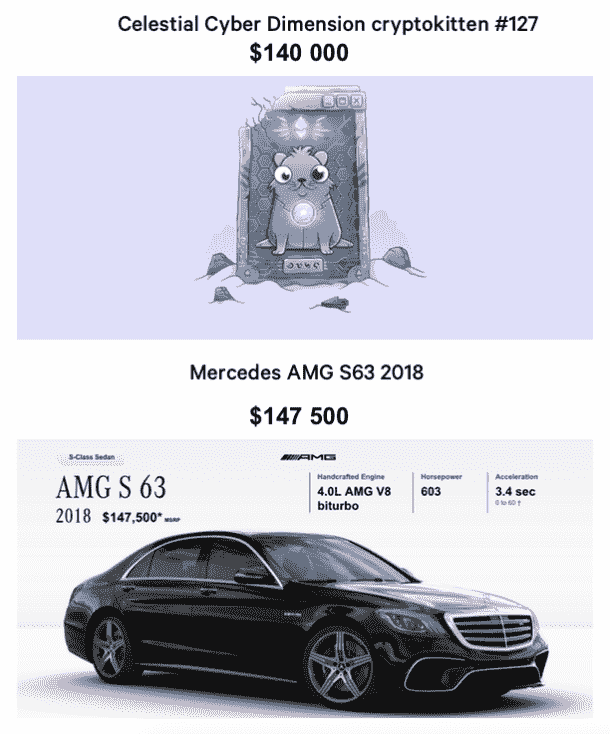

# dApps 的状态(提示:太早了)

> 原文：<https://medium.com/hackernoon/state-of-the-dapps-hint-way-too-early-cb9bdcbb5a67>

去年的秘密歇斯底里有所减缓。

比特币的价格经历了一次大规模的调整，从 19000 美元到 7000 美元，而许多 ICO 项目已经无声无息: [92%的 ICO 失败了](https://www.bloomberg.com/news/articles/2018-06-28/crypto-coin-graveyard-fills-up-fast-as-icos-meet-their-demise)或者被证明是一个骗局，剩下的 8%中，许多人将会跟进。

简单来说，这意味着那些只为钱而参与其中的人已经转移到其他地方去诈骗人们。

好消息是，现在这些蛇油推销员都走了。铁杆开发者继续慢慢构建去中心化的世界，让超比特币化更接近现实。所以，今天，我想谈谈去中心化应用程序(又名 DApps)。

先说一些题目的背景。

【DApps 和普通 app 有什么区别？

为了简单起见，让我们假设一个分散的应用程序由运行在区块链上的*前端代码*(用任何编程语言编写)和*分散代码*组成。

目前，DApps 需要浏览器(Toshi，Brave)或浏览器扩展(即 Metamask)来负责存储私钥和身份管理，从而在注册过程中去除了额外的步骤。根据最新数据， [95%的去中心化应用](https://twitter.com/BlockGeekDima/status/1006604452604899335)在以太坊区块链上工作。因此，我们可以假设:

> **DApp =前端代码+以太智能合约。**

让我们想象一下，整个生态系统分为三层:

*   第一层— **区块链**(比特币、以太坊、EOS 等)。
*   第 2 层— **协议**构建在 L1 之上—(即基础设施协议，如等离子、分片、闪电、Truebit 等)。
*   第 3 层— **以某种方式使用分散组件的应用程序**和服务。

**那么，DApps 是怎么回事？**

关于 DApps 及其用法的数据，我们可以查看一些来源。DAppradar 是最受欢迎的 DApp 统计网站之一。还有很多其他的比如[app.co](https://app.co/)([backed by block stack](https://twitter.com/ryaneshea/status/996763063410884615))或者 [StateOfTheDapps](https://www.stateofthedapps.com/) 。我将使用 DAppradar 来分析基于以太坊(市值约为 500 亿美元)的 DApps。

Screenshot from dappradar.com

大多数 DApps 都属于这些类别:

*   游戏( [Cryptokitties](https://www.cryptokitties.co/) ， [Ethergoo](https://ethergoo.io/) )
*   交往( [IDEX](https://idex.market/) ，[以太](https://etherdelta.com))
*   不可替代代币的市场([稀有品种](https://rarebits.io/)，[分散市场](https://market.decentraland.org/))
*   投机

也有不属于上述任何类别的服务( [Peepeth](https://peepeth.com/) 是 Twitter 的去中心化版本，PoWH3D 是金字塔，等等)，但游戏和交易所在交易量上占据了 DApps 的大部分份额。

**以太坊的状态**

许多人认为，全面采用加密技术(超过 1 亿用户)至少还需要几年时间。是的，目前以太坊的吞吐能力不允许构建一个真正流行的应用程序。一些你可能从未听说过的中国 ICO 或大规模空投会堵塞网络，达到完全功能障碍的程度，并将油价提高到不可接受的水平。

作为一名外部观察者，我并不清楚以太坊开发生态系统中发生的内部过程(我阅读了 GitHub 上的定期[核心开发会议笔记)，但很难做出任何假设或预测 Casper/sharding 何时会实现，以及是否会很快被广泛采用(据我所知，它们只在](https://github.com/ethereum/pm/issues?utf8=%E2%9C%93&q=is%3Aissue) [Spankchain](https://spankchain.com/) 和 [Funfair](https://funfair.io/) 的生产中工作)；尽管 Vitalik 说“[以太坊 2.0 升级将于 2019 年到来](https://techcrunch.com/2018/07/06/the-future-of-ethereum-looks-bright/)”，但我们之前已经听过很多次了。

**DApps 的状态**

必须明白，流行的“一切去中心化”的想法并没有坚实的背景。大多数加密项目仍然是“寻找问题的解决方案”,并试图将热门技术应用于早已解决的问题，或者根本不值得解决的问题。

Your typical ICO lifecycle

去中心化的区块链背后的关键思想是抵制审查(这带来了它的缺点，例如速度慢，交易成本)，问问你自己:我们真的需要一个去中心化版本的 Twitter 吗，我们需要为每条或每组推文付费(今天可能是 0.6 美元，明天可能是 3.2 美元)？我们需要一个基于密码的共乘还是一个分散的文档编辑器？

> **你上一次在谷歌文档中编辑文档或叫出租车时受到审查是什么时候？**

事实上，所有目前可用的顶级 DApps 都是为了重新分配剩余的密码，让更聪明的人变得更富有而创建的，反之亦然，因此金字塔和付费赢游戏很受欢迎。众多平庸的 CryptoKitties 克隆体和绘制拙劣的 NFT“游戏”也证实了这一理论。

在大多数密码收藏品“游戏”中，普通人没有机会获胜或获利:这是典型的 MLM 方案，在该方案中，技术天才的应用程序作者总是确保普通人用自己的密码换取无用的图片，即使它以某种方式与区块链绑定。随着与另一份智能合同捆绑在一起的新的、更闪亮的加密收藏游戏的出现，这幅画的潜在价值完全消失了。

One of the many crypto-collectible marketplaces

CryptoKitties [从一系列受尊敬的风险投资基金中筹集了 1200 万美元](https://techcrunch.com/2018/03/20/cryptokitties-raises-12m-from-andreessen-horowitz-and-union-square-ventures/),但很明显，这笔钱被投资于 CK 背后的团队的希望，即 Axiom Zen 将制作一个新的病毒式打击，为他们赚更多的钱。虽然一些密码猫据称以六位数的价格出售，但它们是真正的销售还是仅仅是一小群人甚至一个人从一个口袋到另一个口袋的钱，还有待观察。

**价值 14 万美元的 CryptoKitty**

五月，一篇[文章出现在*《纽约时报》*](https://www.nytimes.com/2018/05/18/style/cryptokitty-auction.html) 上，文章称“艺术作品《天体网络维度》和一只密码猫……在 Codex Protocol Ethereal Live 慈善拍卖会上以 14 万美元的价格售出。”

我设法问了购买最昂贵的 CryptoKitty 猫的人伊戈尔·巴里诺夫几个问题:

**问:是什么促使你购买 CryptoKitties 产品？**

有很多因素:

*   那只猫太牛了！它很漂亮，很罕见，有独特的形状和背景。猫的编号是 127，这是一个质数，对我们这样的极客来说有着特殊的意义。
*   这是现实生活中第一次拍卖 cryptokittie。拍卖创造了它的生活故事，一串点点滴滴的故事。对于加密资产来说，与现实生活联系起来并拥有出处记录是很重要的。
*   在拍卖的十件拍品中，只有这一件 CryptoKitty 是被拍卖的数字资产。
*   我是秘密艺术的忠实粉丝，比如像 [Cryptograffity](https://cryptograffiti.com/) 这样的艺术家的 t 恤和贴纸。拍卖所得将用于支持区块链艺术项目，这很好。
*   数字密码猫包括一个[实体硬件钱包](https://static01.nyt.com/images/2018/05/20/style/20cryptokitties/15cryptokitties-jumbo.jpg?quality=90&auto=webp)，它本身可以被视为一件艺术品。

**问:迈克·诺沃格拉茨说，他预计这件作品的价值会上升。你同意还是不同意？**

Mike Novogratz 已被证明是一位非常成功的企业家，很高兴能和他一起参加拍卖。作为软件开发者和收藏者，我们不关心价值是上升还是下降。我们很高兴能够得到这件独一无二的艺术品。

**问:你可以用这些钱买奔驰 S63，但是一只猫呢？加油！**

我有丰田普锐斯，我不需要奔驰。

600hp Mercedes or Cryptokittie?

**最终想法**

*   DApps 在黄金时间**还没有准备好**。可用的基础设施主要包括面向桌面用户的 Metamask 和面向移动用户的 Toshi。尽管有了这些改进，它离我祖母使用它还很远。
*   去年开始的炒作浪潮并没有给真正的用户带来任何真正的好处，而是丰富了一批 ICO 创始人，他们变得非常富有。想想看，排名前五十的 dapp**加起来**的总交易量与一个平庸的打车应用的统计误差不相上下。
*   因此，我认为对于开发者来说，现在把注意力放在创建分散式应用程序上没有什么意义。更多的价值可以在 L1/L2 的发展中找到，改善基础，而不是建造没有人玩的沙堡。
*   市面上还有其他区块链(EOS，Cardano 等。)并且它们可以成为构建快速方便的分散式应用程序的必要基础。但是，即使是已经筹集了 40 亿美元的 EOS，也还没有解决所有日益增长的问题和猜测。

[伊万·博加特伊](https://twitter.com/IvanBogatyy) (GP@ [亚稳资本](https://www.metastablecapital.com/)

> 更乐观的看法是:我认为我们不应该像对普通应用程序那样，要求 dApps 具有同样的可扩展性约束。打个比方:比特币最初的定位是你可以用来买咖啡的点对点支付系统。事实证明，这并不奏效，但解决了一个更重要的数字黄金问题。现在可能是时候接受以太坊不是一个交易加密猫和运行去中心化 Twitter 的平台，而是一个高性能金融衍生品的平台，这些衍生品不可信地操作着数亿美元，如 EtherDelta、0x 或 MakerDAO。对于这些用例，与解锁的可能性相比，1 美元的交易费仍然可以忽略不计。

我很想在评论中听到你的想法。

*感谢* [*尼克·科瓦托夫斯基*](https://www.facebook.com/n1ckyrush) *为这个故事做出贡献。*