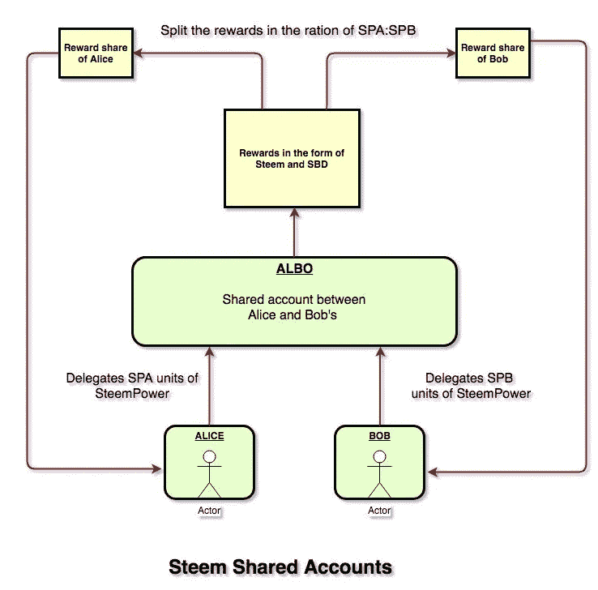

# Steem 共享帐户

> 原文：<https://medium.com/hackernoon/steem-shared-accounts-959aea6ba92d>

最近，我想和一个合作伙伴开一个共享 Steem 账户。我在寻找选择，发现了 Multisig。Steem 上的多签名账户是可能的，但是界面还不友好。你可以在下面的文章中找到更多信息。

 [## [piston]如何将它用于多重签名帐户- Steemit

### 自从最新发布的 piston 0.3.3 以来，您可以使用 Steem 的瑞士军刀进行多西格交易。这个…

steemit.com](https://steemit.com/piston/@xeroc/piston-how-to-use-it-for-multisignature-accounts) 

我们有一个简单的用例，一个必须使用这些工具的非技术用户。对于简单的场景和低价值的交易来说，使用 multisig 是一种大材小用。所以考虑到我们案例中的约束，我们提出了一个简单的方法。

以下是对我们场景的描述

1.  其中一个合作伙伴是非技术合作伙伴。
2.  一般的日常事务由合伙人处理，他也处理项目的技术部分。
3.  我们想要一个共享帐户，但我们想确保如果其中一方失去了他的密码，它不应该影响共享帐户或项目。
4.  每个合伙人都想决定他是否想把他的利润再投资到这个项目中。
5.  每个合伙人都希望完全访问/控制自己的资金份额，但共享账户希望利用每个人愿意投资的金额。

基于上述假设，我们得出了下面的工作流程。

考虑到 Alice 是个技术人员，她会负责创建和设置共享帐户。

1.  Alice 将为该合伙企业创建一个新帐户，她将要求 Bob 为该合伙企业创建一个新帐户。然后，爱丽丝创建了 ALBO 帐户。
2.  爱丽丝和鲍勃都会启动，然后将他们的 Steem 电源份额转移到 ALBO 账户。
3.  ALBO 账户中累积的联合收割机发电量用于项目运营。
4.  来自 ALBO 账户的奖励按照捐赠的 SteemPower(按照 SPA:SPB 的比例)进行分割，并转移到爱丽丝和鲍勃的账户。
5.  为了透明起见，分割奖励的代码/脚本可以在 github 上公开托管，CI 可以集成到这个脚本中。
6.  一旦 Alice 和 Bob 收到他们的奖励，他们可以启动并把 Steem 电源借给共享帐户，或者他们可以做他们想做的任何事情。
7.  如果双方都同意，他们可以使用另一个通用脚本来自动启动和 Steem 电源委托给共享帐户。
8.  任何时候他们感到不舒服或想退出项目，他们可以取消/减少他们的 Steem 权力委托。这个过程需要 7 天，因此给了对方一些时间来计划如何提高所需的 Steem 功率。

你怎么想呢?我们能否使用这种方法，或者您是否预见到这种方法中的任何问题。如果您使用 multisig 或任何其他方法来共享帐户，如果您能分享详细信息，那将非常好。期待您的评论。

如果你觉得这篇文章很有帮助，请在评论中分享你的反馈，不要忘记鼓掌。