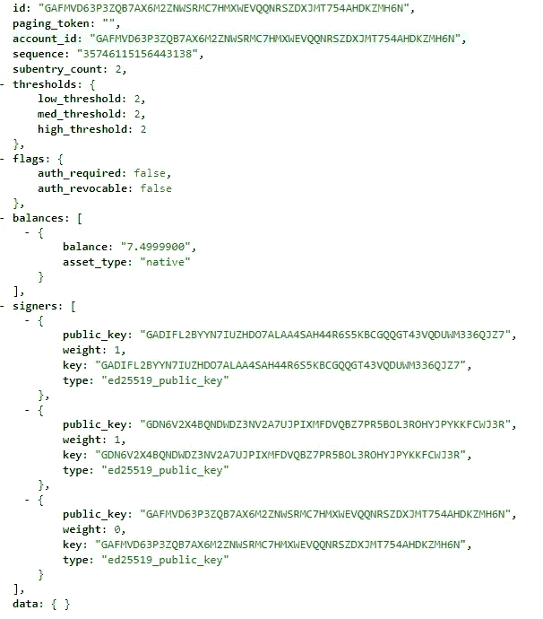
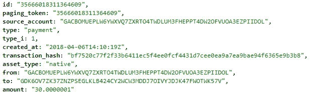

# 恒星托管智能合同开发

> 原文：<https://medium.com/hackernoon/stellar-escrow-smart-contract-development-4fb08d8267c8>

## 在 Stellar 网络上创建您的第一个托管智能合同。


Source: [gratisography.com](https://gratisography.com/)

在阅读本教程之前，您应该对 Stellar 如何工作以及如何在测试网络上创建一个简单的帐户有一个基本的了解。看看我在这个系列中的[上一篇文章](/wearetheledger/exploring-stellar-lumens-development-tutorial-78b4e1c92733)，让你得到更新。

本文将向您解释如何使用 Stellar Lumens 开发托管智能合同。我还会强调一些额外的特性，比如检索余额和干净的历史日志。

*额外说明:本文是* [*区块链器系列*](/wearetheledger/blockchaingers-hackathon-2018-the-aftermath-7a5bc7682dfa) *的一部分。与 TheLedger 一起，我们在最大的区块链黑客马拉松中赢得了“数字国家基础设施”赛道。你可以在这里* *了解更多关于我们的想法* [*。Stellar testnet 上的托管智能合同是这个原型的一部分。*](/wearetheledger/what-weve-built-to-win-the-worlds-biggest-blockchain-hackathon-of-2018-ea01decfd60c)

# 用例描述

我们有两个身份:房子和承包商。房子可以向承包商支付房屋相关服务的费用，比如检查你的中央供暖系统。一旦房屋和承包商同意提供服务，房屋将把商定的金额(在 XLM)存入托管智能合同。一旦工作完成，房子和承包商都必须签字释放资金。

# 准备

首先，我们需要在 testnet 上创建一个新的空帐户。让我们创建一个。

```
const newKey = Stellar.Keypair.random();const transaction = new Stellar.TransactionBuilder(ownerAccount)
    .addOperation(Stellar.Operation.createAccount({
        destination: escrowPubKey,
        startingBalance: '2.5000000'
    }))
    .build();transaction.sign(ownerKeypair);return StellarConfig.server.submitTransaction(transaction);
```

我们还必须定义一个所有者帐户，该帐户负责创建托管，但不能对其执行任何操作。我们使用一个配置文件来检索我们的服务器，这段代码与:`new Stellar.Server('https://horizon-testnet.stellar.org');` 相同，它创建了一个与 Stellar testnet 的新连接。

或许，你想知道为什么我要把 250 万 XLM 交给第三方托管？Stellar 要求每个账户的初始余额为 1 XLM。此外，除了随机托管签名者之外，我们还增加了两个签名者。对于你添加到合同中的每一个签名者，你必须用 0.5 XLM 补足起始余额。所以，…

```
3 x 0.5 (signers) + 1 (base balance) = 2.5
```

更多信息可在 Stellar [文档](https://www.stellar.org/developers/guides/concepts/fees.html#minimum-account-balance)中找到。

# 构建一流的托管交易

让我们取回托管账户，

```
const escrowAccount = StellarConfig.server.loadAccount(pubKey);
```

并建立托管交易。

```
let transaction = new Stellar.TransactionBuilder(escrowAccount)
    .addOperation(Stellar.Operation.setOptions({
        signer: { 
            ed25519PublicKey: houseKeypair.publicKey(),
            weight: 1
        }
    }))
    .addOperation(Stellar.Operation.setOptions({
        masterWeight: 0,
        lowThreshold: 2,
        medThreshold: 2,
        highThreshold: 2,
        signer: {
            ed25519PublicKey: contractorKeypair.publicKey(),
            weight: 1
        }
    }))
    .build();
```

如你所见，我们在托管合同上增加了两个签名人。我们给两个签名者相同的投票权(1)并将阈值设置为 2。因为我们没有给托管账户本身一个明确的权重，所以这个权重被设置为零。这意味着房子和承包商都必须签字才能释放资金，而不是托管所有人。您可以在这里看到一个托管智能合同交易创建的示例[。](https://horizon-testnet.stellar.org/accounts/GAFMVD63P3ZQB7AX6M2ZNWSRMC7HMXWEVQQNRSZDXJMT754AHDKZMH6N)



Stellar Escrow Contract

最后，我们需要签名(用随机密钥对)并将交易发送到网络。

```
transaction.sign(newKey);
await StellarConfig.server.submitTransaction(transaction);
```

理想情况下，房屋将商定的金额发送到托管智能合同。发送充值交易的代码如下所示。

```
memo = Stellar.Memo.text('Pay: House to Contractor');
return new Stellar.TransactionBuilder(<source-account>, { memo })
    .addOperation(Stellar.Operation.payment({
        <destination-pub-key>,
        asset: Stellar.Asset.native(),
        <amount>}))
.build();
```

# 释放资金

释放资金其实很简单。您创建了一个从托管账户到承包商的新转账交易。这里唯一的区别是房子和承包商都必须用他们的钥匙对签名。

```
transaction.sign(houseKeyPair);
transaction.sign(contractorKeyPair);
```

# 附加操作

## 检索客户的历史记录

这将给你一个清单，列出某个账户已经执行的所有付款。我们从数组中移除第一个结果(带有`shift()`),因为这是账户创建交易(对其自身的 0 XLM 支付)。

```
async retrievePayments(pubKey:string) {
    let account = await this.loadAccountAsync(pubKey);
    let payments = await axios.get(`${StellarConfig.baseUrl}/accounts/${account.accountId()}/payments`);let paymentRecords = payments.data._embedded.records;
    paymentRecords.shift();return paymentRecords.map(record => { 
        return { 
            id: record.transaction_hash, 
            from: record.from,
            to: record.to,
            amount: record.amount
        };
    });
}
```

您也可以使用 HTTP API 端点[/accounts/<account-ID>/payments](https://horizon-testnet.stellar.org/accounts/GACBOMUEPLW6YWXVQ7ZXRTO4TWDLUM3FHEPPT4DW2OFVUOA3EZPIIDOL/payments)在您的 web 浏览器中检索它。您将会看到这样的内容:



One payment object (history) for an account.

## 获取帐户余额

要检索一个帐户的 XLM 余额，只需根据它的公钥加载(检索)帐户。由于一个帐户可以有多个余额(原生 XLM 和其他硬币部署在恒星网络)，我们将只寻找原生余额。

```
async getBalance(pubKey) {
    const account = await StellarConfig.server.loadAccount(pubKey);
    let balance;account.balances.forEach((balanceObject) => {
        if (balanceObject.asset_type === 'native') {
             balance = balanceObject.balance;
        }
    }); return balance;
}
```


Source: [https://www.in3dc.com](https://www.in3dc.com/single-post/2017/04/26/Thats-a-Wrap-Did-we-WoW-you)

# 接下来读什么

*   [**探索恒星流明|入门开发教程**](/wearetheledger/exploring-stellar-lumens-development-tutorial-78b4e1c92733)
*   [**【去中心化网络的建设者:10 项最具创新性的技术**](https://hackernoon.com/builders-of-the-decentralized-web-10-of-the-most-innovative-technologies-197271aefa82)
*   [**赢得 2018 年全球最大的区块链黑客马拉松的技术团队！**](/wearetheledger/the-tech-stack-to-win-the-worlds-biggest-blockchain-hackathon-of-2018-bcad38815bd6)