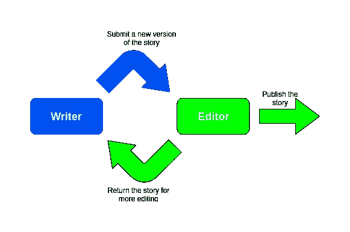
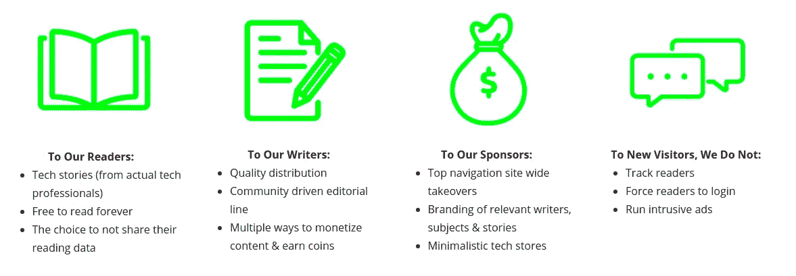
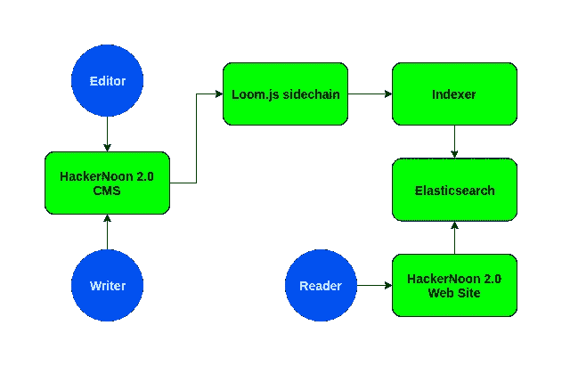

# 让大卫的工作过时的分步指南

> 原文：<https://medium.com/hackernoon/step-by-step-guide-on-making-davids-job-obsolete-c2e9784465ed>

我说的不是我的工作，我说的是 HackerNoon David Smooke 的创始人兼首席执行官。

我是一个狂热的 HackerNoon 读者，对我来说，HackerNoon 似乎有无限数量的优质作家和编辑每天提供大量有趣的技术故事、教程和真实技术问题的解决方案。所以很自然的，当我听到它被从 Medium 转移到它自己的网站的消息时，我很好奇。

在本文中，我将分析当前 HackerNoon 的关键部分，并提出创建自动化新解决方案的步骤。解决方案的示例代码可以在[这里](https://github.com/DavidAbram/hackernoon2.0)找到。

对于那些不知道的人来说，Hacker Noon 是一个联合策划在 Medium 平台上运行的 IT 内容的出版物。正如人们可能预料的那样，联合过程需要大量的资源和时间——你必须通读所有提交的内容，以决定哪些将被选择发布。每一篇发表的文章都需要符合标准，这有时需要将文章退回给作者进行编辑或重写。尽管联合本身是一项艰巨的任务，但黑客正午生态系统仍然非常简单。它的内容是由 IT 专业人士和领域专家组成的社区编写、策划和编辑的，他们的动机纯粹是为了获得更多的读者，推广他们热衷的技术和他们正在建设的项目。

## 简而言之——写一些你感兴趣的与 IT 相关的东西，提交故事，让读者通过 Hacker Noon。

每个联合过程的核心部分是臭名昭著的“作者-编辑循环”。作家和编辑通常以发送没完没了的电子邮件和无所事事的回复而告终。这使得作者-编辑循环成为联合过程中最慢、最乏味的部分。

A diagram of the writer-editor loop

作者-编辑循环可以用两步来解释:
1 .作家提交或编辑他们的故事
2。编辑返回一个故事进行额外编辑
这两个步骤重复进行，直到故事符合标准并准备出版。

让大卫的工作变得过时的最好方法是将联合过程中单调乏味的部分自动化，并给予编辑和作者更多的激励。我将尝试创建一个如何实现这一点的逐步指南，同时牢记更大的 *Hacker Noon 2.0* 愿景的几个要点。

The Vision of Hacker Noon 2.0 taken from [Hacker Noon startengine campaign](https://www.startengine.com/hackernoon).

HackerNoon 发起了一个[众筹活动](https://www.startengine.com/hackernoon)，它解释说 HackerNoon 将永远免费阅读，无需跟踪用户或强迫他们登录。此外，HackerNoon 不会播放侵入性广告，考虑到这一切，很容易理解为什么它会是任何人阅读最新技术相关报道的完美场所。

事不宜迟，让我向您介绍一个可能的解决方案，它可以自动化联合过程，并允许我们保留这一伟大出版物的所有精彩方面。我们出去吧。

# 智能合同作为作者-编辑循环解决方案

作者-编辑循环问题可以通过一个透明的 CMS 来解决，该 CMS 对每个参与者执行相同的规则。实现这种解决方案的一种方法是使用智能合约。

对于那些没有彻底阅读 Hacker Noon 文章的人来说，智能合同是一种计算机协议，旨在以数字方式促进、验证和执行没有第三方参与的合同谈判或履行。这项技术允许我们在作者和编辑之间进行可追踪和不可逆的交互，因为我们将使用区块链上的事务来实现它们。在区块链中，诸如提交、发布、编辑或版本控制等交互都将被表示为一个事务。随后，所有这些数据将是不可变的，并永远存储在区块链内。通过使用这种技术，作者不再被谴责盲目地相信封闭的系统，或者写无数的电子邮件只是为了在故事陷入困境时得到回应。通过使用智能合同，作家现在可以作为系统中的平等者看到与他的故事发生的所有交互，并实时看到它的进展。此外，任何人，不管是不是这个系统的成员，都可以看到我们作家的故事发生了什么。这同样适用于任何故事和任何作者/编辑的互动。

可观察性、可验证性和可执行性是通过设计获得的智能合约的重要属性(查看[gist](https://medium.com/u/b6343375a907#file-example-sol)

上面的代码是用 solidity 编写的这种交互的简单实现。每个黑客正午的故事都必须有标题、内容和作者。这些数据用一个名为 Story 的结构表示，并存储在一个名为 stories 的数组中。此外，我们还定义了一个用于提交故事的函数( *submitStory* )，该函数主要创建、保存提交的故事，然后发送一个事件( *StoryAdded* )。任何通过 WebSocket 协议订阅此事件的人都会被告知系统中的这一变化。契约事件对于解决我们的作者-编辑问题非常重要，因为它们提供了一个通知编辑新故事已经提交审核的渠道。

关于[织机网](https://medium.com/u/9f7a25569a7c?source=post_page-----c2e9784465ed--------------------------------)的更多信息，你可以查看他们的[主页](https://loomx.io/)或者这篇[文章](/loom-network/everything-you-need-to-know-about-loom-network-all-in-one-place-updated-regularly-64742bd839fe)。

对于任何想运行这个简单例子的人来说，这里是到[回购](https://github.com/DavidAbram/hackernoon2.0)的链接。该代码包含一个简单的 HTML 表单，可以用来模拟提交和发布一个故事。也就是说，我不建议新网站看起来像这样。😄

# 索引层

索引可以被认为是根据特定的模式或计划组织数据的一种方式，目的是简化数据检索。在这个解决方案中，我们可以使用它将来自区块链的数据存储到一个数据库中，这个数据库对于信息检索来说性能更好，也更优化。这样，我们可以查询数据库，而不是从区块链检索数据。

这种用法的一个好例子是 [Loom Network](https://medium.com/u/9f7a25569a7c?source=post_page-----c2e9784465ed--------------------------------) 的网站 [DelegateCall](https://delegatecall.com/) 。他们甚至有一篇很棒的博文详细解释了这一点。

实现这一点的首选解决方案是 [Elasticsearch](https://www.elastic.co/) 。很简单，我们可以通过管道将契约发出的事件传递给 Elasticsearch 实例，如下面的代码所示。

有了这样的实现，每当一个故事发布到 HackerNoon 2.0 的 CMS 时，您就可以获得一个更新的全功能搜索。

# 作为奖励的代币

大卫和他的团队提到，他们将向系统中引入这样的令牌，以奖励作家和出版商的辛勤工作。所提出的解决方案能够直接在以太坊主链上创建 ERC-20 和 ERC-721 令牌。这意味着您可以完全自动化令牌的创建和分发。令牌可以由侧链智能合约分发，并在系统中触发定义的操作时分发。因为这不是一个完全实现的解决方案，所以我的示例中不包含这方面的代码，但是请务必查看以下文章:

1.  [等离子织布机网络 DAppChains:具有以太坊安全资产的可扩展 DApps】](/loom-network/loom-network-plasma-5e86caaadef2)
2.  [等离子现金首次发布——等离子支持的 NFT 现已在织机网络侧链上提供](/loom-network/plasma-cash-initial-release-plasma-backed-nfts-now-available-on-loom-network-sidechains-37976d0cfccd)

# 结论

总结一下，我们的新系统由一个连接到 Loom.js 侧链的 CMS 组成。CMS 中发生的每个交互都被写入侧链，并通过发出的事件传递给索引器。索引器确保所有内容都存储在 Elasticsearch 中，并且数据通过新网站显示给用户。下图展示了系统中元素以及与之交互的用户的鸟瞰图。

The overall architecture of the system

HackerNoon 正在迈出第一步，为其利益相关者和技术爱好者创造一个迷人的解决方案。我绝对相信这将是科技媒体领域的游戏改变者，我迫不及待地想看到 HackerNoon 2.0 MVP。我希望您喜欢这种系统的可能实现。如果你认为有更好的方法，一定要让我知道，我想听听其他 HackerNoon 爱好者的想法。