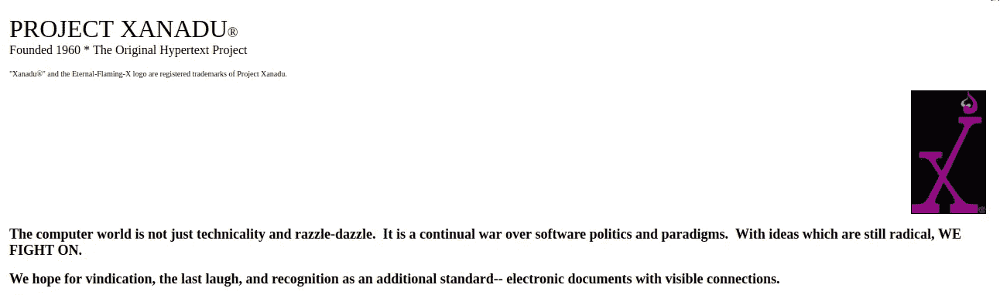
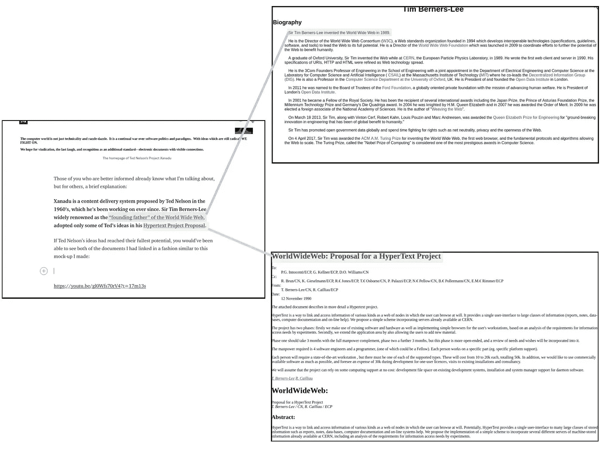

# 互联网历史上的一个奇特点——世外桃源

> 原文：<https://medium.com/hackernoon/steve-wozniak-destroys-apple-in-less-than-2-minutes-dd5e71229a60>

今天，当我在网上浏览奇怪的内容时，我偶然发现了一篇关于[世外桃源](http://xanadu.com/)的文章。

The homepage of Ted Nelson’s Project Xanadu

那些消息灵通的人已经知道是什么了。

根据我的理解，这是 Ted Nelson 在 20 世纪 60 年代提出的一个内容交付系统，从那时起他就一直致力于此。蒂姆·伯纳斯·李爵士以万维网之父[而闻名，他在](https://www.w3.org/People/Berners-Lee/)[超文本项目提案](https://www.w3.org/Proposal.html)中采纳了 ted 的一些想法。这个提议成为了万维网的基石。

如果是 Ted Nelson 的想法发挥了最大的潜力，而不是 Tim Berner Lee 的想法，你应该能够看到我链接的两个文件，类似于我制作的这个低质量模型:

Ultimately the idea behind Xanadu is an interconnected world of documents, in which you can always reach the source of the information that you’re reading.

基本上，有了 Xanadu，一个文档就可以让您查看所有源文件，而无需跳转链接和打开新的浏览器标签。

有点不同于目前网络的工作方式。

然而——事实证明，个人电脑革命的先驱史蒂夫·沃兹尼亚克是泰德·纳尔逊的粉丝。

事实证明，万能的沃兹不喜欢大型互联网公司在网络上做的一些事情。

看了几个 Ted Nelson 的 YouTube 频道的视频后，我发现了一个特别有趣的视频。

在这篇文章中，他谈到了阻止你访问内容的滥用在线广告，并承认我们需要许多聪明的头脑来拯救互联网。

提及的位在 17:00 分钟标记之后开始(链接的视频应该在该时间左右自动开始)，并且只需要大约 2 分钟:

这是一个关于大企业如何改变产品价值的有趣观点，基于一个受欢迎的基于人工智能的产品被收购后发生的事情。

## 大型技术

有许多怀疑论者和阴谋论者想要你相信大公司想要控制你的思想。

随着最近《剑桥分析》和脸书丑闻的曝光，许多理智的人开始意识到，这可能终究不是疯话。

甚至蒂姆·伯纳斯·李爵士也承认，他的发明已经变得如此危险，以至于可以用来对付我们，他在最近发表的公开信中呼吁谨慎行事。

他没有突然把信放下。它于 2018 年 3 月 12 日出版，因为这个日期标志着万维网的 29 岁生日。

他写道的挑战之一是让网络为人们服务。蒂姆爵士承认，大型科技公司不会为我们做这件事。

那么，除了那些我们曾托付给它们如此多信息、金钱和空闲时间的公司，还有谁能拯救我们呢？

也许我们可以自救。

我们只需要学习——关于互联网的基础设施，关于存储我们的数据和托管我们使用的网站和应用程序的硬件，以及关于已经开始影响我们日常生活的软件和算法。

为什么？原因很简单，史蒂夫·沃兹尼亚克在上面的演讲中说得最好:

“未来我们需要更多聪明的人。”