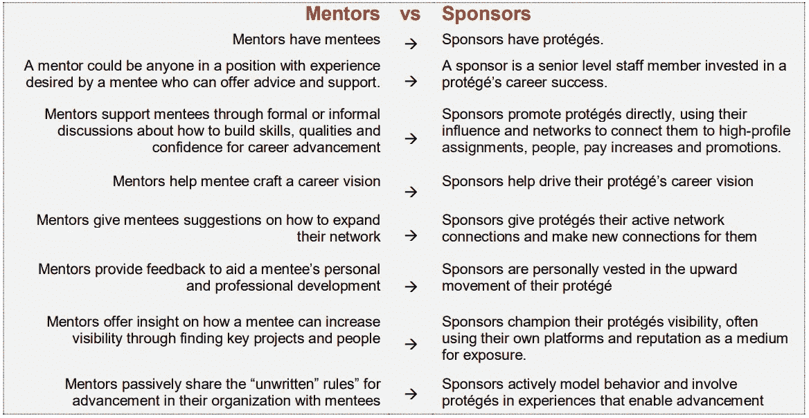

# 停止寻求导师，开始寻求赞助者

> 原文：<https://medium.com/hackernoon/stop-asking-for-mentors-and-start-asking-for-sponsors-600288df98be>

我要冒一次险，我认为职业攀登者犯的最大错误之一就是花太多时间寻找导师。当然，[指导关系可能非常有价值，我不想打击他们。但是当新员工问我，“](https://hackernoon.com/tagged/mentoring)[提升我的职业生涯最快的方法是什么？，](https://startupsventurecapital.com/speedrunning-your-career-game-55b29946701f)“寻找导师根本不是我的首要任务。

在我的职业生涯中，我只有过两个正式的导师。但是我有很多赞助商。

# 那么…有什么区别呢？

我发现许多人甚至从未听说过[赞助](https://hackernoon.com/tagged/sponsorship)这个主意。那么导师和资助人有什么区别呢？嗯，指导就是当你定期遇到某人，你给他们你的问题，他们给你建议。他们可能还会给你免费的咖啡，这很棒。

赞助商是给你机会的人。

[Source](https://inclusion.slac.stanford.edu/sites/inclusion.slac.stanford.edu/files/The_Key_Role_of_a_Sponsorship_for_Diverse_Talent.pdf)

我什么意思？赞助人通常是你公司里有影响力的高层领导。他们可以向其他领导强调您的成就，并在适当的时候向您介绍机会。他们是倡导你成功的人，作为回报，你将代表他们的品牌并交付成果。

我职业生涯中最重要的时刻大多来自赞助:

我负责的第一个重构项目是创建一个可以在微软 Office 的 140 多种语言中工作的拼写检查器。这项任务来自我的报告链之外的一位架构师。他把机会推给了我，因为我在业余时间花了很多精力阅读背景研究，理解代码库，修复 bug。

后来，一位不同的工程领导给了我一个机会，让我管理我的第一个 30 多人的组织。我给他留下了深刻的印象，我有能力在微软办公室组织中推动较小的创新项目(这真的很难，说来话长)。他需要一个能够组建团队、平衡创新和实用性、减少繁文缛节、按时发货的人。这个名为 [InfoNav](http://www.zdnet.com/article/microsoft-adds-natural-language-search-to-its-power-bi-preview/) 的项目是我第一次白手起家组建的团队，它让我结识了儿时的英雄比尔·盖茨。

最后一个例子:当微软云计算和企业团队的一位工程总监需要一个人来解决服务部署的紧急问题时，我的名字出现了。当时我没有云经验，但我作为主管知道我可以快速学习并交付。

这是我参与的第一个云基础设施项目，让我承担了从未想过的新责任。几年后，最初的云体验(和一系列艰苦的工作)让我成为 SaaS 一个名为 [Power BI](https://www.cnbc.com/2018/02/26/satya-nadella-talks-up-microsoft-office-365-growth-opportunity.html) 项目的总经理，这个项目现在是一个价值 5 亿美元的业务。

我可以继续。在每一个案例中，最大的机会都来自了解我的历史、信任我并在关键时刻支持我的人。伟大的赞助商！

# 包装赞助商

那么，你怎样才能找到赞助商呢？第一个技巧很简单:问。我大约一半的赞助来自简单地改变标准的导师咖啡会议。但我没有寻求职业建议，而是谈论了我的工作经历，解释了我的志向，然后问**“如果你有一双多余的手，你会做什么？”**当你向正确的人提出这个问题时，你会惊讶地发现其中蕴含的机遇。

第二种方法是调整你的机会雷达。把你的头从键盘上抬起来，观察你的组织中正在发生的问题。听听你的领导在说什么。你会看到他们不断地给你留下对他们来说重要的提示。

每当我主持市政厅会议或团队同步会议时，我最常被问到的问题是，“是什么让你夜不能寐？”然后，我将解释团队/公司中出现的一些问题以及潜在的解决方案。员工很少意识到**这些是提供帮助和获得赞助的最佳时机。它很少发生，但当它发生时，它是一件美好的事情。**

# 警告和结论

是的，请求赞助会给你带来更多的工作——可能远远超出通常的预期。此外，赞助是双向的，所以在接受下一个大挑战之前要小心。不要让你的赞助商失望！尽管有这些担忧，赞助的回报远远大于风险。

最后，给高管和经理们一个提示:**造就新的领导者是领导者的责任。如果你还没有赞助，现在就开始吧！**

**岩石上的
-刻痕**

# 👏🏿👏🏿👏🏿喜欢这个故事吗？请鼓掌！👏🏿👏🏿👏🏿我感谢大家的支持，这也有助于其他人了解这个故事。