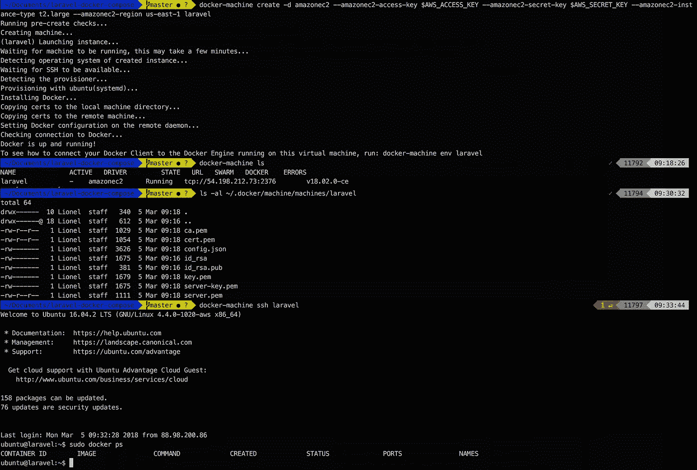
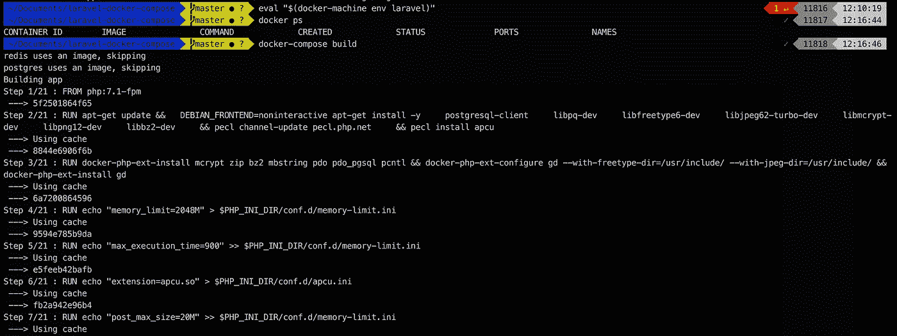
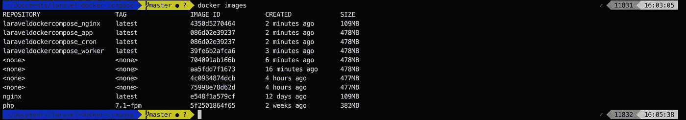
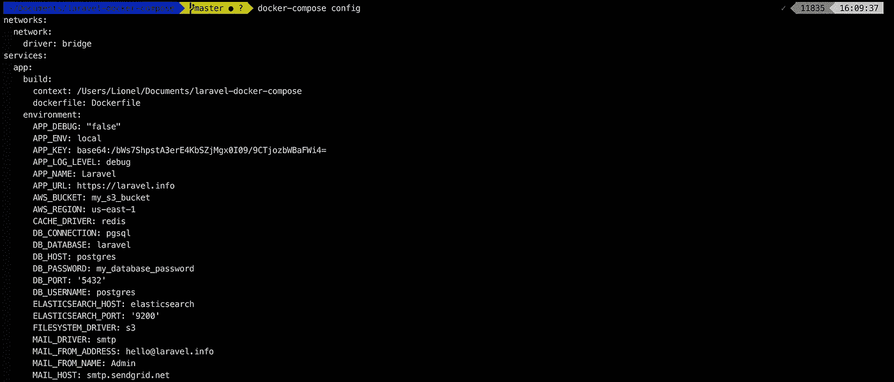
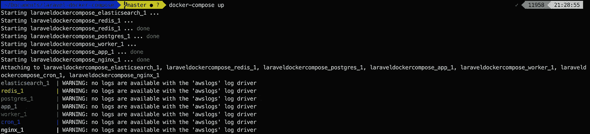
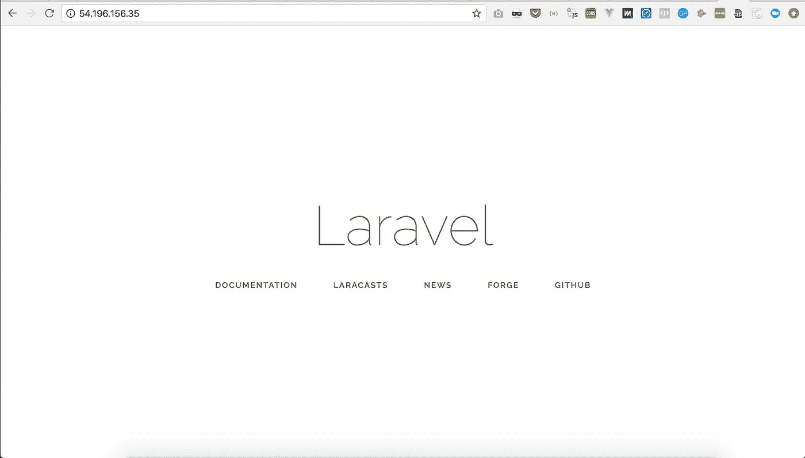
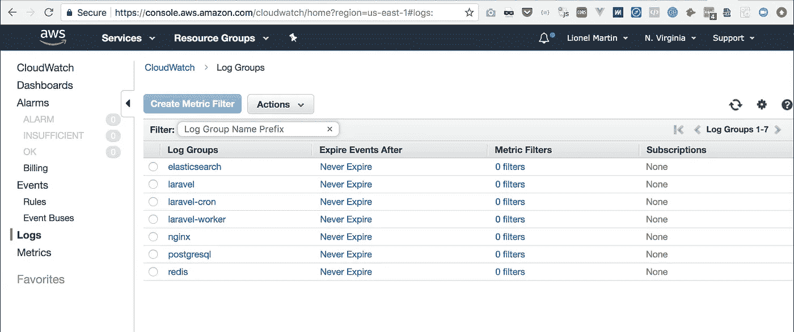
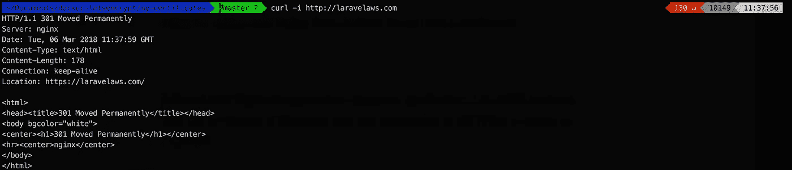
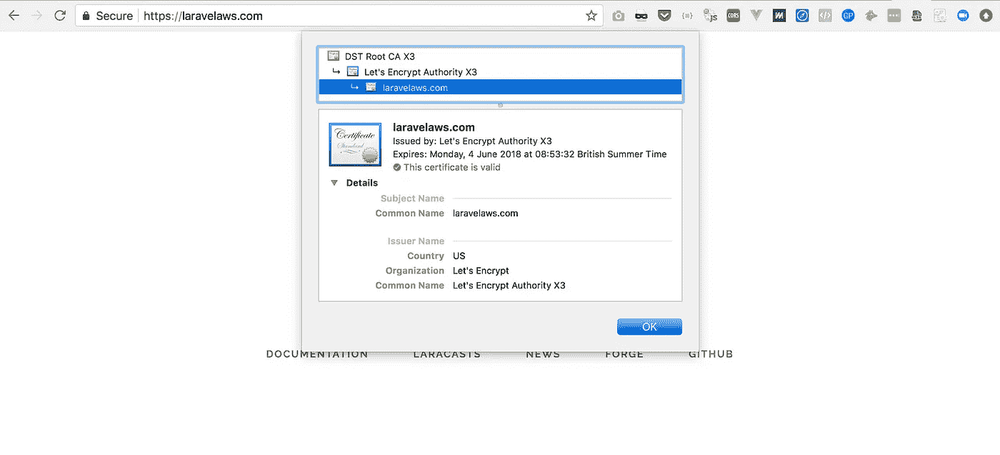

# 停止手动部署 Laravel，改用这个 Docker 配置

> 原文：<https://medium.com/hackernoon/stop-deploying-laravel-manually-steal-this-docker-configuration-instead-da9ecf24cd2e>

***感谢光临！您可能还想查看之前这篇关于在 AWS 上部署 Laravel 的文章***[](https://hackernoon.com/laravel-on-aws-a-reference-architecture-a680755130d0)****或者甚至使用下面的表格下载这本书！****

**

*我们为 web 应用程序所做的事情…*

*抛开编码和测试不谈，我们为他们提供服务器，配置他们的数据库、搜索引擎、缓存引擎、工作人员、crons、队列，配置他们的 web 服务器，为他们获取 SSL 证书，为他们更新 DNS，最后构建和部署他们。
我们每天都这样做，所以希望我们可以轻松地设置它，这样我们就可以每天重新部署几次，而不用考虑太多！*

*作为受人尊敬的开发人员，我们也不会为我们的 web 应用做一些事情:
—我们不会点击 AWS 控制台试图记住我们上次是如何做的
—我们不会 SSH 到一个虚拟机并到处运行 *apt-get installs* ，试图记住我们上次是如何做的—我们不会通过任何东西重新部署我们的应用，除了我们可以轻松回滚的单个命令*

*这将为许多可能的人为错误铺平道路，使部署充满压力和风险，使我们的应用程序不稳定和潜在的不安全(哎哟)。*

*相反，我们将脚本化和自动化。我们将把我们的配置提交为代码。我们将使用一个可重复的自我记录的过程，任何开发人员(包括我们自己)都可以接手，没有风险。我们将在以后的项目中使用相同的可重复过程，随着时间的推移改进它，增加它的可靠性，减少劳动力和部署错误。我们将尽可能多地自动化低商业价值的活动，让我们的公司变得更好。*

*这本指南是给谁的？
本指南是为小型[科技](https://hackernoon.com/tagged/tech)公司设计的，这些公司可能已经手动完成了太多自己的部署，并且已经被淘汰了一两次。它非常适合任何想要开始使用 AWS 的团队，首先使用它的基本服务，然后逐渐增加复杂性。*

*这是我用来在 AWS 上部署客户的 Laravel 应用程序的程序之一。希望这能对你的部署有所帮助。如果您的用例更复杂，或者您希望我指导您的开发人员了解 devOps 最佳实践，请来 https://getlionel.com 与我交谈*

*关于 AWS，我们需要了解什么？
好消息是，对于一个只有少量后台服务(数据库、缓存、队列、文件存储和搜索引擎)的简单 Laravel 应用程序来说， 你不需要太了解 AWS:
—我们不会使用特定的网络(比如无法从互联网访问的私有子网)，所以我们将使用 AWS 帐户的默认 VPC 和公共子网
—我们将在一台 EC2 服务器上部署所有服务，并使用 S3 进行文件存储。 因此，我们不必太担心其他 AWS 服务
—我们将部署一个无状态的应用程序并将数据库备份到 S3，因此我们不必担心 EBS (EC2 的持久存储选项)
—将有一个单一的防火墙配置来设置
—实际上，我们将做的大多数事情都可以移植到更便宜的托管提供商(除了 S3 文件存储，它可以在不同托管提供商的虚拟机上运行应用程序时单独使用)*

***为什么是 Docker？** [Docker](https://hackernoon.com/tagged/docker) 将是我们这篇文章的瑞士军刀。它将帮助我们配置服务器、配置(as-code)和协调我们的服务:*

> ***服务器配置**是一组为服务器准备适当的系统、数据和软件，并使其为网络运行做好准备的操作*
> 
> ***Configuration-as-code** 是一个 DevOps 实践，它提倡将应用配置作为代码存储在源代码存储库中*
> 
> ***编排**是计算机系统和服务的自动化安排、协调和管理*

*Docker 本身不足以应对更复杂的情况(例如，如果我们有 10 多个微服务需要单独更新和扩展，运行在多台服务器上)。然而，我们这里的应用程序只有少量的后台服务，各种 Docker 工具是我们所需要的:
—我们将使用 **Docker Machine** 直接从命令行将我们的 EC2 服务器配置到我们的 AWS 帐户中
—我们将使用 **Docker images** 将我们的服务配置定义为代码
—我们将使用 **Docker Compose** 将我们的服务编排在一起
—我们最终将使用 **Docker***

***第一步。用 Docker Machine** 配置我们的服务器 Docker Machine 是一个工具，它通过一次性安装适当的 Linux 发行版和 Docker 守护进程来配置我们的服务器。它可以通过代表我们调用 Amazon API 来连接到 AWS，并在我们的 AWS 帐户中创建一个 EC2 实例。*

**

*这里发生了什么！？ *—* 首先，Docker Machine 在我们的 AWS 帐户中创建了一个 EC2 实例，其大小由我们指定(t2.large)，并在我们指定的 AWS 区域中创建了一个 EC2 实例(us-east-1)
—它还创建了一个安全组(实例级 AWS 防火墙)，允许任何流量进入端口 80 和 443
—然后它安装了 Docker 守护程序，并将其配置为可通过端口 2376 远程访问。 使用它专门为这台机器创建的新 TLS 证书
—它还创建了一个新的 SSH 密钥，并在服务器上安装了它的公共部分，同时将私有密钥保存在您的机器上。 端口 22 已经为 SSH 访问开放。你可以随时使用*进入你的机器**

*这已经是相当多的自动化工作了！*

*您现在可以在 *~/中查看 Docker Machine 将所有这些配置保存在本地机器上的位置/方式。码头工人/机器/机器*。有一个以您刚刚创建的 Docker 机器命名的新目录( *laravel* 此处)，包含上面提到的 SSH 密钥和 TLS 证书。
然后，您可以使用命令 *docker-machine ls* 查看通过 Docker Machine 创建的所有机器的列表。*

 ***尽管这可行，但这绝对不是一种在公司内共享秘密/SSH 密钥的安全方式，Docker Machine 还没有为此提供企业级的解决方案。Docker Machine 不是提供大规模项目的解决方案，Terraform 等更复杂的工具提供远程状态后端，以便与您的团队安全地共享配置。与此同时，如果你和一个小团队一起工作，并且想快速上手，Docker Machine 正符合你的要求。
编辑:我曾经在这里 写过关于共享 Docker Machines[](https://hackernoon.com/finally-you-can-share-docker-machines-without-a-script-8f946d050f7)***

****第二步。使用 Docker** 配置我们的服务下一步是将我们的每个服务构建为单独的 Docker 映像，然后这些映像将作为单独的 Docker 容器运行。这里的好消息是，我们的大多数服务不需要特定的配置(数据库、缓存引擎、搜索引擎和队列)，因此我们可以开箱即用地使用他们的官方 Docker 映像！
对于其余的(我们的 Nginx 服务器、Laravel 应用程序、Laravel worker 和 cron)，我们将不得不从我们的源代码构建我们自己的 Docker 映像。
我们通过编写描述图像如何构建的 docker 文件来实现这一点。我们将使用我们的代码提交这些 docker 文件，有效地实现配置即代码(yaaayy！)**

**这是我们的 docker 文件和配置文件的概述:**

```
**root of your Laravel app
|--deploy
|    |-- nginx
|    |    |-- ssl
|    |    |    +-- ssl.cert             # our SSL certificate
|    |    |    +-- ssl.key              # our SSL certificate
|    |    +-- default.conf              # our Nginx config 
|    |    +-- index.php
|    |    +-- nginx.conf
|    |    +-- robots.txt
|    |-- cron
|    |    +-- artisan-schedule-run      # our artisan scheduler
|    |-- php-fpm
|    |    +-- php-fpm.conf
|    |    +-- php.ini                   # PHP configuration
|    |    +-- www.conf
+-- Dockerfile                          # our Laravel Dockerfile
+-- Dockerfile-nginx                    # our Nginx Dockerfile
+-- docker-compose.yml                  # Docker Compose file
+-- docker-compose.env                  # our environment variables**
```

**我们来看看 Nginx 的配置(default.conf):**

**The only funny part here is***fastcgipass: app:9000****, explanations below***

**和 Docker 文件来使用我们的定制配置构建 Nginx:**

**Just adding our config and static assets into the Nginx Docker image, that’s it**

**对于我们的 Laravel 应用程序工作人员和 cron，我们使用一个 Docker 文件构建一个映像，并且我们将覆盖每个容器的 Docker CMD。**

**This Docker CMD will launch PHP-FPM and tail the Laravel logs into Docker logs**

****第三步。Docker Compose 是一个用 Docker 编排多容器应用程序的工具。在我们的例子中，我们将同时运行多达 7 个容器:
—Laravel 应用程序
— Nginx 作为 PHP 的反向代理——FPM
—Redis 作为缓存引擎和队列引擎
— PostgreSQL 或 MySQL 用于我们的数据库
— Laravel worker 在一个单独的容器中运行
— Laravel cron 也在另一个容器中运行
—如果我们的应用程序需要的不仅仅是数据库原生搜索功能，最终运行 ElasticSearch****

**那我们为什么需要 3 个 Laravel 集装箱？它们都需要运行在相同的 Laravel 代码上，但是我们希望每个容器只运行一个进程:PHP-FPM、Laravel Artisan worker 和 cron。由于 Docker 在每个容器中只能启动一个进程，否则我们将不得不使用 Docker 中的进程控制系统来解决这个问题。不太干净。**

***在我们继续之前，有一些关于 Docker Compose 的概念我们需要在这一点上理解:
—* ***网络*** *: Docker Compose 创建了一个* *桥接网络，它是主机内部的私有网络，因此该网络上的容器可以通信。在幕后，Docker 引擎创建必要的 Linux 桥、内部接口、iptables 规则和主机路由来实现这种连接。
—* ***链接*** *:容器可以通过链接相互连接。链接是 Docker 服务发现机制:这是如何将服务名解析为容器 IP 的。我们在 Nginx 配置中使用它来指向我们的 PHP-FPM 容器。
—* ***端口映射*** *:默认情况下，一个端口只在当前容器上公开，链接到它的容器可以访问。为了向互联网公开它，并且假设我们的主机本身连接到互联网，Docker 可以将容器端口映射到主机端口
—* ***环境变量*** *: Docker Compose 使您能够在。yml 文件将您需要的环境变量放在您的容器中。这很好，因为您可以在不同的环境(暂存、生产等)中部署相同的映像，而无需重建映像。
—* ***卷*** *:默认情况下，删除 Docker 容器时，容器内写入的数据会丢失。可以通过使用 Docker 卷将数据持久化到主机上(我们将把这个用于数据库)
—* ***日志*** *: Docker Compose 有几个日志记录驱动程序，其中之一是 AWS CloudWatch。我们将把每个服务流日志直接发送到 CloudWatch，只需要 docker-compose.yml* 中的几行代码**

**The Docker Compose file that rules all of our services**

**让我们构建我们的应用程序吧！**

****

**让我们检查一下我们所有的图像都已经构建好了:**

****

**Docker Compose default prefix for images is our current directory’s name**

**现在，在启动我们的应用程序之前，我们可以检查 Docker Compose 是否会使用适当的环境变量来执行我们的应用程序:**

****

**Docker Compose compiled our docker-compose.yml file by injecting environment variables and secrets from docker-compose.env**

**看起来不错，现在让我们运行我们的应用程序:**

****

**我们用*docker-machine IP laravel*检索我们的服务器公共 IP……答对了！**

****

**在这个阶段，您可以带着 *Dockerfile* 和 *docker-compose.yml* 文件，将它们复制到您拥有的每个新 Laravel 项目的根目录，然后在几分钟内部署一个新项目……听起来如何！？**

**接下来的步骤是将我们所有的日志集中到 CloudWatch 中，在我们的 Nginx 映像中设置自动更新和免费的 SSL 证书，并定期将我们的数据库备份到 S3。**

***嘿！您是愿意让我为您完成所有这些工作，还是愿意培训您的团队掌握 Docker、AWS 和 devOps 最佳实践？来和我聊聊*[*【https://getlionel.com】*](https://getlionel.com)**

****第四步。(可选)将日志流式传输到 CloudWatch** Docker-Compose 提供了一个 CloudWatch 驱动程序，这样所有符合 Docker 标准输出的内容都可以流式传输到一个新的 cloud watch 日志组中。**

**您所需要做的就是在创建时创建一个与 EC2 实例相关联的实例概要文件:**

**并在 *docker-compose.yml* 文件中取消对每个服务定义的日志记录指令的注释。例如:**

**Configuring AWS CloudWatch driver for Docker**

**上面将在您的 CloudWatch 仪表板中创建一个名为“laravel”的日志组，并开始在那里推送日志事件。一旦我们的所有服务都连接到 CloudWatch，您将会看到:**

****

**Logs for all of our services are centralised in CloudWatch**

**从那里，你可以使用 CloudWatch 的所有优点，比如设置警报和通知，而不必运行自己的 ElasticSearch/Kibana 堆栈。**

****第五步。(可选)设置 SSL 并将所有 HTTP 流量重定向到 HTTPS** 您应该在第一个版本中就设置 HTTPS，这样可以省去很多后续的麻烦。首先，我们将更新 Nginx 配置，将所有 HTTP 流量重定向到 HTTPS:**

**Redirecting HTTP traffic to HTTPS and [www.laravelaws.com](http://www.laravelaws.com) to APEX**

**然后我们从 Let's Encrypt 订购 SSL 证书。让我们加密证书是免费的，有效期为 3 个月。我们不会在这里讨论如何设置 Nginx 来自动更新证书，但至少我们有一个解决方案可以在几分钟内获得免费证书:**

**This script uses our AWS CLI using the default profile and an existing Route53 Hosted Zone for your domain**

**然后，我们将文件 *fullchain.pem* (我们的证书)和 *privkey.pem* (证书的私钥)复制到我们的 *deploy/nginx/ssl* 目录中，并更新我们的 Nginx Dockerfile 文件以导入 ssl 证书:**

**Adding the certificates to our Nginx image**

**重建您的 Nginx 映像并重新启动您的应用程序。使用 cURL 检查证书是否有效，以及到 HTTPS 的重定向是否按预期工作:**

****

**Nginx successfully forcing redirection to HTTPS**

**我们可以用 Chrome 检查证书是否有效:**

****

**Nginx serving our Laravel application through HTTPS**

****第六步。(可选)自动数据库备份**
…我们将添加一个容器，每天定期将我们的数据库备份到 S3。**

***即将推出***

****更进一步:(可选)在多个实例上扩展我们的应用，在 RDS 上托管我们的数据库，等等..哇，已经有很多工作自动化了！现在，如果我们想在 AWS RDS 上运行数据库，跨越多个工作人员，在多个服务器上自动扩展我们的应用程序，等等，该怎么办呢？
除了仅仅使用 Docker Machine 和 Docker Compose，我们还能走得更远吗？不完全是。Docker 的集群解决方案是 Docker Swarm，它正在失去吸引力，并被 Kubernetes 等更受欢迎的解决方案所取代。****

**好吧，那是另一个时间，但在此期间，你可以阅读我关于 Laravel 和 AWS 的其他文章“ [*如何使用 CloudFormation*](https://hackernoon.com/laravel-on-aws-a-reference-architecture-a680755130d0) 在 AWS 上部署 Laravel”和“ [*如何在 AWS 上持续部署你的 Laravel 应用程序*](https://hackernoon.com/how-to-continuously-deploy-your-laravel-application-on-aws-7fc0f39c558e) ”。**

**莱昂内尔是总部位于伦敦的初创公司 Wi5 的首席技术官，也是《面向未来的工程文化课程 *的作者。你可以在*[*https://getlionel.com*](https://getlionel.com)上联系他**