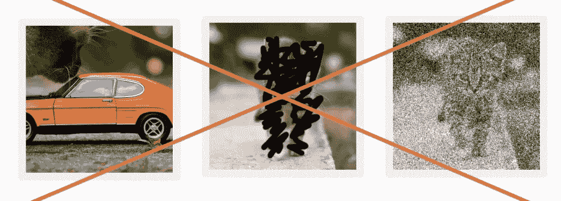

# 停止给你的模特喂垃圾！—数据集的 6 个最大错误以及如何避免它们。

> 原文：<https://medium.com/hackernoon/stop-feeding-garbage-to-your-model-the-6-biggest-mistakes-with-datasets-and-how-to-avoid-them-3cb7532ad3b7>

## 了解如何通过避免数据科学中最常见的错误，加上提示、技巧和小猫来构建杀手级数据集。

# 介绍

如果你还没有听说过，让我告诉你一个事实，作为一个数据科学家，你应该永远记住:

> **“你的结果取决于你的数据。”**

许多人犯了这样的错误:试图通过改进**他们的**模型**来**补偿**他们丑陋的**数据集**。这就相当于买了一辆**超跑**因为你的旧车用*便宜的* *汽油*表现不好。更有意义的是*提炼*的**油**而不是*升级*的**车**。在这篇文章中，我将解释如何通过**增强**您的**数据集**来轻松**提高**您的**结果**。**

***注*** *:我将以图像分类的任务为例，但这些提示可以适用于各种数据集。*

# 6 个最常见的错误，以及如何纠正它们。

## 1.数据不足。

如果你的数据集太小*，你的模型就没有足够的例子来找到**用于**泛化**的区别特征**。然后 [**会过度拟合**](https://machinelearningmastery.com/overfitting-and-underfitting-with-machine-learning-algorithms/) 你的数据，导致**低** **训练** **错误**但是**高** **测试** **错误**。*

****解决方案#1:*** 多收集数据。您可以尝试从与您的原始数据集相同的**源*中找到更多，或者从另一个 *源*中找到更多，如果图像非常相似或者如果您**绝对希望**概括。**

*****注意事项:*** 这通常不是一件容易的事情，至少不需要投入时间和金钱。另外，你可能想做一个*分析*来决定**你需要多少**额外的数据。将您的结果与**不同的数据集大小、**进行比较，并尝试**外推**。**

****

**In this case, it seems that we would need **500k samples** to reach our **target** **error**. That would mean gathering **50 times as much** data as we have for the moment. It is probably more *efficient* to work on other ***aspects*** of the data, or on the **model**.**

*****解决方案#2:*** 通过创建同一个图像的多个副本来扩充您的数据。这项技术创造了奇迹，它以非常低的成本产生了大量的额外图像。你可以尝试用*裁剪*、*旋转*、*平移*或*缩放*你的图像。你可以*添加* *噪点*，*模糊它*，*改变它的颜色*或者*遮挡它的部分。*在所有情况下，你都需要确保数据**仍然代表同一个类**。**

****

**All this images still represent the “cat” category**

**这可能是非常强大的，因为叠加这些效果会为您的数据集提供指数级的大量样本。注意，这通常仍然是**不如**来采集**更多的** **原始** **数据**。**

****

**Combined data augmentation techniques. The class is still “cat” and should be recognized as such.**

*****注意事项:*** 并非所有的增强技术都能解决你的问题。例如，如果你想对柠檬和酸橙进行分类，不要玩弄色调，因为颜色对分类很重要*是有意义的*。**

****

**This type of data augmentation would make it harder for the model to find discriminating features.**

****

## **2.低质量等级**

**这很简单，但是如果可能的话，花点时间浏览你的数据集，并且**验证每个样本的标签**。这可能需要一段时间，但是在你的数据集中有*反例*将会**不利于**到的学习过程。**

**此外，为您的类选择正确的**粒度级别**。根据问题的不同，您可能需要更多或更少的类。*例如*，你可以用**全局分类器**对一只**小猫**的图像进行分类，以确定它是一只**动物**，然后通过**动物分类器**运行它，以确定它是一只**小猫**。一个巨大的模型可以做到这两点，但是会困难得多。**

****

**Two stage prediction with specialized classifiers.**

****

## **3.低质量数据**

**如简介中所说，*低质量* **数据**只会导致*低质量* **结果**。**

**您的数据集中的样本可能离您想要使用的样本太远。这些对模型来说可能更令人困惑而不是有益。**

*****解决*** : *去除*最差图像。这是一个漫长的过程，但会改善你的结果。**

****

**Sure, these three images represent cats, but the model might not be able to work with it.**

**另一个**常见的**问题是当你的数据集是由****不匹配**真实****世界** **应用**的数据组成时。例如，如果图像是从完全不同的来源拍摄的。******

*********解决方案:*** 想想你的技术的长期应用，以及在生产中会采用哪些手段获取数据。如果可能，尝试使用相同的工具查找/构建数据集。******

************

******Using data that doesn’t represent your real world application is usually a bad idea. Your model is likely to extract features that won’t work in the real world.******

************

## ******4.不平衡的阶级******

******如果每类样本的**号**不是所有类的** *大致*和**相同的**，则模型可能倾向于优势类，因为它会导致更低的****误差**。我们说模型是**有偏的**，因为*的等级分布*是**偏斜的**。这是一个严重的问题，也是为什么你需要看看[精度，回忆](https://en.wikipedia.org/wiki/Precision_and_recall)或[混淆矩阵。](https://en.wikipedia.org/wiki/Confusion_matrix)**********

*******解决方案#1:*** 从*代表性不足的*类别中收集更多样本。但是，这是**往往**耗资在*时间*和*金钱*，或者干脆*不可行。*****

*******解决方案 2:*** 过采样/欠采样数据。这意味着您**从**代表过多的**类中移除**一些样本，和/或从**代表不足的**类中移除**重复的**样本。比*复制*更好的是，使用前面看到的数据扩充。****

********

****We need to **augment** the **under-represented** class (cat) and **leave aside** somesamples from the **over-represented** class (lime). This will give a much smoother class distribution.****

********

## ****5.不平衡数据****

****如果您的数据没有一个特定的****格式**，或者如果值不在某个****范围**内，您的模型可能会在处理它时遇到麻烦。在*纵横比**和*像素值**的情况下，您将获得更好的效果。**********

**********解决方案#1:*** *裁剪*或*拉伸*数据，使其具有与其他样本相同的外观或**格式**。*******

************

******Two possibilities to improve a badly formatted image.******

*********解决方案#2:*** *归一化*数据，使每个样本的数据都在**相同**值**范围**内。******

************

******The value range is normalized to be consistent across the dataset.******

************

## ******6.没有验证或测试******

******一旦你的数据集已经被*清理*、*扩充*并正确*标记*，你需要**分割**它。很多人是这样划分的: *80%* 用于**训练**，而 *20%* 用于**测试，**哪个能让你轻松发现*过度拟合。* **然而**，如果你在同一个测试集上尝试多个模型，会发生一些别的事情。通过*选择*给出最佳测试精度的模型，您实际上**过度调整了测试集**。发生这种情况是因为您正在手动选择一个模型**而不是**的内在****值**，而是在一组**特定的**数据上选择其*性能*。********

*********解决方案:*** 将数据集一分为三:**训练**、**验证**和**测试**。这个**保护**你的测试设备不会因为**选择型号**而*过度装配*。选择过程变成:******

1.  ********在**训练设备上训练**你的模特。********
2.  ******在**验证装置**上测试**它们，以确保你没有*过度配合*。****
3.  ****挑选最有前途的型号。**在**测试装置**上测试**，这会给你模型的**真实精度**。****

********

*******注意*** :一旦*为**生产**选择了*你的模型，别忘了在**整体** **数据集**上训练它！数据越多越好！****

## ****结论****

****我希望现在你已经*确信*你必须在考虑你的模型之前关注你的**数据集**。你现在知道处理数据的最大错误，如何避免**陷阱**，加上**技巧**和**窍门**关于如何建立**杀手** **数据集**！如有疑问，请记住:****

> ******“赢家不是拥有最佳模型的人，而是拥有最佳数据的人。”**。****

****🎉你已经到达终点了！我希望你喜欢这篇文章。如果你做了，请喜欢它，分享它，订阅时事通讯，给我发送比萨饼，在媒体上跟随我，或者做任何你想做的事情！🎉****

> ******如果你喜欢数据科学和人工智能，** [**订阅时事通讯**](http://eepurl.com/cATXvT) **接收文章更新和更多内容！******