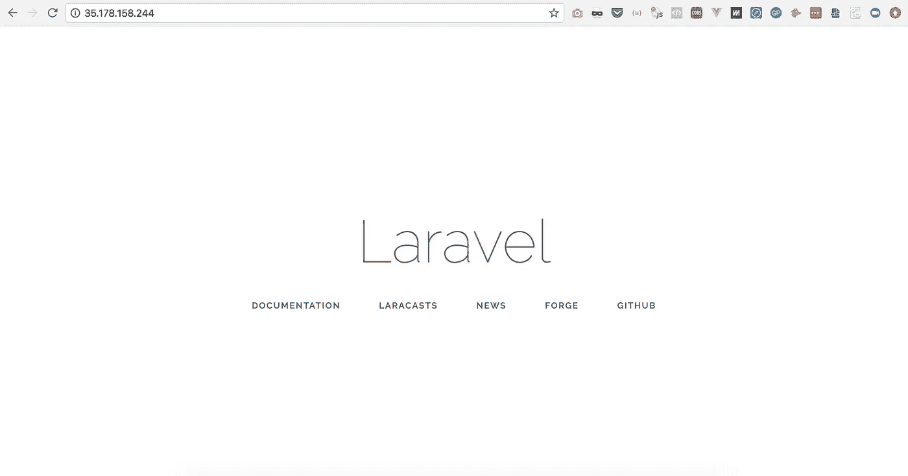

# 停止为 Laravel 手动配置 AWS 改用 Terraform

> 原文：<https://medium.com/hackernoon/stop-manually-provisioning-aws-for-laravel-use-terraform-instead-11b8b360617c>


Poe knows a fair bit about automating

有太多的产品希望帮助我们在云中运行应用程序。不幸的是，它们都没有涵盖我们所需要的全部。有时候我们需要自带服务器。或者他们负责托管，但我们无法访问底层基础架构。

因此，我们不仅为它们付费，在闭源软件上下赌注，而且只处理我们需要的一小部分。

**我正在分享一个完整的 Terraform 和 Docker 配置，让你从头开始配置 AWS 和部署 Laravel/Nginx/MySQL/Redis/elastic search，只需几个命令**。我们将使用“基础设施即代码”和“配置即代码”来实现这一点，以确保流程的可重复性、可共享性和可记录性。

> 关于自动化的一句话:**自动化是我们有效发展你的技术团队的唯一途径。**我们自动化程度越高，流程就越标准。我们将用普遍理解的技术，如 Docker、 [Terraform](https://hackernoon.com/tagged/terraform) 、Kubernetes、Consul 等以及它们的设计模式来取代你的零散脚本。我们可以快速构建并移交给新的开发者。我们可以忘记它们，几个月后再回来，而不会大脑冻结。

我们在 [AWS](https://hackernoon.com/tagged/aws) 上部署 Laravel 所需的完整源代码可以在 GitHub 上公开获得，网址是:

[](https://github.com/li0nel/laravel-terraform) [## 里欧内尔/拉勒韦尔-地形

### laravel-terraform -一键部署 Laravel -无需支付额外的 Saas 费用

github.com](https://github.com/li0nel/laravel-terraform) 

准备好了吗？开始吧！

*这是我用来在 AWS 上部署客户的 Laravel 应用程序的过程。希望这能对你的部署有所帮助。如果您的用例更复杂，我会提供持续的支持包，从指导您的开发人员到亲手在 AWS 上构建应用程序。在 hi@getlionel.com ping 我*

## 1.克隆部署脚本

我们首先下载部署 Laravel 所需的 Terraform 和 Docker 脚本。从我们的 Laravel 根目录:

`git clone git@github.com:li0nel/laravel-terraform deploy`

这将在我们的 Laravel 安装的根目录下创建一个部署目录。现在，我们将使用该目录中的 Terraform 脚本来创建我们的基础设施。

```
├── deploy
  └── terraform                 *# our Terraform scripts*
    ├── master.tf               # *entrypoint for Terraform (TF)*
    ├── terraform.tfvars        # *TF input variables*
    └── modules
      └── vpc                   # *VPC configuration*
        ├── vpc.tf
        └── outputs.tf
      └── ec2                   *# EC2 configuration*
        ├── ec2.tf
        └── outputs.tf
      └── aurora      *          # Aurora configuration*
        ├── aurora.tf
        └── outputs.tf
      └── s3                    *# S3 configuration*
        ├── s3.tf
        └── outputs.tf
  └── cron                      *# cron configuration for Docker*
    └── artisan-schedule-run
  └── nginx                     *# Nginx configuration*
    ├── default.conf
    ├── nginx.conf
    └── ssl                     *# Nginx SSL certificates*
      ├── ssl.cert
      └── ssl.key
  ├── php-fpm                   *# PHP-FPM config* ├── Dockerfile                *# Dockerfile for Laravel containers* ├── Dockerfile-nginx          *# Dockerfile for Nginx container* └── docker-compose.yml        *# Docker Compose configuration*
```

## 2.配置我们的 AWS 命令行

我们从认证命令行开始，在 AWS 控制台的 IAM 部分为新用户下载 API 密钥和密码。该用户需要拥有为我们将在下面使用的所有服务创建资源的权限。按照以下提示操作:

`aws configure`

## 3.更新 Terraform 输入变量

Terraform 自动从当前目录中的任何`terraform.tfvars`或`*.auto.tfvars`加载输入变量。

Update “stack_name” with your project’s name

## 4.用 Terraform 构建我们的基础设施

让我们通过`terraform plan`查看一下我们的 AWS 账户中 Terraform 将要为我们构建什么:


这些是在 AWS 上部署 Laravel 所需的 33 个基础设施部分。如果我们包括监控警报、数据库副本和一个自动扩展组，这个数字将很容易达到 60 左右。

您能看到在 AWS 控制台中为每个新项目手动设置它会有多危险和痛苦吗？

执行设置的命令是`terraform apply plan.tf`


Terraform created our infrastructure in less than 8 minutes

Terraform 不仅能让我们变得非常高效，而且用它来编写基础设施也是一种真正的乐趣。请看它的语法示例:

使用 Terraform 时要记住的两件事:
—我们尽可能用项目名称标记每个资源，以便在 AWS 控制台中识别它们
—我们将设置 Terraform 在 S3 上存储我们的状态文件(更多信息在下面的步骤 7 中)**，并确保*桶版本控制*已启用**！如果我们不这样做，并且意外地覆盖了我们的状态文件，Terraform 将会停止跟踪我们的堆栈，我们需要手动删除控制台中的所有内容。

## 4.(可选)克隆我们的堆栈

Terraform 的一个很大的特点是，它不仅可以跟踪我们的基础设施，还可以跟踪它的不同版本(即测试、试运行、生产)。

把它想象成 Git 分支。Terraform 称其版本为[工作空间](https://www.terraform.io/docs/state/workspaces.html)。它是这样工作的:


Creating the exact same stack, in production


Switching back to our initial workspace

## 5.使用 Docker 机器在我们的 EC2 实例上安装 Docker

Docker Machine 是供应新 Docker 主机或*机器*的最简单方法。

—它非常快
—命令行非常简单
—它管理所有的 SSH 密钥和 TLS 证书，即使我们有几十台服务器
—使我们的服务器立即为 Docker 部署做好准备

因为我们已经用 Terraform 创建了一个 EC2 实例，然后我们使用 [Docker 机器通用驱动程序](https://docs.docker.com/machine/drivers/generic/)，它通过 SSH 使用现有的 VM/主机创建*机器*:

```
docker-machine create \
  --driver generic \
  --generic-ip-address=$(terraform output ec2_ip) \
  --generic-ssh-key $(terraform output ssh_key_path) \
  --generic-ssh-user "ubuntu" \
laravelaws
```

Docker Machine 将通过 SSH 连接到远程服务器，安装 Docker 守护程序并生成 TLS 证书来保护 Docker 守护程序端口。然后，我们可以在任何地方使用`eval "$(docker-machine env your_machine_name)"`连接到我们的机器，从这里我们可以列出正在运行的容器。


Provisioning our existing EC2 instance with the Docker daemon with Docker Machine

## 6.使用 Docker Compose 构建和部署 Docker 映像

太好了，我们已经完成一半了！我们有一个完全配置好的基础设施，现在可以在上面部署我们的 Laravel 堆栈。我们将部署以下 Docker 容器:

—我们在 PHP-FPM 容器中的 Laravel 代码
— Nginx 作为 PHP-FPM 的反向代理
—(可选)Redis 作为 Laravel 的缓存和队列引擎
—(可选)elastic 搜索我们的应用程序搜索引擎
—我们在运行 *cron* 的容器中的 Laravel 代码，用于 artisan 调度命令
—我们在 worker 容器中的 Laravel 代码，它将侦听来自 Redis 队列的 Laravel 作业

就像我们不想手动管理我们基础架构的所有移动部分一样，我们也不可能手动管理所有这些配置和流程编排。

码头工人组成救援队！

上述所有容器的配置被提交到*docker 文件:*

```
└── deploy
├── Dockerfile                *# Dockerfile for Laravel containers* ├── Dockerfile-nginx          *# Dockerfile for Nginx container* └── docker-compose.yml        *# Docker Compose configuration*
```

…协调所有这些的脚本是`docker-compose.yml`文件:

Orchestrating all of our containers

将这些文件复制到项目的根目录:
`mv Dockerfile Dockerfile-nginx docker-compose.yml .dockerignore ..`

然后为我们的远程环境变量
`cp .env docker-compose.env`创建一个`docker-compose.env`文件

用适当的环境变量更新`docker-compose.env`文件:
— `DB_HOST`，输出`terraform output aurora_endpoint`
— `DB_DATABASE`，输出`terraform output aurora_db_name`
— `DB_USERNAME`，输出`terraform output aurora_master_username` — `DB_PASSWORD`，输出`terraform output aurora_master_password` — `CACHE_DRIVER`，`SESSION_DRIVER`，`QUEUE_DRIVER`，输出`redis`

我们现在准备构建我们的映像并运行我们的容器:
`docker-compose up --build -d`


Building and running all containers at once

让我们通过运行默认的数据库迁移来确认我们的 Laravel 代码是否正确地配置了正确的数据库连接细节:


Our Laravel project successfully connecting to Aurora

…并且我们的 web 项目可以通过端口 80 访问:



Laravel running in its Docker container on our Terraform-provisioned EC2


Each container’s log stream is centralised in our CloudWatch console

## **7。(可选)与队友共享访问权限**

太神奇了！我们现在可以随意重新部署您的 Laravel 代码，修改我们的基础设施和配置，同时跟踪您代码中的所有更改。

队友可以通过从我们的源代码库中提取代码来访问所有的 Docker 配置和 Terraform 文件。然而，在这个阶段，他们不能:
—修改基础设施或访问 Terraform 输出，因为他们不能访问 Terraform 本地保存在我们机器上的状态文件
—将他们的 Docker 客户端连接到我们的 EC2 实例，因为他们没有像我们一样安装指向 EC2 的 Docker 机器

第一点的解决方案是让 Terraform 使用 S3 远程*后端*，其中 Terraform 状态被有效地远程保存在 S3 桶上以供共享。这是通过取消注释`master.tf`中的以下行并运行`terraform init`将状态迁移到新的后端来实现的:

Terraform S3 backend configuration

*强烈建议在您的 S3 存储桶上激活版本控制，以便在您意外覆盖它时能够检索您的地形状态！*


Migrating Terraform’s state to S3 for security and collaboration

现在，如果我们的同事使用 AWS 凭证来访问我们的 S3 存储桶，他们将和我们一样连接到相同的 Terraform 后端，我们可以同时在堆栈上工作，没有任何风险。

## 8.(可选)随意销毁和重新创建您的堆栈

恭喜你在本指南中走了这么远！一旦完成，使用`terraform destroy`清理你的基础设施，这样你就不会在月底收到账单惊喜。

莱昂内尔是总部位于伦敦的初创公司 Wi5 的首席技术官，也是面向未来的工程文化课程 [*的作者。你可以在*](https://hackernoon.com/why-the-platform-model-is-broken-a51478b1b4ee)[*https://getlionel.com*](https://getlionel.com)上联系他