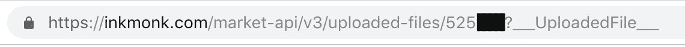
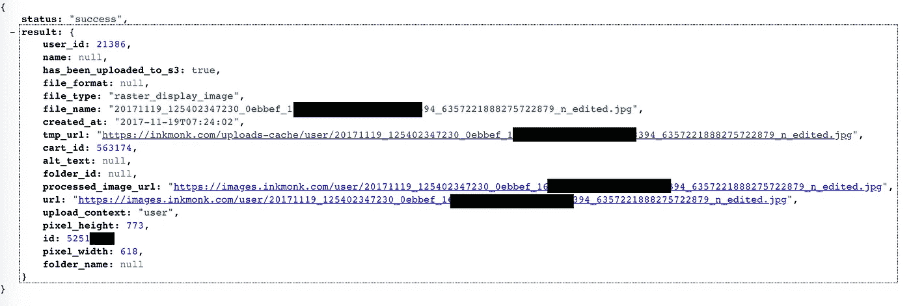
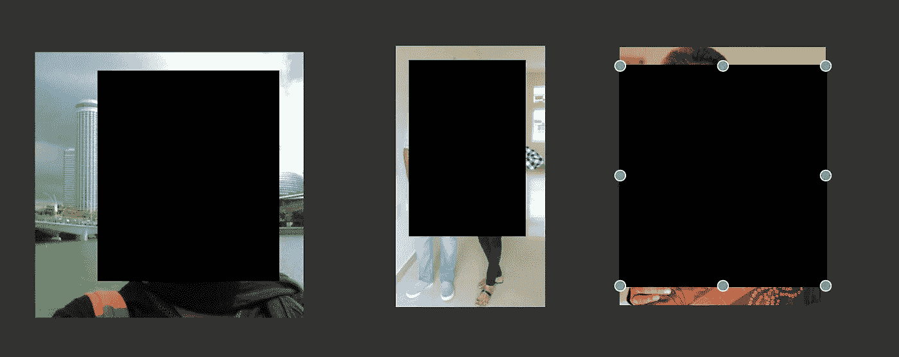

# 停止通过在线网站打印你的个人照片

> 原文：<https://medium.com/hackernoon/stop-printing-your-personal-photos-via-online-websites-155a9b925179>

## Inkmonk 中的安全漏洞

有很多网上商店提供打印你的照片、名片和 t 恤衫。但是他们会保护你与他们分享的照片或个人信息吗？我们会找到答案的。

我们在 Inkmonk.com(印度第一个印刷市场)发现了一个安全漏洞，它会通过一个简单的 API 泄露您上传的所有照片:

Vulnerable API

上述 API 中使用的 id 是串行可迭代的，响应如下所示:

API response

如果你点击上面回复中的一个网址，你会看到该网站用户上传的图片。它们根本不需要任何类型的认证。以下是一些例子:

2017 年 11 月 19 日向 InkMonk 报告了这个安全漏洞。他们承认问题的存在，并承诺在未来几天内修复。他们甚至发送了找到问题的好东西。

一个月后，我再次联系他们，说它仍然很脆弱，但没有得到任何回应。即使在一年零一个月过去后，写这篇文章时(2018 年 12 月 19 日)，它仍然没有固定。

可悲的是，在运营公司的其他方面，安全漏洞退居其次。

## 关键外卖

现在，如果你关心你的隐私，停止上传你的个人照片和像名片一样的个人信息。

对于技术公司，请将用户的安全放在首位。