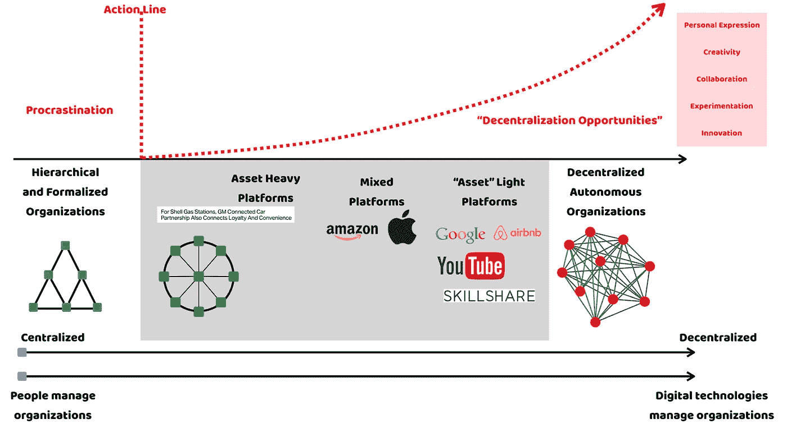

# 别拖了:“去中心化”来了！

> 原文：<https://medium.com/hackernoon/stop-procrastinating-decentralization-is-coming-2c00c7a31c24>

## 不要让当前的技术水平愚弄了你，拖了你的后腿

Photo by [Anton Repponen](https://unsplash.com/photos/IOCN-gwfwEU?utm_source=unsplash&utm_medium=referral&utm_content=creditCopyText) on [Unsplash](https://unsplash.com/search/photos/procrastinating?utm_source=unsplash&utm_medium=referral&utm_content=creditCopyText)

关于去中心化及其在数字化转型时代的重要性，已经有很多文章发表。该术语通常用于加密经济学领域，并与新技术相关联，如区块链和智能合约。

简而言之，集权和分权的区别可以从控制、协调、治理和组织方面来解释。在一个极端，我们发现有中央集权和独裁领导人或一群领导人的独裁政权。另一方面，我们看到社区管理的网络具有协作和透明的协调机制。

上周，我在格鲁吉亚(这个国家)讨论了组织扁平化和分散化的趋势，以及这对领导力、治理和工作的未来意味着什么。尽管该演示并不直接涉及新技术，但不可避免地讨论了分布式账本技术、硬币和代币的当前发展。

令人兴奋的是，“集权与分权”的趋势通常被视为非黑即白。我们的讨论最初得出以下结论:

*   令人怀疑的是，我们是否会看到区块链提倡的完全分散的社区/网络。
*   只要社区/组织/政府没有完全去中心化，一切照旧将会盛行。

这些结论很容易导致拖延。很多人都在谈论数字化转型，但大多数政府和企业并没有认真对待这个问题。

我们经常思考数字时代的优势(开博客，开 YouTube 频道等等。)，但通常不会相应行动。这就像我们(我在这里概括)在等待新的(完全)去中心化的世界首先出现。

虽然我理解这种行为，但格鲁吉亚的讨论使我认识到，权力下放已经在我们的社会中扎根。个人表达、合作(对话)的增加和透明度的提高已经让世界变得更加扁平。更有趣的是，这个扁平的世界为去中心化和点对点技术的进一步快速发展创造了一个肥沃的环境。

Decentralization in Business

我们应该停止拖延，开始利用去中心化世界的诸多好处。我们也应该更加认真地对待它的挑战。以下是我们在佐治亚州讨论的一些事情，让我意识到我们已经生活在“去中心化的未来”

## *孩子们梦寐以求的“新”工作*

当飞行员或消防员是我年轻时许多孩子的梦想工作，而成为“视频博客”/YouTuber 已经成为今天许多孩子的头号梦想。有趣的是，孩子们住在哪里似乎并不重要。这种“无边界结构”是分散式环境的特征之一。

事实上，我们看到孩子们已经有了成功的 YouTube 频道，这只会进一步鼓励他们在互联网上成名的梦想。个人表达、真实性以及对等交流和对话是新梦想的一些吸引人的特征。

 [## 一个 6 岁的孩子在 You Tube 上评论玩具一年赚了 1100 万美元

### 2017 年 12 月 11 日当大多数人回忆他们那个时代的儿童名人时，他们可能会想到儿童电影…

www.washingtonpost.com](https://www.washingtonpost.com/news/morning-mix/wp/2017/12/11/6-year-old-made-11-million-in-one-year-reviewing-toys-on-you-tube/?noredirect=on&utm_term=.004d12902312) 

## *隐私和数据收集*

我听到越来越多关于人们“谈论隐私”而没有“表现隐私”的言论。当然，大多数人(包括我)都认为隐私是必不可少的。然而，我也认为，如果能带来新的体验或更多的便利，我们愿意放弃一些隐私。即使是隐私狂热者也经常在他们的智能手机上启用“位置共享”。

欧洲的一般数据保护法规是我们许多人处理隐私方式的另一个例子。我们理应认真对待它，但似乎没有多少人明白他们“点击同意”时同意了什么(更不用说他们明白这些法规是如何执行的)。

 [## 政府无法处理技术监管。是时候让公司接手了

### 随着人们对无人驾驶汽车、人工智能和社交媒体给我们带来的风险越来越担忧，现在…

qz.com](https://qz.com/1316426/weve-disrupted-technology-now-its-time-to-disrupt-its-regulation/) 

## *传感器和数据分析*

传感器、相机、数据分析和人工智能让世界变得更加透明和扁平。在我们的数字世界中隐藏任何东西都是极其复杂的。此外，我们可以更快地意识到问题和可能的解决方案。

## *传统媒体的颠覆*

社交媒体正在改变新闻业。甚至可以说，社交媒体已经颠覆了传统媒体。越来越多的人依赖社交媒体作为他们的头号新闻来源。值得注意的是，即使是传统媒体也将社交媒体作为他们的主要信息来源。

## “中央集权政府”的终结？

信息一直是组织和政府中最重要的权力来源之一。独裁者总是确保他们只能获得信息或者信息被销毁。历史上焚烧书籍时有发生，这是一个很好的例子。但在数字时代，“隐藏和销毁信息”变得极其困难。许多信息都在云中，或者分布在人们的个人电脑和设备上。

还有更多。隐藏阴谋和其他“秘密计划”也变得非常困难(几乎不可能)。已经提到的传感器、摄像头和社交媒体让事情变得更加透明。

# **这一切意味着什么？**

人们经常期望的“完全成熟的”分权还不存在。但是去中心化的趋势是明显的。我们必须更好地准备，或者至少开始准备自己。没有时间拖延了:

*   在数字时代，个人表达、创造力和批判性反思已经成为更加重要的技能。必须围绕这些技能重新思考教育。
*   更扁平的世界导致更积极的合作。更多的合作导致更多的实验。更多的实验导致更多的创新。我很清楚，数字技术最终会带来更多更好的“去中心化”，为每个人提供更多的机会。但是我们必须现在就行动。
*   我们必须更加明智地对待权力下放。当然，目前的“点对点”技术和发展并不完美(滥用数据、假新闻等)。).但这些问题无法通过传统的、集中的手段(法规等)解决。).我们现在必须合作寻找分散的、技术驱动的解决方案。

*非常感谢您的阅读！请按住*👏*下面，还是留下评论吧。*

每周都有新的故事。因此，如果你关注我，你不会错过我关于数字技术如何改变我们生活、工作和学习方式的最新见解。