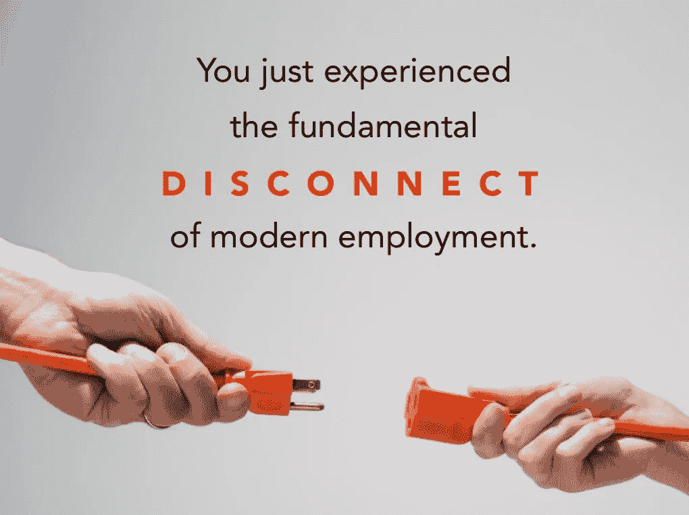
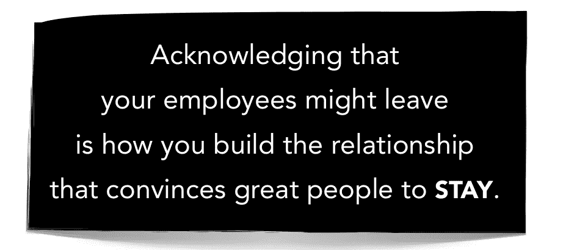

# 停止留住千禧一代的人才

> 原文：<https://medium.com/hackernoon/stop-retaining-millennial-talent-2fb543581a8f>

[Gulf News](http://gulfnews.com/guides/life/career/18-countries-where-millennials-work-the-longest-hours-1.1913819)

在我最近的文章中，我分享了到 2030 年，千禧一代将占劳动力的 75%,并将重塑我们的工作方式。

这篇文章是关于如何吸引和放弃顶尖千禧一代人才的指南。我知道这听起来有点疯狂，但不像大多数人，我已经接受了千禧一代每三年换一次工作。然而，雇主仍在招聘并试图留住千禧一代，就好像这是一份终身工作一样。

> 在工作中的[联盟](http://www.theallianceframework.com/)中，义务旅行代表着雇主和雇员对特定任务的道德承诺，这种承诺预计将持续有限的时间。理想的使命是互利的:公司获得新产品、客户、利润等。员工获得了新的技能、经验、关系等等。— [雷德·霍夫曼](https://www.linkedin.com/pulse/20141023153633-1213-tours-of-duty-how-to-organize-modern-employment/)

关于“千禧一代的工作问题”或“千禧一代有多懒”已经制造了太多噪音。当雇主们越来越纠结于“我如何吸引和留住最好的员工？”

对于千禧一代，我觉得雇主需要重新审视专门招聘增长、发展和保留。

## **1。招聘**

> “过去，很多公司都称我‘难以接近’，事实是，他们没有尽力去接近我。”

很多公司都犯了一个错误，那就是他们的招聘依据是:

1.找到通过酒吧测试的志同道合的人

2.寻找合适的技能

3.寻找与公司价值观一致的有发展潜力的人

优秀的招聘经理应该依次关注价值一致性、发展潜力和技能。对很多招聘经理来说，建立多元化和包容性的团队意味着承认他们潜意识中的偏见，并确保他们雇佣的不仅仅是志同道合的人。

对雇主来说，达成双赢是最大的绊脚石。根据德勤千禧调查，目前，千禧一代认为(75%)的企业专注于自己的议程，而不是帮助改善社会。

## **2。生长发育**

太多的雇主在入职培训时向员工介绍他们的价值观，然后直到年终年度评估时才再次提及。在此过程中，员工需要根据这些相同的价值观，将反馈调整到一个任意的框架中。许多人这样做是为了获得奖金、加薪或晋升。

The Alliance

这是可怕的，并促进了错误的行为。招聘经理需要建立信任，提前了解个人的愿望，以及公司可以提供哪些机会来帮助个人实现个人目标。招聘经理的工作是将个人目标与公司目标对应起来，以确保他们的任务适合个人完成，并且对双方都有利(这被称为“[职责之旅](https://www.linkedin.com/pulse/20141023153633-1213-tours-of-duty-how-to-organize-modern-employment/)”)。

像衡量绩效和 KPAs 这样的事情的人力资源技术很差，并且过于关注企业而不是消费者。我仍然感到惊讶的是，一些公司强迫员工使用绩效跟踪软件，这些软件自私地只关注公司议程，而不是个人。应该反过来，软件应该努力支持消费者在其职业生涯中的发展，不管他们在哪里工作。雇主应该从这类软件提供的关于员工目标、技能、接受的培训和他们可以做出贡献的发展领域的洞察力中受益。

## **3。保持力**

> *“不管你的职位如何，我们都在从事建立关系的工作。”*

最后，在留住人才方面，公司仍然像过去 50 多年那样雇佣和管理员工。尽管员工的任期已经从终身职业变为平均 3 年。根据美国的统计数据，英国没有相关数据，但在美国，55 岁至 64 岁工人的平均任期为 10.1 年，是 25 岁至 34 岁工人的 2.8 年的 3 倍多。

没有人投资长期关系。雇主会失去有价值的人才，因为他们无法理解员工的个人目标和发展计划。员工不断地审视市场，当一份更好的工作出现时，他们会离开，在那里他们可以得到更多的成长和发展。劳资关系破裂。

世界变化很快，部分原因是技术变化的速度加快。人力资源的角色需要改变，以适应这种更具流动性的员工队伍。**我认为未来的人力资源应该在理解、管理和建立与人才的长期关系方面发挥更好的作用。**人力资源部门的成员应负责三项额外职责:

1.  **互利合同** *(雇员和雇主都应明确雇佣的有限时间表以及双方将获得的价值，例如雇主获得更多利润+雇员获得更多技能)。*
2.  **建立和维护校友网络** *(可能会导致再次聘用和推荐，从而降低招聘成本)。*
3.  **帮助员工找到新工作** *(这将有助于公司预测人们什么时候想离开，帮助他们获得符合他们愿望的好职位，并在找到工作后保持良好的关系)。*

The paradox of retention

为雇主和雇员建立一个有效的关系网，关注的是你能为别人做什么，而不是他们能给你什么。公司过于关注个人能为他们做什么，而对他们在个人价值交换中能做什么关注不够。

人们希望在共同价值观和相互欣赏的基础上建立深入互利的关系。我认为所有公司都应该努力做到这一点。公司管理灵活员工的最好方法就是自己也变得更灵活。

*自从发表了这篇文章，我已经发布了一本名为* [***的电子书，讲述了你如何适应快速变化的世界，在这个世界里，谷歌的第一页代表着你的简历，我们每 2-5 年就会换一次工作:***](http://andyayim.com/ebook/)**[http://andyayim.com/ebook/](http://andyayim.com/ebook/)。**