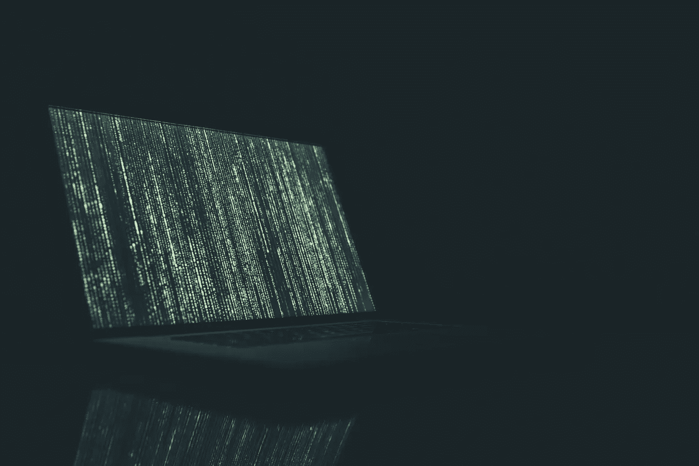

# 停止睡觉，真正拥有一个成功的早晨。

> 原文：<https://medium.com/hackernoon/stop-sleeping-and-actually-have-a-successful-morning-d3a9c7c0d731>

## 在一个为早起的人准备的世界里，夜猫子如何才能成功？

Photo by Kaboompics // Karolina from Pexels [https://www.pexels.com/photo/coffee-apple-laptop-working-54283/](https://www.pexels.com/photo/coffee-apple-laptop-working-54283/)

研究表明，比别人起得早的人更成功。

他们当然是！如果你从事的是典型的早上 8 点到下午 5 点的工作(和大多数人一样)，那么早起会给你 3 到 4 个小时的领先。

此外，这 3-4 个小时是富有成效的。

当我们其他人利用下班时间去网飞狂欢时，早起的人正在创造、做、[学习](https://hackernoon.com/tagged/learning)等。

此外，如果你醒得早，不是为了看《网飞》(试着告诉别人你会在凌晨 4 点起床去看《网飞》——即使阅读听起来很荒谬)，所以当你早起时，你会做有成效的事情。

如果你想成为成功的 T4，你只有两个选择:

1.  成为一个早起的人。
2.  改变你在下午 5 点-凌晨 1 点做的事情(给你一个提示:不是网飞)

我不是一个早起的人，直到最近我才成功地改变了下班后的空闲时间。但是，我只是通过测试和评估结果来做出这些改变。

1.  成为早起的人。

我试着把闹钟设定在凌晨 4 点。

但是，我发现熬夜和强迫自己起床一周只有两次效果。在那两天里，我对这个世界的任何事情都感到愤怒。

**解决方法:** *关注你的睡觉时间。*

作为夜猫子，我们喜欢熬夜。一旦开始困倦，我们的大脑开始分泌创造性的汁液，很难入睡。

这里有一个秘密——这也发生在早上。

塞缪尔·比姆(又名铁和酒)是我最喜欢的艺术家之一。在 NPR 的一场小桌音乐会上，萨姆谈到利用早晨写作，因为它“接近潜意识”

You should listen to the whole thing, but the question I reference starts at 3:20.

我从来没有能够描述为什么我的创造力在晚上回升，但意识到这就是原因。当我累了的时候，我的创造力就爆发了。

但是，你可以在清晨有同样的感觉。关键的区别是你不会在键盘上睡着。

此外，你会觉得自己完成了一些事情；因此，为你接下来的一天定下一个好的基调。

2.改变你在下午 5 点到凌晨 1 点所做的事情

我们夜猫子的另一个选择是改变下班后的日常工作。

花点时间想想你昨天下班后做了什么。

以下是我的最佳猜测(不一定按照这个顺序):

*   吃晚饭
*   看电视
*   浏览社交媒体

我敢打赌，你们大多数人至少做了这三件事情中的两件。你们中的一些人可能浏览过互联网上的文章，我把它们归类在第三个项目下，因为你们可能在使用 Twitter。

但是，你怎么能指望写作、创业、变得健康等等。当你忙着看超过 5 小时的电视节目时？

第一步:关掉电视(手机和平板电脑也算)。事实上，取消你的网飞订阅，因为你可以用这笔钱做其他事情。

第二步:起床去做你一直梦想做的事情。

让我们做一些数学。

每天看 5 小时电视 X 每年 365 天=每年 1，825 小时

也就是说，每年你坐在沙发上看电视的时间超过 76 天。

Photo by [NeONBRAND](https://unsplash.com/photos/KYxXMTpTzek?utm_source=unsplash&utm_medium=referral&utm_content=creditCopyText) on [Unsplash](https://unsplash.com/search/photos/time?utm_source=unsplash&utm_medium=referral&utm_content=creditCopyText)

你能感觉到时间在流逝吗？

在你决定哪种选择适合你之前，让我们先来看看几个大缺点:

1.  [《权力的游戏》将于美国东部时间晚上 9 点开播，预计剧集会更长。](https://www.vanityfair.com/hollywood/2017/07/game-of-thrones-season-8-feature-length-episodes)

换句话说，如果你想早点起床，你就得早点睡觉。因此，你会错过一些只在晚上发生的事情。

**解决方案:流式传输！！！！**

现在是 2018 年。当你在跑步机上行走的时候，在你的手机上观看。

2.朋友晚上 9 点不睡觉。

**解决方案:**你无法回避这个问题。你只能控制自己的行为。

有时你不得不为你想要的东西做出牺牲，这将意味着错过。

你只需要问问自己…

Photo by [Jonas Svidras](https://unsplash.com/photos/Hx2YqZB4Dwc?utm_source=unsplash&utm_medium=referral&utm_content=creditCopyText) on [Unsplash](https://unsplash.com/search/photos/quotes?utm_source=unsplash&utm_medium=referral&utm_content=creditCopyText)

# 方法:

不幸的是，这些选择并不是神奇的解决方案。

我不是莫斐斯。

你不是尼奥(但那会有多酷？).

你必须对每一个进行实验，找到你喜欢的那个。

如果你选择选项 1，有无数的文章和书籍都是关于“如何成为一个早起的人”

他们基本上都归结为遵守纪律，每晚在同一时间上床睡觉，直到它成为习惯。

除了加里·维纳查克，我还没见过多少人宣传选项 2。

所以，如果你走那条路，我建议你读读他的书，跟着他走。

夜猫子的选择相当二元。但是，如果你坚持其中的一条，你会发现自己实现了目标。

记住，成功的真正关键是专注和毅力。

如果你花时间专注于你的目标，并在起起伏伏中坚持不懈，你会成功的。