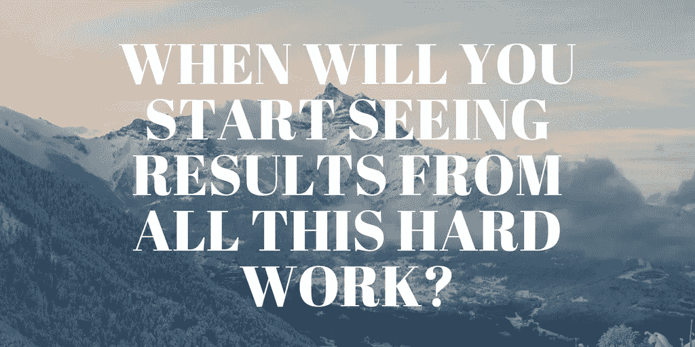
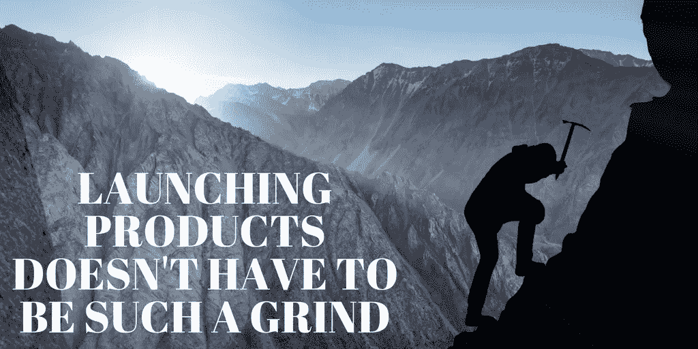
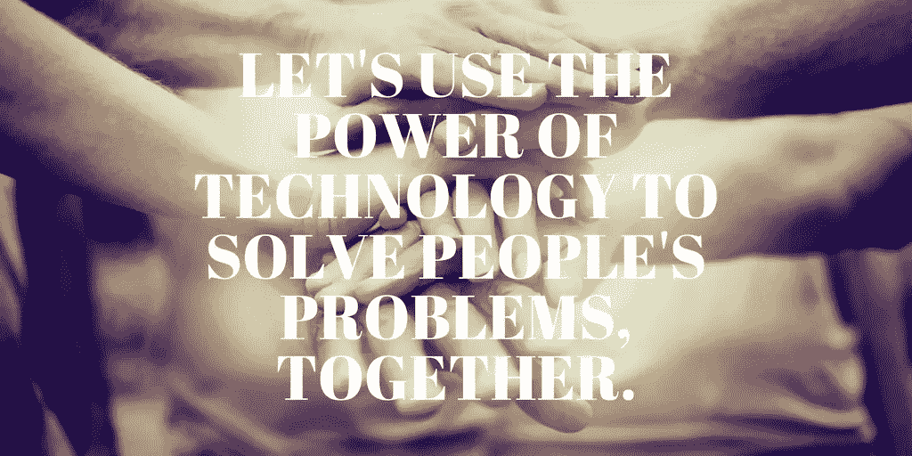

# 不要再努力追求高增长了

> 原文：<https://medium.com/hackernoon/stop-trying-to-hustle-your-way-to-high-growth-2f065ecb747f>

## 制造成功的产品不是靠努力或运气，而是用科学和同情心

告诉我这听起来是否熟悉:

你努力工作来打造你的产品，但不知何故，你梦想的成功似乎总是遥不可及。你正在做专家说你应该做的一切，但这仍然不够。

你和用户交谈，但是他们的反馈并不总是有意义的。当你建造他们要求的东西时，他们不会使用它。

如果用户知道他们真正想要什么，你早就给他们了。

你与你的团队分享令人兴奋的想法，试图驾驭这艘船，并期待你的团队会为实现你的要求而兴奋不已。相反，他们质疑你的一举一动。

*如果其他人也像你一样对这个产品充满热情，你就会按时、按预算地运送你所设想的一切。*

尽管如此，你还是尽可能经常地发布，因为你已经听到了像雷德·霍夫曼的建议，如果你没有为你的第一个版本感到尴尬，那你就发布得太晚了。但是当你向人们展示你的产品时，他们会把它拆开，告诉你所有的错误。

*如果你一直等到它符合你的愿景，你的产品就会自我推销，因为你会让用户告诉每个人他们有多喜欢它。*

你阅读文章，听播客，试图了解你错过了什么，但最终你会觉得自己淹没在建议和其他人的成功故事中。其他人似乎都做对了。

你什么时候会开始看到所有这些努力的成果？

你开始怀疑你听到的这些故事是否都是谎言。你不像他们那样管用。但是你要坚持下去，因为你不是一个半途而废的人。日复一日的生活是艰苦的，但你不害怕艰苦的工作。

*当你最终推出将推动曲棍球棒增长的大功能时，一切都会有回报，对吗？*

## 光是写这些就让我感到有压力——因为我经历过。

十年前，我作为一家初创公司团队的一员，过着这样的生活。我们富有创造力和激情。我们在努力工作，我们的愿景和我们周围的成功故事支撑着我们。我们愿意为我们的梦想做出牺牲，靠微薄的预算生活，放弃我们本可以在其他地方赚到的薪水，相信我们需要抓住机会，这样会有回报。这本来是可能的——这个愿景很棒。事实上，它如此伟大，以至于你可能会认出一个今天成功的产品，它或多或少做了我们十年前预想的事情。

即使过了这么多年，说起那个故事还是很痛苦。长话短说，我们从未达到产品与市场的契合。经过几年的努力，我开始了产品管理生涯，为别人的创业公司开发产品。在 scaling startups 担任产品经理的这些年里，我学到了很多东西，我真希望自己在十年前就知道。我已经成功发布了十几款产品，现在我可以自信地说:

## 发布产品不一定要这么辛苦。

想象一下，你在不到 3 个月的时间里推出你的产品，从你的目标用户那里获得好评。他们喜欢它为他们解决了一个真正的问题，并兴奋地向你索取更多。他们要求的东西正是你期望他们接下来想要的——你已经在做的东西。这些用户很乐意为你的原型提供反馈，你可以自信地制定一个计划，让你从这个阶段进入你的愿景。一年后，你的关键指标比开始时高了 10 倍，你兴奋地发展你的产品和团队，因为每个人都热情地朝着你的愿景前进。

听起来像一场梦，不是吗？

我想告诉你这不是遥不可及的。这个梦想我已经实现过好几次了，有一个移动健康信息平台，有一个 UX 为 MediaMath 的广告技术平台重新设计和重新搭建的平台，还有 Shutterstock Editor(一个为非设计师设计专业设计的设计工具)。

> 那么秘诀是什么呢？仅仅是运气吗？对一些公司来说——做了一次但很难再做一次的公司——也许是这样的。但对于我们这些一次又一次推出成功新产品的创始人和产品负责人来说，这不是运气，而是科学——产品科学。

## 为什么您应该将科学应用到您的产品流程中

产品科学是一种可重复的、基于科学的方法，用于在不确定的世界中构建高增长产品。它将**用户科学**(应用心理学和行为科学原理来理解和预测用户行为)与**精益和敏捷开发实践**、**现代管理原则和意向文化设置**相结合，打造创新产品和顶级产品团队。

像脸书、亚马逊和网飞这样的世界顶级科技公司使用产品科学的原理来颠覆巨型市场并永远改变世界。这些科技巨头雇佣那些在用户研究、行为设计、数据科学、产品管理和增长营销等领域拥有经验的人，他们使用这些技能来开发基于证据的产品战略，从而开发出我们日常使用的产品。

在技术领域工作的十年，无论是生存还是死亡，都教会了我如何制造人们喜爱的产品，现在我的任务是把它教给每一个想推出成功产品的人。让我们一起用产品科学来解决人们的问题，并推进您的愿景。

你会加入我吗？

从产品经理和设计师到高管，从 Plectica 和精益创业公司这样的初创公司到 Shutterstock 和 Weight Watchers 这样的上市公司，我都曾指导过每个人完善他们对产品的愿景，并一起制定更好的战略。

*现在我也在教别人怎么做。这里有两种加入方式:*

*欢迎参加我的下一个* [*数据驱动的产品决策*](https://h2rproductscience.com/workshops/data-driven-product-decisions-workshop/) *研讨会，亲身体验如何决定哪些产品机会值得追求。*

*非常感谢*[*Jessica Schimm*](/@JessicaSchimm)*在编辑本文时给予的帮助。*

*原载于* [*H2R 产品科学*](https://h2rproductscience.com/stop-trying-to-hustle-your-way-to-high-growth/) *。*