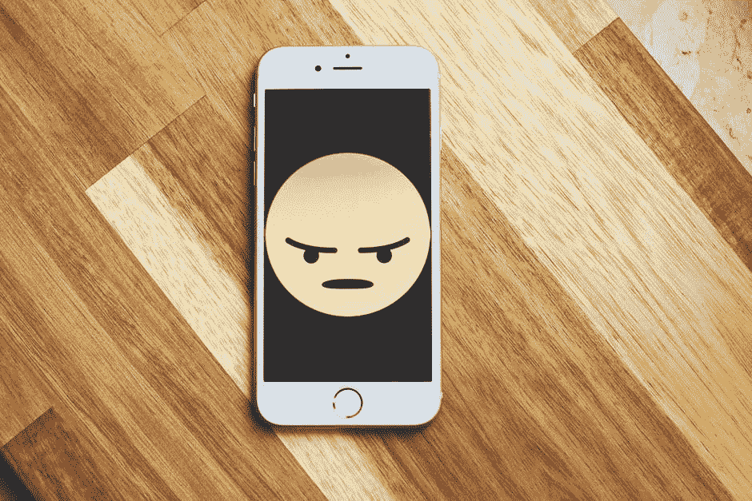
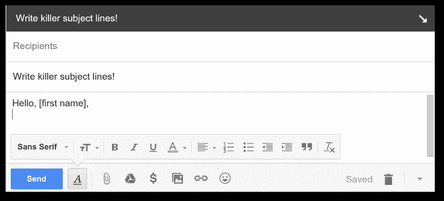

# 邮件噱头正在毁掉你冰冷的邮件

> 原文：<https://medium.com/hackernoon/stop-using-gimmicks-for-your-cold-emails-b2116be92082>

[Image Source](https://www.pexels.com/photo/silver-iphone-6-987585/)

# 为什么(适当的)冷邮件很重要？

冷邮件是指给一个不知道你是谁的人发邮件，以达到某种目的。如果处理得当，冰冷的电子邮件可以成为一个非常强大和多功能的工具，用来建立你的职业关系网，为你的企业争取新客户，或者只是结交新朋友。

我已经使用冷电子邮件来实现以上所有。我成功地给首席执行官、投资者、书籍作者、教授等等发了冷邮件。其他人也成功地利用冰冷的电子邮件来改变他们的生意和社交圈。但我看到了一个越来越令人担忧的趋势:使用噱头。

营销人员、企业或职业人士经常使用这些花招来吸引人们对他们电子邮件的注意。这些电子邮件伎俩通常来自一些企业家“大师”，他们向你承诺，如果你只需支付 10 美元，他就会给你他的“十大电子邮件技巧”，以保证对方会回复邮件。

我想消除这种观念，即有任何特定的花招可以让你在一封冰冷的电子邮件中几乎 100%成功。即使有这样一个噱头，保证冷电子邮件的成功，你肯定不能只花 10 美元买它。

我将向你展示你应该避免的那种冷冰冰的电子邮件花招。

# 冰冷的电子邮件噱头会适得其反

## 噱头主题行

这就是我所说的“电子邮件点击诱饵花招”。一些商业/企业家大师建议你在冰冷的邮件中使用一些噱头主题来增加对方打开邮件的可能性。

这有什么问题？仅仅因为有人打开了你的电子邮件并不意味着他们会自动购买你的产品或服务。只有当它与实现他们的目标或梦想相关时，他们才会购买。使用噱头主题行不会改变这一点。

例如，一个例子噱头主题行是:“我很失望克里斯”。

如果我收到一封主题为“我让谁失望了”的电子邮件，我会想，这是与个人还是商业有关。我决定点击打开邮件，邮件正文写道:

“我很失望，因为你没有跟进我上次的电话。我们仍然认为您可以从使用 XYZ 服务中真正受益，在那里您只需每月支付 19.99 美元……”

希望你能抓住要点。我迅速删除了这封邮件，并设置了一个过滤器来阻止任何来自该邮件地址的邮件。

再说一次，如果你的冰冷邮件没有转化成有用的东西，那么你是否能获得难以置信的高打开率并不重要。我可以想到很多噱头主题行，保证几乎 100%的开放率，但这并不意味着你应该使用它们。

此外，这种花招降低了人们对你的品牌的信任，因为它表明你的主题与你邮件的正文毫无关系。当营销人员和销售人员使用这样的技巧让人们打开他们的电子邮件时，这只会给人留下不好的印象。

## 你应该使用哪些冷冰冰的邮件主题？

当你不确定该用什么作为冰冷邮件的主题时，保持简单。谈到冷冰冰的邮件，这里有一个你应该遵循的总体框架:

*   尽可能使主题更加具体、开放和诚实。
*   尽量使主题个性化(例如，使用对方的姓氏，提及其业务名称等)。).
*   如果看起来像是噱头，那就是噱头。扔掉它，再试一次。
*   在电子邮件中使用这个人的名字。

以下是一些你可以使用的有效的主题:

*   嘿[姓名]，问个小问题
*   关于[公司名称]的快速请求
*   希望与[决策者]取得联系
*   想问你关于[特定主题]的问题

# 为什么噱头通常无效？

好吧，让我们言归正传。我并不是说在你冰冷的邮件中使用花招永远不会奏效。他们可以工作。事实上，你可以使用最荒谬、最夸张的冷冰冰的电子邮件伎俩，平均成功率只有 0.1%，如果你向成千上万的人群发电子邮件，仍然会有一些客户。

这并不意味着你应该出去做那件事。学会写更好的冷邮件。联系某人时，不要依赖冷冰冰的电子邮件噱头。阅读关于如何写好文案的书籍。研究有效的电子邮件营销活动以及它们是如何成功的。

只是请，无论你做什么，请停止使用冰冷的电子邮件噱头。