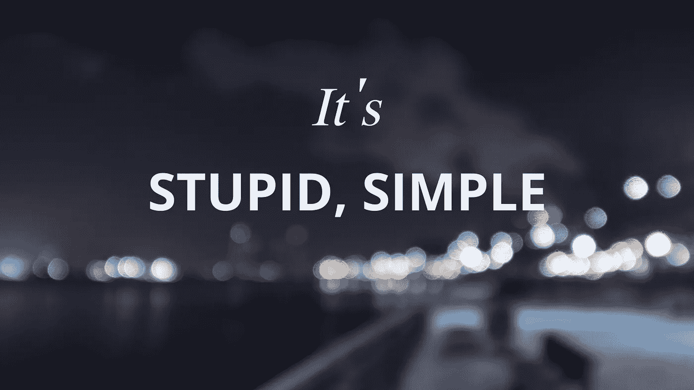
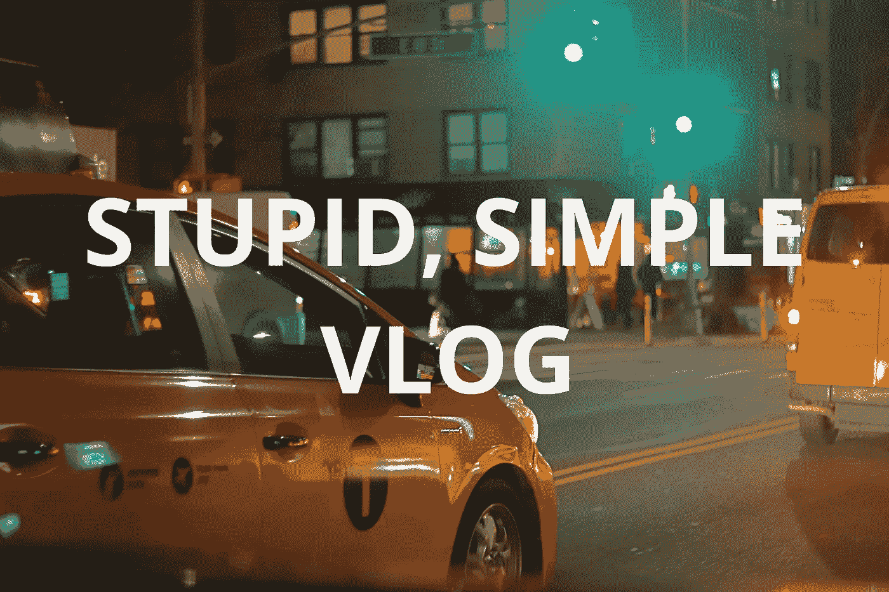

# 停止等待灵感来行动的 3 个激励因素！

> 原文：<https://medium.com/hackernoon/stop-waiting-for-inspiration-to-act-c58d951e8fb1>

## 为什么我要成为 2018 年的创造者

[My YouTube channel](https://tinyurl.com/yc4yb77t) — maybe throw a sub my way?

2018 年，我决定成为一名创造者。视频、照片、播客、博客——凡是你能想到的，我都打算在今年创造出来。多年来，我一直对所有这些内容着迷和上瘾，并积累了一堆想法来玩每一个。但是尽管我想做，我还是一直在等待灵感或者其他什么东西来推动我。问题是，如果你一生都在等待什么东西来推动你，你会等很久。所以我决定表演。

让我的心灵明白这一点并不容易——否则我会在几年前就开始了。毕竟；我有自己喜欢的工作，没有受过以上任何一种艺术形式的正式训练，也没有人强迫我；所以我为什么要致力于一堆新工作呢？推动我前进的是，我没有抗拒，而是决定融入我的爱、渴望和一些挫折的感觉。

# 1.**爱……**为“创造”

我喜欢创造的想法。我被制造以前不存在的东西的想法吸引住了。在以前做顾问的时候，我遇到的最大问题之一是，你去解决别人的问题，却很少留下来看结果。最终，你几乎永远不会回头说“我创造了它——它因我而存在。”当你除了提升自己的职业生涯之外，没有什么可以展示的结果时，很难评估你对这个世界产生了什么影响或影响。通过创造一些东西，你把你自己的一些东西和遗产传递给它，就像你传递给你制作的任何一件艺术品(或内容)一样。创造一些东西可以给世界带来欢乐，给别人留下印象，同时给世界留下你的印记。

# 2.渴望…学习和分享

这些年来，我一直被我最喜欢的创作者和艺术家所吸引，也有很多问题。你怎么计划做什么？你需要关注什么才能成功？当你在公共场合对着摄像机说话时，人们会盯着你看吗？导致我想知道更多知识的更大漏洞的基本问题。每走一步，我都渴望知道怎样才能成为一个内容被观看数百万次的人。

但是仅仅为自己收集知识并不是我真正追求的。我今年的目标之一是与我周围的人分享我的经历。我知道很多人很想投入到音乐、视频或其他内容的创作中，但是需要一些帮助来解决我一直在探索的问题:你需要什么，如何开始？

# 3.挫折感……只思考不行动

我喜欢计划。我喜欢列表、便利贴和思考各种情况来回答“如果会怎样？”但是你永远不会真正知道事情是如何发展的，除非你真正去尝试。最终，我感到沮丧，因为我有越来越多的想法和概念，但却没有付诸行动。我陷入了我们所有人都会陷入的困境，当生活足够舒适，不需要改变，但仍然让你想要更好的东西。我害怕打破常规，让自己尴尬，害怕犯错。这不仅没有成效，而且还非常有害，因为它阻止了我去冒险和变得更有创造力。这一系列认识是开始行动的最后推动力之一。不要误解我——我仍然害怕所有这些事情——但我不再让这些事情支配我的行动，而是用行动来克服我对不作为的挫败感。

所以这就是我在这里的原因！我开始每周在我的 YouTube 频道上发布帖子，一个播客，并继续我的博客，同时随着时间的推移尝试其他创造性的项目。如果你有想尝试的东西；让我知道，让我们实现它！

## 加入我的旅程，和我一起学习！

**YouTube**:【https://www.youtube.com/channel/UC-uk3HpFde1606Jmh6UMaFg 

**insta gram**:[@ stupidsimplelife](https://www.instagram.com/stupidsimplelife/)

**推特**:[@ savar screen](https://twitter.com/SavarSareen)

**Flickr**:[https://www.flickr.com/photos/152735956@N08/](https://www.flickr.com/photos/152735956@N08/)

**套件(在那里你可以找到我用的所有齿轮)**:[https://kit.com/StupidSimple](https://kit.com/StupidSimple)