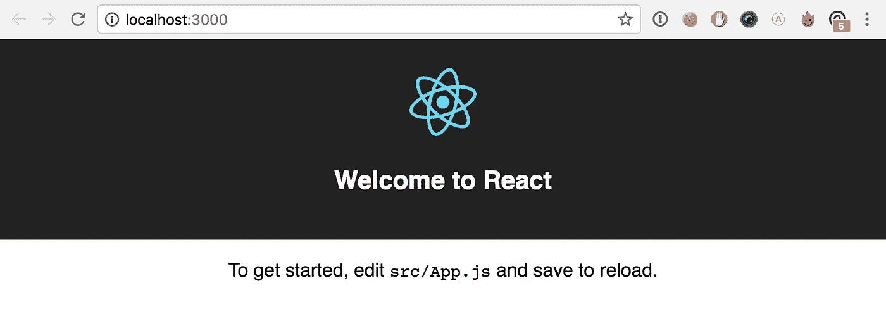

# 在与 apollo-link-state 的反应中存储本地状态

> 原文：<https://medium.com/hackernoon/storing-local-state-in-react-with-apollo-link-state-738f6ca45569>

[**GraphQL**](https://graphql-docs.com/) 和它的生态系统非常棒，而 [**阿波罗**](https://github.com/apollographql) 让使用它成为一种乐趣。如果你现在正在编写一个 javascript 应用程序，我不能过分强调这两种技术会使这个过程变得多么简单。

一个 **pollo** 最近**离开了** [**Redux**](https://redux.js.org/) 并释放了自己的机制来帮助你在他们的缓存中存储本地状态。我对这一举措感到非常兴奋，并相信这将进一步简化前端开发的过程。然而，它确实增加了复杂性，因为目前还没有很多资源或第三方库支持 **apollo-link-state** 。本教程旨在帮助改变这种情况。😀

本教程结束时，您将拥有:

1.  使用`create-react-app`设置一个 React 项目
2.  使用`apollo-link-state`存储和查询信息
3.  在`recompose`的帮助下写了一些无状态组件

> *特别感谢*yarn global add create-react-app# Use it to create a React Project
> create-react-app link_state_demo# Navigate to the project
> cd link_state_demo
> 
> ## 添加其他依赖项
> 
> 接下来，我们想在其他支持库中添加`apollo`、`apollo-link-state`、`recompose`和`lodash`。
> 
> ```
> yarn add apollo-boost apollo-client-preset apollo-link-state react-apollo graphql-tag graphql lodash recompose
> ```
> 
> ## 踢它！
> 
> 就是这么简单，现在我们只需启动我们的开发服务器就可以了！
> 
> ```
> yarn start
> ```
> 
> *您现在应该能够导航到* `*localhost:3000*` *并看到您的应用程序正在运行。*
> 
> 
> 
> create-react-app running out of the box
> 
> # 将 App.js 修改为无状态
> 
> ***可选！***
> 
> 我更喜欢使用 React 的无状态组件来编写我的组件，因为我相信它有助于通过以下方式简化我的代码:
> 
> 1.  减少样板文件
> 2.  增加可读性
> 3.  令人沮丧的生命周期方法
> 4.  鼓励 UI 和应用程序逻辑之间的健康分离
> 
> *尽管这些只是观点，并不是使用本演示所必需的！*
> 
> 切换到使用无状态组件就像将下面的代码复制到您的`app.js`文件中一样简单:
> 
> # 设置 Apollo 客户端
> 
> 首先，我们必须设置我们的阿波罗客户端。这相当简单，只需要修改一个现有文件，然后在另一个文件上创建。
> 
> ## 设置 ApolloProvider
> 
> 打开`index.js`，将`<App/>`包裹在阿波罗的`ApolloProvider`中。
> 
> ## 设置 ApolloClient
> 
> 创建一个名为`Client.js`的新文件，并初始化缓存和`ApolloClient`
> 
> # 设置支持待办事项列表的状态逻辑
> 
> ***(一个待办事项演示！多么有创意！)***
> 
> 既然我们已经设置好了 Apollo 客户机，是时候开始添加方法、查询和组件了，它们将允许我们在 Apollo 缓存中存储和修改本地状态。
> 
> ## 将 apollo-link-state 添加到 Client.js
> 
> 下面你会发现一个更新的`Client.js`，它完全实现了使用`apollo-link-state`处理待办事项列表状态的所有必要工具。但是，在深入研究之前，您应该了解这些部分的作用:
> 
> **默认值**
> 
> 当应用程序加载时，我们的本地缓存返回到缺省值。
> 
> **图表 QL**
> 
> 此部分包含 GraphQL 查询，这些查询以下列方式使用:
> 
> 1.  从缓存中查找数据
> 2.  查找将数据插入缓存的位置
> 
> 需要注意一些不同之处:
> 
> *`***@client***`***装饰者****
> 
> *这告诉 Apollo 这些查询的目标是本地缓存。*
> 
> ****查询 vs*突变***
> 
> *在`@client`上下文中的`query`关键字确实如你所料，它在缓存中寻找数据并返回它。*
> 
> *然而`mutation`关键字告诉我们，它需要修改缓存中的一些东西。为了做到这一点，变异在解析器对象中寻找一个同名的函数，我们将它传递给`CreateClientStore`，我们将进一步定义它。*
> 
> ***缓存突变***
> 
> *这些是我们的变异查询所调用的函数。它们被赋予发送给查询的参数和一个缓存实例，目的是我们使用它们来更新内部保存的状态。*
> 
> ***商店***
> 
> *在这里，我们将缓存、客户端状态、默认值、解析器和 Apollo 客户端联系在一起，让 ApolloProvider 能够使用`apollo-link-state`存储状态。*
> 
> ***助手***
> 
> *这里，我们创建了一个高阶组件，帮助子组件访问与我们刚刚设置的状态机制交互所需的功能。*
> 
> ***这一切看起来像什么***
> 
> # *设置 TodoList 组件*
> 
> *接下来，我们需要实际使用我们上面定义的查询。为此，我们将创建一个基本的待办事项列表，让我们可以向列表中添加项目和清除列表。*
> 
> ## *创建 TodoList.js*
> 
> ## *将 TodoList 添加到我们的应用程序*
> 
> *然后我们只需要将`TodoList`添加到我们的`App`容器中，就可以开始了。*
> 
> ## *它应该是什么样子*
> 
> *导航回`localhost:3000`，您应该会看到:*
> 
> **
> 
> *就是这样！您现在使用`apollo-link-state`在本地存储状态*
> 
> **
> 
> # *包裹*
> 
> *从长远来看，简单的解决方案和简单的架构会带来更好、更稳定的系统。虽然 GraphQL 帮助简化了查询逻辑，但 Apollo 团队也做了同样多的工作来简化其余部分。因此，我很乐意尽可能地包含这两种技术。*
> 
> *在这种特殊情况下,`apollo-link-state`被证明是 Redux 的有效替代方案，使我免于:*
> 
> 1.  *添加另一种技术和模式*
> 2.  *将我的州分成多个位置*
> 3.  *添加多个方法来获取应用程序状态。*
> 
> *到目前为止，唯一的警告是链接状态缺少一些 Redux 社区所享有的工具和第三方库支持，但我相信这是一个非常小且非常暂时的问题。*
> 
> # *接下来*
> 
> *我们深入探讨在处理`N`额外商店时，如何设置`apollo-link-state`以取得成功。*
> 
> *[](/@bnchrch/setting-up-apollo-link-state-for-multiple-stores-4cf54fdb1e00) [## 为多个商店设置阿波罗链接状态
> 
> ### 概观
> 
> medium.com](/@bnchrch/setting-up-apollo-link-state-for-multiple-stores-4cf54fdb1e00) 
> 
> > ***🧞‍* 这是开源！你可以在 Github** 上找到[](https://github.com/bechurch/link_state_demo)
> > 
> > **❤️:我只写编程和远程工作。如果你在推特上关注我，我不会浪费你的时间。***