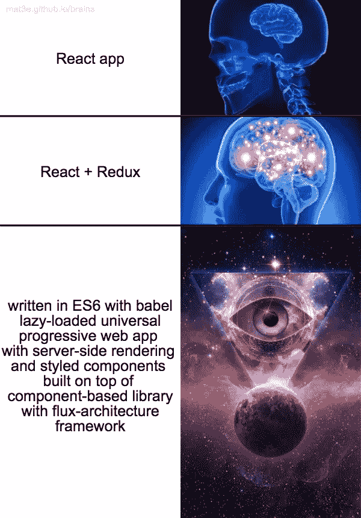

# React 应用的基本建议。

> 原文：<https://medium.com/hackernoon/strategical-view-part-1-9a1da295a3c1>

# 用于什么…

几乎每个图书馆都有一个“克隆体”。您可以找到多个库来解决特定的任务。这意味着当你看到一个对 [React](https://hackernoon.com/tagged/react) 路由器的引用时，要确保这个库是“克隆”的，但不是 Preact。

# 基于组件的库

可以用 React/Preact/Inferno。没关系。React 是众所周知的和规范的。Preact 很小，只能在生产中使用。

> 但这个“速度”在“现实生活”中并不重要。90%的速度问题都是 app 优化不好造成的，而不是一个框架。所以选择什么库没有区别(**除了大小**)。

# 状态管理

mobx/Redux/Flux/Kea——没关系。

> “承诺中间件”允许使用承诺作为行动的有效载荷。Redux 中异步的最简单解决方案。

# 样式和样式组件

> “样式组件”——设计方法。
> `styled-components`—React 中设计样式组件的库。

*   `styled-components` —臃肿，需要对 CSS 方法论有很好的理解。但是它非常强大并且有丰富的 API。
*   `glamorous` —类似于“样式化组件”的 API，轻量级，性能良好。
*   `radium` + `styled-jsx` + `glamor`也很酷。

> “在组件中思考，在组件中造型”。

## “样式化组件”有什么问题？

*   有时很难覆盖你已经在使用的 CSS 框架。
*   如果您是样式化组件的新手，您可能会将应用程序逻辑与样式直接联系起来。不正确。

处理`styled-components`时的一些建议:

*   不要为应用程序中的每个组件都设计一个样式化的组件。仅将`styled-components`用于可重复使用/通用组件。
*   HOCs 可以节省你一些时间。
*   不要混淆逻辑道具和 UI 道具。

# 工具包和网络包

> 查看[**“next . js，Razzle，CRA。为什么你应该在下一个项目中使用它们。”**](https://hackernoon.com/next-js-razzle-cra-why-you-should-use-them-for-a-next-project-a78d320de97f) 了解为什么工具包更好的更多信息。

> 不要从头开始写 webpack.config！
> 
> 没有样板，只有工具包。

*   **Creact-react-app** ， **Next.js** ，**包裹**，**盖茨比。**
*   服务器(如果有)和客户端都必须有 HMR。

> [**【牛逼-工具包】**列表](https://github.com/reyronald/awesome-toolkits)。

您可能错过的 Webpack 插件:

*   `circular-dependency-plugin` —检测循环依赖关系
*   `autodll-webpack-plugin` —仅重新编译没有供应商的更新代码
*   `write-file-webpack-plugin` —将文件从内存文件系统写入真实文件系统。
*   `assets-webpack-plugin` —从编译器获取 webpack 统计数据

# 用户界面

也许，[这篇文章通过对不同 UI 框架的比较](https://hackernoon.com/the-coolest-react-ui-frameworks-for-your-new-react-app-ad699fffd651)可以帮助你为下一个项目选择一个框架。

如果你想要一个超快的 UI 框架，那么选择由 CSS-in-JS 或 inline-css 库支持的框架。

> 蚂蚁设计和 Material-UI 都很棒。

# 静态分型

**肯定是打字稿。**

> Flow 完全没有经过优化，缺少很多特性。MS > FB *😉*

# 文件夹结构

构造 React/Redux 项目有许多方法。请记住，这种结构可能会因您的设置而异。例如，Next.js 和 CRA 有一些预定义的文件夹。

## “典型结构”

没有推荐的结构。从任何简单的结构开始，并不断完善。

> 比较一些开源的 React/Redux 项目，你会发现它们之间有很大的不同。
> 
> 你可以使用*“鸭子”方法。
> 优点:松耦合，代码清晰。缺点:不那么干。*

# 成分

## 组件 vs 纯组件 vs“无状态组件”

> [组件类型之间的差异。](https://stackoverflow.com/questions/40703675/react-functional-stateless-component-purecomponent-component-what-are-the-dif)

改变组件的类型并不能保证性能的提高。

## /组件

除了“原子”方法和其他启发式方法，没有关于构建`/components`文件夹的实用建议。

> 注意:“原子”方法**不起作用！大多数“原子”方法只会让事情变得更糟！**只有**你的团队和你**真正知道如何以最佳方式构建`/components`

最可靠的方法之一——将所有共享组件存储在`/components`文件夹中。这对于一个中小型项目来说已经足够了。

> 在开发的过程中，你会找到构建`/components` **的最佳方式。**不要过早开始优化！****

# 艾滋病患者

使用离线插件。

# 埃斯林特

标准代码样式是❤️.
如果你关心 a11y(可访问性)—添加`eslint-plugin-jsx-a11y`。

> 一些默认的 StandardJS 规则很烦人，比如`*no-unused-vars*`和`*indent*`。

# 巴比伦式的城市

生产中增加`babel-preset-react-optimize`。如果你使用`styled-components`，别忘了添加`styled-components`插件。

# 还原剂

> [解剖 Twitter 的 Redux Store](/statuscode/dissecting-twitters-redux-store-d7280b62c6b1) 。

任何应用程序中 95%的状态都可以解释为:

Redux 开发的主要关键是:

> 状态=内存数据库。
> 
> 在状态下复制数据是可以的。[反规格化]

# 选择器

> 永远使用选择器！

什么是“选择器”？
如果你的`mapStateToProps`看起来像:

那你就错了，因为:

*   每次计算某些值的方式发生变化时，您都必须在整个应用程序中进行更改。
*   每当你的状态结构改变时，你必须在应用程序中修改属性的路径。
*   您将计算逻辑(*选择逻辑*)连接到容器。

相反:

感谢阅读！
Github:[@ met new](https://github.com/Metnew)
推特: [@vladimir_metnew](https://twitter.com/vladimir_metnew)