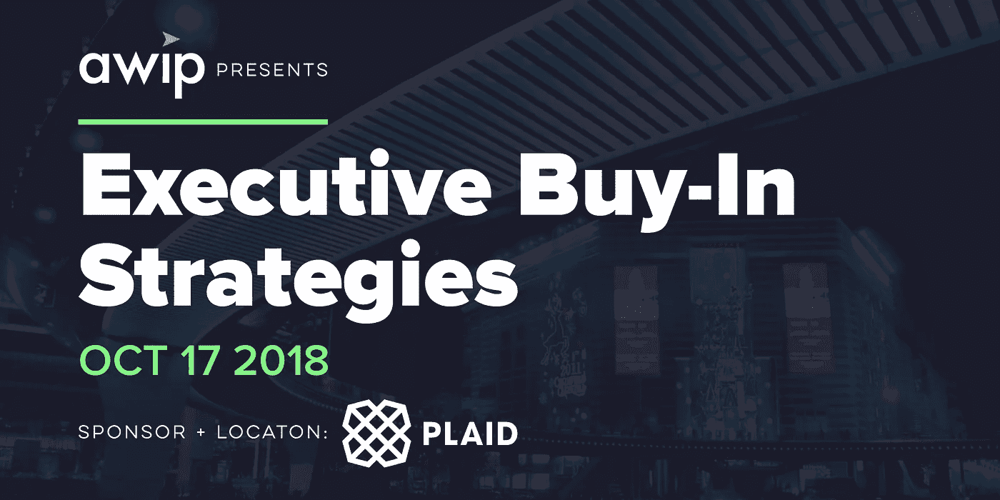
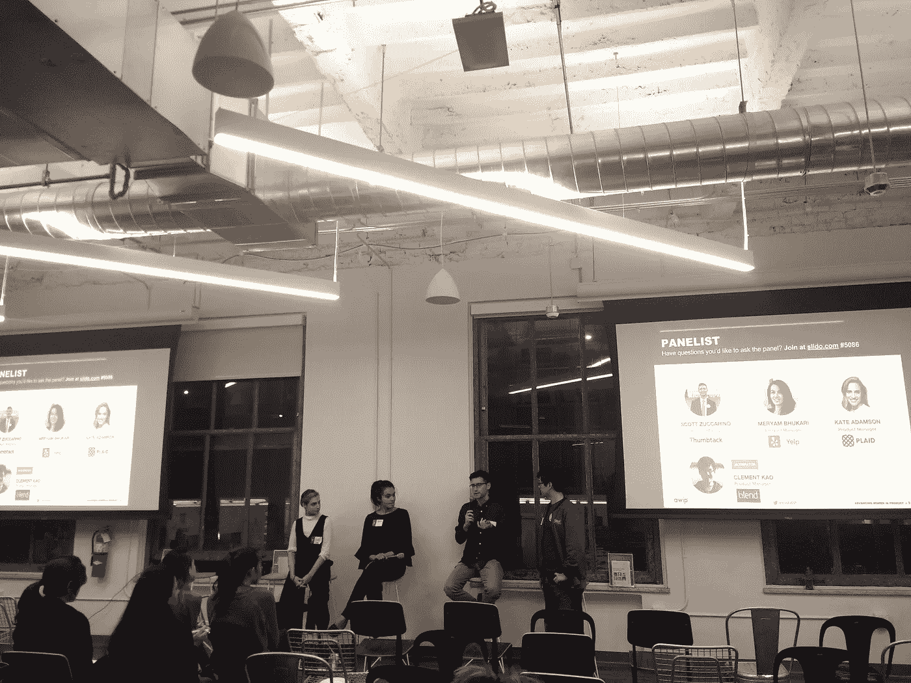

# 通过提升女性在产品中的地位，帮助项目经理获得管理层认可的策略(AWIP)

> 原文：<https://medium.com/hackernoon/strategies-to-help-pms-get-executive-buy-in-event-by-advancing-women-in-product-awip-d43afed122c8>

演职员表: *AWIP 团队*、*、*、[、*图里亚纳拉扬*、](https://www.linkedin.com/in/thuria-narayan-853a229/)、*(10 月份的 AWIP 节目负责人)、*、[、*韩辉*、](https://www.linkedin.com/in/hanh-bui/)、*、【12 月份的 AWIP 节目负责人以及和我合写这篇文章的人】、*、[、*、黄*、](https://www.linkedin.com/in/carol-wong-14133927/)、 *(AWIP 合作伙伴关系负责人)*

随着产品经理和其他技术专业人员在职业生涯中的成长，高管的认同成为职业发展的关键。项目、期限，尤其是萌芽中的新隐形产品线，都需要高管作为一个组织来帮助赞助，并在后来促进产品的发展。

10 月 17 日，周三，[提升产品中的女性](https://www.advancingwomeninproduct.org/) (AWIP)，召集了一个格子花呢的高级产品经理小组:[斯科特·祖卡里诺](https://www.linkedin.com/in/szuccarino)(图钉产品管理经理)[梅亚姆·布哈里](https://www.linkedin.com/in/meryambukhari/)(Yelp 产品经理)[凯特·阿达姆松](https://www.linkedin.com/in/kate-adamson-87a31661/)(格子花呢产品经理)[克莱门特·高](https://www.linkedin.com/in/clement-kao/)(Blend 产品经理)担任小组主持人。以下强调了所提出的要点:

Panelists in action, describing their top strategies for getting executive buy-in as lead PMs

**为什么获得高管的认同很重要？**

高管买入是指高管会对你的想法给予支持和担保。虽然“买入”的确切定义可能因组织的大小而异，但其重要性的概念不会改变:为了推动计划或新产品创意向前发展，我们不仅需要同事和跨职能团队的支持，还需要领导的支持。我记得当我在谷歌的时候，我试图在短时间内交付一个产品，有我们的高级工程总监和我们的产品负责人在我身边，这个过程变得更加无缝。跨职能团队更愿意参与进来，他们的支持让我们面前的障碍变得更容易解决。

如何开始获得高管的认同？您从哪些利益相关方那里收集数据，您将收集哪些类型的信息？

小组成员一致认为，迈出第一步往往是最困难的一步。但通常，如果我们把最困难的问题分解成可行的步骤，它看起来是可以解决的:从做一件事开始，然后引导我们继续前进，真正解决整个问题。

就利益相关者而言，真正理解你试图推进的产品或问题的背景，并看到大多数障碍出现在哪里。对于这个项目来说，初始资本支出是否太大？或者，工程部门是否需要确信实施方法和时间表是正确的。底线:理解需要说服的一方/团队，并开始努力让人们站在你这边。这就是高管买入真正有帮助的地方，为达成你想要的共识扫清障碍。

**获得高管认同的最重要因素之一是什么？**

纵观所有小组成员获得高管认同的经历，同理心是每个人都可以谈论的一个共同话题。在与高管交谈之前，试着了解高管来自哪里，他们试图避免什么样的痛苦，他们的恐惧，以及他们试图解决的问题。

**小组成员分享他们的个人战术:**

1.  在向一群高管展示之前，让一群商业伙伴或用户来验证、质疑和反馈你的想法。这将有助于你避免过程中的任何意外，也有助于你预测高管可能会问你的问题。
2.  当心对高管们自己提出的想法的隐性偏见；请记住，他们也是人，他们的想法也需要像任何一个人的想法一样经过同样严格的验证。也就是说，他们可能对这些想法有更多的了解。
3.  当高管对你的想法说不时，继续做/测试它，除非它是不道德的或违背团队士气的。坚持是关键。
4.  你听过创业公司这样说:失败，而且失败得很快。当你没有太多利害关系的时候失败总比当你的想法有太多利害关系的时候被拒绝要好。以上所有关于实践和验证的建议将有望帮助你避免到达这个阶段。

我们希望您和我们的现场参与者一样喜欢这次活动，他们向我们提供了以下反馈:

> “我喜欢这个活动，因为它讨论了工作中的一个基本问题，这个问题人们很容易忘记提及，但在项目经理的工作中发挥了巨大作用。我参加的大多数活动都侧重于硬技能。这是一个罕见的深潜软技能。未来我们需要更多这样的东西。”
> 
> “这次活动让我有时间反思自己与高管打交道的经历，以及如何做得更好。”
> 
> "有些问题非常有趣，我完全可以理解。"

要观看完整的小组讨论和小组成员进行的高管买入对话的现场示例，您可以[在此](https://www.youtube.com/watch?v=UvGB2HrEXAk)观看完整视频，也可以在 AWIP YouTube 频道观看其他视频。

**如何了解最新动态:**

[Sign up!](https://www.advancingwomeninproduct.org/) // Follow us on [Facebook](https://www.facebook.com/advancingwomeninproduct/), [LinkedIn](https://www.linkedin.com/company/18170634/) and [Twitter](https://twitter.com/theAWIP)

*   [喜欢 AWIP·脸书的那一页](https://www.facebook.com/advancingwomeninproduct/)
*   [关注 AWIP 的推特](https://twitter.com/theawip)
*   [注册我们两周一次的时事通讯更新](http://eepurl.com/c4NaOH)
*   查看我们的网站，了解更多精彩的即将到来的[活动](https://www.advancingwomeninproduct.org/2018-events/)！