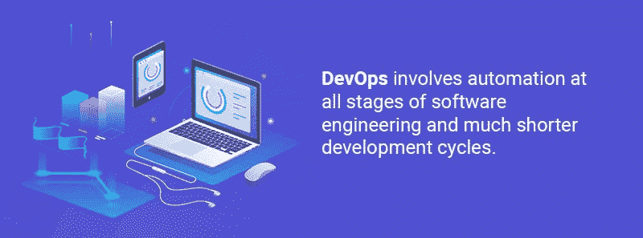
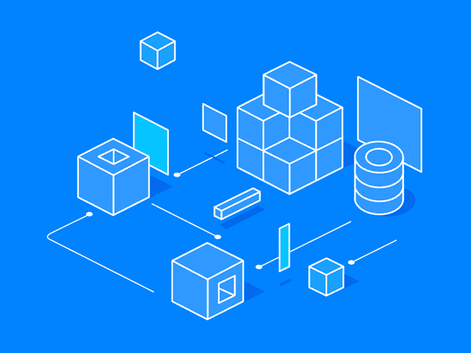
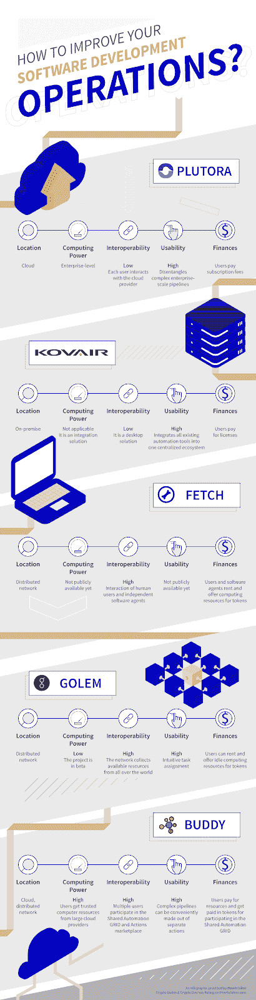

# 简化 DevOps 流程:为什么区块链对您的项目至关重要

> 原文：<https://medium.com/hackernoon/streamlining-devops-processes-why-the-blockchain-is-essential-to-your-project-53cdfe023fe0>

DevOps 是近年来加速技术进步的动力。DevOps 为我们提供了一个通向未来的门户，在那里软件技术总是最新的，所有的东西都在一眨眼的时间里加载，你再也不用面对另一个应用程序故障了。这怎么可能？紧密的团队沟通、快速的反馈和关键流程的自动化使 DevOps 团队能够不断创新，使传统的 IT 看起来极其缓慢和繁琐。今天的软件公司现在面临以下选择:“要么采用 DevOps，要么慢慢死去。”

> 感谢[agency.howtotoken.com](http://agency.howtotoken.com/)对创建该主题的支持(第一个拥有成熟 ICO 承包商的平台)

但是在我们继续深入之前，让我们澄清 DevOps 实际上是什么的概念。DevOps 是一种软件交付的整体方法，它统一了软件开发(Dev)和软件运营(Ops)。它包括软件工程所有阶段的自动化和更短的开发周期。成功采用 DevOps 的一个最著名的例子是[网飞](https://insights.sei.cmu.edu/devops/2015/04/devops-case-study-netflix-and-the-chaos-monkey.html)——由于无处不在的自动化，包括故障的自动化，它已经能够管理快速增长(一个名为“混沌猴子”的工具通过随机关闭服务器实例来定期测试网飞应用程序的稳定性)。

也就是说，DevOps 仍然有一些问题——主要与自动化流程、基础设施不足和缺乏计算能力有关。幸运的是，有许多值得注意的项目在令牌化基础设施市场、自动化网格和人工智能的帮助下解决了某些 DevOps 挑战。在本文中，我们将详细描述它们，并将它们与非区块链解决方案进行比较。

# 开发运维与传统 IT:感受差异

采用 DevOps 的[优势](https://www.gocd.org/2017/08/29/driving-change-devops-adoption/)包括处理安全问题的时间减少了 50%,故障恢复速度提高了 24 倍，变更失败率降低了 3 倍。此外，今天的[适应性最强、发展最快的科技公司](https://techbeacon.com/10-companies-killing-it-devops)正在使用 DevOps，以接近“需求速度”的方式运作他们可以快速获得产品反馈，并在最短的时间内满足新出现的需求。

DevOps [与传统的 IT 模式](https://devops.com/comparing-devops-traditional-eight-key-differences/)有什么不同，传统的 IT 模式被用来创建大多数现有的网站？

# 专门的跨职能团队

任何面向 DevOps 的公司都由[专门的跨职能团队](https://puppet.com/blog/what%E2%80%99s-best-team-structure-for-devops-success)组成，而不是[以技能为中心的筒仓](https://www.webopedia.com/TERM/I/information_silo.html)——没有充分沟通的独立部门。在传统的 IT 环境中，三个或四个筒仓因此处理一个新的特性，有时会将它发送回前一个特性。然而，DevOps 团队是自给自足的。团队由专注于一个应用程序的开发人员、测试人员、操作人员和业务分析师组成。这样一个跨职能团队将致力于一个新功能，而不会把责任推给别人，说“这不是我们的工作”当准备好部署时，工作就完成了。因此，没有时间浪费在移交上。[根据–2–20 法则，](https://www.energizedwork.com/weblog/2007/07/competing-against-time)周期时间每减少 25%,生产率就会提高一倍，运营费用就会减少 20%。

# 小批量、频繁交付

DevOps 与小批量一起工作，尽可能频繁地交付——而不是一年几次大发布。从 DevOps 的角度来看，大批量太冒险、太复杂、太难协调，而小批量可以很容易地进行必要程度的彻底测试。如果出现任何问题，都可以迅速轻松地解决。除此之外，小规模、频繁的发布使开发运维组织能够更好地响应客户的需求。

# 自动化

DevOps 文化[欣赏自动化](https://dzone.com/articles/what-is-devops-and-how-automation-helps-achieve-it)，这允许团队处理创造性的任务，而不是常规任务。为每段代码自动创建并测试一个构建，并且(如果它通过了测试)通过管道发送并交付给消费者。应该注意的是，完全自动化通常是不必要的。[自动化水平取决于每个团队的过程和痛点](https://techbeacon.com/introducing-automation-your-organization-strategic-move)，过度自动化会导致次优的结果。为了达到完美的平衡，每个团队都应该[评估其需求，定义瓶颈，并设定优先级](https://techbeacon.com/devops-automation-4-simple-steps-prioritizing)——不幸的是，没有满足所有需求的通用方案。

# 采用 DevOps 的挑战

如果 DevOps 是这样一种有益的方法，可以带来竞争优势，为什么没有被所有人接受呢？它已经出现在[好几年了，最早出现在 2010 年](http://www.flowless.eu/history-of-devops-when-did-it-appear/)，但 2018 年的情况如下:只有 [30%的软件公司](https://www.statista.com/statistics/673505/worldwide-software-development-survey-devops-adoption/)宣布完全(17%)或几乎完全(13%)引入 DevOps，只有 22%的公司刚刚开始向这种方法过渡。

当然，最重要的问题是整个公司从管理层到初级员工的巨大心态转变。这就是为什么很难开始引入 DevOps，以及为什么更难成功完成它的原因。大多数企业中的开发和运营团队试图实现相反的目标:前者被鼓励创新，而后者被激励维持正常运行时间和连续性。消除敌意并使他们团结起来不是一件容易的事情。这就是为什么公司管理层应该通过引入面向协作的目标和促进跨职能培训来支持向 DevOps 的转型。这将帮助开发人员和运营人员超越他们通常的职责范围，认识到他们都在同一个团队中工作。

# 是什么阻止了 DevOps 接管这个行业？

除了企业文化的转变，DevOps 的采用还受到与基础设施、同步和自动化流程相关的不可避免的功利主义问题的阻碍。根据沙盒专家 Quali 进行的[调查，阻碍引入 DevOps 的最大障碍是公司文化(14%)、测试自动化挑战(13%)、传统基础设施(12%)、应用程序复杂性(11%)和预算限制(11%)。](https://betanews.com/2017/03/15/the-challenges-of-adopting-devops/)

# 自动化挑战

测试自动化是 DevOps 的基石之一:它使得持续集成成为可能，并节省了团队的时间，因此他们可以专注于更有创造性的工作。测试意味着检查一段代码是否如预期的那样工作，以及它是否满足所有的技术或业务需求。有各种各样的测试类型，这就是为什么手工测试不可避免地成为快速开发流程中的瓶颈。尽管自动化测试需要额外的努力，但这绝对是值得的。对于金融科技解决方案或电子商务网站等应用来说尤其如此——即使是最小的停机时间也可能导致重大的利润损失。

自动化测试的一个常见问题是，当在资源有限的本地基础设施上运行时，可能会证明[过度耗时](https://techbeacon.com/software-test-automation-6-common-mistakes-how-avoid)。有时你甚至不得不在晚上运行自动化测试以在第二天得到结果，或者甚至等到周末。如此低的速度对于 swift DevOps 流程来说是不可接受的，但很少有公司能够负担得起构建强大的内部基础架构。

# 基础设施挑战

传统基础架构的问题是许多公司抵制开发运维的另一个原因。快速开发是这种方法的特点，主要基于微服务架构，与传统架构完全不同。迁移到微服务会导致工作负载急剧增加，而且在大多数情况下，传统基础架构需要进行成本高昂的升级。

另一个基础设施问题在于 DevOps 工具与现有 IT 系统的集成——它很少顺利进行，因为涉及到太多的更改。例如，开发和运营团队通常采用不同的工具和指标，但是为了实现真正的 DevOps 效率，他们必须集成和统一，因为将有一个跨职能团队。

# 应用程序复杂性

DevOps 的[最佳环境是云](https://www.forbes.com/sites/forbestechcouncil/2017/07/21/the-relationship-between-the-cloud-and-devops/)，原因显而易见:它提供了必要的规模、最佳速度和最大的灵活性，所有这些通常都无法在本地限制内实现。云计算让开发人员对组件有了更多的控制，并减少了等待时间。除此之外，云环境使开发运维团队能够创建用于调配基础架构的自助服务方法，这意味着他们不必等待资源调配。但是过渡到云环境并不总是可能的:根据[的调查，44%在本地环境中运行的应用](https://www.lightreading.com/enterprise-cloud/applications/devops-struggles-with-legacy-systems-culture/a/d-id/731189)被认为太复杂而不能迁移到云环境。

# 自动化解决方案拯救企业

创建了几个自动化解决方案来解决 DevOps 采用中的一些上述问题。 [Plutora](https://www.plutora.com) 和 [Kovair](https://www.kovair.com/intelligent-devops/) 是为那些想要引进 DevOps 的企业设计的，尽管这些企业的遗留系统又大又乱。

# 普鲁多拉

[Plutora](https://www.plutora.com) 是一个拥有一套企业级 SaaS 工具的云平台:Plutora Test、Plutora Environments、Plutora Release 和 Plutora Analytics。它们可以被定制以满足任何软件工程方法论的需求(瀑布、敏捷、DevOps)。

*   [Plutora Test](https://www.plutora.com/platform/plutora-test) 是一个健壮的企业级工具，它可以确保适当的测试覆盖率，提供完整的测试管理，并将所有测试资产和指标集中在一个基于云的存储库中，提供测试活动的实时视图。
*   [Plutora Analytics](https://www.plutora.com/platform/plutora-analytics) 汇总所有数据(与发布、质量、部署等相关。)并提供深刻的分析和丰富的可视化。它可用于数字化转型监控、持续改进和明智决策。
*   [Plutora Environments](https://www.plutora.com/platform/plutora-environments) 旨在全面管理测试环境:它具有自助预订引擎，可以简化测试并消除资源冲突。
*   [Plutora Release](https://www.plutora.com/platform/plutora-release) 是另一个强大的工具，它简化了复杂企业应用程序的发布管理。它自动与交付团队的工具同步，并允许发布管道的集中管理。Plutora Release 跟踪项目内部和项目之间的系统依赖关系，并为工作流优化提供有价值的数据洞察。由于广泛的报告和分析，故障风险降低了。

尽管 Plutora 是一个高效的平台，但它不是一个通用的解决方案。它是为大型企业创建的，目的是理清它们极其复杂的流程和系统。不幸的是，小规模公司负担不起 Plutora 的订阅价格，不得不寻找更便宜的选择。

# 科威尔智能开发平台

[Kovair Intelligent DevOps](https://www.kovair.com/intelligent-devops/) 是一款桌面企业级解决方案，有助于向 DevOps 文化和政策过渡。Kovair 的解决方案旨在统一和同步自动化工具，从而简化开发流程并消除流程中断。

Kovair Intelligent DevOps 的[主要优势](https://www.kovair.com/blog/how-an-integrated-tool-ecosystem-helps-implement-devops/)是它将自动化工具连接到一个中央集成中心，因此工具数据可以在系统间移动。它还确保实时可见性和深入分析，可用于快速决策。

Kovair 智能 DevOps 有助于完成以下任务:

*   自动化工具之间的实时协作
*   连续规划
*   跨工具可追溯性
*   实施持续测试的测试策略
*   持续集成:代码签入一成功完成，构建就会自动触发
*   由于测试自动化脚本的执行而导致的连续交付
*   发布质量的持续监控
*   通过跟踪发布渠道持续交付

然而，该解决方案只是为了集成 DevOps 工具，每个公司都应该评估可用的工具，并选择最适合自己目的的工具。但只要找到正确的自动化解决方案，Kovair 的平台就能创建一个真正无缝的工具生态系统。

# 基于区块链的 DevOps 平台

许多加密项目已经出现，以满足业界对负担得起的计算资源和基础设施的日益增长的需求。它们利用不同的技术，但有一个共同点:激励社区增长并作为使用资源的奖励的令牌。

# 好朋友

作为最有前途的分散式 DevOps 平台之一， [Buddy](https://buddy.works/) 通过提供对两个自动化网格的访问来解决基础设施问题。可信、高可用性的私有自动化网格和共享自动化网格可以执行时间密集和计算密集的自动化操作，甚至整个管道。结果，DevOps 团队以[最大](https://www.digitalocean.com/community/projects/buddy-one-click-delivery-automation-for-web-developers)效率工作(并且不用担心基础设施的可用性)。Buddy 支持复杂的企业级应用、多云工作流和混合环境也很重要。

好友用户可以使用支持的自动化操作创建管道。目前，有 80 个行动，但由于巴迪的**市场**，更多的行动将很快出现，这是为了鼓励社区发展和支持有才华的开发者而创建的。第三方开发者可以向 Buddy 的生态系统提交他们自己的自动化操作，并出售或免费提供。

**私有自动化网格**是一个伙伴实例网络，构成了用于开发运维流程自动化的可自动扩展的按需基础设施。用户可以在他们认为合适的任何地方运行伙伴实例:在他们自己的物理基础设施上，在私有云中，或者在 IaaS 服务器上。Buddy 还可以使用其合作伙伴或 SaaS 集成(谷歌云、亚马逊网络服务等)提供的可信网格。).根据负载情况，Buddy 会自动创建新实例，并在不再需要时删除它们。

**共享自动化网格**用于不需要可信基础设施的情况。时间密集和计算密集的任务可以交给具有可用资源的伙伴实例网络。运行这些实例的用户将为每个计算单元获得一个 BUD 令牌。这个网格不能用于核心开发，而是用于测试(由数百个伙伴实例运行的测试花费的时间要少得多)或其他不需要高信任级别的任务——例如，性能监控或可用性监控。

DevOps 工程师还可以在 Buddy 的**沙箱**的帮助下消除开发瓶颈，这使得它可以直接从 Git 存储库在一次性环境中运行应用程序或网站。沙盒不需要任何物理服务器或虚拟机。

Buddy 支持与以下生态系统的集成:Github、Bitbucket、GitLab、Slack、DigitalOcean、Vultr、AWS、Google Cloud、Microsoft Azure 等等。它还有一个内置的 Git，用户可以选择他们的项目基于它。

**基于以太坊的 BUD Token** 旨在作为分散经济的基础，并在伙伴生态系统中创建正反馈循环。没有令牌化，该平台将缺乏参与电网的经济激励，因为法定支付太慢，效率太低，无法推动社区增长。

# Fetch.ai

[Fetch.ai](https://fetch.ai/) 是一个位于区块链的项目，展示了智能账本——一种[下一代分布式账本技术](/outlier-ventures-io/meet-our-latest-venture-fetch-ai-5e848cf89a23)。它为数字世界提供了动力，在这个世界中，自主软件代理可以出售他们的数据或闲置资源来获取令牌。DevOps 团队显然可以从这样的市场中受益:这将是一种购买测试、监控或其他 DevOps 时间密集型任务的计算资源的便捷方式。从 DevOps 的角度来看，它有点类似于上面提到的 [Buddy 共享自动化网格](https://buddy.works/)，但是人工干预较少。

[这项技术还有其他用途吗？](https://fetch.ai/technical-introduction)简单来说，数据可以在 Fetch 的数字世界里自我推销。物联网设备可以出售对其他代理有用的信息:例如，汽车雨刷的使用可以由软件代理作为天气信息的来源进行中继。闲置的计算机可以为远程客户执行测试任务或运行其他计算。除此之外，还可以将遗留数据插入 Fetch 并使其成为可销售的资产。

随着时间的推移，Fetch 网络可能会扩展并获得巨大的计算能力，其代理将因此获得新的数据洞察力。由于 Fetch 系统中集成了机器学习技术，网络能够创造自己的宝贵知识。最终，可信的数字代理将能够取代人类中间人，建立全新的行业。数据和基础设施将不会像今天这样依赖人类——它们将创造新的市场，并自主销售自己。

提取令牌将用作网络内所有交易和操作的内部货币。它们还将作为某些行为的可退还押金，以确保安全性并防止不良行为。

# 假人

假人项目还解决了闲置计算机资源的潜力，创造了另一个基于以太坊的分散市场。假人网络是一台全球超级计算机，它结合了用户的可用资源，显然 DevOps 团队可以有效地使用它来运行密集的自动化任务。然而，这种资源的可靠性和可用性是值得怀疑的:家用电脑(即使是大量的，结合在一起)会像[巴迪拥有的可信云基础设施一样可靠吗？](https://buddy.works/)

假人网络的参与者——包括人和应用程序——可以请求或出售机器周期。那些共享资源的人，无论是个人电脑还是大型数据中心，都可以通过假人网络代币(缩写为 GNT)的请求者立即获得报酬。沙盒环境提供了必要的安全级别，在沙盒环境中，计算与主机系统完全隔离。

除此之外，假人生态系统可以被软件开发者用于应用的创建、部署、分发和货币化。假人提供了应用注册和交易框架来促进这些活动。

目前，假人仍处于测试阶段，因为它的创造者正致力于使它更加强大和灵活。他们还计划为开发者和软件公司增加各种工具，以使假人成为云提供商的可行替代方案。

*为了更好地向您解释这个想法，我们制作了一张信息图:*

# 结论

本文中提到的大多数项目——非加密平台和基于区块链的项目——都解决了对计算资源的迫切需求，这种需求在未来几年肯定会变得更糟。尽管传统的云提供商在提供基础设施和计算能力方面似乎非常有效，但就社区参与和独立性而言，分散式解决方案更有前途。一旦他们获得足够的牵引力，他们将开始以自己的方式开发和成长，吸引有才华的开发人员，他们将添加新的功能和可能性。人工智能、机器学习和其他前沿技术将推动它们的进一步发展——总有一天我们会惊讶地发现，未来已经到来。

但基于区块链的平台最重要的一点是，它们允许几乎任何人参与这个市场，并通过出售闲置资源来赚取代币。这意味着，如果需要的话，分散平台可以潜在地利用地球上所有现有的计算能力。

## 关于作者:

基里尔·希洛夫——geek forge . io 和 Howtotoken.com 的创始人。采访全球 10，000 名顶尖专家，他们揭示了通往技术奇点的道路上最大的问题。加入我的**# 10k QA challenge:**[geek forge 公式](https://formula.geekforge.io/)。