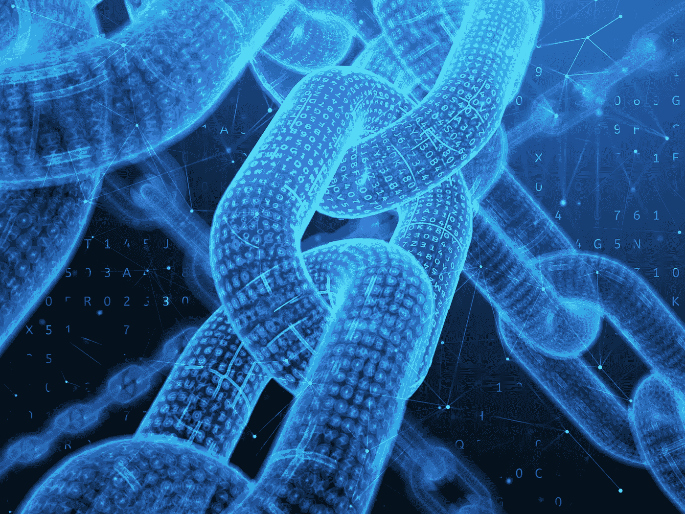
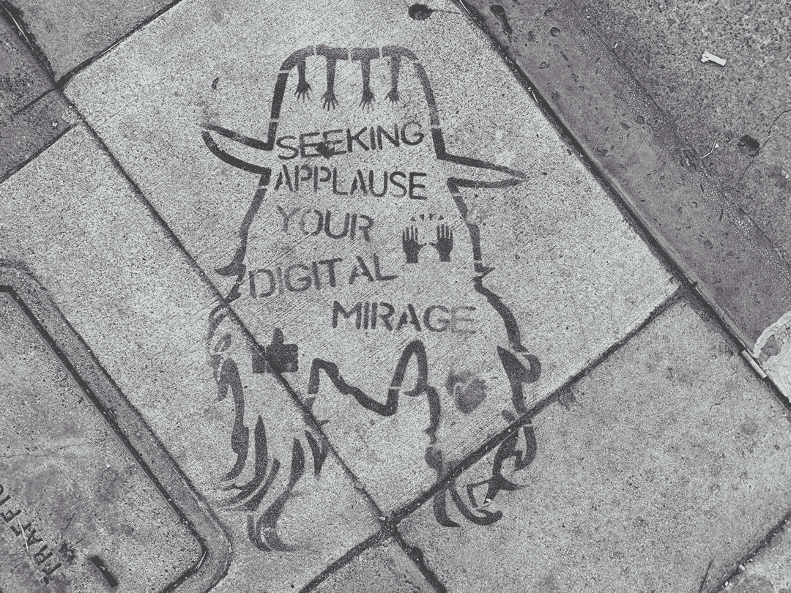

# 简化医疗保健申请流程

> 原文：<https://medium.com/hackernoon/streamlining-healthcare-application-process-991f440eb4d6>

[Source](https://www.pm360online.com/the-advantages-and-disadvantages-of-blockchain-in-healthcare/)

# 问题

每次去医院看病时，你都需要填写一张长长的表格，上面列有你在这次体检前所有的过敏和疾病。医院有这个程序，这样才能给你提供准确的服务。

但更多的时候，我们可能无法正确输入详细信息，因为:

1.  我们可能会急着完成表格。
2.  我们可能会在填表时漏掉一两个过敏项目。并且由于这种错误而开出的错误药物会产生不利影响。

这些错误可能在另一种情况下出现，解释如下:

让我们假设你在纽约工作，你被一家健康保险公司“H”承保。现在你必须转移到加州的帕洛阿尔托。当您填写新的健康保险表格时，可能会有一些数据差异。即使细节由“H”转发，我们也不能忽视这样一个事实，即转移可能会延迟整个过程。

**2 >** 个人的医疗保健信息非常敏感，不应该被黑客获取。医疗保健数据存储在易受网络攻击的集中式服务器中。

在这篇文章中，我打算解决这些问题。

# 动机

几天前，我向我的朋友解释了区块链的必要性。以下是我对她的解释:

1.  我们有一个由三台计算机组成的系统(分别标为 P1、P2 和 P3)。
2.  P1 和 P3 与 P2 相连，但 P1 和 P3 之间没有联系。
3.  由于一些错误，P2 无法沟通了。
4.  如果 P1 和 P3 的数据不同步，那么我们就永远不能相信这两个系统中的数据。
5.  现在让我们将这个系统扩展到**全球运行的数千台**计算机。缺乏数据同步会导致会计、数据跟踪等方面的许多问题。
6.  拥有一个包含网络中每台计算机上相同信息的公共账本只不过是“**区块链**”，它可以解决上一步提到的所有问题。

如果所有医院共享一个包含特定个人医疗保健数据的公共分类账，会怎么样？

找到了，我找到了！

# 解决办法

患者的医疗保健数据可以通过以下方式分发:

1.  我们可以扩展我的第[篇文章](https://hackernoon.com/how-a-to-do-list-application-when-decentralized-can-potentially-solve-3-problems-c7757579ad62)，将 person 的详细信息视为待办事项列表条目。
2.  个人的基本细节，如她的姓名、地址以及过敏列表可以是列表的内容。
3.  这些关于个人的详细信息可以保存在区块链上，并由参与该网络的医院的熟练医生进行验证。
4.  该区块链将由一组医院/健康保险公司共享。
5.  这些医院可以根据它们的声誉来选择。
6.  当此人出现新的过敏症时，列表上的信息可以随时更新。
7.  现在，每当一个人去医院看病时，她都不需要填写表格，因为总是可以从区块链中检索到详细信息，并且可以给予适当的治疗。

我打算用得到许可的区块链。通过这种方法，只有被信任和验证的医院才能加入这个网络。即使其中一家医院的安全受到威胁，系统也会根据其合作医院的**账本**更新其数据(类似于比特币区块链)，从而确保个人信息的安全性和完整性。

因此，这两个问题都可以通过这种方法来解决。

下面这段引语激励我写这篇文章:

> “你无法阻止比特币之类的东西。它将无处不在，世界将不得不重新调整。”—约翰·迈克菲，迈克菲公司创始人

感谢您阅读我的文章。

**注:**
本文来自莱特州立大学智能实验室在裴勇博士指导下完成的研究工作。

莱特州立大学:[https://www.wright.edu/](https://www.wright.edu/)
计算机科学与工程系:[https://www . Wright . edu/degrees-and-programs/profile/Computer-Science](https://www.wright.edu/degrees-and-programs/profile/computer-science)
裴勇俊博士:[https://people.wright.edu/yong.pei](https://people.wright.edu/yong.pei)

*如有任何问题，欢迎随时给我发* [*邮件*](mailto:pamanalionline@gmail.com) *。也可以通过*[*Linkedin*](https://www.linkedin.com/in/amanali1/)*联系我。也可以关注我的* [*推特*](https://twitter.com/aliandco) *。*

*为了入门区块链阅读我的* [*文章*](https://hackernoon.com/blockchain-learning-path-2019-e54d6763dd6c) *发表在*[*hacker noon*](https://hackernoon.com/)*。*

