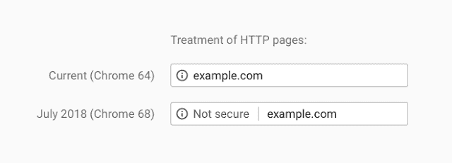
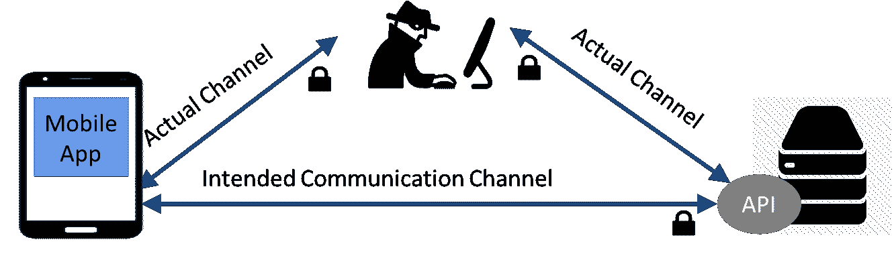
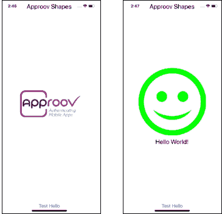
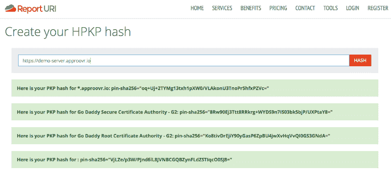
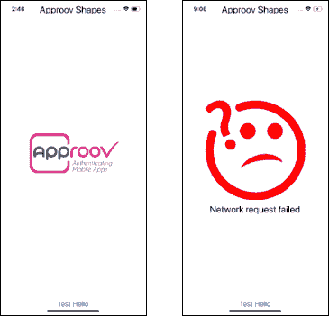

# 通过证书锁定增强 React Native 中的 TLS—iOS 版

> 原文：<https://medium.com/hackernoon/strengthen-tls-in-react-native-through-certificate-pinning-ios-edition-9a42562b6da6>

## 增强 React Native 在 Android 和 iOS 上的联网 API 保护，无需接触您的 Javascript 代码或手动编辑本机代码项目。


本文第一版实现了 Android 上 React 原生应用的 TLS 证书锁定。从那时起， [react-native-cert-pinner](https://www.npmjs.com/package/react-native-cert-pinner) 包已经得到了增强，以支持在 iOS 设备上的锁定，这一期的帖子遍历了之前针对 iOS 的示例。

从 2018 年 7 月 68 版本开始，Chrome 开始将所有不运行 HTTPS (TLS over HTTP)的网站标记为“不安全”。TLS 使用站点证书建立信任链，并在传输层加密通信。



SOURCE: [Google Security Blog](https://security.googleblog.com/2018/02/a-secure-web-is-here-to-stay.html)

这是网络、API 和[移动安全](https://hackernoon.com/mobile-api-security-techniques-682a5da4fe10)的重大提升，但尤其是在移动设备上，这可能还不够。不幸的是，欺骗移动设备信任由意想不到的证书颁发机构签署的证书太容易了。[证书锁定](https://www.owasp.org/index.php/Certificate_and_Public_Key_Pinning)应用于限制对网站叶证书的信任，或仅限于应用本身信任的中间或根授权机构。

由于实施和维护上的困难，证书锁定并没有得到应有的普及。对于 React Native，这甚至更具挑战性，因为实现锁定所需的网络接口没有在 javascript 层公开。

当前可用的支持 React Native 中证书锁定的包需要[替换内置的网络包](https://www.npmjs.com/package/react-native-pinch)或[手动更改本机代码](http://www.madebymany.com/stories/a-year-of-react-native-ssl-pinning)。这个 npm 包，[react-native-cert-pinner](https://www.npmjs.com/package/react-native-cert-pinner)，不需要对 javascript 代码做任何修改就可以进行网络获取。用于固定连接的底层本机代码完全由开发人员指定的 JSON 配置文件生成。这是一项正在进行的工作，目前可以在 Android 和 iOS 上使用，随后会有额外的软件包自动化和安全性。

# 防止中间人攻击

一年的 React Native: SSL Pinning 很好地描述了移动连接的风险，甚至在使用 TLS 时也是如此。对证书颁发机构或移动设备的损害会导致应用程序不正确地信任假冒的服务器证书，并允许攻击者将其自身插入到连接中，静默地解密、观察、可能修改和重新加密本应安全的通信。



证书锁定基于现有的 HTTPS(HTTP 上的 SSL 或 TLS)技术。使用 TLS，移动设备会跟踪证书链，直到到达由它信任的机构签署的证书。

证书锁定用于识别特定证书或限制受信任为目标网站签名的证书颁发机构的数量。通过在应用程序中固定受信任服务器证书的有限列表，欺诈性签名的证书，即使其证书颁发机构受到设备的信任，也将被应用程序拒绝。该应用程序可以锁定服务器的叶证书和中间证书。

通常建议固定多个证书的公钥，以便在其他密钥泄露的情况下，应用程序仍然可以信任一个密钥。

SSL 固定是一种缓解方法，旨在降低通过假冒后端服务器的 SSL 证书实现的 MitM 攻击的有效性。锁定中间密钥简化了证书轮换和更新。检查公钥的散列是方便的，并且对任何攻击者隐藏了证书信息。

# React 本机示例应用程序

NPM[react-native-cert-pin ner](https://www.npmjs.com/package/react-native-cert-pinner)模块包含一个示例应用程序，我们将使用它来

演示证书锁定。该应用程序检查与 demo-server . approvr . io 服务器的 HTTPS 连接:

```
$ curl [https://demo-server.approovr.io](https://demo-server.approovr.io)Hello World!
```

由于 TLS 不是通过 fetch()等 React 原生网络调用公开的，所以必须引入原生模块，Expo 环境不容易用于开发。

首先使用`react-native-cli`初始化一个 React 本地项目:

```
$ react-native init example
Installing react-native…
```

接下来安装[react-native-cert-pin ner](https://www.npmjs.com/package/react-native-cert-pinner)包:

```
$ cd example
$ npm install -S react-native-cert-pinner
+ react-native-cert-pinner@0.3.0
added 4 packages from 2 contributors and audited packages in 6.689s
found 0 vulnerabilities
```

使用 react-native 自动链接 cert pinner 本机模块:

```
$ react-native link
Scanning folders for symlinks in /Users/skiph/Projects/
  rn-pinning/rncp-test/example/node_modules (13ms)
rnpm-install info Linking react-native-cert-pinner ios dependency
rnpm-install info Platform ‘ios’ module react-native-cert-pinner has
  been successfully linked
rnpm-install info Linking react-native-cert-pinner android
  dependency
rnpm-install info Platform ‘android’ module react-native-cert-pinner
  has been successfully linked
```

删除默认的`index.js`和`App.js`文件，从 cert pinner 包的示例目录中安装`index.js`和`src/`文件:

```
$ rm ./index.js ./App.js
$ cp ./node_modules/react-native-cert-pinner/example/index.js ./
$ cp -r ./node_modules/react-native-cert-pinner/example/src ./
```

对于 iOS，复制示例`podfile`并手动安装 pod:

```
$ cp ./node_modules/react-native-cert-pinner/example/ios/podfile ./ios/
$ cd ios && pod install
```

您应该准备好构建和运行应用程序。确保 iOS 模拟器正在运行或 iOS 设备已连接，并启动应用程序:

```
$ react-native run-ios
…** BUILD SUCCEEDED **The following commands produced analyzer issues:
 Analyze …/RCTModuleMethod.mm normal x86_64
 Analyze …/RCTImageCache.m normal x86_64
 Analyze …/RCTNetInfo.m normal x86_64
(3 commands with analyzer issues)Installing build/Build/Products/Debug-iphonesimulator/example.app
Launching org.reactjs.native.example.example
org.reactjs.native.example.example: 9252
```

在开始屏幕上，按下屏幕底部的测试 Hello 按钮。成功的连接将显示一个笑脸:



尽管通过 TLS 成功建立了连接，但没有使用证书锁定。

# 固定可信证书

要添加证书固定，首先要在示例项目的主目录中初始化一个 pinset 配置文件:

```
$ npx pinset init
File ‘./pinset.json’ initialized.
```

接下来，从用于演示服务器的证书链中确定几个公钥哈希。approvr . io .[https://report-uri.com/home/pkp_hash](https://report-uri.com/)[的](https://report-uri.com/home/pkp_hash)报告 URI[有一个方便的查找服务。在撰写本文时，可用的公钥散列是:](https://report-uri.com/home/pkp_hash)



编辑`pinset.json`以锁定一些关键散列:

```
{
  “domains”: {
    “*.approovr.io”: {
      “pins”: [
        “sha256/oq+Uj+2TYMg13txh1pXW0/VLAkonU3TnoPr5hfxPZVc=”,
        “sha256/8Rw90Ej3Ttt8RRkrg+WYDS9n7IS03bk5bjP/UXPtaY8=”
      ] 
    } 
  } 
}
```

在生产应用程序中，您需要为应用程序与之通信的每个服务器域添加 pin。如果您连接到许多服务器，考虑使用一个 [API 代理网关](https://hackernoon.com/whitelists-and-indirection-go-together-like-chocolate-and-peanut-butter-a350786f8381)来提高 API 保护并减少您需要管理的 pin 集数量。

通过运行 pinset gen 生成所需的本地项目文件:

```
$ npx pinset gen
Reading config file ‘./pinset.json’.
Updating plist file ‘./ios/example/info.plist’.
```

如果您认为发布公钥证书的散列是一种安全违规，您可能希望从存储库中删除或忽略 pinset 配置和生成的文件。在您的根文件`.gitignore`中，添加:

```
# default configuration file
./pinset.json# default generated source files
./ios/example/info.plist
```

重新构建并启动修改后的应用程序。您应该会再次看到一个成功的连接，但是这一次连接被至少一个公钥哈希锁定。


# 拒绝无法识别的证书

要测试证书锁定，请更改`pinset.json`中的`*.approovr.io`公钥散列，使它们不匹配任何预期值:

```
{
  “domains”: {
    “*.approovr.io”: {
      “pins”: [
        “sha256/XXXXXXXXXXXXXXXXXXXXXXXXXXXXXXXXXXXXXXXXXXX”
      ] 
    } 
  }
}
```

通过运行`pinset gen`重新生成本地项目文件:

```
$ npx pinset gen
Reading config file ‘./pinset.json’.
Updating plist file ‘./ios/example/info.plist’.
```

重新构建并启动修改后的应用程序。这一次您应该会看到一个连接失败，因为应用程序找不到与其预期 pin 匹配的公钥散列。



# 暂时结束

您已经成功地演示了一个针对 iOS 上的 React Native 的 pinning 实用程序，它使用内置的 fetch() API，而不需要对本机 iOS 代码进行任何手动编辑。参见本文的[第一版](https://hackernoon.com/strengthen-tls-in-react-native-through-certificate-pinning-e6e8d53e8254)以在 Android 中遵循相同的示例。

未来的软件包增强功能包括:

*   每当管脚集配置改变时，自动重新生成本地源文件。
*   将源代码重新生成和 git 忽略添加到大部分自动反应的本地链接步骤中。
*   将证书公钥哈希查找添加到 pinset 实用程序。
*   加强应用程序中 pinset 信息的安全性。

通过简化 React 本地应用的证书锁定， [react-native-cert-pinner](https://www.npmjs.com/package/react-native-cert-pinner) 包应该可以帮助更多的开发人员使用这些技术来加强他们的移动 API 连接的完整性。

要了解更多关于 API 安全和相关主题的信息，请访问[approv . io](https://www.approov.io/)或在 twitter 上关注 [@critblue](https://twitter.com/critblue) 。